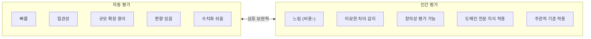

# Human Evaluation / Annotation (인간 평가 & 어노테이션)

## 개요

**Human Evaluation**은 전문 평가자가 LLM 출력의 품질을 직접 평가하는 방식이다. 자동 평가(벤치마크, LLM-as-a-Judge)의 한계를 보완하며, 특히 창의성, 미묘한 뉘앙스, 문화적 적절성 같은 측면은 인간 평가만이 정확히 측정할 수 있다. **Annotation**은 학습 데이터 생성을 위해 인간이 레이블을 붙이는 과정이다.

## 인간 평가의 역할



## Annotation 유형

### 1. 선호도 평가 (Preference Annotation)

RLHF의 핵심. 두 응답 중 더 나은 것 선택:

```
평가자 가이드라인 예시:

[응답 A]: "파이썬은 들여쓰기로 코드 블록을 구분합니다."
[응답 B]: "파이썬에서는 중괄호 대신 들여쓰기를 사용합니다. 
           이는 코드 가독성을 높이는 파이썬의 핵심 특징입니다."

다음 기준으로 평가하세요:
☐ A가 훨씬 낫다
☐ A가 약간 낫다  
☐ 동등하다
☐ B가 약간 낫다
☐ B가 훨씬 낫다

이유 (필수):
```

### 2. 절대 평가 (Absolute Rating)

리커트 척도(1-5점 또는 1-10점):

```
평가 항목:
  정확성:     1 - 2 - 3 - 4 - 5
  완전성:     1 - 2 - 3 - 4 - 5  
  명확성:     1 - 2 - 3 - 4 - 5
  도움 정도:  1 - 2 - 3 - 4 - 5

1 = 매우 나쁨, 5 = 매우 좋음
```

### 3. 범주 분류 (Categorical Annotation)

오류 유형, 의도 분류 등:

```
다음 응답의 오류 유형을 선택하세요:
☐ 사실적 오류 (Factual Error)
☐ 추론 오류 (Reasoning Error)
☐ 불완전한 답변 (Incomplete)
☐ 관련 없는 내용 (Irrelevant)
☐ 안전 위반 (Safety Violation)
☐ 오류 없음 (No Error)
```

## 어노테이션 플랫폼

| 플랫폼 | 특징 | 적합 케이스 |
|--------|------|-----------|
| **Scale AI** | 전문 주석 팀, 높은 품질 | 대규모 엔터프라이즈 |
| **Labelbox** | 다용도 ML 데이터 플랫폼 | 이미지+텍스트 혼합 |
| **Argilla** | 오픈소스, LLM 특화 | 자체 호스팅 선호 |
| **Label Studio** | 오픈소스, 유연한 설정 | 내부 팀 어노테이션 |
| **Prolific / MTurk** | 크라우드소싱 | 빠른 대규모 수집 |

## 어노테이터 품질 관리

### 가이드라인 일관성

```markdown
# 어노테이터 가이드라인 예시

## 정확성 평가 기준
5점 (완벽): 모든 사실이 정확하고 검증 가능
4점 (좋음): 대부분 정확, 사소한 누락
3점 (보통): 핵심은 맞지만 일부 오류 포함
2점 (나쁨): 주요 오류 포함
1점 (매우 나쁨): 대부분 틀리거나 완전히 무관

## 애매한 경우 처리 원칙
- 의심스러우면 낮은 점수
- 문화적 맥락 고려 (한국어 평가 시 한국 문화 기준 적용)
- 평가하기 어려우면 "스킵" 옵션 사용
```

### Inter-Annotator Agreement (IAA)

평가자 간 일치도 측정:

```python
from sklearn.metrics import cohen_kappa_score
import krippendorff

# Cohen's Kappa (2명 평가자, 범주형)
kappa = cohen_kappa_score(annotator_1_ratings, annotator_2_ratings)
# kappa > 0.6: 상당한 일치 / > 0.8: 거의 완벽한 일치

# Krippendorff's Alpha (다수 평가자, 다양한 척도)
alpha = krippendorff.alpha(
    reliability_data=ratings_matrix,  # shape: (annotators, items)
    level_of_measurement='ordinal'
)
# alpha > 0.667: 신뢰 가능 / > 0.800: 높은 신뢰도

if kappa < 0.4:
    print("가이드라인 재검토 필요")
    # → 예시 추가, 모호한 기준 명확화
```

### Gold Standard Items

평가 중간에 정답이 알려진 "함정 문제" 삽입:
```python
def create_evaluation_batch(real_samples: list, gold_items: list) -> list:
    """실제 샘플 90% + 정답 알려진 골드 아이템 10% 혼합"""
    batch = real_samples[:90] + gold_items[:10]
    random.shuffle(batch)
    return batch

def check_annotator_quality(results: list, gold_positions: list) -> float:
    gold_correct = sum(
        results[pos]['label'] == GOLD_LABELS[pos]
        for pos in gold_positions
    )
    accuracy = gold_correct / len(gold_positions)
    if accuracy < 0.8:
        flag_for_review(annotator_id)
    return accuracy
```

## Chatbot Arena

LMSYS가 운영하는 대규모 인간 선호도 수집 플랫폼:
- 두 모델 응답 비교 → 사용자가 선택
- 수백만 명이 자발적 참여 (크라우드소싱)
- ELO 점수로 모델 랭킹

```
사용자 → 질문 → [모델A 응답] vs [모델B 응답] → 선택
                    (모델 이름 숨김)
→ 누적 데이터로 신뢰할 수 있는 인간 선호도 순위
```

## RLHF를 위한 Annotation 파이프라인

```
1단계: 초기 SFT 데이터 수집
  전문가가 고품질 응답 직접 작성 (수천~수만 샘플)

2단계: 선호도 데이터 수집
  동일 질문에 대해 모델이 여러 응답 생성
  → 평가자가 쌍 비교로 선호 응답 선택

3단계: Reward Model 학습
  수집된 선호도 데이터로 보상 모델 학습

4단계: PPO로 LLM 파인튜닝
  Reward Model의 점수를 최대화하도록 학습
```

## AI Engineering에서의 역할

Human Evaluation은 **AI 시스템의 최종 품질 게이트**다. 자동 평가로 빠른 이터레이션을 하고, 정기적으로 인간 평가로 검증하는 사이클이 권장된다. RLHF를 통해 수집된 인간 선호도 데이터는 모델 개선의 가장 직접적인 입력이며, 이 데이터의 품질이 최종 모델 품질을 결정한다.

## 관련 개념
[[LLM_as_a_Judge]] · [[Benchmarking]] · [[Data_Flywheel]] · [[Full_Fine-Tuning]]

## 출처
- Ouyang et al. (2022) "InstructGPT (RLHF)" — [arXiv:2203.02155](https://arxiv.org/abs/2203.02155)
- LMSYS Chatbot Arena — [chat.lmsys.org](https://chat.lmsys.org)
- Argilla 문서 — [docs.argilla.io](https://docs.argilla.io)
