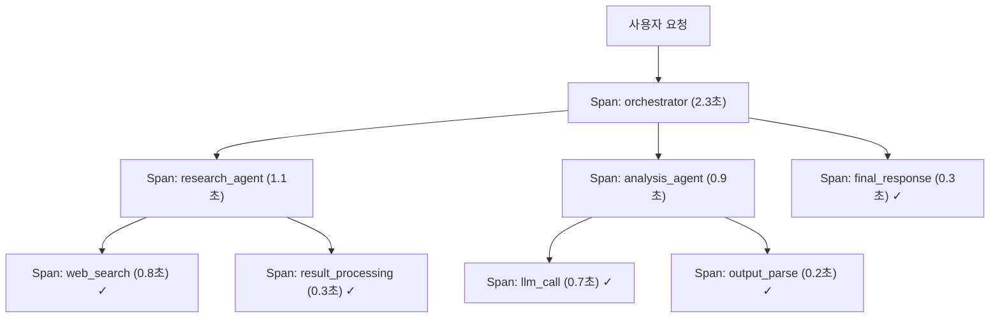
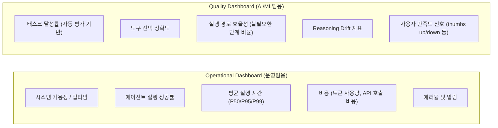

# Observability & Tracing (옵저버빌리티 & 트레이싱)

## 개요

**LLM Observability**는 LLM 기반 애플리케이션의 동작을 실시간으로 모니터링, 추적, 분석하는 실천이다. 전통적인 APM(Application Performance Monitoring)에 LLM 특화 지표(토큰 사용량, 환각률, 응답 품질 등)를 더한 개념이다.

## 왜 필요한가

```
전통 APM의 한계:
  서버 CPU 100% → "과부하"
  응답 시간 5초 → "느림"

LLM Observability 필요 이유:
  "모델이 환각을 일으키고 있는가?"
  "어떤 프롬프트가 비용이 많이 드는가?"
  "어떤 단계에서 실패하는가?"
  "사용자가 응답을 유용하게 느끼는가?"
```

## 핵심 추적 지표

### 비용 추적
```python
# OpenAI 토큰 사용량 추적
response = openai.chat.completions.create(...)
usage = response.usage
cost = (usage.prompt_tokens / 1000 * 0.01 +   # 입력 토큰 비용
        usage.completion_tokens / 1000 * 0.03)  # 출력 토큰 비용

metrics.record({
    "cost_usd": cost,
    "prompt_tokens": usage.prompt_tokens,
    "completion_tokens": usage.completion_tokens
})
```

### 레이턴시 추적
```python
import time

start = time.time()
response = llm.invoke(prompt)
latency = time.time() - start

metrics.record({
    "latency_ms": latency * 1000,
    "ttfb_ms": time_to_first_token * 1000  # Time to First Token (스트리밍)
})
```

### 품질 지표
```python
# LLM-as-a-Judge로 자동 품질 점수
quality_score = judge_llm.evaluate(
    query=user_input,
    response=llm_output
)
metrics.record({"quality_score": quality_score})
```

## 주요 플랫폼

### LangSmith (LangChain)

LangChain 생태계와 가장 긴밀한 통합:

```python
import os
os.environ["LANGCHAIN_TRACING_V2"] = "true"
os.environ["LANGCHAIN_API_KEY"] = "lsv2_..."
os.environ["LANGCHAIN_PROJECT"] = "my-rag-project"

# 이후 모든 LangChain 코드 자동으로 트레이싱됨
result = rag_chain.invoke({"question": "LLM이란?"})
# → LangSmith에서 전체 실행 추적, 각 단계 입출력, 토큰 비용 확인
```

**특징**:
- Polly AI Assistant: 자연어로 트레이스 디버깅
- Topic Clustering: 사용 패턴 자동 분류
- 프롬프트 버전 관리

### Langfuse (오픈소스)

완전 오픈소스, 자체 호스팅 가능:

```python
from langfuse import Langfuse
from langfuse.decorators import observe

langfuse = Langfuse(
    public_key="pk-lf-...",
    secret_key="sk-lf-..."
)

@observe()  # 함수 전체 자동 트레이싱
def generate_response(user_query: str) -> str:
    # RAG 파이프라인
    docs = retriever.invoke(user_query)
    response = llm.invoke(user_query, context=docs)
    return response

# 수동 트레이싱
with langfuse.trace(name="rag_pipeline") as trace:
    with trace.span(name="retrieval") as span:
        docs = retriever.invoke(query)
        span.update(output={"docs_count": len(docs)})
    
    with trace.span(name="generation") as span:
        response = llm.invoke(query)
        span.update(output={"response": response})
```

**특징 (2026 기준)**:
- Clickhouse에 인수됨 (2026년 1월)
- 셀프호스팅 무료
- 비용 분석, 프롬프트 관리 강점

### Arize Phoenix (오픈소스)

RAG 평가에 특화된 관찰 플랫폼:

```python
import phoenix as px
from phoenix.otel import register

# OpenTelemetry 기반 자동 계측
tracer_provider = register(project_name="my-llm-app", endpoint="http://localhost:6006")

# 50+ 내장 평가 메트릭
from phoenix.evals import HallucinationEvaluator, RelevanceEvaluator

hallucination_eval = HallucinationEvaluator(model=eval_model)
relevance_eval = RelevanceEvaluator(model=eval_model)

# 프로덕션 데이터 자동 평가
px.run_evals(
    dataframe=production_traces,
    evaluators=[hallucination_eval, relevance_eval]
)
```

**특징**: 50+ 연구 기반 메트릭, Faithfulness, Hallucination 탐지 강점.

## 분산 추적 (Distributed Tracing)

Agent 시스템처럼 여러 단계가 있는 경우 전체 흐름 추적:



**OpenTelemetry**: 표준 분산 추적 프레임워크. 모든 LLM 옵저버빌리티 도구가 지원.

## 알람 및 모니터링

```python
# 이상 탐지 알람 설정
monitoring_config = {
    "alerts": [
        {
            "name": "high_latency",
            "condition": "avg_latency_p99 > 10s",
            "action": "slack_notify"
        },
        {
            "name": "high_error_rate",
            "condition": "error_rate > 5%",
            "action": "pagerduty"
        },
        {
            "name": "quality_degradation",
            "condition": "avg_quality_score < 0.7",
            "action": "email_team"
        },
        {
            "name": "cost_spike",
            "condition": "hourly_cost > $100",
            "action": "slack_notify"
        }
    ]
}
```

## 플랫폼 선택 가이드 (2026 기준)

| 기준 | 추천 |
|------|------|
| LangChain 생태계 | LangSmith |
| 자체 호스팅 필요 | Langfuse |
| RAG 평가 중심 | Arize Phoenix |
| 실험·프롬프트 연구 | W&B Weave |
| 엔터프라이즈 RAG | Arize AX |

## 에이전트 Observability *(2026년 5월)*

에이전트 시스템은 단순 LLM 호출보다 훨씬 복잡한 관찰이 필요하다. 다중 단계 실행, 도구 호출, 에이전트 간 통신이 모두 추적 대상이다.

### Three Pillars of Agent Observability

| Pillar | 역할 및 에이전트 특화 내용 |
|--------|--------------------------|
| **Logs (로그)** | 에이전트 결정·도구 호출 이벤트 기록. 언제 어떤 도구를 왜 선택했는지 서술적 기록 |
| **Traces (추적)** | 전체 실행 궤적 시각화. Orchestrator → Sub-Agent → Tool 호출 계층 추적. 어느 단계에서 지연/실패가 발생했는지 특정 |
| **Metrics (지표)** | 정량적 성능·품질 지표. 도구 호출 성공률, 태스크 완료율, 재시도 횟수. 단순 latency/비용을 넘어 "에이전트가 잘 작동하는가" |

### Dynamic Sampling 전략

모든 실행을 동등하게 샘플링하면 비용이 폭발한다. 중요도 기반 차등 샘플링:

```python
def sampling_strategy(execution: dict) -> bool:
    """실행 추적 샘플링 여부 결정"""
    
    # 에러는 100% 캡처 (절대 놓치지 않음)
    if execution.get("has_error"):
        return True
    
    # 특이 패턴은 100% 캡처
    if execution.get("tool_retry_count", 0) > 2:
        return True
    if execution.get("latency_ms", 0) > 30_000:  # 30초 이상
        return True
    
    # 정상 성공 실행은 10% 샘플링
    import random
    return random.random() < 0.10
```

### Operational vs Quality Dashboard 이중 체계

에이전트 모니터링은 두 가지 목적이 다르므로 대시보드를 분리하는 것이 모범 사례:



### Agent Observability Suite (Google Cloud)

Gemini Enterprise Agent Platform에 내장된 네이티브 관찰 도구:
- **OTel(OpenTelemetry) 준수**: 기존 LangSmith/Langfuse 등과 호환
- **실행 추적 자동 수집**: Agent Runtime이 모든 단계를 자동 계측
- **Agent Identity 연동**: 어떤 에이전트가 어떤 작업을 했는지 감사 추적
- LangSmith/Langfuse 등 서드파티 도구에서 동일 OTel 데이터 소비 가능

## AI Engineering에서의 역할

Observability는 **프로덕션 AI 시스템의 신경계**다. "왜 사용자 불만이 늘었나", "어떤 쿼리가 비용을 많이 쓰나", "파인튜닝 후 성능이 개선됐나" 같은 질문에 데이터 기반으로 답할 수 있게 한다. 에이전트 시스템에서는 Three Pillars + Dynamic Sampling + 이중 대시보드로 단순 LLM 추적을 넘어 에이전트 품질까지 관찰해야 한다. 없으면 블랙박스 운영이 되어 개선이 불가능하다.

## 관련 개념
[[LLM_as_a_Judge]] · [[Benchmarking]] · [[Guardrail_Engineering]] · [[Data_Flywheel]] · [[AI/Engineering/Harness_Engineering/LLM_as_a_Judge|LLM-as-a-Judge]]

## 출처
- MLflow "Top 5 LLM and Agent Observability Tools in 2026" — [mlflow.org](https://mlflow.org/top-5-agent-observability-tools/)
- Langfuse 공식 문서 — [langfuse.com](https://langfuse.com)
- Arize Phoenix 문서 — [docs.arize.com/phoenix](https://docs.arize.com/phoenix)
- "LLMOps Observability: LangSmith vs Arize vs Langfuse" — [Medium](https://medium.com/@kanerika/llmops-observability-langsmith-vs-arize-vs-langfuse-vs-w-b-f1baeabd1bbf)
- [[Agent_Quality]] (이 위키의 기존 소스, 2025년 11월 최초 발행 → 2026년 5월 업데이트)
