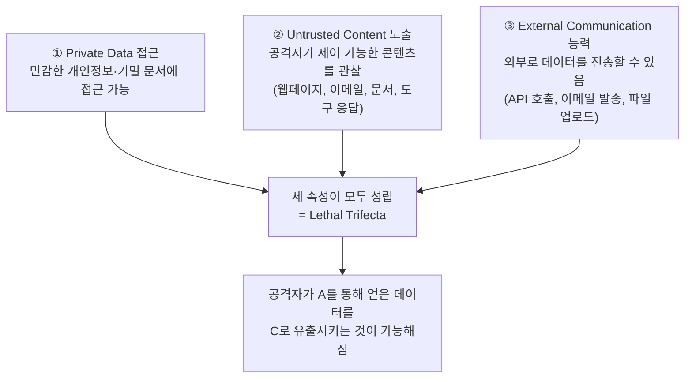

# Prompt Injection Defense (프롬프트 인젝션 방어)

## 개요

Prompt Injection은 2024년부터 OWASP LLM Top 10에서 줄곧 1위를 지키고 있으며, 2026년에도 여전히 "아키텍처적으로 미해결된 문제"로 평가받는다. 이 위키에는 공격 형태([[AI/Engineering/Harness_Engineering/Red_Teaming|Red_Teaming]] §2)와 신뢰 경계 분리 원칙(PVE, [[AI/Engineering/Harness_Engineering/Guardrail_Engineering|Guardrail_Engineering]])이 이미 서술되어 있지만, 2025~2026년에 업계 표준으로 자리잡은 **위험 조건 자체를 정의하는 프레이밍**(Lethal Trifecta, Rule of Two)과 **아키텍처 수준 방어 패턴**(CaMeL, Dual-LLM)은 별도 문서가 필요할 만큼 무겁다. 본 문서는 그 정본 역할을 한다.

## Lethal Trifecta — 언제 치명적인가

Simon Willison이 정식화한 개념. 에이전트가 다음 세 속성을 **동시에** 가질 때만 프롬프트 인젝션이 치명적 공격으로 이어진다.



세 속성 중 **어느 하나라도 제거**하면 트리팩터는 성립하지 않는다 — 민감 데이터에 접근하지 못하게 하거나(①), 비신뢰 콘텐츠를 아예 관찰하지 못하게 하거나(②), 외부 전송 능력을 없애면(③) 인젝션이 성공해도 실질적 피해로 이어지지 않는다. 이 프레이밍의 실무 가치는 "인젝션을 100% 막는다"는 불가능한 목표 대신 "세 속성이 동시에 성립하는 상황을 만들지 않는다"는 달성 가능한 목표로 문제를 재정의한다는 데 있다.

## Meta의 Rule of Two

Lethal Trifecta를 실무 정책으로 전환한 규칙. **"세 속성 중 2개를 초과해 동시에 만족하는 에이전트 행동은 사람의 승인 없이는 실행되어서는 안 된다."**

```
세션 내에서 다음 중 최대 2개까지만 human approval 없이 허용:
  □ Private/민감 데이터 접근
  □ Untrusted 콘텐츠 노출
  □ 외부 통신 능력

3개 모두 필요한 작업 (예: "받은 편지함을 읽고 요약해서 슬랙으로 보내줘"에서
받은 편지함=비신뢰 콘텐츠, 슬랙 전송=외부 통신, 만약 받은 편지함에
민감 정보가 있다면 private data까지 3속성 충족)
  → 반드시 HITL 승인 게이트 통과 필요
```

## 왜 Sandbox·Allow-list만으로는 부족한가

직관적으로는 "샌드박스에 가두고 허용 목록만 열어주면 안전하다"고 생각하기 쉽지만, 실전에서 반복적으로 실패하는 두 가지 패턴이 있다.

```
실패 패턴 1 — Allow-list가 공격을 단순화시킨 사례:
  에이전트가 실행할 수 있는 명령을 화이트리스트로 제한했더니
  공격자가 굳이 새 명령을 주입할 필요 없이
  "이미 허용된 명령들을 공격에 유리한 순서·인자로 조합"하는 것만으로 충분했음
  → allow-list는 "무엇을 할 수 있는가"만 제한하지 "어떤 목적으로 조합하는가"는 막지 못함

실패 패턴 2 — 에이전트 출력이 자기 샌드박스 경계를 재정의:
  샌드박스 설정 자체가 파일·환경변수로 관리되는 경우,
  에이전트가 (인젝션된 지시에 따라) 그 설정 파일을 수정하는 명령을 실행하면
  다음 턴부터는 "수정된" 샌드박스 경계 안에서 동작
  → 격리 메커니즘이 격리 대상과 같은 권한 평면에 있으면 격리가 무력화됨
```

**결론**: Sandbox/allow-list는 필요하지만 충분하지 않다. 반드시 아키텍처 수준의 신뢰 분리와 결합해야 한다.

## 아키텍처 방어 패턴

### CaMeL (Capability-based Machine Learning agents)

도구 호출 결과에 **capability**(권한 토큰)를 부착해, 특정 데이터에서 파생된 값이 어떤 sink(파일 쓰기, 외부 전송 등)로 흘러갈 수 있는지를 데이터플로우 수준에서 강제한다.

```
전통적 접근: LLM 프롬프트에 "이 데이터는 믿지 마"라고 지시 (신뢰에 의존, 우회 가능)
CaMeL 접근: 비신뢰 소스에서 나온 값에 태그를 부착
           → 그 값이 민감 sink로 전달되려는 시점에 정책 엔진이 개입해 차단
           → LLM이 지시를 "잊거나 속아도" 데이터플로우 자체가 강제됨
```

### Dual-LLM 패턴 (Willison)

하나의 LLM에 모든 권한을 몰아주지 않고 역할을 분리한다.

```
Privileged LLM (특권 모델)
  - 사용자와 직접 대화, 도구 호출 여부를 결정
  - 비신뢰 콘텐츠를 절대 직접 보지 않음

Quarantined LLM (격리 모델)
  - 웹페이지·문서 등 비신뢰 콘텐츠만 처리
  - 요약된 결과만 (구조화된 형태로) Privileged LLM에 전달
  - 이 모델이 인젝션에 당해도 도구 호출 권한이 없어 피해가 제한됨
```

### Spotlighting (신뢰 경계 명시)

프롬프트 안에서 신뢰 수준이 다른 콘텐츠를 모델이 구분할 수 있도록 명시적으로 표시하는 기법. `Guardrail_Engineering.md`의 PVE가 제시하는 `<observation untrusted="true">` 태깅이 이 계열에 속한다. 인코딩 변환(예: 비신뢰 콘텐츠를 특수 유니코드로 감싸기)까지 포함하는 확장된 형태도 연구되고 있다.

## MCP 고유의 공격면

[[AI/Engineering/Agent_Engineering/Agent_Skills_and_Protocols/MCP|MCP]]는 도구·리소스 접근을 표준화하면서 동시에 새로운 인젝션 경로를 열었다. MCP 문서의 "보안 위협 5가지"(Tool Poisoning, Rug Pull, Excessive Permissions 등) 중 프롬프트 인젝션과 직접 연결되는 것은 **Tool Poisoning**(악성 서버가 정상 서버로 위장해 도구 설명(description) 자체에 숨겨진 지시를 심음)과 **Rug Pull**(신뢰를 얻은 뒤 서버 동작을 사후 변경)이다. 두 공격 모두 Lethal Trifecta 관점에서 보면 "도구 설명"이라는, 사용자가 검토하지 않는 채널을 통해 Untrusted Content가 주입되는 경로라는 공통점이 있다.

## 경계 정리

| 문서 | 다루는 것 |
|------|-----------|
| [[AI/Engineering/Harness_Engineering/Red_Teaming|Red_Teaming]] | 인젝션·탈옥 등 공격을 **발견·자동화**하는 방법론(PAIR, TAP, Garak) |
| [[AI/Engineering/Harness_Engineering/Guardrail_Engineering|Guardrail_Engineering]] | 콘텐츠 안전·편향·워터마킹을 포함한 **범용 방어 스택** 전반 |
| **본 문서 (Prompt_Injection_Defense)** | 프롬프트 인젝션에 **특화된 아키텍처 방어** — 위험 조건의 정의(Trifecta/Rule of Two)와 구조적 대응(CaMeL/Dual-LLM/Spotlighting) |

## AI Engineering에서의 역할

프롬프트 인젝션은 "모델을 더 안전하게 학습시키면 해결된다"는 접근이 반복적으로 실패해 온 영역이다 — 공격이 자연어 자체를 매개로 하기 때문에, 모델이 지시와 데이터를 완벽히 구분하는 능력에 상한이 있는 한 순수 모델 수준 해결은 어렵다. 그래서 실무의 무게중심은 "모델을 더 안전하게" 가 아니라 "모델이 뚫려도 피해가 나지 않도록 시스템을 설계"하는 쪽으로 이동했다. Lethal Trifecta와 Rule of Two는 이 설계 원칙을 배포 가능한 정책으로 만든 것이고, CaMeL·Dual-LLM은 그 정책을 코드 수준에서 강제하는 구현 패턴이다.

## 관련 개념
[[AI/Engineering/Harness_Engineering/Red_Teaming|Red_Teaming]] · [[AI/Engineering/Harness_Engineering/Guardrail_Engineering|Guardrail_Engineering]] · [[AI/Engineering/Agent_Engineering/Agent_Skills_and_Protocols/MCP|MCP]] · [[AI/Engineering/Agent_Engineering/Autonomous_Systems|Autonomous_Systems]] · [[AI/Engineering/Agent_Engineering/Computer_Use_and_Voice_Agents|Computer_Use_and_Voice_Agents]]

## 출처
- Willison, S. (2025) "The lethal trifecta for AI agents" — [simonwillison.net](https://simonwillison.net/2025/Jun/16/the-lethal-trifecta/)
- Meta (2026) "Agents Rule of Two" — [ai.meta.com](https://ai.meta.com/blog/practical-ai-agent-security/)
- Debenedetti et al. (2025) "Defeating Prompt Injections by Design (CaMeL)" — [arXiv:2503.18813](https://arxiv.org/abs/2503.18813)
- Willison, S. (2023) "The Dual LLM Pattern for Building AI Assistants That Can Resist Prompt Injection" — [simonwillison.net](https://simonwillison.net/2023/Apr/25/dual-llm-pattern/)
- OWASP "LLM01:2025 Prompt Injection" — [owasp.org](https://genai.owasp.org/llmrisk/llm01-prompt-injection/)
