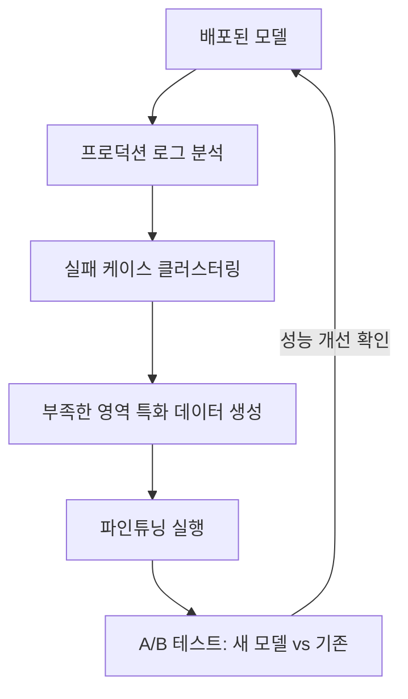

# Continuous Optimization (지속적 최적화)

## 개요

**Continuous Optimization**은 AI 시스템을 배포한 후에도 성능을 지속적으로 향상시키는 프로세스다. 프롬프트 자동 최적화(DSPy), 반복적 파인튜닝, A/B 테스트, 그리고 프로덕션 데이터 기반 개선이 포함된다.

## DSPy: 자동 프롬프트 최적화

### 개요

**DSPy** (Declarative Self-Improving Language Programs)는 Stanford NLP의 Omar Khattab이 2023년 발표한 프레임워크다. LLM 프로그램을 수작업으로 프롬프트 엔지니어링하는 대신, **컴파일러처럼 자동으로 최적의 프롬프트와 Few-shot 예시를 찾는다**.

```
기존 방식:
  개발자가 수작업으로 프롬프트 작성 → 테스트 → 수정 반복
  "너는 전문 요약가야. 다음 텍스트를 3줄로 요약해줘..."

DSPy 방식:
  목표 선언: summarize(text) → summary
  평가 기준 정의: rouge_score(summary, reference) > 0.8
  → 컴파일러가 최적 프롬프트 자동 생성
```

### 핵심 개념

```python
import dspy

# 1. 시그니처 선언 (입출력 명세)
class SummarizeSignature(dspy.Signature):
    """텍스트를 3문장 이내로 핵심 내용 요약"""
    text: str = dspy.InputField(desc="요약할 원문")
    summary: str = dspy.OutputField(desc="3문장 이내 핵심 요약")

# 2. 모듈 정의
class Summarizer(dspy.Module):
    def __init__(self):
        self.summarize = dspy.ChainOfThought(SummarizeSignature)
    
    def forward(self, text: str) -> str:
        return self.summarize(text=text).summary

# 3. 평가 메트릭 정의
def rouge_metric(example, pred, trace=None) -> float:
    from rouge_score import rouge_scorer
    scorer = rouge_scorer.RougeScorer(['rouge2', 'rougeL'])
    scores = scorer.score(example.summary, pred.summary)
    return scores['rougeL'].fmeasure

# 4. 최적화 (컴파일)
train_data = [dspy.Example(text=t, summary=s).with_inputs("text") 
              for t, s in training_pairs]

optimizer = dspy.MIPROv2(metric=rouge_metric, auto="medium")
optimized_summarizer = optimizer.compile(
    Summarizer(),
    trainset=train_data
)

# 최적화된 모듈은 자동으로 찾아진 프롬프트+Few-shot 예시 포함
optimized_summarizer.summarize.show_instructions()
```

### MIPROv2 (2024)

DSPy의 핵심 최적화 알고리즘:

```
MIPROv2 프로세스:
1. 메타 프롬프트 생성 (작업 특성 분석)
2. 후보 Instruction 다수 생성
3. Few-shot 예시 선택 (Bayesian Optimization)
4. 그리디 탐색으로 최적 조합 탐색
5. 검증 세트로 최종 선택

기존 BootstrapFewShot 대비:
  - 프롬프트 지시문도 함께 최적화
  - 효율적인 Bayesian 탐색
  - +10-40% 성능 개선 보고 (구조화 태스크 기준)
```

### DSPy 3.0 (2025) — 신규 옵티마이저

DSPy 3.0에서 추가된 주요 옵티마이저:

| 옵티마이저 | 특징 | 적합한 상황 |
|-----------|------|-----------|
| **SIMBA** | 스토캐스틱 미니배치 + 자기 반성(self-reflection) | 대규모 데이터, 큰 LLM |
| **GEPA** | Genetic-Pareto 탐색, RL 대비 1/35 연산량에 +20% 성능 | 연산 효율 중시 |
| **GRPO** | Group Relative Policy Optimization (RL 기반) | 모델 가중치까지 함께 최적화 |

```python
# SIMBA: 대규모 데이터에서 자기 반성 기반 최적화
optimizer = dspy.SIMBA(metric=my_metric, num_candidates=6)
optimized = optimizer.compile(MyModule(), trainset=train_data)

# GEPA: 유전자 알고리즘 기반, 연산 효율 우선
optimizer = dspy.GEPA(metric=my_metric)
optimized = optimizer.compile(MyModule(), trainset=train_data)
```

DSPy 3.0은 프롬프트 최적화에서 **모델 가중치 최적화**까지 범위를 확장했으며, `dspy.Image` / `dspy.Audio` 타입 추가로 멀티모달 파이프라인도 지원한다.

## 반복적 파인튜닝 사이클



```python
class ContinuousImprovementPipeline:
    def __init__(self, base_model, eval_benchmark):
        self.model = base_model
        self.benchmark = eval_benchmark
        self.iteration = 0
    
    def analyze_failures(self, production_logs: list) -> list:
        """실패 케이스 자동 분석"""
        failures = [log for log in production_logs if log["quality_score"] < 0.6]
        
        # 클러스터링으로 실패 패턴 분류
        failure_clusters = cluster_by_topic(failures)
        
        return [
            {
                "category": cluster["topic"],
                "count": len(cluster["samples"]),
                "representative_examples": cluster["samples"][:5]
            }
            for cluster in sorted(failure_clusters, key=lambda x: -len(x["samples"]))
        ]
    
    def generate_synthetic_data(self, failure_categories: list) -> list:
        """실패 카테고리에 대한 합성 훈련 데이터 생성"""
        synthetic_data = []
        for cat in failure_categories[:3]:  # 상위 3개 카테고리 집중
            new_samples = generator_llm.generate_training_data(
                topic=cat["category"],
                examples=cat["representative_examples"],
                n_samples=200
            )
            synthetic_data.extend(new_samples)
        return synthetic_data
    
    def run_iteration(self, production_logs: list):
        self.iteration += 1
        print(f"=== Iteration {self.iteration} ===")
        
        # 1. 분석
        failures = self.analyze_failures(production_logs)
        
        # 2. 데이터 생성
        new_data = self.generate_synthetic_data(failures)
        
        # 3. 파인튜닝
        new_model = finetune(self.model, new_data)
        
        # 4. 평가
        baseline_score = self.benchmark.evaluate(self.model)
        new_score = self.benchmark.evaluate(new_model)
        
        # 5. 배포 결정
        if new_score > baseline_score * 1.02:  # 2% 이상 개선
            self.model = new_model
            print(f"배포 승인: {baseline_score:.3f} → {new_score:.3f}")
        else:
            print(f"배포 보류: {baseline_score:.3f} vs {new_score:.3f}")
```

## A/B 테스트

모델/프롬프트 변경사항을 프로덕션에서 안전하게 검증:

```python
import random

class ABTestRunner:
    def __init__(self, model_a, model_b, traffic_split=0.1):
        self.model_a = model_a  # 현재 모델 (90% 트래픽)
        self.model_b = model_b  # 새 모델 (10% 트래픽)
        self.traffic_split = traffic_split
        self.results = {"a": [], "b": []}
    
    def route(self, user_query: str) -> tuple[str, str]:
        """트래픽을 A/B로 분기"""
        model_choice = "b" if random.random() < self.traffic_split else "a"
        model = self.model_b if model_choice == "b" else self.model_a
        response = model.generate(user_query)
        return response, model_choice
    
    def record(self, model_choice: str, quality_score: float):
        self.results[model_choice].append(quality_score)
    
    def analyze(self) -> dict:
        """통계적 유의성 검증"""
        from scipy import stats
        t_stat, p_value = stats.ttest_ind(self.results["a"], self.results["b"])
        
        return {
            "model_a_avg": sum(self.results["a"]) / len(self.results["a"]),
            "model_b_avg": sum(self.results["b"]) / len(self.results["b"]),
            "p_value": p_value,
            "significant": p_value < 0.05,
            "winner": "b" if self.results["b"] > self.results["a"] else "a"
        }
```

## 프롬프트 버전 관리

```python
# LangSmith 프롬프트 허브 활용
from langsmith import Client

client = Client()

# 프롬프트 버전 저장
client.push_prompt("rag-qa-v1", 
    prompt=ChatPromptTemplate.from_template(template_v1))

# 프롬프트 풀링
prompt = client.pull_prompt("rag-qa-v1")

# 버전별 성능 비교
# rag-qa-v1: RAGAS 0.82
# rag-qa-v2: RAGAS 0.87 ← 배포
# rag-qa-v3: RAGAS 0.85 ← 회귀, 롤백
```

## RLVR: 검증 가능한 보상 기반 강화학습 *(2025)*

**RLVR (Reinforcement Learning with Verifiable Rewards)**은 정답 여부를 자동으로 확인할 수 있는 도메인(수학, 코드, 논리 추론)에서 모델을 RL로 직접 훈련하는 패러다임이다. 주관적 선호도 기반인 RLHF와 달리 **객관적·자동 피드백**을 사용한다.

```
RLHF vs RLVR 비교:

RLHF:
  응답 A vs 응답 B → 인간이 선호 선택 → 보상 모델 학습 → PPO
  단점: 주관적, 비용 높음, 느림

RLVR:
  응답 생성 → 정답 체크 (수식/코드 실행/규칙) → 즉시 보상
  장점: 완전 자동화, 확장 가능, 창발적 추론 능력 발생
```

**DeepSeek-R1 (2025)**: GRPO(Group Relative Policy Optimization) + RLVR로 수학·코딩 추론 능력을 OpenAI o1 수준까지 끌어올림. 핵심은 정답 검증기만 있으면 별도의 보상 모델 없이 훈련 가능하다는 것.

```python
# RLVR의 핵심 구조
def rlvr_reward(response: str, ground_truth: str) -> float:
    """검증 가능한 보상: 정답이면 1, 오답이면 0"""
    # 수학: 수식 평가기
    # 코드: 유닛 테스트 실행
    # 논리: 규칙 기반 검증기
    return 1.0 if verify(response, ground_truth) else 0.0

# GRPO: 여러 후보 응답 중 상대적 품질로 업데이트
# (별도 critic 모델 불필요)
```

RLVR는 Continuous Optimization의 새로운 축으로, 특히 **검증 가능한 태스크**에서 프롬프트 최적화를 넘어 모델 자체의 추론 능력을 향상시킨다.

## Test-Time Compute Scaling *(2025)*

훈련 시점이 아닌 **추론 시점에 계산을 더 투입**해 품질을 높이는 패러다임. 2025년부터 AI 스케일링의 새로운 축으로 부상했다.

```
기존 스케일링 법칙:
  더 큰 모델 = 더 높은 성능 (파라미터 증가)

Test-Time Compute Scaling:
  동일한 모델 + 더 많은 추론 시간 = 더 높은 성능
  → 모델 크기 대신 "생각하는 시간"을 늘림
```

| 기법 | 설명 | 대표 모델 |
|------|------|---------|
| **Chain-of-Thought** | 단계별 사고 체인 생성 | GPT-4o |
| **Extended Thinking** | 숨겨진 추론 토큰 생성 | OpenAI o1/o3, Claude 3.7 |
| **Best-of-N** | N개 응답 생성 후 최선 선택 | 범용 |
| **Tree Search** | 추론 경로를 트리로 탐색 | MCTS 기반 |

```
OpenAI o-series 패턴:
  o1 (2024): extended thinking으로 AIME 수학 83.3%
  o3 (2025): 더 많은 test-time compute → ARC-AGI 87.5%

루프 관점:
  더 많이 생각하는 것 자체가 하나의 최적화 루프
  → 좋은 추론 궤적 → RLVR 훈련 데이터 → 더 나은 모델
```

## AI Engineering에서의 역할

Continuous Optimization은 **AI 시스템을 항상 최신 상태로 유지하는 엔진**이다. DSPy는 프롬프트 최적화를 수작업에서 자동화로 전환하고, RLVR은 검증 가능한 도메인에서 모델 자체의 추론 능력을 향상시킨다. A/B 테스트는 개선사항을 안전하게 검증한다. 2025년 이후로는 Test-Time Compute Scaling이 훈련이 아닌 추론 단계에서의 최적화 루프로 새롭게 자리잡고 있다.

## 관련 개념
[[Data_Flywheel]] · [[Runtime_Optimization]] · [[LLM_as_a_Judge]] · [[Benchmarking]] · [[PEFT_LoRA_QLoRA]]

## 출처
- Khattab et al. (2023) "DSPy: Compiling Declarative Language Model Calls" — [arxiv.org/abs/2310.03714](https://arxiv.org/abs/2310.03714)
- DSPy 공식 문서 — [dspy.ai](https://dspy.ai)
- DSPy 3.0 출시 (2025) — [dspy.ai/roadmap](https://dspy.ai/roadmap/)
- DeepSeek-R1 (2025) "Incentivizing Reasoning Capability in LLMs via RL" — [arxiv.org/abs/2501.12948](https://arxiv.org/abs/2501.12948)
- "Inference-Time Scaling for Complex Tasks" (2025) — [arxiv.org/abs/2504.00294](https://arxiv.org/abs/2504.00294)
