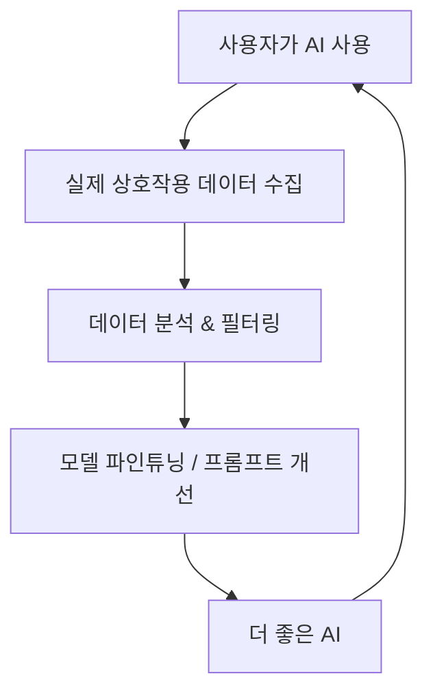
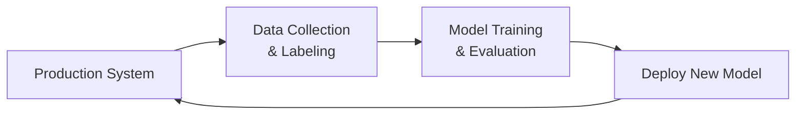
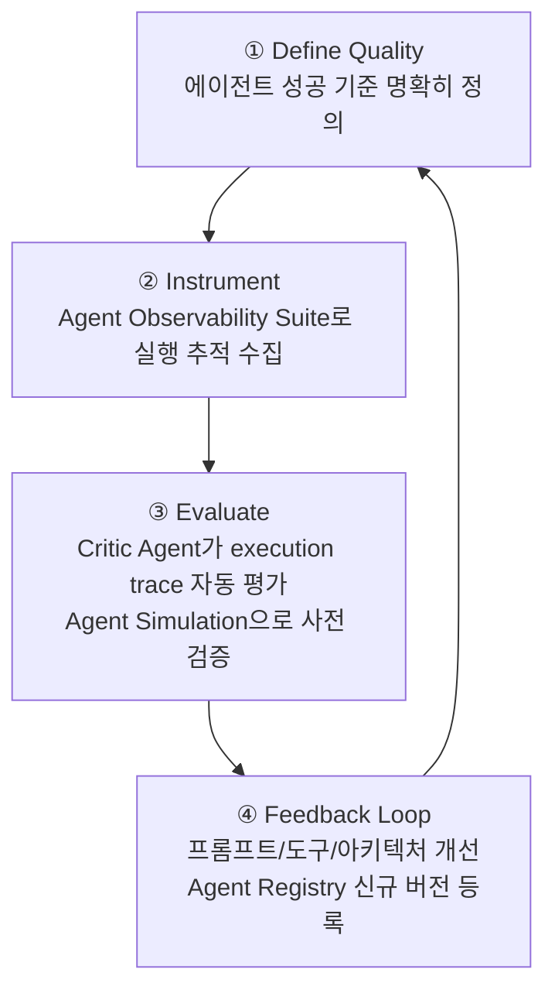
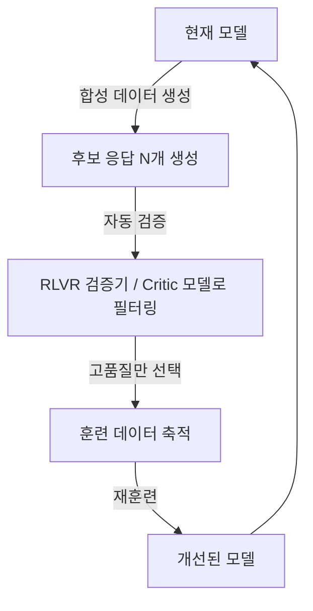

# Data Flywheel (데이터 플라이휠)

## 개요

**Data Flywheel**은 AI 시스템이 사용될수록 더 많은 고품질 데이터가 쌓이고, 그 데이터로 모델을 개선하면 더 많은 사용을 유도하는 **자기 강화 사이클**이다. 비즈니스 전략의 Flywheel Effect를 AI에 적용한 개념이다.



## Agent-in-the-Loop 프레임워크

**핵심 아이디어**: Agent가 단순히 태스크를 실행하는 것을 넘어서, 실행 과정에서 학습 데이터를 자동으로 생성하는 역할도 한다.

```python
from langchain_core.runnables import RunnableLambda
from langsmith import Client

class AgentInTheLoop:
    """실행하면서 동시에 학습 데이터를 생성하는 에이전트"""
    
    def __init__(self, agent, evaluator, data_store):
        self.agent = agent
        self.evaluator = evaluator
        self.data_store = data_store
    
    def run_and_collect(self, user_query: str) -> dict:
        # 1. 에이전트 실행
        response = self.agent.run(user_query)
        
        # 2. 자동 품질 평가
        quality_score = self.evaluator.score(
            query=user_query,
            response=response
        )
        
        # 3. 고품질 응답만 데이터셋에 추가
        if quality_score >= 0.8:
            self.data_store.add({
                "input": user_query,
                "output": response,
                "quality_score": quality_score,
                "timestamp": datetime.now().isoformat()
            })
        
        return {"response": response, "score": quality_score}
    
    def trigger_finetuning_if_ready(self, threshold=1000):
        """충분한 데이터가 쌓이면 파인튜닝 트리거"""
        if len(self.data_store) >= threshold:
            finetune_model(self.data_store.get_all())
            self.data_store.clear()
```

## 데이터 수집 전략

### 1. 암시적 피드백 (Implicit Feedback)

사용자 행동에서 품질 신호 추출:

```python
# 사용자 행동 → 품질 신호
behavior_signals = {
    "응답 복사": 0.8,        # 유용하다고 판단
    "재질문 없음": 0.7,       # 만족했을 가능성
    "엄지 올림": 1.0,        # 명시적 좋음
    "재질문": -0.3,          # 불만족 신호
    "대화 중단": -0.5,        # 이탈
    "엄지 내림": -1.0,        # 명시적 나쁨
}

def compute_quality_signal(session_events: list) -> float:
    score = 0.5  # 기본값
    for event in session_events:
        score += behavior_signals.get(event["type"], 0)
    return max(0, min(1, score))
```

### 2. 명시적 피드백 (Explicit Feedback)

```python
# RLHF 스타일 선호도 수집
def collect_preference(query: str, response_a: str, response_b: str) -> str:
    """사용자에게 두 응답 중 선택 요청"""
    return display_pairwise_comparison(response_a, response_b)
    # → 선택된 응답이 학습 데이터로
```

### 3. LLM-as-a-Judge 기반 자동 필터링

```python
from ragas import evaluate
from ragas.metrics import faithfulness, answer_relevancy

def auto_filter_high_quality(samples: list) -> list:
    """LLM 판사로 고품질 샘플만 선별"""
    results = evaluate(dataset=samples, metrics=[faithfulness, answer_relevancy])
    
    high_quality = [
        sample for sample, score in zip(samples, results.scores)
        if score["answer_relevancy"] > 0.8 and score["faithfulness"] > 0.9
    ]
    return high_quality
```

## RAG 데이터 플라이휠 실사례

**목표**: 검색 시스템을 점점 더 정확하게 만들기

```
1주차: 기본 RAG 배포
  → 사용자 질의 1,000개 수집

2주차: 검색 실패 패턴 분석
  → "찾을 수 없습니다" 응답 = 검색 미스
  → 상위 20% 쿼리 패턴 식별

3주차: 청킹 전략 최적화
  → 실패한 쿼리 기반으로 청크 크기 조정
  → +11.7% Recall 개선 (내부 측정)

4주차: Query Expansion 도입
  → 자주 실패하는 쿼리 → Multi-Query로 확장
  → 추가 +8.3% Recall 개선

→ 지속 반복
```

## 데이터 플라이휠의 구성 요소



핵심 4요소:
1. 데이터 수집 파이프라인 (자동화 필수)
2. 품질 필터링 (LLM-as-a-Judge 또는 인간)
3. 학습 트리거 (데이터 임계치 도달 시)
4. 배포 게이팅 (성능 회귀 방지)

## 데이터 품질 관리

```python
class DataQualityPipeline:
    def process(self, raw_sample: dict) -> Optional[dict]:
        # 1. 기본 필터
        if len(raw_sample["output"]) < 50:  # 너무 짧은 응답 제거
            return None
        
        # 2. 중복 제거
        if self.is_duplicate(raw_sample):
            return None
        
        # 3. 독성 필터
        if self.toxicity_score(raw_sample["output"]) > 0.3:
            return None
        
        # 4. 품질 점수
        quality = self.llm_judge(raw_sample)
        if quality < 0.7:
            return None
        
        return {**raw_sample, "quality_score": quality}
```

## Agent Quality Flywheel *(2026년 5월)*

에이전트 시스템에 특화된 Data Flywheel 구조. 일반 LLM 플라이휠과 달리 **실행 궤적(execution trace)** 데이터가 핵심이다:



```
Data Flywheel vs Agent Quality Flywheel 비교:

Data Flywheel:
  사용자 상호작용 → 텍스트 데이터 → 파인튜닝 → 더 좋은 응답

Agent Quality Flywheel:
  에이전트 실행 → execution trace → Critic Agent 평가
  → 실패 패턴 식별 → 개선 → Agent Simulation 검증
  → 배포 → 반복
  
  핵심 차이: 데이터가 텍스트가 아닌 "실행 궤적"
```

에이전트 플라이휠이 잘 돌기 위한 인프라: Agent Observability Suite(계측) + Critic Agent(평가) + Agent Simulation(검증) + Agent Registry(버전 관리). 자세한 내용 → [[Agent_Deployment]] · [[LLM_as_a_Judge]]

## Self-Evolving Data Flywheel *(2025-2026)*

모델 자신이 훈련 데이터를 생성하는 **자기 진화(Self-Evolving)** 플라이휠. 외부 인간 데이터 없이도 모델이 스스로 개선된다.



**RLVR + Self-Play 결합**: 수학·코드처럼 정답 검증이 가능한 도메인에서 모델이 스스로 문제를 풀고, 검증기가 즉시 보상 신호를 제공한다. DeepSeek-R1이 이 방식으로 훈련됐다.

```
Self-Distilled RLVR (2025):
  1. 기존 모델로 Chain-of-Thought 응답 대량 생성
  2. 검증기로 정답 확인 → 정답 응답만 선별
  3. 선별된 응답으로 동일 모델 재훈련 (self-distillation)
  4. 반복 → 추론 능력 점진적 향상
  
  장점: 외부 stronger 모델 불필요
  적용 도메인: 수학, 코드, 논리 퍼즐
```

**AgenticQwen Dual Flywheel (2025)**: 도구 사용 에이전트를 위한 이중 플라이휠. 실제 실행 궤적(execution trace)과 합성 생성 궤적을 동시에 활용해 소형 에이전트 모델을 산업 규모로 훈련한다.

```
Dual Data Flywheel:
  Flywheel 1 (Real): 프로덕션 에이전트 실행 → trace 수집 → 품질 필터 → 훈련
  Flywheel 2 (Synthetic): 시뮬레이터에서 합성 trace 생성 → 검증 → 훈련
  → 두 플라이휠 결합으로 데이터 다양성 + 스케일 확보
```

## AI Engineering에서의 역할

Data Flywheel은 AI 시스템이 **정적인 제품에서 살아있는 시스템**으로 진화하게 하는 핵심 메커니즘이다. 2025년 이후로는 외부 인간 레이블 없이 모델 스스로가 훈련 데이터를 생성·검증하는 Self-Evolving 패턴이 확산되고 있다. 에이전트 시스템에서는 Agent Quality Flywheel과 Dual Flywheel로 실행 궤적 수준의 개선 루프를 구축해야 한다.

## 관련 개념
[[Continuous_Optimization]] · [[LLM_as_a_Judge]] · [[Human_Evaluation]] · [[Observability_and_Tracing]] · [[Agent_Deployment]]

## 출처
- Lilian Weng (2023) "LLM-powered Autonomous Agents" — [lilianweng.github.io](https://lilianweng.github.io/posts/2023-06-23-agent/)
- "Self-Evolving Data Flywheel" — [emergentmind.com](https://www.emergentmind.com/topics/self-evolving-data-flywheel-d6bab9fb-b333-4f84-a20a-5dcf55ee8dbd)
- "AgenticQwen: Training Small Agentic LMs with Dual Data Flywheels" (2025) — [arxiv.org/abs/2604.21590](https://arxiv.org/abs/2604.21590)
- "Self-Distilled RLVR" (2025) — [arxiv.org/abs/2604.03128](https://arxiv.org/abs/2604.03128)
