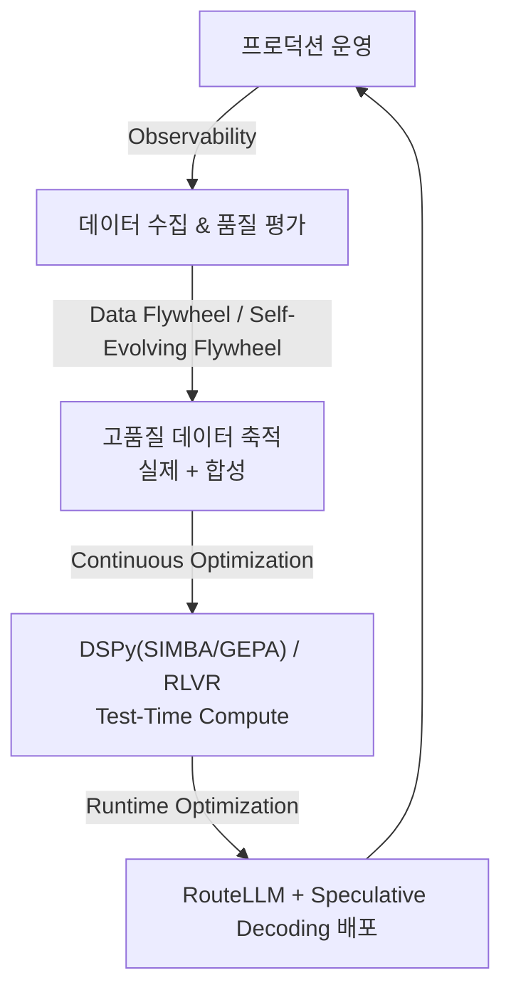

# Loop Engineering (루프 엔지니어링)

## 개요

**Loop Engineering**은 AI 시스템이 배포된 이후에도 **스스로 개선되는 사이클**을 설계하는 기술이다. "배포로 끝이 아니라 배포가 시작이다"라는 원칙 아래, 프로덕션 데이터를 다시 시스템 개선에 활용하는 피드백 루프를 구축한다.



## 하위 문서

| 문서 | 내용 |
|------|------|
| [[Data_Flywheel]] | 자기 강화 데이터 사이클, Self-Evolving Flywheel, RLVR + 합성 데이터 |
| [[Continuous_Optimization]] | DSPy 3.0(SIMBA/GEPA/GRPO), RLVR, Test-Time Compute Scaling |
| [[Runtime_Optimization]] | Semantic Cache, RouteLLM, Speculative Decoding, vLLM/SGLang 서빙 내부 |
| [[Production_Operations]] | AI 게이트웨이, 배포 전략, A/B 테스트, SRE/카오스 엔지니어링, FinOps |

## 루프 없이는 무엇이 문제인가

```
정적 AI 시스템:
  1개월 후 — 사용자 불만 증가 (이유 모름)
  2개월 후 — 경쟁사 모델이 더 좋아짐
  3개월 후 — 시스템이 시대에 뒤처짐

Loop Engineering이 있으면:
  1개월 후 — 실패 패턴 자동 감지 → 프롬프트 개선
  2개월 후 — 축적된 데이터로 파인튜닝
  3개월 후 — 경쟁사보다 더 빠른 개선 속도
```

## AI Engineering에서의 역할

Loop Engineering은 **AI 시스템에 진화 능력을 부여하는 최상위 계층**이다. 데이터 플라이휠이 돌면 사용자 기반이 클수록 더 빠르게 개선되는 네트워크 효과가 발생한다. 이것이 AI 스타트업과 대형 플랫폼의 경쟁에서 핵심 해자(moat)가 된다.

## 관련 개념
[[Harness_Engineering/Observability_and_Tracing]] · [[Harness_Engineering/LLM_as_a_Judge]] · [[Model_Engineering/PEFT_LoRA_QLoRA]]
