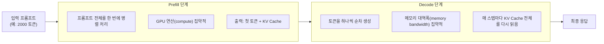

# Serving Engineering (서빙 엔지니어링)

## 개요

[[AI/Engineering/Loop_Engineering/Cost_Engineering/Cost_Engineering|Cost_Engineering]]이 "이 계층은 새 통제 대상이 아니라 Loop Engineering의 목표 지표를 비용으로 바꾼 특수화"라고 스스로를 정의했듯, **Serving Engineering도 새 계층이 아니다.** [[AI/Engineering/Loop_Engineering/Runtime_Optimization|Runtime_Optimization]]이 다루던 "각 요청을 GPU에서 어떻게 가장 효율적으로 처리할 것인가"라는 인프라 층위가 하나의 문서 안에서 다루기엔 너무 커져(418줄, 위키 전체 최대 분량) 별도 서브폴더로 분리한 것이다. Runtime_Optimization은 **애플리케이션이 API를 어떻게 더 적게·더 싸게 호출할 것인가**(캐싱·라우팅·배칭)에 집중하고, 본 챕터는 **셀프호스팅 서빙 엔진 내부에서 GPU 자원을 어떻게 최대로 활용할 것인가**를 다룬다.

## Prefill/Decode 2단계 구조

LLM 추론은 성격이 전혀 다른 두 단계로 구성된다. 이 챕터 전체를 관통하는 가장 중요한 전제다.



두 단계를 같은 GPU 풀에서 처리하면 자원 요구 특성이 달라 서로를 방해한다 — 연산 집약적인 Prefill이 진행되는 동안 메모리 대역폭 집약적인 Decode 요청은 지연을 겪는다(헤드 오브 라인 블로킹). 이 구조적 긴장을 어떻게 완화하느냐가 [[AI/Engineering/Loop_Engineering/Serving_Engineering/Inference_Internals|Inference_Internals]](같은 GPU에서 완화)와 [[AI/Engineering/Loop_Engineering/Serving_Engineering/Distributed_Serving|Distributed_Serving]](물리적으로 분리)의 핵심 주제다.

## 핵심 지표: TTFT / TPOT / Goodput

```
TTFT (Time To First Token)
  요청 도착 → 첫 토큰 출력까지 걸린 시간
  주로 Prefill 단계 성능 + 큐 대기시간이 결정

TPOT (Time Per Output Token)
  두 번째 토큰부터 각 토큰 생성 간 평균 시간
  주로 Decode 단계 성능이 결정 (메모리 대역폭에 좌우)

Goodput
  단순 처리량(throughput)이 아니라 "SLA를 만족하는" 처리량
  예: TTFT < 1초, TPOT < 50ms를 만족하는 요청만 카운트
  → 처리량은 높지만 지연시간 SLA를 어기는 스케줄링은 goodput 관점에서 실패
```

## 셀프호스팅 서빙 옵션 비교

| 엔진 | 강점 | 적합한 경우 |
|------|------|------------|
| **vLLM** | PagedAttention, 폭넓은 모델 지원, 성숙한 생태계 | 범용 프로덕션 서빙의 기본 선택지 |
| **SGLang** | RadixAttention, 구조화 출력에 강함 | Prefix 공유가 많은 에이전트/멀티턴 워크로드 |
| **TensorRT-LLM** | NVIDIA GPU 최적화, FP8/NVFP4 | 최신 NVIDIA 하드웨어에서 최대 처리량 필요 시 |
| **llama.cpp** | CPU/엣지에서도 실행, 낮은 리소스 요구 | 로컬/엣지 배포, 소규모 모델 |
| **Ollama** | llama.cpp 기반, 매우 쉬운 설치·관리 | 개발자 로컬 환경, 프로토타이핑 |
| **TGI** (HuggingFace) | HuggingFace 생태계 통합 | HF Hub 모델을 빠르게 서빙 |

## 하위 문서

| 문서 | 내용 |
|------|------|
| [[AI/Engineering/Loop_Engineering/Serving_Engineering/Inference_Internals|Inference_Internals]] | 단일 GPU(풀) 내부 최적화 — KV Cache, PagedAttention, Continuous Batching, Chunked Prefill, RadixAttention, FlashAttention |
| [[AI/Engineering/Loop_Engineering/Serving_Engineering/Speculative_Decoding|Speculative_Decoding]] | Draft 모델 기반 가속 — EAGLE-3, Medusa, n-gram/Prompt Lookup, 수락률(acceptance rate) |
| [[AI/Engineering/Loop_Engineering/Serving_Engineering/Distributed_Serving|Distributed_Serving]] | 다중 GPU·다중 리전 — Disaggregated Prefill/Decode, KV Cache Transfer, TP/PP/EP 병렬화, Goodput 스케줄링, 콜드 스타트 |

## 경계 정리

| 문서 | 다루는 것 |
|------|-----------|
| [[AI/Engineering/Loop_Engineering/Runtime_Optimization|Runtime_Optimization]] | **API 호출 측**에서 요청 수·토큰 수 자체를 줄이는 방법 — Semantic Cache, 모델 라우팅, 배칭, 스트리밍 |
| **본 챕터 (Serving_Engineering)** | **서빙 엔진 내부**에서 이미 도착한 요청을 GPU 자원 관점에서 가장 효율적으로 처리하는 방법 |
| [[AI/Engineering/Loop_Engineering/Cost_Engineering/Cost_Engineering|Cost_Engineering]] | 위 두 계층의 비용 지표를 **자율적으로 감시·조정**하는 워처 에이전트 |
| [[AI/Engineering/Loop_Engineering/Production_Operations|Production_Operations]] | 게이트웨이·배포 전략 등 **조직 차원**의 프로덕션 운영 |

## AI Engineering에서의 역할

셀프호스팅이 API 호출보다 유리해지는 임계 규모(요청량이 일정 수준을 넘어서면 자체 GPU 인프라 비용이 API 종량제보다 저렴해지는 지점)에 도달한 조직에게 이 계층의 최적화는 총소유비용(TCO)에 직접 반영된다. PagedAttention·RadixAttention 같은 기법이 서빙 엔진에 기본 내장되면서, 실무자가 직접 구현할 일은 줄었지만 "어떤 엔진을 왜 선택하는가"는 여전히 아키텍처 결정이다.

## 관련 개념
[[AI/Engineering/Loop_Engineering/Runtime_Optimization|Runtime_Optimization]] · [[AI/Engineering/Model_Engineering/Quantization|Quantization]] · [[AI/Engineering/Loop_Engineering/Cost_Engineering/Cost_Engineering|Cost_Engineering]] · [[AI/Engineering/Loop_Engineering/Production_Operations|Production_Operations]]

## 출처
- Kwon et al. (2023) "Efficient Memory Management for LLM Serving with PagedAttention" — [arXiv:2309.06180](https://arxiv.org/abs/2309.06180)
- Zheng et al. (2024) "SGLang: Efficient Execution of Structured Language Model Programs" — [arXiv:2312.07104](https://arxiv.org/abs/2312.07104)
- NVIDIA "TensorRT-LLM" 문서 — [nvidia.github.io/TensorRT-LLM](https://nvidia.github.io/TensorRT-LLM/)
- AI Engineering from Scratch, Phase 17 · Lessons 04-18 (서빙 엔진 내부, Disaggregated Serving, 셀프호스팅) — [GitHub](https://github.com/rohitg00/ai-engineering-from-scratch/tree/main/phases/17-infrastructure-and-production)
