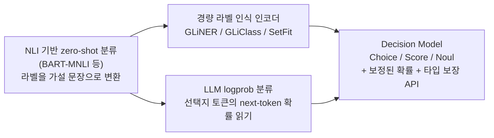
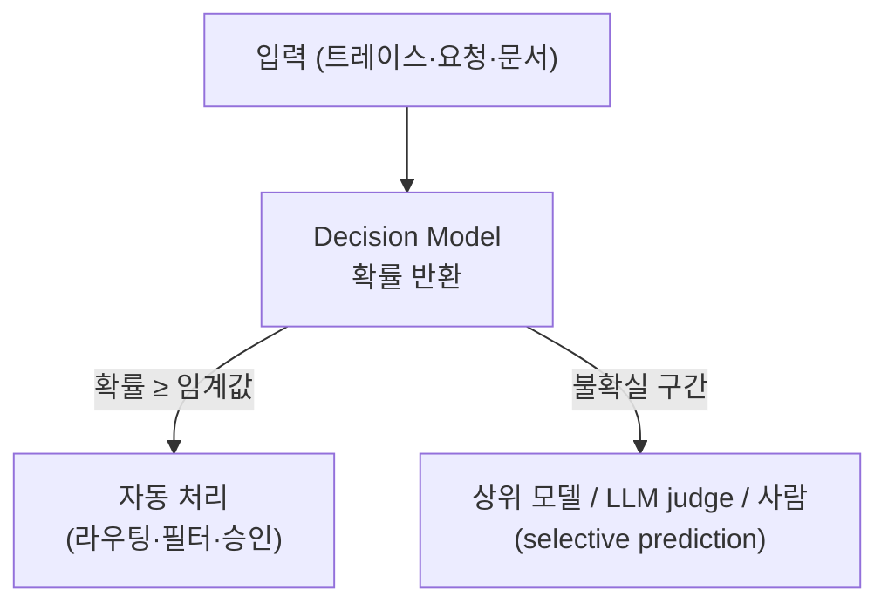

# Decision Models (System One Models)

## 개요

**Decision Model**은 텍스트를 생성하지 않고, 사용자가 지정한 선택지·척도·명제에 대해 **타입이 보장된 값과 확률(probability)·confidence**만 반환하는 판정형(discriminative) 모델이다. 분류, 라우팅, 점수화, 필터링처럼 "짧은 입력을 보고 빠르게 하나를 고르는" 작업에서 생성형 LLM의 긴 출력·높은 지연·불안정한 포맷을 걷어내는 것이 목적이다.

2026년 9월 TypeSafe AI가 **Jev**를 공개하면서 이 범주가 "System One Model"(Kahneman의 빠른 직관 사고에서 차용한 이름)로 불리기 시작했다. 이후 오픈웨이트 진영에서 (a) 새로 학습한 모델, (b) 기존 LLM에 헤드·LoRA를 붙여 튜닝한 모델, (c) 기존 LLM의 next-token **logprob**만 읽는 wrapper 형태의 재현이 활발히 나왔다. 아이디어 자체는 새롭지 않다(NLI 기반 zero-shot 분류, logit으로 선택지 점수화). 새로운 점은 **zero-shot 유연성 + 보정된 확률 + 타입 보장 API**를 한 묶음으로 제공한다는 것이다.

[[AI/Engineering/Prompt_Engineering/Structured_Output|Structured_Output]]이 "생성된 텍스트를 스키마에 맞추는" 방법이라면, 이 문서는 **애초에 텍스트를 생성하지 않는 모델 클래스**를 다룬다.

## 생성형 vs 판정형

| 구분 | 생성형 LLM (System Two 방식) | Decision Model (System One 방식) |
|------|------------------------------|----------------------------------|
| 출력 | 자유 텍스트 → 파싱 | 선택지별 확률 / 점수 / 참·거짓 확률 |
| 추론 | 토큰을 순차 디코딩(CoT 포함) | 입력 prefill 1회, 디코딩 없음 |
| 지연·비용 | 출력 토큰 수에 비례 | 입력 토큰만 과금되는 구조가 일반적 |
| 포맷 오류 | 발생 가능 (재시도 필요) | 선택지 밖 값이 구조적으로 불가능 |
| 설명 | 근거(reasoning) 제공 가능 | 근거 없음 — 확률만 |
| 적합한 작업 | 복합 추론, 생성, 설명 | 라우팅, 분류, moderation, 스코어링 |

## Jev

TypeSafe AI의 Jev(2026-09-15 early access 공개)는 **세 가지 질문 프리미티브**를 가진다.

| 프리미티브 | 입력 | 반환 |
|-----------|------|------|
| **Choice** | 상태(state) + 선택지 목록 | 선택지별 확률 |
| **Score** | 상태 + 순서가 있는 척도 | 척도 수준별 확률/점수 |
| **Noul** | 상태 + 참/거짓 명제 | 명제가 참일 확률 (0–1) |

여러 질문을 한 요청에 병렬로 실어 보낼 수 있고, 응답은 스키마로 제약되어 **선택지 밖 값이 나올 수 없다**. 학습은 합성 데이터와 **RLCD**(Reinforcement Learning for Calibrated Decisions)로 한다고 보고되며, 사람 선호가 아니라 **결과 대비 확률의 정확성**(높게 말한 확률이 실제로 높은 적중률)을 최적화 대상으로 삼는다. 아키텍처와 기술 보고서는 공개되지 않았다.

TypeSafe 자체 보고 수치는 응답 70–500ms, 입력 토큰 100만 개당 $0.042(출력 무료), 프런티어 LLM 대비 40–400배 저렴·40–200배 빠름이다. 이 수치는 **자사 벤치마크 기반**이며 상한에 가까운 사례로 해석해야 한다.

## 계보



## 구현 접근 4가지

| 접근 | 방식 | 예시 | 보정(calibration) | 비고 |
|------|------|------|------------------|------|
| **학습형 Decision Model** | 인코더·LLM에 decision head를 붙이거나 LoRA 튜닝, 혹은 scratch 학습 | Laya(ModernBERT 기반), Kev(Qwen3.5 LoRA + pointer head), NanoJev(0.6B scratch), pplx-decider·Clef(27B급) | 일부는 temperature scaling 등 post-hoc 보정 보고 | 학습 코드·데이터 공개 여부가 프로젝트마다 다름 |
| **Logprob wrapper** | 모델은 frozen. 프롬프트에 선택지를 나열하고 선택지 토큰의 logit을 softmax | mini-jev(Qwen3-4B), SemIf, openjev-sglang(prefill-only 서버) | 대부분 **보정을 주장하지 않음** | 재학습 불필요, 선택지 순서에 민감할 수 있음 |
| **고전 zero-shot 분류기** | NLI 모델·라벨 인식 인코더가 런타임에 라벨을 받음 | NLI 헤드 모델, GLiClass, SetFit(few-shot) | 점수가 보정된 확률이 아닌 경우가 많음 | CPU 추론 가능, 입력이 짧은 분류에 적합 |
| **Structured output 라이브러리** | 어떤 LLM이든 스키마·문법에 맞게 출력 제약 | Outlines, Instructor, DSPy | 해당 없음 (확률 미제공) | 타입은 보장되지만 보정된 confidence는 없음 |

위 프로젝트 목록은 2026년 10월 시점의 스냅샷이며, 대부분 수 주 내에 등장한 신생 프로젝트다. 개별 프로젝트의 성능·라이선스 주장은 도입 전에 직접 검증해야 한다.

### Logprob wrapper 최소 구현

기존 오픈웨이트 LLM으로 Choice 프리미티브를 흉내 내는 가장 단순한 형태다. 선택지에 문자 라벨을 붙이고, 정답 위치의 **next-token 분포 중 라벨 토큰의 logit만** 꺼내 softmax한다.

```python
import torch
from transformers import AutoModelForCausalLM, AutoTokenizer

model_id = "Qwen/Qwen3-4B-Instruct"  # 예시 모델 — 실제 사용 가능한 instruct 모델로 교체
tok = AutoTokenizer.from_pretrained(model_id)
model = AutoModelForCausalLM.from_pretrained(model_id, torch_dtype=torch.bfloat16)

def choose(state: str, question: str, options: list[str]) -> dict[str, float]:
    labels = [chr(ord("A") + i) for i in range(len(options))]
    listing = "\n".join(f"{l}. {o}" for l, o in zip(labels, options))
    prompt = f"{state}\n\n{question}\n{listing}\nAnswer with a single letter.\nAnswer:"

    ids = tok(prompt, return_tensors="pt")
    with torch.no_grad():
        logits = model(**ids).logits[0, -1]  # 마지막 위치의 next-token logit (디코딩 없음)

    # 라벨 토큰 id만 추려 softmax → 선택지 밖 값은 구조적으로 불가능
    label_ids = [tok.encode(" " + l, add_special_tokens=False)[-1] for l in labels]
    probs = torch.softmax(logits[label_ids].float(), dim=-1)
    return dict(zip(options, probs.tolist()))
```

이 방식의 한계는 세 가지다. ① 프롬프트의 선택지 **순서·라벨 편향**(position bias)이 확률에 섞인다. ② softmax는 선택지 안에서 정규화될 뿐이라 **정답 확률이 아닌 "선택지 간 상대 우세"**다. ③ 별도 보정 없이는 과신(over-confidence)하는 경향이 있다. 순서 편향은 선택지를 섞어 여러 번 평균하는 방식으로 줄일 수 있고, 일부 프로젝트는 이를 option-order invariance로 설계 단계에서 보장한다고 주장한다.

## Calibration

Decision Model의 가치는 정확도보다 **확률을 믿고 임계값을 걸 수 있느냐**에 있다.

- **ECE**(Expected Calibration Error): confidence 구간별로 예측 신뢰도와 실제 적중률의 차이를 평균. 낮을수록 보정이 잘 된 것.
- **Brier score**: 확률 예측과 실제 결과의 제곱오차. 정확도와 보정을 함께 반영.
- **Temperature scaling**: 소규모 검증 셋으로 logit에 단일 온도를 학습해 사후 보정. logprob wrapper와 학습형 모델 모두에 쓰이며, 한 프로젝트는 ECE가 0.466에서 0.081로 줄었다고 보고한다.
- **함정**: 확률이 "분포의 집중도"일 뿐 "정답일 가능성"이 아닌 경우가 많다. 보정을 주장하지 않는 wrapper의 confidence를 그대로 임계값에 쓰면 위험하다.

이 문제는 LLM reranker의 점수 비일관성([[AI/Engineering/Context_Engineering/Retrieval_Strategies/RAG/Advanced_Retrieval|Advanced_Retrieval]])이나 cascade 라우팅의 불확실성 추정([[AI/Engineering/Loop_Engineering/Cost_Engineering/Complexity_Aware_Model_Routing|Complexity_Aware_Model_Routing]])과 같은 뿌리를 공유한다.

## 독립 평가: Jev (Deußer et al., 2026)

Bonn 대학 연구팀이 Jev v1.13.0을 37개 공개 데이터셋(감성, 의도·토픽, NLI, 독해, 상식 추론, 안전·moderation, 루브릭 스코어링)에서 평가했다. 비교 기준은 오픈웨이트 Qwen3.8-27B와 Gemma-4-E4B의 **next-token 확률을 직접 읽은 값**(즉 logprob wrapper 방식)이다.

| 항목 | 결과 |
|------|------|
| 정확도 | Qwen 대비 37개 중 27개에서 우위, Gemma 대비 전부 우위 |
| Choice 확률 보정 | 22개 데이터셋 통합 ECE 0.028 — 양호 |
| Noul(참/거짓) 확률 | 약간 under-confident → 재현율 저하, 순위 지표(AUROC)는 양호 |
| Multi-label | 양성 과대예측(평균 확률 0.209 vs 실제 0.041). 학습 예시 1,000개로 threshold를 튜닝하면 F₁ 대폭 개선 |
| 약점 | 저자원 언어, 노이즈 라벨, 5-class 세분 감성, 도메인 지식이 필요한 법률 판단, 생성문 품질 루브릭 |
| 주의 | MMLU 계산 과목에서 비정상 패턴 → 데이터 오염 가능성을 저자들이 배제하지 못함 |

이 평가는 오픈 모델을 단일 패스·추론 없이 채점했으므로 오픈 모델 성능이 과소평가되었을 수 있다는 한계를 저자들이 명시한다. 또한 특정 버전(1.13.0)에 한정된 결과다.

## 사용 패턴



- **라우팅·의도 분류**: 에이전트 앞단에서 어떤 도구·모델·워크플로우로 보낼지 결정. 확률이 낮으면 더 큰 모델로 escalate.
- **Moderation·Guardrail**: 입력/출력의 정책 위반 여부를 Noul로 판정.
- **전수 eval + 샘플 심층 평가**: 모든 트레이스에 저비용 판정을 돌리고, 일부만 LLM judge로 정밀 검토. Arize는 Jev가 LLM judge를 완전 대체하지는 못하며(근거 설명 없음, 정확도가 프런티어 모델에 소폭 뒤처짐) 이런 하이브리드를 권한다.
- **Selective prediction**: 보정된 확률로 "자동 처리할 구간"과 "사람에게 넘길 구간"을 임계값으로 나눈다.

## 경계 정리

| 문서 | 다루는 것 |
|------|-----------|
| **본 문서 (Decision_Models)** | 텍스트를 생성하지 않고 **보정된 확률을 반환**하는 모델 클래스와 구현 방식 |
| [[AI/Engineering/Prompt_Engineering/Structured_Output\|Structured_Output]] | 생성형 LLM의 출력을 스키마에 맞추는 기법 — 타입은 보장하지만 확률은 없음 |
| [[AI/Engineering/Harness_Engineering/LLM_as_a_Judge\|LLM_as_a_Judge]] | 생성형 LLM이 근거와 함께 평가 — 느리고 비싸지만 설명 가능 |
| [[AI/Engineering/Context_Engineering/Retrieval_Strategies/Embedding_Models\|Embedding_Models]] | Cross-encoder 등 쌍(pair) 점수화 모델 — 검색 관련도에 특화된 판정형 모델 |
| [[AI/Engineering/Loop_Engineering/Cost_Engineering/Complexity_Aware_Model_Routing\|Complexity_Aware_Model_Routing]] | 난이도에 따른 모델 선택 전략 — Decision Model은 그 라우터 자체로 쓸 수 있음 |
| [[AI/Engineering/Harness_Engineering/Guardrail_Engineering\|Guardrail_Engineering]] | 입출력 안전 장치 설계 — Decision Model은 그 판정기 후보 |

## AI Engineering에서의 역할

Decision Model은 에이전트·RAG 파이프라인 곳곳에 박힌 "짧은 판정" 호출(라우팅, 관련도 체크, 정책 검사, 평가 스코어링)을 **저지연·저비용·보정된 확률**로 대체하는 부품이다. 다만 생성형 LLM의 추론·설명 능력을 대체하지는 못하므로, 임계값 밖의 불확실한 케이스를 상위 모델이나 사람에게 넘기는 구조와 함께 설계해야 한다. 도입 전에는 자기 도메인 데이터로 **보정(ECE)과 임계값 성능을 직접 측정**하는 것이 필수다.

## 관련 개념
[[AI/Engineering/Prompt_Engineering/Structured_Output|Structured_Output]] · [[AI/Engineering/Harness_Engineering/LLM_as_a_Judge|LLM_as_a_Judge]] · [[AI/Engineering/Harness_Engineering/Guardrail_Engineering|Guardrail_Engineering]] · [[AI/Engineering/Loop_Engineering/Cost_Engineering/Complexity_Aware_Model_Routing|Complexity_Aware_Model_Routing]] · [[AI/Engineering/Context_Engineering/Retrieval_Strategies/Embedding_Models|Embedding_Models]] · [[AI/Engineering/Model_Engineering/Model_Distillation|Model_Distillation]]

## 출처
- Deußer, Sparrenberg, Sifa (2026) "Evaluating and Benchmarking the System One Model Jev" — [arXiv:2609.37647](https://arxiv.org/html/2609.37647v1)
- Arize, "TypeSafe Jev: Can Decision Models Replace LLM Judges?" — [arize.com](https://arize.com/blog/typesafe-jev-llm-judge/)
- Glean, "Jev and the return of the zero-shot classifier" — [glean.com](https://www.glean.com/blog/jev-zero-shot-classifier)
- "Jev (AI model)" — [Wikipedia](https://en.wikipedia.org/wiki/Jev_(AI_model))
- systemonemodels.org, "Jev alternatives: open-source reproductions, local models and classifiers" — [systemonemodels.org](https://systemonemodels.org/examples/alternatives/) (커뮤니티 큐레이션 — 개별 프로젝트 수치는 각 repo에서 재확인 필요)
