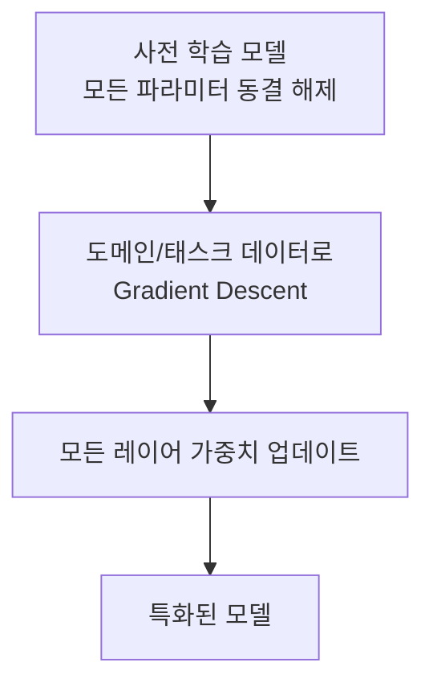
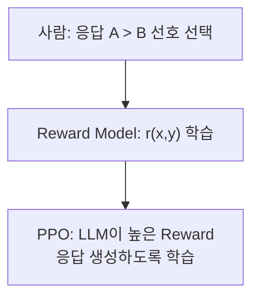

# Full Fine-Tuning

## 개요

**Full Fine-Tuning**은 사전 학습된 모델의 **모든 파라미터**를 태스크·도메인 특화 데이터로 재학습하는 기법이다. 가장 강력하지만 가장 비용이 높은 미세조정 방식.

## 작동 원리



### SFT (Supervised Fine-Tuning)

가장 일반적인 Full FT 형태. 입력→출력 쌍으로 지도 학습:

```python
# 훈련 데이터 예시 (Instruction Tuning 형식)
{
    "instruction": "다음 계약서를 검토하고 위험 조항을 찾아라.",
    "input": "<계약서 내용>",
    "output": "위험 조항 1: 5조 3항 - 일방적 해지 조건..."
}
```

### RLHF (Reinforcement Learning from Human Feedback)

OpenAI의 InstructGPT, ChatGPT에 사용된 기법:

1. **SFT 단계**: 고품질 시연 데이터로 기초 모델 학습
2. **Reward Model 학습**: 인간 평가자가 응답 쌍을 비교 → 선호도 레이블 → Reward Model 학습
3. **PPO 최적화**: RL(PPO 알고리즘)로 Reward를 최대화하도록 LLM 파인튜닝



**DPO (Direct Preference Optimization)**: RLHF의 Reward Model 학습을 생략하고 직접 선호도 데이터로 최적화. 더 안정적이고 단순.

## Full FT vs PEFT 비교

| 기준 | Full Fine-Tuning | PEFT (LoRA 등) |
|------|-----------------|---------------|
| **학습 파라미터** | 100% (수십억) | 0.01~1% |
| **GPU 메모리** | 매우 높음 (수십 GB×여러 GPU) | 낮음 |
| **성능** | 최대 | Full FT에 근접 |
| **학습 시간** | 길다 | 빠르다 |
| **Catastrophic Forgetting** | 높은 위험 | 낮은 위험 |
| **적합 케이스** | 완전한 행동 변화 | 빠른 도메인 적응 |

## 적합한 상황

- 모델의 근본적인 행동 패턴을 변경해야 할 때 (안전성, 정책 준수)
- 충분한 컴퓨팅 리소스가 있을 때
- 수백만 개 이상의 고품질 학습 데이터가 있을 때
- 특수한 출력 형식이나 언어를 모델에 깊이 내재화할 때

## 비용 최적화

```
Full FT 메모리 = 파라미터 × (가중치 + 그래디언트 + 옵티마이저 상태)
  = 7B 파라미터 × (2 + 2 + 8 bytes) = ~84 GB (FP32 Adam)

→ BF16 학습 + Gradient Checkpointing + ZeRO-3 분산 학습으로 감소
```

- **Gradient Checkpointing**: 중간 활성화 값을 버렸다가 역전파 시 재계산 → 메모리 절감
- **DeepSpeed ZeRO**: 옵티마이저 상태, 그래디언트, 파라미터를 여러 GPU에 분산

## AI Engineering에서의 역할

Full FT는 Model Engineering 레이어의 가장 강력한 도구이나, 대부분의 실무 적용에서는 LoRA/QLoRA(→ [[PEFT_LoRA_QLoRA]])로 대체된다. RLHF는 GPT-4, Claude, Gemini 등 상용 모델의 핵심 훈련 파이프라인이다.

## 관련 개념
[[Pre-training_and_Continual_Learning]] · [[PEFT_LoRA_QLoRA]] · [[Model_Distillation]]

## 출처
- Ouyang et al. (2022) "Training language models to follow instructions with human feedback" (InstructGPT) — [arXiv:2203.02155](https://arxiv.org/abs/2203.02155)
- Rafailov et al. (2023) "Direct Preference Optimization" — [arXiv:2305.18290](https://arxiv.org/abs/2305.18290)
- Karpathy, A. "Let's reproduce GPT-2" — [YouTube](https://www.youtube.com/watch?v=l8pRSuU81PU)
