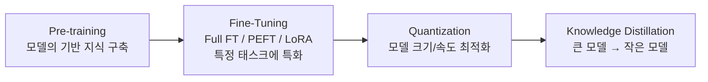
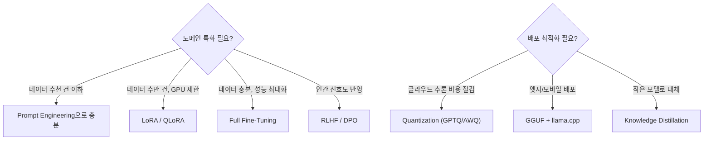

# Model Engineering (모델 엔지니어링)

## 개요

**Model Engineering**은 AI Engineering 스택의 최하단 계층으로, **모델 자체를 만들고, 조정하고, 최적화하는** 모든 기술을 다룬다. "어떤 모델을 어떻게 훈련/조정/압축할 것인가"에 답한다.

## 포함 기술 영역

## 하위 문서

| 문서 | 내용 |
|------|------|
| [[Pre-training_and_Continual_Learning]] | 대규모 사전 학습, Chinchilla 법칙, 재앙적 망각 |
| [[Full_Fine-Tuning]] | SFT, RLHF(PPO), DPO — 전체 가중치 업데이트 |
| [[PEFT_LoRA_QLoRA]] | 파라미터 효율적 파인튜닝, LoRA/QLoRA 수학 |
| [[Quantization]] | INT8/INT4 양자화, GPTQ/AWQ/GGUF |
| [[Model_Distillation]] | Teacher-Student, DistilBERT/Phi 계열 |

## 언제 어떤 기술을 선택하는가

## AI Engineering에서의 역할

Model Engineering은 **AI 시스템의 두뇌를 만드는 계층**이다. 대부분의 팀은 기반 모델(GPT-4, Claude, Llama)을 그대로 사용하거나 LoRA로 경량 튜닝하지만, 특수 도메인이나 엄격한 비용/레이턴시 요건이 있을 때는 이 계층 전체를 직접 다뤄야 한다.

## 관련 개념
[[Prompt_Engineering/Prompt_Engineering]] · [[Harness_Engineering/Benchmarking]] · [[Loop_Engineering/Continuous_Optimization]]
