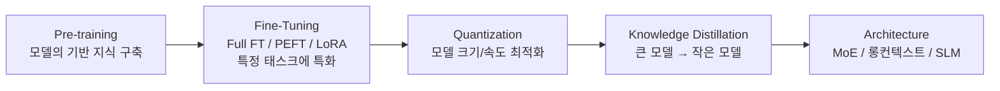
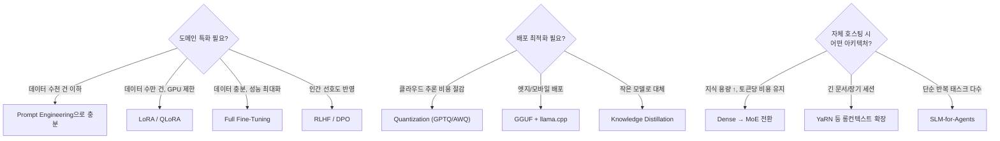

# Model Engineering (모델 엔지니어링)

## 개요

**Model Engineering**은 AI Engineering 스택의 최하단 계층으로, **모델 자체를 만들고, 조정하고, 최적화하는** 모든 기술을 다룬다. "어떤 모델을 어떻게 훈련/조정/압축할 것인가"에 답한다.

## 포함 기술 영역

```mermaid
flowchart LR
    P["Pre-training<br/>모델의 기반 지식 구축"] --> F
    F["Fine-Tuning<br/>Full FT / PEFT / LoRA<br/>특정 태스크에 특화"] --> Q
    Q["Quantization<br/>모델 크기/속도 최적화"] --> D
    D["Knowledge Distillation<br/>큰 모델 → 작은 모델"] --> A
    A["Architecture<br/>MoE / 롱컨텍스트 / SLM"]
```

## 하위 문서

| 문서 | 내용 |
|------|------|
| [[AI/Engineering/Model_Engineering/Pre-training_and_Continual_Learning\|Pre-training_and_Continual_Learning]] | 대규모 사전 학습, Chinchilla 법칙, 재앙적 망각 |
| [[AI/Engineering/Model_Engineering/Full_Fine-Tuning\|Full_Fine-Tuning]] | SFT, RLHF(PPO), DPO, GRPO/RLVR — 전체 가중치 업데이트 |
| [[AI/Engineering/Model_Engineering/PEFT_LoRA_QLoRA\|PEFT_LoRA_QLoRA]] | 파라미터 효율적 파인튜닝, LoRA/QLoRA 수학 |
| [[AI/Engineering/Model_Engineering/Quantization\|Quantization]] | INT8/INT4 양자화, GPTQ/AWQ/GGUF |
| [[AI/Engineering/Model_Engineering/Model_Distillation\|Model_Distillation]] | Teacher-Student, DistilBERT/Phi 계열 |
| [[AI/Engineering/Model_Engineering/Model_Architectures_and_MoE\|Model_Architectures_and_MoE]] | Dense vs MoE, RoPE/YaRN 롱컨텍스트, SLM-for-Agents |

## 언제 어떤 기술을 선택하는가

```mermaid
flowchart TD
    A{도메인 특화 필요?} -->|"데이터 수천 건 이하"| PE[Prompt Engineering으로 충분]
    A -->|"데이터 수만 건, GPU 제한"| LR["LoRA / QLoRA"]
    A -->|"데이터 충분, 성능 최대화"| FF[Full Fine-Tuning]
    A -->|"인간 선호도 반영"| RL["RLHF / DPO"]

    B{배포 최적화 필요?} -->|"클라우드 추론 비용 절감"| QT["Quantization (GPTQ/AWQ)"]
    B -->|"엣지/모바일 배포"| GG["GGUF + llama.cpp"]
    B -->|"작은 모델로 대체"| KD[Knowledge Distillation]

    C{"자체 호스팅 시<br/>어떤 아키텍처?"} -->|"지식 용량 ↑, 토큰당 비용 유지"| MOE["Dense → MoE 전환"]
    C -->|"긴 문서/장기 세션"| YARN["YaRN 등 롱컨텍스트 확장"]
    C -->|"단순 반복 태스크 다수"| SLM["SLM-for-Agents"]
```

## AI Engineering에서의 역할

Model Engineering은 **AI 시스템의 두뇌를 만드는 계층**이다. 대부분의 팀은 기반 모델(GPT-4, Claude, Llama)을 그대로 사용하거나 LoRA로 경량 튜닝하지만, 특수 도메인이나 엄격한 비용/레이턴시 요건이 있을 때는 이 계층 전체를 직접 다뤄야 한다.

## 관련 개념
[[AI/Engineering/Prompt_Engineering/Prompt_Engineering|Prompt Engineering]] · [[AI/Engineering/Harness_Engineering/Benchmarking|Harness_Engineering/Benchmarking]] · [[AI/Engineering/Loop_Engineering/Continuous_Optimization|Loop_Engineering/Continuous_Optimization]]
