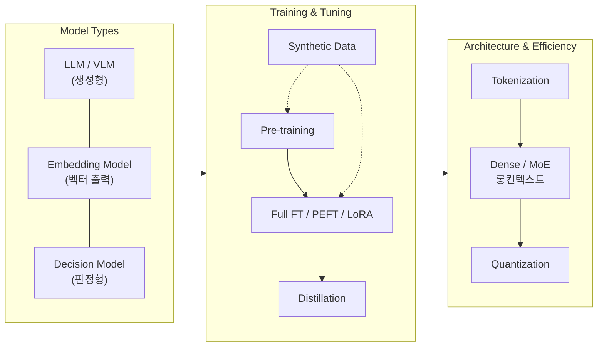
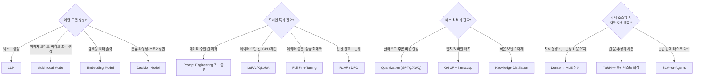

# Model Engineering (모델 엔지니어링)

## 개요

**Model Engineering**은 AI Engineering 스택의 최하단 계층으로, **모델 자체를 만들고, 조정하고, 최적화하는** 모든 기술을 다룬다. 세 가지 질문에 답한다 — 어떤 **모델 종류**를 쓸 것인가(Model Types), 그 가중치를 어떻게 **만들고 바꿀** 것인가(Training and Tuning), 그것을 어떻게 **구조화하고 경량화**할 것인가(Architecture and Efficiency).

## 포함 기술 영역

```mermaid
flowchart LR
    subgraph MT["Model Types"]
        LLM["LLM / VLM<br/>(생성형)"] --- EMB["Embedding Model<br/>(벡터 출력)"]
        EMB --- DEC["Decision Model<br/>(판정형)"]
    end
    subgraph TT["Training & Tuning"]
        P["Pre-training"] --> F["Full FT / PEFT / LoRA"] --> D["Distillation"]
        SD["Synthetic Data"] -.-> P
        SD -.-> F
    end
    subgraph AE["Architecture & Efficiency"]
        TOK["Tokenization"] --> ARCH["Dense / MoE<br/>롱컨텍스트"] --> Q["Quantization"]
    end
    MT --> TT
    TT --> AE
```

## 하위 문서

세 하위 카테고리로 나뉜다. **모델 유형**은 출력 형태(토큰/벡터/판정)에 따른 모델 분류, **학습·조정**은 그 가중치를 만들고 바꾸는 방법, **아키텍처·효율**은 구조적 선택으로 용량과 비용을 결정하는 방법을 다룬다.

### 모델 유형

| 문서 | 내용 |
|------|------|
| [[AI/Engineering/Model_Engineering/Model_Types/Model_Types\|Model_Types]] | 카테고리 개요 |
| [[AI/Engineering/Model_Engineering/Model_Types/Large_Language_Models\|Large_Language_Models]] | 디코더 전용 Transformer 기반 범용 생성 모델 — base/instruct/reasoning, open/closed weight |
| [[AI/Engineering/Model_Engineering/Model_Types/Multimodal_Models\|Multimodal_Models]] | VLM 아키텍처(어댑터 결합형 vs 네이티브), 이미지 토큰화, 오디오/비디오, MMMU/DocVQA |
| [[AI/Engineering/Model_Engineering/Model_Types/Embedding_Models\|Embedding_Models]] | 임베딩·리랭커 모델 자체 — Bi/Cross-encoder/Late Interaction, Matryoshka, MTEB |
| [[AI/Engineering/Model_Engineering/Model_Types/Multimodal_Embeddings\|Multimodal_Embeddings]] | 멀티모달 임베딩 모델 — 정렬 학습, modality gap, EmbeddingGemma 2 · Gemini Embedding 2 |
| [[AI/Engineering/Model_Engineering/Model_Types/Decision_Models\|Decision_Models]] | Jev 계열 System One Model, Choice/Score/Noul 프리미티브, logprob wrapper vs 학습형, calibration(ECE) |

### 학습·조정

| 문서 | 내용 |
|------|------|
| [[AI/Engineering/Model_Engineering/Training_and_Tuning/Training_and_Tuning\|Training_and_Tuning]] | 카테고리 개요 |
| [[AI/Engineering/Model_Engineering/Training_and_Tuning/Pre-training_and_Continual_Learning\|Pre-training_and_Continual_Learning]] | 대규모 사전 학습, Chinchilla 법칙, 재앙적 망각 |
| [[AI/Engineering/Model_Engineering/Training_and_Tuning/Full_Fine-Tuning\|Full_Fine-Tuning]] | SFT, RLHF(PPO), DPO, GRPO/RLVR — 전체 가중치 업데이트 |
| [[AI/Engineering/Model_Engineering/Training_and_Tuning/PEFT_LoRA_QLoRA\|PEFT_LoRA_QLoRA]] | 파라미터 효율적 파인튜닝, LoRA/QLoRA 수학 |
| [[AI/Engineering/Model_Engineering/Training_and_Tuning/Model_Distillation\|Model_Distillation]] | Teacher-Student, DistilBERT/Phi 계열 |
| [[AI/Engineering/Model_Engineering/Training_and_Tuning/Synthetic_Data_and_Curation\|Synthetic_Data_and_Curation]] | Self-Instruct/Evol-Instruct, judge 필터링, dedup/decontamination, model collapse |

### 아키텍처·효율

| 문서 | 내용 |
|------|------|
| [[AI/Engineering/Model_Engineering/Architecture_and_Efficiency/Architecture_and_Efficiency\|Architecture_and_Efficiency]] | 카테고리 개요 |
| [[AI/Engineering/Model_Engineering/Architecture_and_Efficiency/Tokenization\|Tokenization]] | BPE/WordPiece/SentencePiece, 어휘 크기 트레이드오프, 다국어·한국어 토큰 효율 |
| [[AI/Engineering/Model_Engineering/Architecture_and_Efficiency/Model_Architectures_and_MoE\|Model_Architectures_and_MoE]] | Dense vs MoE, RoPE/YaRN 롱컨텍스트, SLM-for-Agents |
| [[AI/Engineering/Model_Engineering/Architecture_and_Efficiency/Quantization\|Quantization]] | INT8/INT4 양자화, GPTQ/AWQ/GGUF |

## 언제 어떤 기술을 선택하는가

```mermaid
flowchart TD
    D0{어떤 모델 유형?} -->|"텍스트 생성"| D1["LLM"]
    D0 -->|"이미지·오디오·비디오 포함 생성"| D2["Multimodal Model"]
    D0 -->|"검색용 벡터 출력"| D3["Embedding Model"]
    D0 -->|"분류·라우팅·스코어링만"| D4["Decision Model"]

    A{도메인 특화 필요?} -->|"데이터 수천 건 이하"| PE[Prompt Engineering으로 충분]
    A -->|"데이터 수만 건, GPU 제한"| LR["LoRA / QLoRA"]
    A -->|"데이터 충분, 성능 최대화"| FF[Full Fine-Tuning]
    A -->|"인간 선호도 반영"| RL["RLHF / DPO"]

    B{배포 최적화 필요?} -->|"클라우드 추론 비용 절감"| QT["Quantization (GPTQ/AWQ)"]
    B -->|"엣지/모바일 배포"| GG["GGUF + llama.cpp"]
    B -->|"작은 모델로 대체"| KD[Knowledge Distillation]

    C{"자체 호스팅 시<br/>어떤 아키텍처?"} -->|"지식 용량 ↑, 토큰당 비용 유지"| MOE["Dense → MoE 전환"]
    C -->|"긴 문서/장기 세션"| YARN["YaRN 등 롱컨텍스트 확장"]
    C -->|"단순 반복 태스크 다수"| SLM["SLM-for-Agents"]
```

## AI Engineering에서의 역할

Model Engineering은 **AI 시스템의 두뇌를 만드는 계층**이다. 대부분의 팀은 기반 모델(GPT-4, Claude, Llama)을 그대로 사용하거나 LoRA로 경량 튜닝하지만, 특수 도메인이나 엄격한 비용/레이턴시 요건이 있을 때는 이 계층 전체를 직접 다뤄야 한다.

## 관련 개념
[[AI/Engineering/Prompt_Engineering/Prompt_Engineering|Prompt Engineering]] · [[AI/Engineering/Harness_Engineering/Harness_Evaluation/Benchmarking|Harness_Engineering/Harness_Evaluation/Benchmarking]] · [[AI/Engineering/Loop_Engineering/Continuous_Optimization|Loop_Engineering/Continuous_Optimization]]
