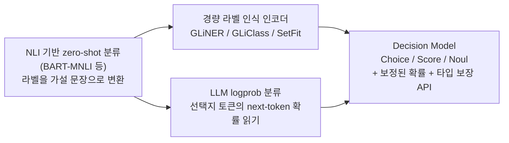
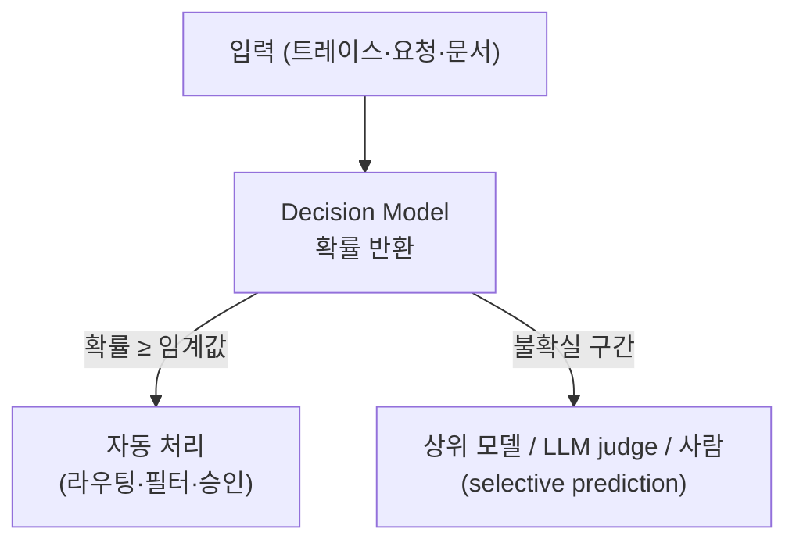

# Decision Models (System One Models)

## 개요

**Decision Model**은 텍스트를 생성하지 않고, 사용자가 지정한 선택지·척도·명제에 대해 **타입이 보장된 값과 확률(probability)·confidence**만 반환하는 판정형(discriminative) 모델이다. 분류, 라우팅, 점수화, 필터링처럼 "짧은 입력을 보고 빠르게 하나를 고르는" 작업에서 생성형 LLM의 긴 출력·높은 지연·불안정한 포맷을 걷어내는 것이 목적이다.

2026년 9월 TypeSafe AI가 **Jev**를 공개하면서 이 범주가 "System One Model"(Kahneman의 빠른 직관 사고에서 차용한 이름)로 불리기 시작했다. 이후 오픈웨이트 진영에서 (a) 새로 학습한 모델, (b) 기존 LLM에 헤드·LoRA를 붙여 튜닝한 모델, (c) 기존 LLM의 next-token **logprob**만 읽는 wrapper 형태의 재현이 활발히 나왔고, 9월 말부터는 OpenAI·Microsoft 등 프런티어 랩도 자체 Decision Model을 API로 내놓았다. 아이디어 자체는 새롭지 않다(NLI 기반 zero-shot 분류, logit으로 선택지 점수화). 새로운 점은 **zero-shot 유연성 + 보정된 확률 + 타입 보장 API**를 한 묶음으로 제공한다는 것이다.

[[AI/Engineering/Prompt_Engineering/Structured_Output|Structured_Output]]이 "생성된 텍스트를 스키마에 맞추는" 방법이라면, 이 문서는 **애초에 텍스트를 생성하지 않는 모델 클래스**를 다룬다.

## 생성형 vs 판정형

| 구분 | 생성형 LLM (System Two 방식) | Decision Model (System One 방식) |
|------|------------------------------|----------------------------------|
| 출력 | 자유 텍스트 → 파싱 | 선택지별 확률 / 점수 / 참·거짓 확률 |
| 추론 | 토큰을 순차 디코딩(CoT 포함) | 입력 prefill 1회, 디코딩 없음 |
| 지연·비용 | 출력 토큰 수에 비례 | 입력 토큰만 과금되는 구조가 일반적 |
| 포맷 오류 | 발생 가능 (재시도 필요) | 선택지 밖 값이 구조적으로 불가능 |
| 설명 | 근거(reasoning) 제공 가능 | 근거 없음 — 확률만 |
| 적합한 작업 | 복합 추론, 생성, 설명 | 라우팅, 분류, moderation, 스코어링 |

## Jev

TypeSafe AI의 Jev(2026-09-15 early access 공개)는 **세 가지 질문 프리미티브**를 가진다.

| 프리미티브 | 입력 | 반환 |
|-----------|------|------|
| **Choice** | 상태(state) + 선택지 목록 | 선택지별 확률 |
| **Score** | 상태 + 순서가 있는 척도 | 척도 수준별 확률/점수 |
| **Noul** | 상태 + 참/거짓 명제 | 명제가 참일 확률 (0–1) |

여러 질문을 한 요청에 병렬로 실어 보낼 수 있고, 응답은 스키마로 제약되어 **선택지 밖 값이 나올 수 없다**. 학습은 합성 데이터와 **RLCD**(Reinforcement Learning for Calibrated Decisions)로 한다고 보고되며, 사람 선호가 아니라 **결과 대비 확률의 정확성**(높게 말한 확률이 실제로 높은 적중률)을 최적화 대상으로 삼는다. 아키텍처와 기술 보고서는 공개되지 않았다.

TypeSafe 자체 보고 수치는 응답 70–500ms, 입력 토큰 100만 개당 $0.042(출력 무료), 프런티어 LLM 대비 40–400배 저렴·40–200배 빠름이다. 이 수치는 **자사 벤치마크 기반**이며 상한에 가까운 사례로 해석해야 한다.

## 프런티어 랩의 진입

Jev 공개 2주 만에 OpenAI와 Microsoft가 같은 형태의 API를 내놓았다. 세 제품의 질문 프리미티브는 사실상 동일한 세 가지(참/거짓 · 선택 · 척도)로 수렴했다.

| 항목 | Jev (TypeSafe AI) | OpenAI Decisions API | Microsoft-Decision-1 |
|------|-------------------|----------------------|----------------------|
| 공개 | 2026-09-15 early access | 2026-09-30 limited preview → 2026-10-06 public beta | 2026-10-09 Microsoft Foundry |
| 모델 | 비공개 | `gpt-6-luna` 단일 | Qwen3.5-9B post-training |
| 프리미티브 | Noul / Choice / Score | `predicate` / `choice` / `score` | 예·아니오 / 다지선다 / 점수화 |
| 반환 | 선택지별 확률 | 선택지별 `probabilities` + 별도 `confidence`, `refusal` 가능 | 선택지별 확률 |
| 입력 | 텍스트 | 텍스트 + 이미지(최대 128장) | 텍스트 |
| 가격 (1M input) | $0.042, 출력 무료 | $0.10, 출력 무료 | $0.042, 출력 무료 |
| 가중치 | 비공개 (hosted API) | 비공개 | 비공개 (API 전용) |

### OpenAI Decisions API

Sam Altman이 DevDay(2026-09-30)에서 "모델을 선택 하나에 집중시키면 극도로 빠르게 만들 수 있다"며 공개했고, 10월 6일 전체 개발자 대상 public beta로 열렸다(GA 일정 미정). `POST /v1/decisions` 한 요청에 독립된 질문 여러 개를 실을 수 있으며, 서로 의존하는 질문은 별도 요청으로 나눠야 한다. `score`는 level 인덱스의 확률 가중 평균을 반환한다.

확률 정의 중 **`confidence`가 어떻게 산출되는지, 선택지 분포를 어떻게 만드는지는 공개되지 않았다.** 속도는 "Responses API 대비 약 10배", 150ms(DevDay 슬라이드)라는 자사 수치만 있고 p50/p95·rate limit·최대 선택지 수는 미공개다. 질문 단위로 `refusal`이 나올 수 있다는 점은 Jev에 없는 동작이므로, 자동 처리 파이프라인에서는 refusal을 별도 분기로 다뤄야 한다. 텍스트 외에 이미지 입력을 받고, GPT-Live 음성 세션에서 Decisions를 호출하는 연동 가이드도 함께 나왔다.

### Microsoft-Decision-1

Microsoft는 오픈웨이트 Qwen3.5-9B를 post-training해 Microsoft Foundry에서 API로만 제공한다. 아래 구현 접근 표의 "학습형 Decision Model"(기존 LLM에 decision 학습을 얹는 방식)이 대형 클라우드 상품으로 나온 사례다. 가격은 Jev와 같은 입력 1M 토큰당 $0.042이며, 향후 MAI·OpenAI 모델 기반 버전도 예고했다. 주 용도로는 작업 분류·우선순위 결정·검증·에이전트 워크플로 통제를 내세운다.

자사 사례로 Xbox 피드백 1만여 건 토픽 분류에서 GPT-6 Sol과 비슷한 품질을 약 1/200 비용·14배 이상 빠른 속도로, Copilot 응답 품질 평가에서 약 100배 빠른 속도로 처리했다고 밝혔다. 모두 **내부 측정**이며 공개 벤치마크 점수는 없다.

### 초기 비교와 시사점

한 개발자가 BANKING77 77-way 의도 분류(770건)로 OpenAI Decisions(beta)와 Jev(v1.13.0)를 같은 조건에서 비교했다.

| API | 지침 | 정확도 | ECE ↓ | Brier ↓ | 평균 지연 |
|-----|------|--------|-------|---------|-----------|
| Decisions | 라벨 정의만 | 78.96% | 4.35% | 0.3163 | 144ms |
| Jev | 라벨 정의만 | 81.17% | 9.33% | 0.3078 | 298ms |
| Decisions | 정의 + 라벨당 예시 2개 | 84.16% | 4.63% | 0.2472 | 194ms |
| Jev | 정의 + 라벨당 예시 2개 | 85.32% | 6.50% | 0.2206 | 520ms |

- **보정 지표가 엇갈린다**: ECE는 Decisions가, Brier score는 Jev가 낫다. "calibrated"라는 벤더 주장을 지표 하나로 판단하면 안 되는 이유다.
- **레이블이 있으면 학습형 분류기가 여전히 앞선다**: 같은 데이터에서 fine-tuning한 MiniLM 분류기가 89.87%로 두 API를 모두 넘었다.
- **한계**: 단일 샘플, beta 서비스, 측정 날짜가 달라 지연 비교는 통제되지 않았다. Decisions의 refusal(2–7건)은 오답으로 처리됐다.

프리미티브가 같은 형태로 수렴하면서 벤더 간 교체 가능한 인터페이스가 생기고 있지만, **확률을 만드는 방식과 `confidence`의 정의는 벤더마다 다르다.** 벤더를 바꾸거나 버전이 올라가면 임계값을 그대로 옮기지 말고 자기 데이터로 보정을 다시 측정해야 한다.

## 계보



## 구현 접근 4가지

| 접근 | 방식 | 예시 | 보정(calibration) | 비고 |
|------|------|------|------------------|------|
| **학습형 Decision Model** | 인코더·LLM에 decision head를 붙이거나 LoRA 튜닝, 혹은 scratch 학습 | Laya(ModernBERT 기반), Kev(Qwen3.5 LoRA + pointer head), NanoJev(0.6B scratch), pplx-decider·Clef(27B급), Microsoft-Decision-1(Qwen3.5-9B post-training, API 전용) | 일부는 temperature scaling 등 post-hoc 보정 보고 | 학습 코드·데이터 공개 여부가 프로젝트마다 다름 |
| **Logprob wrapper** | 모델은 frozen. 프롬프트에 선택지를 나열하고 선택지 토큰의 logit을 softmax | mini-jev(Qwen3-4B), SemIf, openjev-sglang(prefill-only 서버), AnyJev(Nokia) | 대부분 **보정을 주장하지 않음** (AnyJev는 예외 — 아래 참고) | 재학습 불필요, 선택지 순서에 민감할 수 있음 |
| **고전 zero-shot 분류기** | NLI 모델·라벨 인식 인코더가 런타임에 라벨을 받음 | NLI 헤드 모델, GLiClass, SetFit(few-shot) | 점수가 보정된 확률이 아닌 경우가 많음 | CPU 추론 가능, 입력이 짧은 분류에 적합 |
| **Structured output 라이브러리** | 어떤 LLM이든 스키마·문법에 맞게 출력 제약 | Outlines, Instructor, DSPy | 해당 없음 (확률 미제공) | 타입은 보장되지만 보정된 confidence는 없음 |

위 프로젝트 목록은 2026년 10월 시점의 스냅샷이며, 대부분 수 주 내에 등장한 신생 프로젝트다. 개별 프로젝트의 성능·라이선스 주장은 도입 전에 직접 검증해야 한다.

### Logprob wrapper 최소 구현

기존 오픈웨이트 LLM으로 Choice 프리미티브를 흉내 내는 가장 단순한 형태다. 선택지에 문자 라벨을 붙이고, 정답 위치의 **next-token 분포 중 라벨 토큰의 logit만** 꺼내 softmax한다.

```python
import torch
from transformers import AutoModelForCausalLM, AutoTokenizer

model_id = "Qwen/Qwen3-4B-Instruct"  # 예시 모델 — 실제 사용 가능한 instruct 모델로 교체
tok = AutoTokenizer.from_pretrained(model_id)
model = AutoModelForCausalLM.from_pretrained(model_id, torch_dtype=torch.bfloat16)

def choose(state: str, question: str, options: list[str]) -> dict[str, float]:
    labels = [chr(ord("A") + i) for i in range(len(options))]
    listing = "\n".join(f"{l}. {o}" for l, o in zip(labels, options))
    prompt = f"{state}\n\n{question}\n{listing}\nAnswer with a single letter.\nAnswer:"

    ids = tok(prompt, return_tensors="pt")
    with torch.no_grad():
        logits = model(**ids).logits[0, -1]  # 마지막 위치의 next-token logit (디코딩 없음)

    # 라벨 토큰 id만 추려 softmax → 선택지 밖 값은 구조적으로 불가능
    label_ids = [tok.encode(" " + l, add_special_tokens=False)[-1] for l in labels]
    probs = torch.softmax(logits[label_ids].float(), dim=-1)
    return dict(zip(options, probs.tolist()))
```

이 방식의 한계는 세 가지다. ① 프롬프트의 선택지 **순서·라벨 편향**(position bias)이 확률에 섞인다. ② softmax는 선택지 안에서 정규화될 뿐이라 **정답 확률이 아닌 "선택지 간 상대 우세"**다. ③ 별도 보정 없이는 과신(over-confidence)하는 경향이 있다. 순서 편향은 선택지를 섞어 여러 번 평균하는 방식으로 줄일 수 있고, 일부 프로젝트는 이를 option-order invariance로 설계 단계에서 보장한다고 주장한다.

Nokia Applied Research의 **AnyJev**(Apache-2.0)는 이 wrapper를 출발점으로 위 한계를 단계적으로 메운다. 각 결과에 level이 붙고, `require=`로 낮은 level의 결과를 거부할 수 있다.

- **L0 (라벨 0개)**: 선택지를 K번 cyclic shift해 log-space로 결합(position bias 제거)하고, batch calibration·contextual calibration으로 label prior를 나눠낸다. Qwen3-8B·BANKING77 20-way에서 선택지 역순 시 답이 바뀌는 비율이 0.230 → 0.073으로 줄었다.
- **L1 (라벨 100–500개)**: L0 위에 temperature scaling. 순위는 그대로, confidence만 보정한다.
- **L2 (라벨 100–300개)**: 모델 깊이 약 2/3 지점 block의 hidden state에 질문별 **closed-form linear head**(shrunk LDA·ridge)를 붙인다. gradient·가중치 변경이 없고 forward를 그 block에서 멈추므로 비용은 일반 forward의 0.68–0.84배다. 학습형 Decision Model과 wrapper 사이의 linear probe에 가깝다.

라벨은 "고정된 질문 하나에 대한 (입력, 정답) 쌍"이며, 사람 검토·사후 결과·대체하려는 LLM의 판정에서 모은다. head는 질문·모델마다 따로 필요하지만, 문구·선택지 순서가 바뀌면 라벨 없는 요청 약 30개로 feature 평균·분산만 재추정해 따라간다. 라벨 없는 L0 정확도는 Jev가 공개한 수치보다 낮고, L2에서야 이를 넘는다. L2는 hidden state가 필요해 transformers·vLLM 로컬 서빙에서만 동작하며, logprob만 주는 상용 API로는 최대 L1까지만 이론상 가능하다(현재 상용 API용 backend는 없음).

## Calibration

Decision Model의 가치는 정확도보다 **확률을 믿고 임계값을 걸 수 있느냐**에 있다.

- **ECE**(Expected Calibration Error): confidence 구간별로 예측 신뢰도와 실제 적중률의 차이를 평균. 낮을수록 보정이 잘 된 것.
- **Brier score**: 확률 예측과 실제 결과의 제곱오차. 정확도와 보정을 함께 반영.
- **Temperature scaling**: 소규모 검증 셋으로 logit에 단일 온도를 학습해 사후 보정. logprob wrapper와 학습형 모델 모두에 쓰이며, 한 프로젝트는 ECE가 0.466에서 0.081로 줄었다고 보고한다.
- **Coverage@risk**: confidence 순으로 자동 처리할 때, 오류율이 목표(예: 5%)를 넘기 전까지 처리 가능한 비율. 보정의 실용적 가치를 직접 보여 준다 — AnyJev 보고 기준 raw logit 7.7% → L1 52.0%(Qwen3-8B, BANKING77 20-way).
- **함정**: 확률이 "분포의 집중도"일 뿐 "정답일 가능성"이 아닌 경우가 많다. 보정을 주장하지 않는 wrapper의 confidence를 그대로 임계값에 쓰면 위험하다.

이 문제는 LLM reranker의 점수 비일관성([[AI/Engineering/Context_Engineering/Retrieval_Strategies/RAG/Advanced_Retrieval|Advanced_Retrieval]])이나 cascade 라우팅의 불확실성 추정([[AI/Engineering/Loop_Engineering/Cost_Engineering/Complexity_Aware_Model_Routing|Complexity_Aware_Model_Routing]])과 같은 뿌리를 공유한다.

## 독립 평가: Jev (Deußer et al., 2026)

Bonn 대학 연구팀이 Jev v1.13.0을 37개 공개 데이터셋(감성, 의도·토픽, NLI, 독해, 상식 추론, 안전·moderation, 루브릭 스코어링)에서 평가했다. 비교 기준은 오픈웨이트 Qwen3.8-27B와 Gemma-4-E4B의 **next-token 확률을 직접 읽은 값**(즉 logprob wrapper 방식)이다.

| 항목 | 결과 |
|------|------|
| 정확도 | Qwen 대비 37개 중 27개에서 우위, Gemma 대비 전부 우위 |
| Choice 확률 보정 | 22개 데이터셋 통합 ECE 0.028 — 양호 |
| Noul(참/거짓) 확률 | 약간 under-confident → 재현율 저하, 순위 지표(AUROC)는 양호 |
| Multi-label | 양성 과대예측(평균 확률 0.209 vs 실제 0.041). 학습 예시 1,000개로 threshold를 튜닝하면 F₁ 대폭 개선 |
| 약점 | 저자원 언어, 노이즈 라벨, 5-class 세분 감성, 도메인 지식이 필요한 법률 판단, 생성문 품질 루브릭 |
| 주의 | MMLU 계산 과목에서 비정상 패턴 → 데이터 오염 가능성을 저자들이 배제하지 못함 |

이 평가는 오픈 모델을 단일 패스·추론 없이 채점했으므로 오픈 모델 성능이 과소평가되었을 수 있다는 한계를 저자들이 명시한다. 또한 특정 버전(1.13.0)에 한정된 결과다.

## 사용 패턴



- **라우팅·의도 분류**: 에이전트 앞단에서 어떤 도구·모델·워크플로우로 보낼지 결정. 확률이 낮으면 더 큰 모델로 escalate. Microsoft-Decision-1과 OpenAI Decisions 모두 에이전트 행동 선택·워크플로 통제를 대표 용도로 제시하며, OpenAI는 음성 에이전트가 대화 중 Decisions를 호출하는 구성도 안내한다.
- **Moderation·Guardrail**: 입력/출력의 정책 위반 여부를 Noul로 판정.
- **전수 eval + 샘플 심층 평가**: 모든 트레이스에 저비용 판정을 돌리고, 일부만 LLM judge로 정밀 검토. Arize는 Jev가 LLM judge를 완전 대체하지는 못하며(근거 설명 없음, 정확도가 프런티어 모델에 소폭 뒤처짐) 이런 하이브리드를 권한다.
- **Selective prediction**: 보정된 확률로 "자동 처리할 구간"과 "사람에게 넘길 구간"을 임계값으로 나눈다.

## 경계 정리

| 문서 | 다루는 것 |
|------|-----------|
| **본 문서 (Decision_Models)** | 텍스트를 생성하지 않고 **보정된 확률을 반환**하는 모델 클래스와 구현 방식 |
| [[AI/Engineering/Model_Engineering/Model_Types/Large_Language_Models\|Large_Language_Models]] | 생성형 LLM 자체의 모델 종류 규정(base/instruct/reasoning) — Decision Model은 그 생성 경로를 쓰지 않는 대안 |
| [[AI/Engineering/Prompt_Engineering/Structured_Output\|Structured_Output]] | 생성형 LLM의 출력을 스키마에 맞추는 기법 — 타입은 보장하지만 확률은 없음 |
| [[AI/Engineering/Harness_Engineering/Harness_Evaluation/LLM_as_a_Judge\|LLM_as_a_Judge]] | 생성형 LLM이 근거와 함께 평가 — 느리고 비싸지만 설명 가능 |
| [[AI/Engineering/Model_Engineering/Model_Types/Embedding_Models\|Embedding_Models]] | Cross-encoder 등 쌍(pair) 점수화 모델 — 검색 관련도에 특화된 판정형 모델 |
| [[AI/Engineering/Loop_Engineering/Cost_Engineering/Complexity_Aware_Model_Routing\|Complexity_Aware_Model_Routing]] | 난이도에 따른 모델 선택 전략 — Decision Model은 그 라우터 자체로 쓸 수 있음 |
| [[AI/Engineering/Harness_Engineering/Harness_Safety/Guardrail_Engineering\|Guardrail_Engineering]] | 입출력 안전 장치 설계 — Decision Model은 그 판정기 후보 |

## AI Engineering에서의 역할

Decision Model은 에이전트·RAG 파이프라인 곳곳에 박힌 "짧은 판정" 호출(라우팅, 관련도 체크, 정책 검사, 평가 스코어링)을 **저지연·저비용·보정된 확률**로 대체하는 부품이다. 다만 생성형 LLM의 추론·설명 능력을 대체하지는 못하므로, 임계값 밖의 불확실한 케이스를 상위 모델이나 사람에게 넘기는 구조와 함께 설계해야 한다. 도입 전에는 자기 도메인 데이터로 **보정(ECE)과 임계값 성능을 직접 측정**하는 것이 필수다.

## 관련 개념
[[AI/Engineering/Prompt_Engineering/Structured_Output|Structured_Output]] · [[AI/Engineering/Harness_Engineering/Harness_Evaluation/LLM_as_a_Judge|LLM_as_a_Judge]] · [[AI/Engineering/Harness_Engineering/Harness_Safety/Guardrail_Engineering|Guardrail_Engineering]] · [[AI/Engineering/Loop_Engineering/Cost_Engineering/Complexity_Aware_Model_Routing|Complexity_Aware_Model_Routing]] · [[AI/Engineering/Model_Engineering/Model_Types/Embedding_Models|Embedding_Models]] · [[AI/Engineering/Model_Engineering/Training_and_Tuning/Model_Distillation|Model_Distillation]]

## 출처
- Deußer, Sparrenberg, Sifa (2026) "Evaluating and Benchmarking the System One Model Jev" — [arXiv:2609.37647](https://arxiv.org/html/2609.37647v1)
- Arize, "TypeSafe Jev: Can Decision Models Replace LLM Judges?" — [arize.com](https://arize.com/blog/typesafe-jev-llm-judge/)
- Glean, "Jev and the return of the zero-shot classifier" — [glean.com](https://www.glean.com/blog/jev-zero-shot-classifier)
- "Jev (AI model)" — [Wikipedia](https://en.wikipedia.org/wiki/Jev_(AI_model))
- TechCrunch, "OpenAI's Jev clone could help the frontier lab stop its swarming agents" (2026-09-30) — [techcrunch.com](https://techcrunch.com/2026/09/30/openais-jev-clone-could-help-the-frontier-lab-stop-its-swarming-agents/)
- Evalgent, "OpenAI Decisions API vs Jev: Pricing, Probabilities, Voice" (2026-10-07 기준 OpenAI 공식 가이드 정리) — [evalgent.com](https://www.evalgent.com/blog/openai-decisions-api-vs-jev-voice-agents)
- "OpenAI Decisions API: How Does Jev's Big-Lab Competitor Fare?" (2026-10-08, BANKING77 비교 — 단일 샘플·beta 기준) — [stacktoheap.com](https://stacktoheap.com/blog/2026/10/08/jev-the-decisions-strike-back/)
- Microsoft, "Introducing Microsoft-Decision-1 in Microsoft Foundry for decision and classification workloads" — [techcommunity.microsoft.com](https://techcommunity.microsoft.com/blog/azure-ai-foundry-blog/introducing-microsoft-decision-1-in-microsoft-foundry-for-decision-and-classific/4562742)
- Digital Today, "Microsoft joins decision-focused AI model race with Microsoft-Decision-1" (2026-10-09, 성능 수치는 Microsoft 내부 측정) — [digitaltoday.co.kr](https://www.digitaltoday.co.kr/en/view/112711/microsoft-joins-decision-focused-ai-model-race-unveils-microsoft-decision-1)
- systemonemodels.org, "Jev alternatives: open-source reproductions, local models and classifiers" — [systemonemodels.org](https://systemonemodels.org/examples/alternatives/) (커뮤니티 큐레이션 — 개별 프로젝트 수치는 각 repo에서 재확인 필요)
- Zhang et al. (2026), AnyJev — [github.com/nokia-applied-research/AnyJev](https://github.com/nokia-applied-research/AnyJev) (수치는 저자 자체 측정, typed-decisions 벤치의 정답은 teacher LLM 출력)
