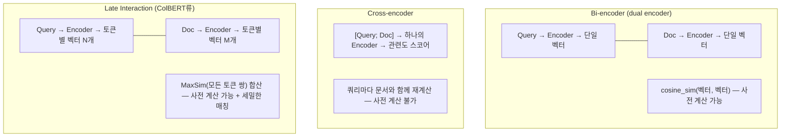

# Embedding & Reranker Models (임베딩·리랭커 모델)

## 개요

RAG·GraphRAG·시맨틱 검색 전체가 딛고 선 기반은 **임베딩 모델**이다. 청킹·벡터 저장·리랭킹 같은 검색 파이프라인 설계는 대개 임베딩이 "이미 잘 만들어져 있다"는 전제 위에서 논의된다. 이 문서는 그 전제 자체 — **임베딩 모델을 어떻게 고르고, 왜 특정 아키텍처를 선택하며, 리랭커와 어떻게 나눠 쓰는가** — 를 다룬다.

```
임베딩(Embedding) = 이질적 데이터(텍스트·이미지·오디오)를 공유 벡터 공간으로 매핑하는 손실 압축(lossy compression)
  의미적 유사성 = 기하학적 거리 (위도/경도가 위치의 2D 임베딩인 것과 같은 원리)
  다른 모델이 만든 임베딩은 서로 호환되지 않는다 → 파이프라인 전체가 하나의 버전을 고정해야 함
```

## 3가지 아키텍처: Bi-encoder vs Cross-encoder vs Late Interaction



| | Bi-encoder | Cross-encoder | Late Interaction (ColBERT) |
|---|---|---|---|
| **연산 시점** | 쿼리·문서 독립 인코딩 (사전 계산) | 쿼리+문서 동시 입력 (실시간) | 쿼리·문서 독립 인코딩, 토큰별 벡터 보존 |
| **속도** | 매우 빠름 (ANN 인덱스 가능) | 느림 (후보 수만큼 forward pass) | 중간 (bi-encoder보다 저장·연산 큼) |
| **정확도** | 중간 (문장 전체를 한 벡터로 뭉갬) | 높음 (토큰 단위 상호작용) | 높음 (토큰 단위 상호작용 + 사전 계산 가능) |
| **용도** | 1차 검색 (대규모 후보군에서 Top-K) | 리랭킹 (소수 후보만 재정렬) | 1차 검색 + 세밀한 매칭 동시 |
| **대표 모델** | Sentence-BERT, E5, BGE, Qwen3-Embedding, gemini-embedding-001, EmbeddingGemma, OpenAI text-embedding-3 | Cohere Rerank, bge-reranker, Qwen3-Reranker, Vertex 기반 두 개탑(Two-tower) 인코더의 발전형 | ColBERT (Khattab & Zaharia, 2020), XTR (Lee, 2023), ColPali (Faysse, 2024) |

**실무 패턴**: 대량 후보군에서는 Bi-encoder로 1차 검색(Top-100~500) → Cross-encoder 또는 Late Interaction으로 재정렬(Top-5~20). 리랭킹 단계의 파이프라인 배치는 [[AI/Engineering/Context_Engineering/Retrieval_Strategies/RAG/Advanced_Retrieval|Advanced_Retrieval]] 참고.

## Matryoshka Representation Learning — 차원을 고르는 문제

**Matryoshka Embedding**(Kusupati et al., 2022)은 하나의 임베딩 벡터 안에 여러 해상도의 표현을 중첩시켜 학습한다. 러시아 마트료시카 인형처럼, 벡터의 앞쪽 N차원만 잘라내도 그 자체로 유효한 임베딩으로 쓸 수 있다.

```
전체 벡터: [d1, d2, d3, ..., d3072]  (예: 3072차원 모델)
  앞 1024차원만 사용 → 저장 공간 1/3, 품질 하락 ~2%
  앞 256차원만 사용  → 저장 공간 1/12, 품질 하락은 더 크지만 여전히 유효

→ 서비스 단계별로 다른 절단 지점을 쓸 수 있음:
  1차 대량 필터링 = 256차원 (빠르고 저렴)
  최종 재정렬     = 전체 차원 (정확)
```

3072→1024차원 절단 시 벡터 DB 저장 비용이 약 1/3로 줄고 검색 품질 하락은 약 2% 수준에 그친다는 것이 실무에서 반복 관찰되는 트레이드오프다. 2025년 Matryoshka Quantization으로 양자화(Quantization)와 결합되어 저장 비용을 더 줄이는 방향으로 발전했다.

## 학습 원리: Contrastive Learning과 InfoNCE

임베딩 모델은 대부분 **contrastive learning**으로 학습한다. `(query, positive)` 쌍을 배치로 묶고, 각 query에 대해 자기 positive는 가깝게, 배치 안의 다른 모든 문서(**in-batch negatives**)는 멀게 만드는 **InfoNCE** loss를 최소화한다.

```
loss = -log( exp(sim(q, d+) / τ) / Σ_j exp(sim(q, d_j) / τ) )    # τ: temperature
```

- 배치가 클수록 negative가 많아져 표현이 정교해진다 → 대배치·gradient caching이 학습 품질의 핵심 변수
- 사전학습(대규모 약지도 쌍) → 미세조정(고품질 쌍 + hard negative) → (선택) 큰 모델에서의 distillation 순서가 일반적이다. 작은 모델은 큰 임베더나 리랭커의 점수를 distill해 크기 대비 성능을 끌어올린다.
- 아래 "도메인 파인튜닝" 절의 triplet 학습이 같은 loss를 도메인 데이터에 적용하는 것이다.

## LLM 기반 임베더와 Instruction Prefix

2024년 이후 상위권 모델은 BERT류 encoder가 아니라 **decoder-only LLM을 backbone**으로 삼는다. 마지막 토큰(last-token) 또는 mean pooling으로 벡터 하나를 뽑고 L2 정규화한다. Qwen3-Embedding, Gemini Embedding, Microsoft harrier-oss-v1, EmbeddingGemma 2가 이 구조이며, 사전학습된 LLM의 다국어·코드·긴 컨텍스트 능력을 그대로 물려받는다.

이 계열은 **instruction/task prefix**에 민감하다. 같은 문서라도 용도에 따라 다른 벡터가 되도록 학습되므로, 쿼리 쪽에만 태스크 지시문을 붙이는 것이 규약인 모델이 많다.

```
query   : "Instruct: 주어진 질문에 답하는 문서를 검색하라\nQuery: 환불 규정이 뭐야?"
document: "환불은 구매 후 7일 이내 ..."     # 문서에는 prefix를 붙이지 않는 모델이 많다
```

모델 카드에 명시된 prefix 규약(`query:`/`passage:`, `task_type=RETRIEVAL_QUERY` 등)을 어기면 성능이 눈에 띄게 떨어진다. harrier-oss-v1처럼 "쿼리에 instruction을 붙이지 않으면 성능 저하"를 명시하는 모델도 있다.

## Dense·Sparse·Multi-vector 통합 모델

한 모델이 여러 표현을 동시에 내면 인덱스 설계가 단순해진다.

| 모델 | 출력 |
|------|------|
| **BGE-M3** | dense + sparse(lexical weights) + multi-vector(ColBERT식)를 한 번의 forward로 출력, 100+ 언어, 8K 컨텍스트 |
| **SPLADE** | 어휘 사전 위의 학습된 sparse 벡터 — 역색인으로 검색, 용어 확장 포함 |
| **UEmbed** (2026) | dense + sparse를 한 체크포인트에서 출력하는 멀티모달 모델 |

Dense(의미)와 sparse(정확한 용어 일치)를 결합하는 검색 설계는 [[AI/Engineering/Context_Engineering/Retrieval_Strategies/RAG/Hybrid_RAG|Hybrid_RAG]]에서 다룬다.

## 임베딩 양자화

벡터 DB 비용은 `문서 수 × 차원 × 정밀도`로 결정되므로 차원(MRL)과 정밀도를 함께 줄인다.

| 방식 | 저장량 | 비고 |
|------|--------|------|
| float32 | 1× | 기준 |
| int8 (scalar) | 1/4 | 품질 손실 거의 없음 |
| binary (1-bit) | 1/32 | Hamming 거리로 초고속 1차 검색 → 원본 정밀도로 rescoring 하는 2단계 구성이 일반적 |

모델이 MRL과 양자화 학습을 함께 지원하면(예: 2025년 Matryoshka Quantization) 저차원 + 저정밀 조합에서 품질 하락이 줄어든다. 인덱스 수준의 압축(PQ, ScaNN)은 [[AI/Engineering/Context_Engineering/Retrieval_Strategies/RAG/Vector_Storage|Vector_Storage]]에서 다룬다.

## 대표 모델 (2026년 10월 기준)

| 모델 | 공개 | 특징 |
|------|------|------|
| **gemini-embedding-001** (Google) | 2025-03 | MTEB Multilingual task mean 68.32 (논문 보고, 당시 1위). 후속 **Gemini Embedding 2**는 멀티모달 → [[AI/Engineering/Model_Engineering/Model_Types/Multimodal_Embeddings\|Multimodal_Embeddings]] |
| **Qwen3-Embedding** 0.6B/4B/8B (Alibaba) | 2025-06 | 오픈 웨이트, 8B가 출시 시점 MTEB Multilingual 70.58. 같은 계열의 Qwen3-Reranker와 짝 |
| **EmbeddingGemma** (Google) | 2025 | 308M 온디바이스 텍스트 임베더. 2세대(740M, 멀티모달, 2026-10)는 [[AI/Engineering/Model_Engineering/Model_Types/Multimodal_Embeddings\|Multimodal_Embeddings]] 참고 |
| **harrier-oss-v1** 270M/0.6B/27B (Microsoft) | 2026-03~04 | MIT 라이선스, decoder-only + last-token pooling. Microsoft 보고 기준 27B가 MTEB Multilingual v2 74.3, 0.6B 69.0, 270M 66.5. 쿼리에 instruction 필수 |
| **BGE-M3** (BAAI) | 2024 | dense+sparse+multi-vector 통합, 다국어 |

**순위 해석 주의**: 2026년 리더보드 상위는 KaLM-Embedding-Gemma3-12B, QZhou-Embedding 등 신규 모델이 수시로 바꾸고, 집계 사이트마다 서브셋(English v2 / Multilingual v2 / Code)과 지표(task mean / task-type mean)가 달라 순위가 엇갈린다. 위 점수는 각 벤더·논문의 자체 보고값이며, 선택 직전에 HF MTEB 리더보드에서 같은 서브셋끼리 다시 비교한다.

## 운영: 모델 버전 고정과 재임베딩

다른 모델(같은 모델의 다른 버전, 다른 차원 포함)이 만든 벡터는 서로 비교할 수 없다. 따라서:

- 인덱스 메타데이터에 **모델 ID·버전·차원·prefix 규약·정규화 여부**를 함께 저장한다.
- API 모델은 deprecation 일정이 있으므로, 교체 시 **전체 코퍼스 재임베딩 + 새 인덱스 구축 후 cutover**(blue/green) 비용을 처음부터 계산에 넣는다.
- 쿼리 임베딩만 새 모델로 바꾸는 "부분 교체"는 불가능하다.
- 오픈 웨이트 모델을 자체 호스팅하면 버전 고정과 재현이 쉽지만 GPU 서빙 비용이 든다.

## 벤치마크: MTEB / BEIR와 그 한계

- **BEIR**(Benchmarking IR, zero-shot retrieval): 도메인 전이 성능을 측정하는 표준
- **MTEB**(Massive Text Embedding Benchmark): 검색뿐 아니라 분류·클러스터링·유사도 등 여러 태스크를 종합한 리더보드. 원조 BERT의 BEIR 점수 ~10.6에서 2025년 기준 상위 모델 평균 55.7까지 상승
- **평가 지표**: Precision@k(검색된 것 중 관련 비율), Recall@k(전체 관련 중 검색된 비율), nDCG(순서까지 반영한 정규화 점수)

**한계**: MTEB/BEIR는 공개 벤치마크 데이터셋 기준이라 실제 도메인(사내 법률 문서, 의료 기록 등)과 분포가 다를 수 있다. 리더보드 1위 모델이 특정 도메인에서는 하위권 모델보다 못한 경우가 흔하다 — **벤치마크는 후보 압축용이지 최종 선택 기준이 아니다.** 반드시 자체 골든셋으로 재검증한다(골든셋 구축 방법론은 [[AI/Engineering/Agent_Engineering/Agent_Infrastructure/Eval_Driven_Development_and_Agent_Workbench|Eval_Driven_Development_and_Agent_Workbench]] 참고).

## 도메인 파인튜닝

범용 임베딩 모델은 전문 용어·사내 은어·법률/의료 도메인에서 성능이 떨어진다. 대응 방법:

```python
# Contrastive fine-tuning 개념 흐름
# <anchor(쿼리), positive(정답 문서), [negatives(오답 문서들)]> 삼중항으로 학습
# 목표: positive는 anchor와 가깝게, negative는 멀게

# Hard negative mining: 무작위 오답이 아니라
# "표면적으로는 비슷하지만 의미상 틀린" 문서를 찾아 negative로 사용
# → 결정 경계(decision boundary)가 훨씬 정교해짐
```

- **데이터 소스**: 사람이 라벨링한 쿼리-문서 쌍, 합성 데이터(LLM으로 쿼리 생성 — Gecko 논문의 LLM 합성 Q-D 쌍 접근), 기존 검색 로그에서 추출
- **한국어 임베딩 고려사항**: 다국어 모델(BGE-M3, multilingual-e5)은 한국어 토큰 효율이 영어 대비 낮고 형태소 경계가 모호해 청킹·임베딩 품질에 영향을 준다. 한국어 특화 모델(KoSimCSE, KURE 등) 또는 한국어 코퍼스로 재파인튜닝한 다국어 모델이 실무에서 더 안정적인 경우가 많다.

## 리랭커 모델

| 모델 | 방식 | 특징 |
|------|------|------|
| **Cohere Rerank** | Cross-encoder (API) | 다국어 지원, 별도 인프라 불필요 |
| **bge-reranker** | Cross-encoder (오픈소스) | 자체 호스팅, 다양한 크기(base/large) |
| **Qwen3-Reranker** | Cross-encoder (오픈소스) | 최신 세대, 다국어·긴 컨텍스트 지원 |
| **ColBERT/ColPali 계열** | Late Interaction | 1차 검색과 리랭킹을 동일 모델로 처리 가능 |

리랭커를 파이프라인 어디에 배치하는지, RRF(Reciprocal Rank Fusion) 등과 어떻게 결합하는지는 [[AI/Engineering/Context_Engineering/Retrieval_Strategies/RAG/Advanced_Retrieval|Advanced_Retrieval]]에서 다룬다 — 본 문서는 **리랭커 모델 자체의 선택 기준**에 집중한다.

## 경계 정리

| 문서 | 다루는 것 |
|------|-----------|
| **본 문서 (Embedding_Models)** | 임베딩·리랭커 **모델 자체**의 아키텍처 분류, 벤치마크 해석, 차원 선택, 파인튜닝 |
| [[AI/Engineering/Model_Engineering/Model_Types/Multimodal_Embeddings\|Multimodal_Embeddings]] | 이미지·오디오·비디오까지 한 공간에 매핑하는 **멀티모달 임베딩 모델** — 정렬 학습, modality gap, EmbeddingGemma 2 등 |
| [[AI/Engineering/Context_Engineering/Retrieval_Strategies/RAG/Vector_Storage\|Vector_Storage]] | 임베딩을 **저장**하는 인프라 — ANN 인덱스(HNSW/FAISS/ScaNN), 벡터 DB 제품 선택 |
| [[AI/Engineering/Context_Engineering/Retrieval_Strategies/RAG/Advanced_Retrieval\|Advanced_Retrieval]] | 리랭킹·쿼리 변환을 검색 **파이프라인**에 배치하는 방법 |

## AI Engineering에서의 역할

RAG·GraphRAG·시맨틱 캐시·Agentic RAG는 결국 "좋은 임베딩이 이미 있다"는 전제 위에 서 있다. 그 전제를 검증하지 않고 검색 파이프라인만 정교화하면, 리랭킹·청킹·쿼리 변환을 아무리 개선해도 상한선은 임베딩 모델의 표현력에 갇힌다. 임베딩 모델 선택은 RAG 프로젝트에서 가장 먼저 결정하고, 가장 늦게 재검토하는 실수가 잦은 결정이다.

## 관련 개념
[[AI/Engineering/Context_Engineering/Retrieval_Strategies/RAG/Vector_Storage|Vector_Storage]] · [[AI/Engineering/Context_Engineering/Retrieval_Strategies/RAG/Advanced_Retrieval|Advanced_Retrieval]] · [[AI/Engineering/Model_Engineering/Model_Types/Multimodal_Embeddings|Multimodal_Embeddings]] · [[AI/Engineering/Context_Engineering/Retrieval_Strategies/RAG/Multimodal_RAG|Multimodal_RAG]] · [[AI/Engineering/Context_Engineering/Retrieval_Strategies/RAG/Hybrid_RAG|Hybrid_RAG]] · [[AI/Engineering/Model_Engineering/Architecture_and_Efficiency/Quantization|Model_Engineering/Quantization]]

## 출처
- [[AI/sources/whitepaper_emebddings_vectorstores_v2|Embeddings & Vector Stores]] (Google, Nawalgaria/Ren/Sugnet, 2025년 2월 — 이 위키의 기존 소스)
- Kusupati et al. (2022) "Matryoshka Representation Learning" — [arXiv:2205.13147](https://arxiv.org/abs/2205.13147)
- Khattab & Zaharia (2020) "ColBERT: Efficient and Effective Passage Search via Contextualized Late Interaction over BERT" — [arXiv:2004.12832](https://arxiv.org/abs/2004.12832)
- Faysse et al. (2024) "ColPali: Efficient Document Retrieval with Vision Language Models" — [arXiv:2407.01449](https://arxiv.org/abs/2407.01449)
- Lee et al. (2024) "Gecko: Versatile Text Embeddings Distilled from Large Language Models" — [arXiv:2403.20327](https://arxiv.org/abs/2403.20327)
- Zhang et al. (2025) "Qwen3 Embedding: Advancing Text Embedding and Reranking Through Foundation Models" — [arXiv:2506.05176](https://arxiv.org/abs/2506.05176)
- Lee et al. (2025) "Gemini Embedding: Generalizable Embeddings from Gemini" — [arXiv:2503.07891](https://arxiv.org/abs/2503.07891)
- Chen et al. (2024) "BGE M3-Embedding: Multi-Lingual, Multi-Functionality, Multi-Granularity Text Embeddings Through Self-Knowledge Distillation" — [arXiv:2402.03216](https://arxiv.org/abs/2402.03216)
- Microsoft Bing, "Microsoft Open Sources Industry Leading Embedding Model" (harrier-oss-v1, 2026-04) — [blogs.bing.com](https://blogs.bing.com/search/April-2026/Microsoft-Open-Sources-Industry-Leading-Embedding-Model)
- Google, "EmbeddingGemma 2" (2026-10-06) — [blog.google](https://blog.google/innovation-and-ai/technology/developers-tools/embeddinggemma-2/)
- MTEB Leaderboard — [huggingface.co/spaces/mteb/leaderboard](https://huggingface.co/spaces/mteb/leaderboard)
