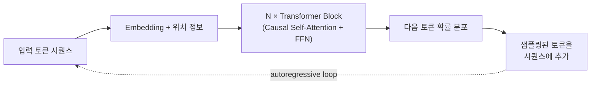

# Large Language Models (대규모 언어 모델)

## 개요

**LLM(Large Language Model)**은 대규모 텍스트 코퍼스로 다음 토큰을 예측하도록 사전학습한 **디코더 전용(decoder-only) Transformer**다. 이 위키 대부분의 상위 계층 — [[AI/Engineering/Prompt_Engineering/Prompt_Engineering|Prompt Engineering]], [[AI/Engineering/Context_Engineering/Context_Engineering|Context Engineering]], [[AI/Engineering/Agent_Engineering/Agent_Engineering|Agent Engineering]] — 은 이 모델 종류의 존재를 전제로 쓰여 있다. 이 문서는 그 전제 자체 — **LLM을 모델 종류로서 규정하는 것**: 디코더 전용 아키텍처의 개관, base/instruct/reasoning의 단계 구분, open-weight와 closed API의 배포 축 — 를 다룬다. 가중치를 구체적으로 어떻게 만들고 바꾸는지는 [[AI/Engineering/Model_Engineering/Training_and_Tuning/Training_and_Tuning|Training_and_Tuning]]이, Dense/MoE·토큰화·양자화 같은 구조·효율 선택은 [[AI/Engineering/Model_Engineering/Architecture_and_Efficiency/Architecture_and_Efficiency|Architecture_and_Efficiency]]가 다룬다.

## 아키텍처 한눈에: Decoder-only Transformer

**Causal mask**로 각 위치는 자신보다 앞선 토큰만 참조할 수 있어, 한 번의 forward pass로 전체 시퀀스를 학습하면서도 생성 시에는 토큰을 하나씩 순차적으로 뽑는 autoregressive 디코딩이 가능하다. 텍스트를 토큰으로 바꾸는 방법은 [[AI/Engineering/Model_Engineering/Architecture_and_Efficiency/Tokenization|Tokenization]], Transformer Block 내부를 Dense로 둘지 MoE로 희소화할지, 컨텍스트 윈도우를 어떻게 늘리는지는 [[AI/Engineering/Model_Engineering/Architecture_and_Efficiency/Model_Architectures_and_MoE|Model_Architectures_and_MoE]]에서 다룬다.

## Base → Instruct → Reasoning

같은 사전학습 가중치에서 출발해도, 이후 어떤 조정을 거쳤는지에 따라 모델의 행동이 전혀 다른 세 단계로 나뉜다.

| 단계 | 조정 방법 | 행동 특징 |
|------|-----------|-----------|
| **Base** | 사전학습만 (다음 토큰 예측) | 채팅 형식이 없는 "이어쓰기" 모델 — 지시를 따르기보다 입력을 통계적으로 이어감 |
| **Instruct / Chat** | SFT + RLHF(PPO) 또는 DPO | 지시를 따르고 대화 형식을 유지하며, 유해 요청을 거부하도록 조정됨 |
| **Reasoning** | 긴 CoT 데이터 + RLVR/GRPO | 최종 답 전에 내부적으로 긴 추론 토큰을 생성 — OpenAI o 시리즈, DeepSeek-R1, Claude의 extended thinking, Gemini의 Thinking 모드가 이 범주 |

세 단계를 만드는 구체적인 학습 기법(SFT, RLHF, DPO, GRPO/RLVR)은 [[AI/Engineering/Model_Engineering/Training_and_Tuning/Full_Fine-Tuning|Full_Fine-Tuning]]에서 다룬다 — 이 문서는 **그 결과로 나오는 행동 축**에 집중한다.

## 스케일링

사전학습 데이터·파라미터·연산량을 늘리면 손실(loss)이 예측 가능한 곡선을 따라 줄어든다는 것이 LLM 개발의 기본 전제다. 구체적인 스케일링 법칙(Chinchilla)과 재앙적 망각 같은 사전학습 운영 이슈는 [[AI/Engineering/Model_Engineering/Training_and_Tuning/Pre-training_and_Continual_Learning|Pre-training_and_Continual_Learning]]에서 다룬다. 컨텍스트 윈도우를 수십만~수백만 토큰까지 늘리는 RoPE/YaRN 등의 기법은 [[AI/Engineering/Model_Engineering/Architecture_and_Efficiency/Model_Architectures_and_MoE|Model_Architectures_and_MoE]]를 참고한다.

## Open-weight vs Closed(API) 모델

| | Open-weight | Closed (API) |
|---|---|---|
| **배포** | 가중치를 직접 받아 자체 호스팅·수정 가능 | API 호출만 가능, 가중치 비공개 |
| **예시 계열** | Llama, Qwen, DeepSeek, Gemma | GPT, Claude, Gemini |
| **장점** | 완전한 배포 제어, 온프레미스·프라이버시 요건 충족, 라이선스 내에서 파인튜닝·양자화 자유 | 운영 부담 없음, 지속적인 모델 업데이트, 인프라 투자 불필요 |
| **제약** | 라이선스 조건(상업적 사용 제한 등)을 모델마다 확인해야 함, 서빙 인프라를 직접 구축 | 벤더 종속, 가중치 접근 불가로 특정 최적화(양자화 등) 제한 |

[[AI/Engineering/Model_Engineering/Architecture_and_Efficiency/Quantization|Quantization]]·[[AI/Engineering/Model_Engineering/Training_and_Tuning/PEFT_LoRA_QLoRA|PEFT_LoRA_QLoRA]]처럼 가중치에 직접 손을 대는 기법은 open-weight 모델에서만 전면적으로 적용 가능하다.

## 평가

Base 모델은 보통 perplexity나 few-shot 완성 정확도로, instruct/reasoning 모델은 instruction-following·대화 품질·추론 정답률로 평가한다 — 평가 축이 다르므로 같은 벤치마크 점수를 base와 instruct 모델 사이에서 그대로 비교하면 오해하기 쉽다. 표준 벤치마크(MMLU, HumanEval, SWE-bench 등)와 LLM-as-a-Judge 평가 방법론은 [[AI/Engineering/Harness_Engineering/Harness_Evaluation/Benchmarking|Benchmarking]]·[[AI/Engineering/Harness_Engineering/Harness_Evaluation/LLM_as_a_Judge|LLM_as_a_Judge]]에서 다룬다.

## 경계 정리

| 문서 | 다루는 것 |
|------|-----------|
| **본 문서 (Large_Language_Models)** | LLM이라는 **모델 종류 자체** — decoder-only 개관, base/instruct/reasoning 구분, open/closed 배포 |
| [[AI/Engineering/Model_Engineering/Model_Types/Multimodal_Models\|Multimodal_Models]] | 텍스트 외 이미지·오디오·비디오까지 처리하는 아키텍처 |
| [[AI/Engineering/Model_Engineering/Model_Types/Decision_Models\|Decision_Models]] | 텍스트를 생성하지 않고 보정된 확률만 반환하는 판정형 모델 |
| [[AI/Engineering/Model_Engineering/Model_Types/Embedding_Models\|Embedding_Models]] | 토큰이 아니라 벡터를 출력하는 모델 |
| [[AI/Engineering/Model_Engineering/Training_and_Tuning/Training_and_Tuning\|Training_and_Tuning]] | LLM의 가중치를 만들고 바꾸는 구체적 방법 (Pre-training/Full FT/PEFT/Distillation) |
| [[AI/Engineering/Model_Engineering/Architecture_and_Efficiency/Architecture_and_Efficiency\|Architecture_and_Efficiency]] | Dense/MoE, 토큰화, 양자화 같은 구조·효율 선택 |

## AI Engineering에서의 역할

LLM은 이 위키가 다루는 대부분의 상위 계층이 전제하는 기반 모델이다. 어떤 단계(base/instruct/reasoning)를 쓸지, open-weight로 직접 호스팅할지 closed API를 쓸지의 선택은 이후 Prompt·Context·Agent·Harness Engineering 전체의 설계를 제약한다 — 예를 들어 reasoning 모델은 긴 내부 추론 토큰 때문에 지연·비용 프로파일이 다르고, open-weight 모델은 자체 파인튜닝·양자화가 가능하지만 서빙 인프라 책임이 따른다.

## 관련 개념
[[AI/Engineering/Model_Engineering/Model_Types/Model_Types|Model_Types]] · [[AI/Engineering/Model_Engineering/Training_and_Tuning/Training_and_Tuning|Training_and_Tuning]] · [[AI/Engineering/Model_Engineering/Architecture_and_Efficiency/Architecture_and_Efficiency|Architecture_and_Efficiency]] · [[AI/Engineering/Model_Engineering/Model_Types/Multimodal_Models|Multimodal_Models]] · [[AI/Engineering/Prompt_Engineering/Prompt_Engineering|Prompt_Engineering]] · [[AI/Engineering/Harness_Engineering/Harness_Evaluation/Benchmarking|Benchmarking]]

## 출처
- Vaswani et al. (2017) "Attention Is All You Need" — [arXiv:1706.03762](https://arxiv.org/abs/1706.03762)
- Radford et al. (2019) "Language Models are Unsupervised Multitask Learners (GPT-2)" — [openai.com](https://cdn.openai.com/better-language-models/language_models_are_unsupervised_multitask_learners.pdf)
- Ouyang et al. (2022) "Training language models to follow instructions with human feedback (InstructGPT)" — [arXiv:2203.02155](https://arxiv.org/abs/2203.02155)
- [[AI/sources/whitepaper_Foundational_Large_Language_models_&_text_generation_v2|Foundational LLMs]] (Google, 이 위키의 기존 소스) — Transformer 수식, GPT~DeepSeek-R1 진화 개관
