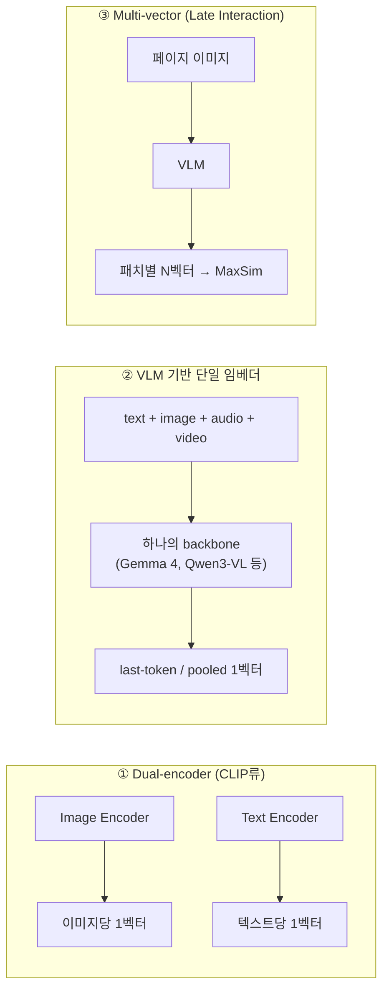

# Multimodal Embedding Models (멀티모달 임베딩 모델)

## 개요

**멀티모달 임베딩 모델**은 텍스트·이미지·오디오·비디오·PDF 페이지처럼 형태가 다른 입력을 **하나의 공유 벡터 공간**에 매핑한다. 같은 의미를 가진 "고양이 사진"과 "a cat"이 가까운 벡터가 되므로, 텍스트 쿼리로 이미지를 찾거나 영상 클립으로 문서를 찾는 cross-modal 검색이 단일 ANN 인덱스로 가능해진다. 텍스트 임베딩의 아키텍처·차원·벤치마크 논의는 [[AI/Engineering/Model_Engineering/Model_Types/Embedding_Models|Embedding_Models]]가 다루고, 이 문서는 모달리티가 늘어날 때 새로 생기는 문제 — **정렬 방식, modality gap, 모델 계보, 평가** — 를 다룬다.

```
텍스트 임베딩:   text ──► Encoder ──► 벡터
멀티모달 임베딩: text / image / audio / video / PDF ──► (모달리티별 encoder + 공유 backbone) ──► 같은 공간의 벡터
  → 모달리티 간 거리 비교가 의미를 가지려면 "정렬(alignment)" 학습이 필요하다
```

## 학습 방식: 정렬(Alignment)

| 방식 | 핵심 | 비고 |
|------|------|------|
| **CLIP** (Radford, 2021) | 이미지-캡션 쌍 배치에서 InfoNCE(softmax contrastive) — 맞는 쌍은 가깝게, 배치 내 나머지는 멀게 | 배치 전체의 softmax 정규화가 필요해 대배치 통신 비용이 크다 |
| **SigLIP / SigLIP 2** (Google) | 쌍마다 독립적인 **sigmoid loss** — 전역 정규화 불필요 | 작은 배치에서도 안정적, 현재 vision encoder의 표준 선택지 |
| **ImageBind** (Meta, 2023) | 이미지를 "접착제"로 삼아 오디오·깊이·IMU 등을 이미지 공간에 각각 정렬 | 쌍 데이터가 없는 모달리티 조합도 간접적으로 정렬됨 |
| **CLAP** | 오디오-텍스트 contrastive | 오디오 검색·분류 |
| **VLM 기반 임베더** | 사전학습된 Vision-Language Model을 backbone으로 contrastive 미세조정 | 아래 구조 분류 참고 — 2025년 이후 주류 |

## 구조 분류



- **① Dual-encoder**: 모달리티별 encoder가 따로 있어 가볍고 빠르다. 텍스트 이해가 얕고(긴 쿼리·복합 지시에 약함), 이미지+텍스트가 섞인 입력(interleaved)을 한 벡터로 만들기 어렵다.
- **② VLM 기반 단일 임베더**: 하나의 transformer가 모든 모달리티 토큰을 처리한다. 혼합 입력과 긴 컨텍스트를 자연스럽게 다루고, 텍스트 임베더의 기법(instruction prefix, MRL)을 그대로 쓴다. 최신 모델 대부분이 이 계열이다.
- **③ Multi-vector**: ColPali/ColQwen처럼 페이지를 패치 단위 벡터 N개로 보존해 MaxSim으로 매칭한다. 문서 페이지 검색 정확도는 높지만 저장량이 이미지당 수십~수천 벡터로 늘어난다. 검색 파이프라인에서의 사용은 [[AI/Engineering/Context_Engineering/Retrieval_Strategies/RAG/Multimodal_RAG|Multimodal_RAG]]에서 다룬다.

## Modality Gap

CLIP류 dual-encoder에서는 이미지 벡터와 텍스트 벡터가 같은 공간 안에서도 **서로 다른 영역(cone)에 몰려** 있다. 이것이 modality gap이다. 결과적으로 이미지 쿼리는 이미지끼리, 텍스트 쿼리는 텍스트끼리 더 높은 유사도를 받아, 혼합 인덱스에서 **한 모달리티가 상위를 독식**하는 편향이 생긴다.

- 완화책: 모달리티별 평균 벡터를 빼는 centering, 모달리티별 별도 인덱스 검색 후 점수 정규화·RRF 결합, 단일 backbone으로 모든 모달리티를 처리하는 구조(②) 채택
- 실무 점검: 혼합 코퍼스에서 쿼리 하나에 대해 모달리티별 Top-K 비율을 확인한다. 한쪽으로 쏠리면 gap 보정이 필요하다.

## 대표 모델 (2026년 10월 기준)

| 모델 | 공개 | 모달리티 | 특징 |
|------|------|----------|------|
| **EmbeddingGemma 2** (Google DeepMind) | 2026-10 | text·code·image·video·audio | Apache 2.0 오픈 웨이트, 740M(text 270M + vision 170M + audio 300M, 선택 로딩), Gemma 4 기반. 768차원, MRL로 512/256/128 절단, 8K 컨텍스트(이미지 29장 또는 오디오 5.5분 또는 비디오 58프레임). 양자화 시 온디바이스 RAM text-only 약 191MB, 전체 약 567MB |
| **Gemini Embedding 2** (Google) | 2026-03 preview, 2026-04 GA | text·image·video·audio·PDF | API 제공. MRL 128~3072차원. 호출당 8192 tokens, 이미지 6장, 비디오 120초, 오디오 180초(전사 없이 직접 임베딩), PDF 6페이지 |
| **Qwen3-VL-Embedding / Reranker** (Alibaba) | 2026-01 | text·image·문서 이미지·video | 2B/8B 오픈 모델, 32k 컨텍스트, MRL 지원. 임베딩 모델과 cross-encoder 리랭커를 한 쌍으로 제공. 8B가 MMEB-V2 77.8 (논문 보고, 당시 1위) |
| **Voyage Multimodal 3.5** | 2026-01 | text·image·video | 단일 transformer로 interleaved 입력 처리. modality gap 완화를 내세움 |
| **Cohere Embed v4** | 2025 | text·image(문서) | 128K 컨텍스트, 표·차트·필기 포함 문서 이미지를 전처리 없이 임베딩 |
| **jina-embeddings-v5-omni** | 2026-05 | text·image·audio·video(·PDF) | 웨이트 공개되나 라이선스 CC BY-NC 4.0 — 상업 사용은 별도 계약 |
| **TwelveLabs Marengo 3.0** | 2026 | video 중심 | 시간 구조를 반영하는 video-native 임베딩 |
| **ColPali / ColQwen** | 2024~ | 문서 페이지 이미지 | Multi-vector, OCR-free 문서 검색 |

연구 흐름으로는 dense와 sparse를 한 체크포인트에서 함께 내는 **UEmbed**(arXiv:2608.02583), 긴 컨텍스트 평가용 **MMLongEmbed**(arXiv:2606.14747), 임베딩 전에 reasoning을 수행하는 **MMEmb-R1**(arXiv:2604.06156)이 있다. 개별 수치는 벤더 보고값이므로, 자체 골든셋으로 재검증하는 것이 전제다.

### EmbeddingGemma 계보와 선택 기준

EmbeddingGemma(2025)는 텍스트 전용 308M 온디바이스 임베더였고, EmbeddingGemma 2는 같은 "작고 로컬에서 돈다"는 노선을 text·code·image·video·audio로 확장했다. Google 보고 기준 MTEB Code는 68.76에서 78.68로 올랐고, sub-1B 멀티모달 임베더 중 MTEB Code와 MAEB(Massive Audio Embedding Benchmark)에서 선두다. 텍스트 다국어 성능은 1세대와 동급이다.

| 상황 | 선택 |
|------|------|
| 프라이버시·오프라인·엣지 디바이스, 상업 이용 | EmbeddingGemma 2 (Apache 2.0, text-only 로딩 가능) |
| 관리형 API, 비디오·오디오·PDF를 한 번에 | Gemini Embedding 2 |
| 문서 이미지 + 리랭커까지 자체 호스팅 | Qwen3-VL-Embedding/Reranker |
| 스캔 PDF 페이지의 레이아웃 보존 검색 | ColPali/ColQwen (저장량 증가 감수) |
| 연구·비상업 | jina-embeddings-v5-omni |

모달리티를 늘릴수록 같은 정확도에 필요한 저장량과 인코딩 비용이 커지므로, **필요한 모달리티만 로딩**할 수 있는 modular 구조(EmbeddingGemma 2)와 MRL 절단([[AI/Engineering/Model_Engineering/Model_Types/Embedding_Models|Embedding_Models]]의 Matryoshka 절)이 비용 통제 수단이 된다.

## 평가

- **MMEB / MMEB-V2**: 이미지·비디오·시각 문서에 걸친 multimodal embedding 종합 벤치마크. VLM2Vec 계열이 제안했고 Qwen3-VL-Embedding 등이 보고 지표로 쓴다.
- **ViDoRe**: ColPali와 함께 나온 시각 문서 검색 벤치마크.
- **MAEB**: 오디오 임베딩 벤치마크, **MTEB Code**: 코드 검색.
- **한계**: 텍스트 벤치마크와 마찬가지로 공개 데이터셋 분포가 실제 도메인(사내 도면, 의료 영상, 회의 녹음)과 다르다. cross-modal 검색은 모달리티 쏠림(modality gap) 때문에 평균 점수만으로 드러나지 않는 실패가 많아, 모달리티 조합별(text→image, image→text, text→video 등) 골든셋을 따로 만든다.

## 경계 정리

| 문서 | 다루는 것 |
|------|-----------|
| **본 문서 (Multimodal_Embeddings)** | 멀티모달 **임베딩 모델 자체** — 정렬 학습, 구조, modality gap, 모델 비교 |
| [[AI/Engineering/Model_Engineering/Model_Types/Embedding_Models\|Embedding_Models]] | 텍스트 임베딩·리랭커 모델 — 아키텍처 분류, MRL, 벤치마크, 파인튜닝 |
| [[AI/Engineering/Context_Engineering/Retrieval_Strategies/RAG/Multimodal_RAG\|Multimodal_RAG]] | 멀티모달 임베딩을 쓰는 **검색·생성 파이프라인** |
| [[AI/Engineering/Model_Engineering/Model_Types/Multimodal_Models\|Multimodal_Models]] | 멀티모달 **생성** 모델(VLM)의 아키텍처 — vision encoder, projector |

## AI Engineering에서의 역할

멀티모달 RAG의 검색 품질 상한은 임베딩 모델이 모달리티를 얼마나 잘 정렬했는지로 정해진다. 모델 선택은 모달리티 범위, 라이선스, 배포 위치(클라우드 vs 온디바이스), 저장 비용을 함께 놓고 하며, 임베딩이 모델별로 호환되지 않으므로 교체 시 전체 코퍼스를 재임베딩해야 한다.

## 관련 개념
[[AI/Engineering/Model_Engineering/Model_Types/Embedding_Models|Embedding_Models]] · [[AI/Engineering/Context_Engineering/Retrieval_Strategies/RAG/Multimodal_RAG|Multimodal_RAG]] · [[AI/Engineering/Context_Engineering/Retrieval_Strategies/RAG/Vector_Storage|Vector_Storage]] · [[AI/Engineering/Model_Engineering/Model_Types/Multimodal_Models|Multimodal_Models]] · [[AI/Engineering/Context_Engineering/Retrieval_Strategies/RAG/Document_Ingestion|Document_Ingestion]]

## 출처
- Google, "EmbeddingGemma 2 is a best-in-class open model for natively multimodal embeddings" (2026-10-06) — [blog.google](https://blog.google/innovation-and-ai/technology/developers-tools/embeddinggemma-2/)
- Google, "Gemini Embedding 2: Our first natively multimodal embedding model" (2026-03) — [blog.google](https://blog.google/innovation-and-ai/models-and-research/gemini-models/gemini-embedding-2/)
- Google Developers Blog, "Building with Gemini Embedding 2: Agentic multimodal RAG and beyond" (2026-04) — [developers.googleblog.com](https://developers.googleblog.com/building-with-gemini-embedding-2/)
- Qwen Team (2026) "Qwen3-VL-Embedding and Qwen3-VL-Reranker" — [arXiv:2601.04720](https://arxiv.org/abs/2601.04720)
- Radford et al. (2021) "Learning Transferable Visual Models From Natural Language Supervision (CLIP)" — [arXiv:2103.00020](https://arxiv.org/abs/2103.00020)
- Zhai et al. (2023) "Sigmoid Loss for Language Image Pre-Training (SigLIP)" — [arXiv:2303.15343](https://arxiv.org/abs/2303.15343)
- Girdhar et al. (2023) "ImageBind: One Embedding Space To Bind Them All" — [arXiv:2305.05665](https://arxiv.org/abs/2305.05665)
- Liang et al. (2022) "Mind the Gap: Understanding the Modality Gap in Multi-modal Contrastive Representation Learning" — [arXiv:2203.02053](https://arxiv.org/abs/2203.02053)
- Faysse et al. (2024) "ColPali: Efficient Document Retrieval with Vision Language Models" — [arXiv:2407.01449](https://arxiv.org/abs/2407.01449)
- Jina AI / Elastic, "jina-embeddings-v5-omni" (2026-05) — [jina.ai](https://jina.ai/news/jina-embeddings-v5-omni-multimodal-embeddings-for-text-image-audio-and-video)
