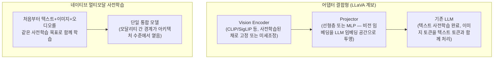

# Multimodal Models (멀티모달 모델)

## 개요

이 챕터의 앞선 문서들(Pre-training부터 Model Architectures까지)은 사실상 텍스트 전용 모델을 전제한다. 그러나 프로덕션 LLM 대부분은 이미지·오디오·비디오를 함께 다루는 **멀티모달 모델**이다. 이 위키에는 검색 관점의 멀티모달 다룸([[AI/Engineering/Context_Engineering/Retrieval_Strategies/RAG/Multimodal_RAG|Multimodal_RAG]])과 행동 관점의 다룸([[AI/Engineering/Agent_Engineering/Computer_Use_and_Voice_Agents|Computer_Use_and_Voice_Agents]])은 있었지만, **모델 자체의 아키텍처**를 다루는 문서가 없었다. 본 문서가 그 공백을 채운다.

## VLM 아키텍처 두 계보



| | 어댑터 결합형 (LLaVA 계보) | 네이티브 멀티모달 사전학습 |
|---|---|---|
| **구성** | 별도 학습된 Vision Encoder + Projector + 기존 LLM | 처음부터 통합 학습 |
| **학습 비용** | 낮음 (기존 컴포넌트 재사용, projector만 학습) | 매우 높음 (전체 재학습) |
| **성능 상한** | Vision Encoder·LLM 각각의 사전학습 한계에 종속 | 모달리티 간 상호작용을 처음부터 학습해 상한이 더 높음 |
| **대표 사례** | LLaVA, 초기 오픈소스 VLM 다수 | GPT-4o, Gemini, Claude(이미지 네이티브 처리) 계열 |

## 이미지 토큰화와 해상도 타일링

이미지는 텍스트처럼 자연스러운 토큰 경계가 없다. 대부분의 VLM은 이미지를 고정 크기 패치(patch)로 분할한 뒤 각 패치를 하나의 "이미지 토큰"으로 취급한다.

```
저해상도 이미지 (예: 512×512) → 적은 패치 수 → 적은 토큰 소비, 세부 디테일 손실
고해상도 이미지 (예: 2048×2048) → 타일링(tiling)으로 여러 조각 분할 → 각 타일이 별도 패치 세트
  → 텍스트 몇 문장보다 이미지 한 장이 훨씬 많은 컨텍스트 예산을 소비할 수 있음

실무 함의:
  - 스크린샷·문서 이미지를 다루는 에이전트(Computer_Use)는 이미지 토큰 비용이
    전체 비용의 상당 부분을 차지할 수 있음
  - 해상도를 무작정 높이면 정확도는 오르지만 컨텍스트·비용이 비선형적으로 증가
```

## 오디오: Whisper부터 네이티브 음성까지

```
1세대: Cascade 방식
  음성 → ASR(Whisper 등) → 텍스트 → LLM → 텍스트 → TTS → 음성
  단점: 파이프라인 각 단계에서 지연·정보 손실(억양·감정 뉘앙스 소실) 누적

2세대: 네이티브 음성-음성(speech-to-speech) 모델
  음성 입력 → 모델이 오디오 토큰을 직접 처리 → 오디오 토큰 직접 생성
  장점: 지연 감소, 억양·끼어들기(interruption) 등 준언어적 정보 보존
```

음성 에이전트의 지연시간·턴테이킹 설계는 [[AI/Engineering/Agent_Engineering/Computer_Use_and_Voice_Agents|Computer_Use_and_Voice_Agents]]에서 다룬다 — 본 절은 **모델이 오디오를 처리하는 방식 자체**에 집중한다.

## 비디오: 프레임 샘플링의 트레이드오프

비디오는 이미지의 시퀀스이므로 원칙적으로 모든 프레임을 이미지 토큰화하면 되지만, 초당 수십 프레임을 그대로 넣으면 컨텍스트가 즉시 소진된다.

```
샘플링 전략:
  - 균등 샘플링: N초마다 1프레임 (단순하지만 빠른 장면 전환을 놓칠 수 있음)
  - 장면 전환 감지 기반 샘플링: 변화가 큰 지점만 선택적으로 추출
  - 키프레임 + 자막/음성 텍스트 결합: 프레임 수를 줄이는 대신 오디오 트랙에서 텍스트 정보 보완
```

## 멀티모달 평가 벤치마크

| 벤치마크 | 측정 대상 |
|---|---|
| **MMMU** | 대학 수준 멀티모달 추론(과목별 이미지+텍스트 문제) |
| **MathVista** | 시각적 요소가 포함된 수학 문제 해결 |
| **DocVQA** | 문서 이미지에 대한 질의응답 (표·양식 이해 포함) |

이 벤치마크들은 [[AI/Engineering/Harness_Engineering/Benchmarking|Benchmarking]]의 텍스트 전용 벤치마크(MMLU, GSM8K 등)와 별도 트랙으로 관리되는 것이 일반적이다 — 텍스트 추론 능력과 시각 이해 능력이 반드시 함께 향상되지 않기 때문이다.

## 경계 정리

| 문서 | 다루는 것 |
|------|-----------|
| **본 문서 (Multimodal_Models)** | VLM/오디오/비디오 모델의 **아키텍처 자체** — 인코더 결합 방식, 토큰화, 평가 |
| [[AI/Engineering/Context_Engineering/Retrieval_Strategies/RAG/Multimodal_RAG|Multimodal_RAG]] | 멀티모달 임베딩을 이용한 **검색** — CLIP 공유 임베딩, ColPali OCR-free 검색 |
| [[AI/Engineering/Agent_Engineering/Computer_Use_and_Voice_Agents|Computer_Use_and_Voice_Agents]] | 멀티모달 모델을 이용한 **행동공간**(스크린샷 기반 조작, 음성 대화) — 에이전트 레벨 활용 |

## AI Engineering에서의 역할

멀티모달 지원 여부는 더 이상 "특수 기능"이 아니라 프론티어 모델의 기본값이 되었다. 이미지 토큰이 텍스트 토큰보다 훨씬 많은 컨텍스트를 소비할 수 있다는 사실은 Cost Engineering·Context Engineering 모두에 직접적인 영향을 준다 — 스크린샷을 반복적으로 컨텍스트에 넣는 에이전트 설계는 텍스트 전용 설계보다 비용 곡선이 훨씬 가파르게 증가한다.

## 관련 개념
[[AI/Engineering/Context_Engineering/Retrieval_Strategies/RAG/Multimodal_RAG|Multimodal_RAG]] · [[AI/Engineering/Agent_Engineering/Computer_Use_and_Voice_Agents|Computer_Use_and_Voice_Agents]] · [[AI/Engineering/Model_Engineering/Model_Architectures_and_MoE|Model_Architectures_and_MoE]] · [[AI/Engineering/Harness_Engineering/Benchmarking|Benchmarking]]

## 출처
- Liu et al. (2023) "Visual Instruction Tuning (LLaVA)" — [arXiv:2304.08485](https://arxiv.org/abs/2304.08485)
- Radford et al. (2021) "Learning Transferable Visual Models From Natural Language Supervision (CLIP)" — [arXiv:2103.00020](https://arxiv.org/abs/2103.00020)
- Yue et al. (2023) "MMMU: A Massive Multi-discipline Multimodal Understanding Benchmark" — [arXiv:2311.16502](https://arxiv.org/abs/2311.16502)
- Radford et al. (2022) "Robust Speech Recognition via Large-Scale Weak Supervision (Whisper)" — [arXiv:2212.04356](https://arxiv.org/abs/2212.04356)
