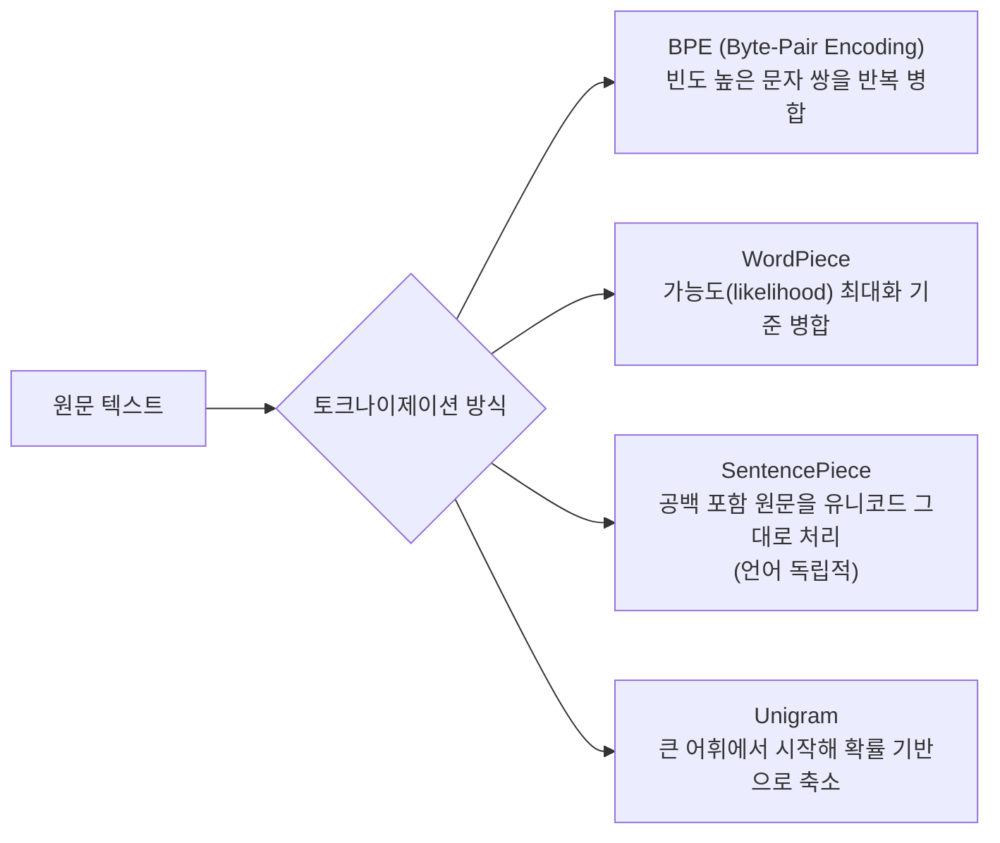

# Tokenization (토크나이제이션)

## 개요

[[AI/Engineering/Loop_Engineering/Cost_Engineering/Cost_Engineering|Cost_Engineering]]과 [[AI/Engineering/Prompt_Engineering/Prompt_Caching|Prompt_Caching]] 모두 "토큰 하나의 비용"을 전제로 논의를 시작하지만, 정작 **토큰이 어떻게 만들어지는가**를 다루는 문서는 이 위키에 없었다. 토크나이저는 모델 아키텍처만큼이나 비용·컨텍스트 예산·다국어 성능을 좌우하는데도 프롬프트·비용 최적화 논의에서 당연하게 전제되는 경우가 많다.

## 서브워드 토크나이제이션 방식



| 방식 | 병합 기준 | 대표 사용처 |
|------|-----------|-----------|
| **BPE** | 가장 빈번한 인접 문자/바이트 쌍을 반복적으로 병합 | GPT 계열(tiktoken), 대다수 오픈소스 LLM |
| **WordPiece** | 병합 시 언어모델 가능도가 최대가 되는 쌍 선택 | BERT 계열 |
| **SentencePiece** | 공백을 포함한 원문을 언어 비의존적으로 처리(unigram 또는 BPE 알고리즘 위에 구축) | 다국어 모델, T5, LLaMA |
| **Byte-level fallback** | 어휘에 없는 문자는 UTF-8 바이트 단위로 분해 | 대다수 최신 토크나이저의 안전망 — "토크나이즈 불가능한 문자열"을 없앰 |

## 어휘 크기의 트레이드오프

```
어휘 크기(vocab_size) ↑
  장점: 같은 텍스트를 더 적은 토큰으로 표현 (시퀀스 길이↓, 컨텍스트 예산 절약)
  단점: 임베딩 테이블(vocab_size × d_model)이 커져 파라미터·메모리 증가

어휘 크기(vocab_size) ↓
  장점: 임베딩 테이블이 작아짐
  단점: 같은 텍스트가 더 많은 토큰으로 쪼개짐 (시퀀스 길이↑, 추론 비용↑)

실무 균형점: 대형 모델은 대개 5만~25만 사이 어휘 크기를 사용
  (다국어 지원 모델일수록 어휘 크기가 커지는 경향)
```

## 다국어·한국어 토큰 효율 불이익

토크나이저의 어휘는 학습 코퍼스의 언어 분포를 반영한다. 영어 중심으로 학습된 토크나이저는 영어 단어를 1~2 토큰으로 표현하지만, 같은 의미의 비영어권 텍스트, 특히 한국어는 훨씬 많은 토큰을 소비하는 경우가 흔하다.

```
예시적 패턴 (토크나이저·모델마다 정확한 비율은 다름):
  영어 문장 "I love you" → 3토큰 내외
  같은 의미의 한국어 "사랑해" → 형태소 경계·음절 조합 방식에 따라
                                동일 토크나이저에서 더 많은 토큰으로 분해되는 경우가 흔함

실무적 함의:
  - 같은 글자 수의 작업이라도 한국어 입출력이 영어보다 비용이 더 들 수 있음
    (토큰 단위 과금 구조에서 직접적인 비용 불이익)
  - 컨텍스트 윈도우도 "토큰" 단위이므로, 같은 윈도우 크기라도
    한국어로는 담을 수 있는 실질 정보량이 영어보다 적을 수 있음
  - 한국어 특화 토크나이저(형태소 분석 기반 vocab) 또는
    한국어 코퍼스 비중을 높여 재학습한 토크나이저가 이 불이익을 완화
```

이 불이익은 [[AI/Engineering/Loop_Engineering/Cost_Engineering/Cost_Engineering|Cost_Engineering]] 관점에서 다국어 서비스의 비용 구조를 설계할 때 반드시 고려해야 하는 변수다 — 같은 라우팅·캐싱 전략이라도 언어별 토큰 밀도가 다르면 실제 비용 곡선이 달라진다.

## 숫자·코드 토큰화가 산술·코딩 성능에 미치는 영향

```
숫자 토큰화 문제:
  "12345"가 하나의 토큰으로 뭉쳐지면 모델이 자릿수 단위 연산(덧셈·자릿수 비교)을 학습하기 어려움
  → 일부 최신 토크나이저는 숫자를 자릿수 단위로 분해하거나 일관된 방식으로 청킹해
    산술 추론 정확도를 개선 (예: 세 자리씩 고정 분할)

코드 토큰화 문제:
  들여쓰기(공백/탭)·특수기호(중괄호, 세미콜론)가 자연어 텍스트와 다른 통계적 분포를 가짐
  → 코드 특화 토크나이저 또는 코드 데이터 비중이 높은 학습 코퍼스가 코딩 성능에 유의미한 영향
```

## Tokenizer 불일치와 토큰 카운팅 실무

```
실무에서 자주 발생하는 문제:
  - 벤더 A의 tokenizer로 토큰 수를 추정했는데 실제 청구는 벤더 B의 tokenizer 기준
    → 사전 비용 추정과 실제 청구액 불일치
  - 모델 업그레이드 시 토크나이저 자체가 바뀌는 경우
    (예: 어휘 확장) → 동일 프롬프트의 토큰 수가 달라져 캐싱·비용 예측이 어긋남
  - 클라이언트 사이드에서 정확한 토큰 수를 알려면 벤더가 제공하는 공식 토크나이저
    라이브러리(tiktoken, 벤더 SDK의 count_tokens API 등)를 반드시 사용해야 함
    — 근사치 추정(단어 수 × 1.3 같은 휴리스틱)은 청구 예측용으로 부정확
```

## 경계 정리

| 문서 | 다루는 것 |
|------|-----------|
| **본 문서 (Tokenization)** | 토크나이저 **자체**의 알고리즘, 어휘 크기 트레이드오프, 언어별 효율 |
| [[AI/Engineering/Loop_Engineering/Cost_Engineering/Cost_Engineering|Cost_Engineering]] | 토큰 단위 **비용을 최적화**하는 라우팅·캐싱·감사 전략 |
| [[AI/Engineering/Prompt_Engineering/Prompt_Caching|Prompt_Caching]] | 토큰 **경계**를 이용해 캐시 브레이크포인트를 설계하는 방법 |

## AI Engineering에서의 역할

토크나이저는 프롬프트를 쓰는 순간부터 API 비용이 청구되는 순간까지 보이지 않게 개입하는 계층이다. 다국어 서비스, 특히 한국어 서비스를 설계할 때 토큰 효율 불이익을 무시하면 영어 기준으로 추정한 비용·컨텍스트 예산이 실제 운영에서 크게 벗어난다. 모델 선택·라우팅 전략을 짤 때 "이 모델의 토크나이저가 우리 서비스 언어에서 얼마나 효율적인가"는 벤치마크 점수 못지않게 실질적인 선택 기준이다.

## 관련 개념
[[AI/Engineering/Loop_Engineering/Cost_Engineering/Cost_Engineering|Cost_Engineering]] · [[AI/Engineering/Prompt_Engineering/Prompt_Caching|Prompt_Caching]] · [[AI/Engineering/Model_Engineering/Model_Architectures_and_MoE|Model_Architectures_and_MoE]]

## 출처
- Sennrich et al. (2016) "Neural Machine Translation of Rare Words with Subword Units (BPE)" — [arXiv:1508.07909](https://arxiv.org/abs/1508.07909)
- Kudo & Richardson (2018) "SentencePiece: A simple and language independent subword tokenizer" — [arXiv:1808.06226](https://arxiv.org/abs/1808.06226)
- Kudo (2018) "Subword Regularization (Unigram)" — [arXiv:1804.10959](https://arxiv.org/abs/1804.10959)
- OpenAI `tiktoken` — [github.com/openai/tiktoken](https://github.com/openai/tiktoken)
