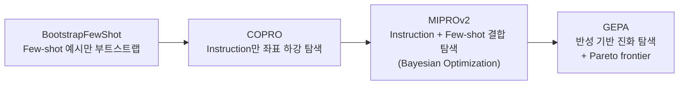

# Automatic Prompt Optimization (자동 프롬프트 최적화)

## 개요

**Automatic Prompt Optimization**은 프롬프트를 사람이 손으로 쓰지 않고, 목표와 평가 지표만 선언하면 옵티마이저가 프롬프트 문구·Few-shot 예시·지시 구조를 자동으로 탐색하게 하는 접근이다. 2024년 말부터 실무에 자리잡기 시작했으며, 프롬프트를 "작성하는 것"이 아니라 "컴파일하는 것"으로 보는 관점의 전환을 담고 있다.

이 문서는 그 패러다임 전환 자체와 **어떤 옵티마이저를 언제 쓰는가**를 다룬다. 실제 컴파일 파이프라인과 운영 루프 연결은 [[AI/Engineering/Loop_Engineering/Continuous_Optimization|Continuous_Optimization]]에서 다룬다.

## 왜 수작업 프롬프팅에 한계가 있는가

```
수작업 프롬프트 엔지니어링의 구조적 문제:
  - 사람의 직관이 모델의 실제 반응 패턴과 다를 수 있음
    ("정중하게 부탁하면 더 잘 따를 것"이라는 직관이 항상 맞지는 않음)
  - 프롬프트 하나를 조금 바꿀 때마다 전체 파이프라인을 수동 재평가해야 함
  - 모델이 바뀌면(GPT-4→GPT-5, Claude 3.5→4.5) 기존 프롬프트가 최적이 아니게 됨
    → 매 모델 업그레이드마다 수작업 재튜닝 필요
  - 멀티스텝 파이프라인(RAG, 에이전트)에서는 단계별 프롬프트가 서로 영향을 주고받아
    사람이 전체 최적 조합을 직관적으로 찾기 어려움
```

## 자동 최적화 기법 지형

| 기법 | 방식 | 특징 |
|------|------|------|
| **APE** (Automatic Prompt Engineer) | LLM에게 시연 예시로부터 후보 instruction을 역생성시킨 뒤 스코어링 | 최초 세대의 "LLM이 LLM 프롬프트를 쓴다" 접근 (Zhou et al., 2022) |
| **OPRO** (Optimization by PROmpting) | LLM 자체를 메타 최적화 알고리즘처럼 사용 — 이전 시도-점수 기록을 프롬프트에 넣고 다음 후보를 생성시킴 | 그래디언트 없이 순수 자연어 피드백 루프만으로 최적화 |
| **TextGrad** | "텍스트 기반 역전파" — 평가 피드백을 미분 가능한 손실처럼 취급해 파이프라인 각 노드의 프롬프트에 전파 | 멀티스텝 파이프라인 전체를 동시에 최적화 |
| **벤더 Prompt Improver** | Anthropic/OpenAI 등이 콘솔에 내장한 1회성 프롬프트 개선 도구 | 별도 파이프라인 구축 없이 즉시 사용 가능하나 반복 최적화 루프는 아님 |
| **DSPy 옵티마이저 계열** | 시그니처·모듈·메트릭을 선언하면 컴파일러가 프롬프트+예시를 탐색 | 아래 절 참고, 상세는 [[AI/Engineering/Loop_Engineering/Continuous_Optimization\|Continuous_Optimization]] |

## GEPA (ICLR 2026) — 반성 기반 진화 탐색

**GEPA**(Genetic-Pareto)는 DSPy 3.0에 포함된 최신 옵티마이저로, ICLR 2026에서 발표되었다. 기존 RL 기반 최적화(GRPO)와의 차이가 핵심이다.

```
GRPO(RL 기반) 방식:
  수치 보상 신호만으로 정책을 점진적으로 갱신
  → 대량의 rollout(수천~수만 회) 필요

GEPA(반성 기반 진화) 방식:
  각 반복마다 미니배치 실행 → 실행 궤적(trajectory)에 대한 자연어 반성(reflection) 생성
  → "왜 이 응답이 틀렸는가"를 텍스트로 분석해 프롬프트를 직접 수정
  → 수정된 후보들을 Pareto frontier(다중 지표 동시 고려)로 유지·선별
```

GEPA는 GRPO 대비 **약 35배 적은 rollout**으로 **+20% 성능 개선**을 보고한다 — 수치 보상만으로 방향을 추측하는 대신, 실패 이유를 자연어로 직접 진단하고 그 진단을 프롬프트 수정에 바로 반영하기 때문에 탐색 효율이 훨씬 높다.

## DSPy 옵티마이저 선택 가이드

DSPy는 "프롬프트를 컴파일한다"는 접근의 대표 프레임워크다. 옵티마이저 계보와 각각의 트레이드오프:



| 상황 | 권장 옵티마이저 |
|------|-----------------|
| 예시 몇 개만 잘 고르면 충분한 단순 태스크 | BootstrapFewShot |
| Instruction 문구 자체가 중요하고 예시는 불필요 | COPRO |
| 예시·지시문을 함께 탐색해야 하는 일반적인 경우 | MIPROv2 |
| 연산 예산이 제한적이면서 최고 성능이 필요한 경우 | GEPA |
| 프롬프트 수준을 넘어 모델 가중치까지 최적화하려는 경우 | GRPO ([[AI/Engineering/Loop_Engineering/Continuous_Optimization\|Continuous_Optimization]] 참고) |

## 경계 정리

| 문서 | 다루는 것 |
|------|-----------|
| **본 문서 (Automatic_Prompt_Optimization)** | "프롬프트를 사람이 안 쓴다"는 **패러다임 전환**과 **옵티마이저 선택 기준** |
| [[AI/Engineering/Loop_Engineering/Continuous_Optimization\|Continuous_Optimization]] | DSPy 컴파일 파이프라인의 **구현 상세**(시그니처·모듈·메트릭 코드), A/B 테스트·프롬프트 버전 관리를 포함한 **운영 루프** |

## AI Engineering에서의 역할

자동 프롬프트 최적화는 Prompt Engineering과 Loop Engineering의 경계에 걸쳐 있는 기법이다 — 결과물은 여전히 "프롬프트"(Prompt Engineering의 대상)이지만, 그것을 만드는 과정은 반복적 평가·개선 루프(Loop Engineering의 방법론)를 따른다. 모델이 업그레이드될 때마다 프롬프트를 수작업으로 재튜닝하는 비용이 조직 규모에서 무시할 수 없어지면서, 이 자동화가 "있으면 좋은 것"에서 "프로덕션 필수 인프라"로 옮겨가고 있다.

## 관련 개념
[[AI/Engineering/Loop_Engineering/Continuous_Optimization|Continuous_Optimization]] · [[AI/Engineering/Prompt_Engineering/Few_shot_Prompting|Few_shot_Prompting]] · [[AI/Engineering/Prompt_Engineering/System_and_Role_Prompting|System_and_Role_Prompting]] · [[AI/Engineering/Harness_Engineering/LLM_as_a_Judge|LLM_as_a_Judge]]

## 출처
- Zhou et al. (2022) "Large Language Models Are Human-Level Prompt Engineers (APE)" — [arXiv:2211.01910](https://arxiv.org/abs/2211.01910)
- Yang et al. (2023) "Large Language Models as Optimizers (OPRO)" — [arXiv:2309.03409](https://arxiv.org/abs/2309.03409)
- Yuksekgonul et al. (2024) "TextGrad: Automatic Differentiation via Text" — [arXiv:2406.07496](https://arxiv.org/abs/2406.07496)
- Khattab et al. (2023) "DSPy: Compiling Declarative Language Model Calls into Self-Improving Pipelines" — [arXiv:2310.03714](https://arxiv.org/abs/2310.03714)
- Agrawal et al. (2026) "GEPA: Reflective Prompt Evolution Can Outperform Reinforcement Learning" (ICLR 2026) — [arXiv:2507.19457](https://arxiv.org/abs/2507.19457)
