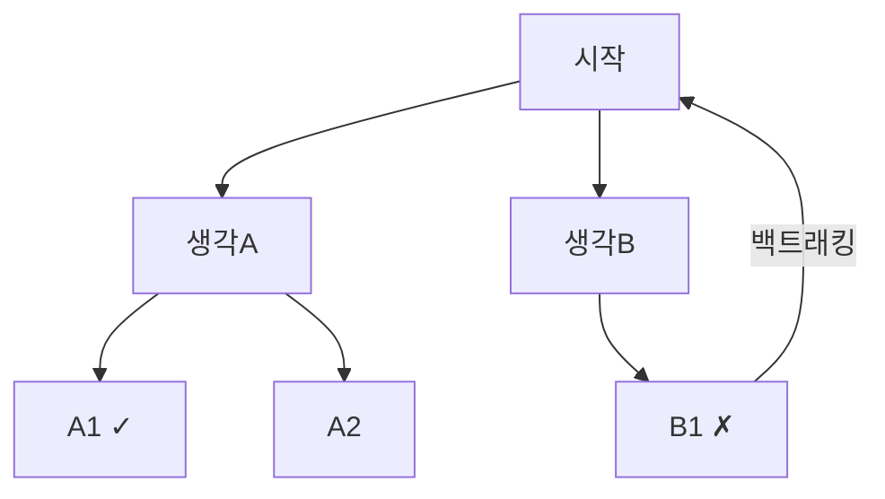

# Chain of Thought / Tree of Thought

## 개요

**Chain of Thought (CoT)**는 LLM이 최종 답변 전에 단계적 추론 과정을 명시적으로 생성하도록 유도하는 프롬프팅 기법이다. **Tree of Thought (ToT)**는 CoT를 일반화하여 여러 추론 경로를 탐색하고 가장 유망한 경로를 선택하는 트리 탐색 방식이다.

## Chain of Thought (CoT)

### 제창
- **저자**: Wei et al., Google Brain (2022)
- **논문**: "Chain-of-Thought Prompting Elicits Reasoning in Large Language Models" — [arXiv:2201.11903](https://arxiv.org/pdf/2201.11903)

### 핵심 아이디어
"Let me think step by step" 방식의 중간 추론 단계 포함:

```
Without CoT:
  Q: "Roger는 테니스공 5개를 가지고 있다. 그는 2캔을 샀고 각 캔에 3개씩 있다. 총?"
  A: "11개" (틀림)

With CoT:
  Q: 동일
  A: "Roger는 5개를 가지고 있다.
      2캔 × 3개/캔 = 6개 추가.
      5 + 6 = 11개"
  A: "11개" (맞음)
```

### Zero-shot CoT
예시 없이 "단계별로 생각해보자" 한 줄만 추가:
```
Q: "..." + "Let's think step by step."
```
- Kojima et al. (2022)가 발견
- 간단하지만 복잡한 추론에서 성능 대폭 향상

### Few-shot CoT
CoT 추론 과정이 포함된 예시를 제공:
```
예시:
  Q: "정원에 꽃이 15개 있다. 그중 1/3을 꺾었다. 남은 꽃은?"
  A: "15개의 1/3은 5개. 꺾은 후 15 - 5 = 10개 남음."

질문:
  Q: "버스에 45명이 탔다. 다음 정류장에서 1/5이 내렸다. 남은 사람은?"
```

### Self-Consistency CoT
동일 질문에 여러 추론 경로 생성 후 투표:
```
Temperature 높여서 3~10개 답변 생성
→ 가장 많이 나온 답변 선택 (다수결)
→ 단일 CoT보다 안정적인 성능
```

## Tree of Thought (ToT)

### 제창
- **저자**: Yao et al., Princeton (2023)
- **논문**: "Tree of Thoughts: Deliberate Problem Solving with Large Language Models" — [arXiv:2305.10601](https://arxiv.org/abs/2305.10601)

### 핵심 아이디어
CoT의 선형 추론을 **트리 탐색**으로 확장:



**구성 요소**:
1. **Thought Generator**: 각 단계에서 여러 후보 "생각" 생성
2. **State Evaluator**: 각 생각의 유망성 평가 (LLM 자체 평가 또는 휴리스틱)
3. **Search Algorithm**: BFS (너비 우선) 또는 DFS (깊이 우선) 탐색

### ToT 적합 태스크
- 탐색 공간이 있는 문제 (퍼즐, 코드 디버깅, 창작 글쓰기)
- 중간 단계 평가가 가능한 문제
- 백트래킹이 의미 있는 문제

## CoT vs ToT 비교

| | CoT | ToT |
|--|-----|-----|
| **추론 구조** | 선형 | 트리 |
| **백트래킹** | 없음 | 있음 |
| **LLM 호출 수** | 1회 | 수십~수백 회 |
| **비용** | 낮음 | 높음 |
| **적합 태스크** | 수학, 상식 추론 | 복잡한 계획, 퍼즐 |
| **성능 개선** | 큼 | CoT 대비 추가 향상 |

## 확장: Graph of Thoughts & Beyond

- **Graph of Thoughts (GoT)**: ToT를 그래프로 일반화 (순환·병합 허용)
- **Algorithm of Thoughts**: 단일 컨텍스트에서 탐색
- **ReAct**: 외부 도구 호출과 CoT 결합 (→ [[ReAct_Pattern]])

## Thinking Mode (Extended Thinking)

최신 모델(Claude 3.7 Sonnet, o1/o3 등)은 내부적으로 CoT를 실행하는 "Thinking" 모드 제공:
- 모델이 응답 전 내부 추론 토큰 생성
- 사용자에게는 최종 답변만 노출 (또는 thinking 내용도 공개)

## AI Engineering에서의 역할

CoT는 LLM의 추론 능력을 끌어내는 가장 검증된 기법이다. 수학, 코딩, 법률 분석 등 복잡한 추론이 필요한 LLM 애플리케이션의 기본 프롬프팅 패턴이며, "Think step by step" 한 줄로도 유의미한 성능 향상을 얻을 수 있다.

## 관련 개념
[[Few_shot_Prompting]] · [[System_and_Role_Prompting]] · [[ReAct_Pattern]] · [[Planning_and_Reflection]]

## 출처
- Wei et al. (2022) "Chain-of-Thought Prompting Elicits Reasoning in Large Language Models" — [arXiv:2201.11903](https://arxiv.org/pdf/2201.11903)
- Yao et al. (2023) "Tree of Thoughts" — [arXiv:2305.10601](https://arxiv.org/abs/2305.10601)
- Kojima et al. (2022) "Large Language Models are Zero-Shot Reasoners" — [arXiv:2205.11916](https://arxiv.org/abs/2205.11916)
- learnprompting.org "Chain-of-Thought Prompting" — [learnprompting.org](https://learnprompting.org/docs/intermediate/chain_of_thought)
