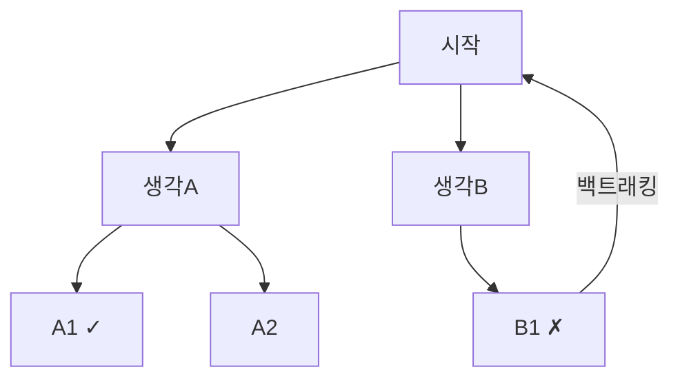

# Chain of Thought / Tree of Thought

## 개요

**Chain of Thought (CoT)**는 LLM이 최종 답변 전에 단계적 추론 과정을 명시적으로 생성하도록 유도하는 프롬프팅 기법이다. **Tree of Thought (ToT)**는 CoT를 일반화하여 여러 추론 경로를 탐색하고 가장 유망한 경로를 선택하는 트리 탐색 방식이다.

## Chain of Thought (CoT)

### 제창
- **저자**: Wei et al., Google Brain (2022)
- **논문**: "Chain-of-Thought Prompting Elicits Reasoning in Large Language Models" — [arXiv:2201.11903](https://arxiv.org/pdf/2201.11903)

### 핵심 아이디어
"Let me think step by step" 방식의 중간 추론 단계 포함:

```
Without CoT:
  Q: "Roger는 테니스공 5개를 가지고 있다. 그는 2캔을 샀고 각 캔에 3개씩 있다. 총?"
  A: "11개" (틀림)

With CoT:
  Q: 동일
  A: "Roger는 5개를 가지고 있다.
      2캔 × 3개/캔 = 6개 추가.
      5 + 6 = 11개"
  A: "11개" (맞음)
```

### Zero-shot CoT
예시 없이 "단계별로 생각해보자" 한 줄만 추가:
```
Q: "..." + "Let's think step by step."
```
- Kojima et al. (2022)가 발견
- 간단하지만 복잡한 추론에서 성능 대폭 향상

### Few-shot CoT
CoT 추론 과정이 포함된 예시를 제공:
```
예시:
  Q: "정원에 꽃이 15개 있다. 그중 1/3을 꺾었다. 남은 꽃은?"
  A: "15개의 1/3은 5개. 꺾은 후 15 - 5 = 10개 남음."

질문:
  Q: "버스에 45명이 탔다. 다음 정류장에서 1/5이 내렸다. 남은 사람은?"
```

### Self-Consistency CoT
동일 질문에 여러 추론 경로 생성 후 투표:
```
Temperature 높여서 3~10개 답변 생성
→ 가장 많이 나온 답변 선택 (다수결)
→ 단일 CoT보다 안정적인 성능
```

## Tree of Thought (ToT)

### 제창
- **저자**: Yao et al., Princeton (2023)
- **논문**: "Tree of Thoughts: Deliberate Problem Solving with Large Language Models" — [arXiv:2305.10601](https://arxiv.org/abs/2305.10601)

### 핵심 아이디어
CoT의 선형 추론을 **트리 탐색**으로 확장:


```mermaid
flowchart TD
    S[시작] --> A[생각A] & B[생각B]
    A --> A1[A1 ✓] & A2[A2]
    B --> B1[B1 ✗]
    B1 -->|백트래킹| S
```

**구성 요소**:
1. **Thought Generator**: 각 단계에서 여러 후보 "생각" 생성
2. **State Evaluator**: 각 생각의 유망성 평가 (LLM 자체 평가 또는 휴리스틱)
3. **Search Algorithm**: BFS (너비 우선) 또는 DFS (깊이 우선) 탐색

### ToT 적합 태스크
- 탐색 공간이 있는 문제 (퍼즐, 코드 디버깅, 창작 글쓰기)
- 중간 단계 평가가 가능한 문제
- 백트래킹이 의미 있는 문제

## CoT vs ToT 비교

| | CoT | ToT |
|--|-----|-----|
| **추론 구조** | 선형 | 트리 |
| **백트래킹** | 없음 | 있음 |
| **LLM 호출 수** | 1회 | 수십~수백 회 |
| **비용** | 낮음 | 높음 |
| **적합 태스크** | 수학, 상식 추론 | 복잡한 계획, 퍼즐 |
| **성능 개선** | 큼 | CoT 대비 추가 향상 |

## 확장: Graph of Thoughts & Beyond

- **Graph of Thoughts (GoT)**: ToT를 그래프로 일반화 (순환·병합 허용)
- **Algorithm of Thoughts**: 단일 컨텍스트에서 탐색
- **ReAct**: 외부 도구 호출과 CoT 결합 (→ [[AI/Engineering/Flow_Engineering/Graph_Flow/ReAct_Pattern|ReAct_Pattern]])

## 그 밖의 CoT 계열 기법

### Least-to-Most Prompting
Zhou et al. (2022) [4]. 복잡한 문제를 여러 하위 문제로 **분해**한 뒤, 앞선 하위 문제의 답을 다음 하위 문제 풀이에 활용하며 순차적으로 해결한다. Few-shot CoT가 예시를 통해 "어떻게 생각할지"를 보여준다면, Least-to-Most는 "문제를 어떻게 쪼갤지"를 먼저 보여준다는 점이 다르다. 조합적으로 어려운(compositional) 문제에서 Few-shot CoT보다 일반화가 잘 된다.

### Self-Ask
Press et al. (2022) [5]. 모델이 최종 질문에 답하기 전 스스로 **후속 질문(follow-up question)**을 던지고 답하도록 유도한다. "필요한 후속 질문이 있습니까?"라는 명시적 프롬프트로 검색 도구 등 외부 액션을 후속 질문마다 끼워 넣기 쉬워, ReAct 같은 도구 사용 패턴의 전신에 해당한다.

### Program-of-Thought (PoT)
Chen et al. (2022) [6]. 추론 과정을 자연어 대신 **실행 가능한 코드**(주로 Python)로 생성하고, 코드 실행 결과를 최종 답으로 사용한다. CoT는 산술 계산 과정 자체를 텍스트로 서술하다 계산 실수를 하는 경우가 있는데, PoT는 "추론(어떤 계산을 할지)"과 "계산(그 계산을 정확히 수행하기)"을 분리해 계산은 인터프리터에 위임한다.

## Thinking Mode와 Reasoning 모델 시대의 CoT

Claude Opus/Sonnet의 Extended Thinking, OpenAI의 o-시리즈·GPT-5 계열, Gemini Deep Think 같은 **reasoning 모델**은 모델 자체가 학습 단계에서 내부적으로 긴 추론 체인을 생성하도록 훈련돼 있다. 이는 위 CoT 기법들이 프롬프트로 "유도"하던 것을 모델이 기본 동작으로 내장했다는 뜻이며, 실무 프롬프팅 방식이 달라진다.

```
비-reasoning 모델 (GPT-4, Claude 3.5 등):
  "Let's think step by step"을 프롬프트에 명시 → 추론 유도 필요

Reasoning 모델 (o1/o3, Claude Extended Thinking, Gemini Deep Think 등):
  모델이 응답 전 자체적으로 내부 추론 토큰을 생성
  → "단계별로 생각해" 같은 CoT 유도 문구는 대개 불필요
  → 일부 케이스에서는 오히려 성능을 해칠 수 있음 (모델의 자체 추론 전략을 방해)
```

**Reasoning 모델 프롬프팅에서 바뀌는 것:**
- **Thinking budget / effort level 제어**: "얼마나 깊이 생각할지"를 CoT 문구가 아니라 API 파라미터(예: `thinking_budget`, `reasoning_effort`)로 직접 조절한다.
- **Thinking block을 다음 턴에 되먹이지 않는다**: 모델의 내부 추론 내용을 대화 히스토리에 그대로 포함시켜 재사용하지 않는 것이 표준 관례다 — 이전 추론이 이후 응답의 품질을 오히려 낮출 수 있다.
- **적응형(adaptive) 모드 우선**: "무조건 깊게 생각하라"고 강제하기보다, 모델이 문제 난이도에 따라 스스로 추론 깊이를 조절하게 두는 편이 비용·품질 균형에 유리한 경우가 많다.

**CoT 프롬프팅이 여전히 유효한 경우**: 이 흐름이 CoT를 완전히 대체한 것은 아니다. reasoning 기능이 없는 비추론 모델(저비용 티어, 경량 모델), 지연시간·비용에 민감해 reasoning 모드를 끄고 쓰는 상황, 그리고 모델의 사고 과정을 사용자에게 그대로 노출하고 싶은 설명 가능성(explainability) 요구가 있는 경우에는 명시적 CoT 프롬프팅이 여전히 유효하다.

## AI Engineering에서의 역할

CoT는 LLM의 추론 능력을 끌어내는 가장 검증된 기법이다. 수학, 코딩, 법률 분석 등 복잡한 추론이 필요한 LLM 애플리케이션의 기본 프롬프팅 패턴이며, "Think step by step" 한 줄로도 유의미한 성능 향상을 얻을 수 있다. 다만 reasoning 모델이 표준이 되면서, "얼마나 깊이 생각하게 할지"를 프롬프트 문구가 아니라 API 레벨 파라미터로 제어하는 방향으로 실무가 이동하고 있다.

## 관련 개념
[[AI/Engineering/Prompt_Engineering/Few_shot_Prompting|Few_shot_Prompting]] · [[AI/Engineering/Prompt_Engineering/System_and_Role_Prompting|System_and_Role_Prompting]] · [[AI/Engineering/Flow_Engineering/Graph_Flow/ReAct_Pattern|ReAct_Pattern]] · [[AI/Engineering/Agent_Engineering/Planning_and_Reflection|Planning_and_Reflection]] · [[AI/Engineering/Prompt_Engineering/Prompt_Caching|Prompt_Caching]]

## 출처
- Wei et al. (2022) "Chain-of-Thought Prompting Elicits Reasoning in Large Language Models" — [arXiv:2201.11903](https://arxiv.org/pdf/2201.11903)
- Yao et al. (2023) "Tree of Thoughts" — [arXiv:2305.10601](https://arxiv.org/abs/2305.10601)
- Kojima et al. (2022) "Large Language Models are Zero-Shot Reasoners" — [arXiv:2205.11916](https://arxiv.org/abs/2205.11916)
- Zhou et al. (2022) "Least-to-Most Prompting Enables Complex Reasoning in Large Language Models" — [arXiv:2205.10625](https://arxiv.org/abs/2205.10625)
- Press et al. (2022) "Measuring and Narrowing the Compositionality Gap in Language Models" — [arXiv:2210.03350](https://arxiv.org/abs/2210.03350)
- Chen et al. (2022) "Program of Thoughts Prompting" — [arXiv:2211.12588](https://arxiv.org/abs/2211.12588)
- learnprompting.org "Chain-of-Thought Prompting" — [learnprompting.org](https://learnprompting.org/docs/intermediate/chain_of_thought)
