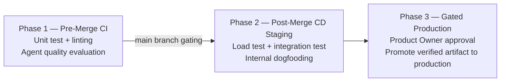
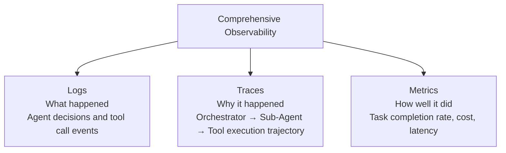
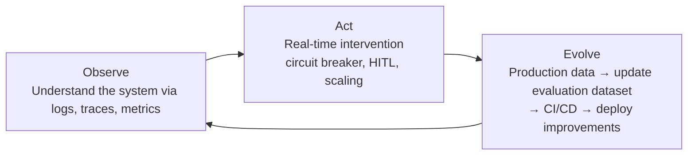

# AgentOps

**AgentOps** is the methodology and tooling system for transitioning AI Agents from prototype to production and continuously operating and improving them. It extends the principles of DevOps and MLOps to match the unique complexity of agents — dynamic tool orchestration, non-deterministic execution paths, multi-turn state management.

## The Ops Evolution Chain

```
DevOps → MLOps → FMOps → PromptOps → RAGOps → AgentOps
```

AgentOps is a subcategory of **GenAIOps**. Additional management elements compared to previous stages:
- **Tool Management**: Version control, access control, registry for hundreds to thousands of tools
- **Agent Brain Prompt**: Agent-specific system prompt containing goals, persona, and instructions
- **Orchestration**: Inter-agent communication, task delegation, execution coordination
- **Memory**: Short-term in-session + long-term cross-session memory management
- **Task Decomposition**: Decomposing complex goals into executable subtasks

## Unique Operational Challenges of Agents

Unlike traditional software, agents have **autonomous, stateful, dynamic paths**. This is why existing MLOps falls short:

| Challenge | Description | Operational requirement |
|-----------|-------------|------------------------|
| **Dynamic Tool Orchestration** | Different tool selection paths each execution | Robust versioning, access control, granular tracing |
| **Scalable State Management** | Maintaining memory across sessions | Safe and consistent external state storage |
| **Unpredictable Cost & Latency** | Non-deterministic execution paths | Smart budgeting, dynamic caching, cost alerts |

**Real failure cases that occur without production-grade ops**:
- No guardrails → customer service agent offers products for free
- Auth misconfiguration → access to confidential internal DB
- No monitoring → massive unexpected charges accumulate over a weekend
- No continuous evaluation → agent that worked perfectly yesterday suddenly stops

> "Building an agent is easy. Trusting one is hard." — Prototype to Production (Google, 2026)

## 3 Pillars of AgentOps

### Pillar 1: Automated Evaluation

Golden dataset-based quality gate — no version can reach production without passing evaluation.

Why traditional unit tests alone are insufficient: even passing 100 tool unit tests, wrong tool selection or hallucination can still occur. Agents must evaluate the **entire reasoning trajectory**.

3 evaluation components:
1. **Capabilities** — Does the agent have the intended capabilities?
2. **Trajectory & Tool Use** — Did it select the right tools in the right order?
3. **Final Response** — Does the final response meet expected quality?

6 trajectory evaluation metrics:
- Exact match / In-order match / Any-order match / Precision / Recall / Single-tool use

### Pillar 2: CI/CD Pipeline



**Safe Rollout 4 strategies**:

| Strategy | Method | Best for |
|----------|--------|---------|
| **Canary** | 1% → gradual expansion | First deployment of new agent version |
| **Blue-Green** | Swap two environments | Needs immediate rollback |
| **A/B Testing** | Compare business metrics | Data-driven decision making |
| **Feature Flags** | Dynamic release after code deploy | Selective user testing |

**Prerequisite**: **Rigorous versioning** of the entire stack — code, prompts, models, tool schemas, memory structures, evaluation datasets — the "undo button" for production.

### Pillar 3: Comprehensive Observability



## Observe → Act → Evolve Operating Loop



**Core value**: Virtuous cycle where every production incident makes the agent stronger = improvement cycle compressed from weeks to hours.

## AgentOps Platform (agentops.ai)

**AgentOps** (agentops.ai) is a commercial AI Agent-specific observability and debugging platform — separate from AgentOps as a methodology.

### Core Features

- **Time-Travel Debugging & Session Replay**: Rewind agent execution to an exact point for reproduction
- **Multi-Agent Workflow Visualization**: Visually trace inter-agent interactions and delegation relationships
- **Visual Event Tracking**: Timeline visualization of LLM calls, tool use, and agent interactions
- **Token & Cost Tracking**: Per-agent token and cost monitoring with automatic multi-model pricing updates
- **400+ LLM and Framework Support**: OpenAI, CrewAI, Autogen, LangChain, OpenAI Agents SDK, etc.

### Strengths

- Lowest-friction instrumentation in multi-framework environments
- Time-travel debugging is a genuine differentiator for debugging complex multi-agent interactions
- Single SDK covers 400+ LLMs/frameworks

### Limitations

- No automatic issue clustering
- No automatic eval generation
- Focused on observability/debugging → separate tooling needed for systematic quality improvement loops
- ~12% overhead in production (higher than LangSmith)

## Major Tool Comparison (2026)

| Tool | Agent workflow support | Auto issue detection | Eval generation | Open-source/self-hosted | Specialty |
|------|----------------------|---------------------|----------------|------------------------|-----------|
| **AgentOps** | ✅ Time-travel debugging | ❌ | ❌ | ❌ (Cloud) | Multi-framework debugging |
| **LangSmith** | ✅ LangChain/LangGraph native | Partial (Insights) | ❌ (manual) | ❌ (Cloud) | LangChain ecosystem |
| **Langfuse** | ✅ Strong multi-step tracing | ❌ | ❌ (manual) | ✅ MIT license | Self-hosted, data residency |
| **Arize Phoenix** | ✅ OTel native | ❌ | ❌ | ✅ Open source | RAG evaluation, OTel infra |
| **Braintrust** | ✅ Supported | Partial (Topics beta) | ❌ (manual) | ❌ (Cloud) | CI/CD gate eval, most generous free tier |
| **Latitude** | ✅ Causal session tracing | ✅ Issue lifecycle | ✅ GEPA auto-generation | ✅ Self-hosted free | Production failures → auto eval generation |
| **Galileo** | ✅ Supported | Partial (Signals) | ❌ | ❌ (Cloud) | Luna-2 real-time eval of 100% traffic |

### Selection Guide

- **Multi-framework (CrewAI + Autogen + LangChain mixed)** → AgentOps
- **LangChain/LangGraph stack** → LangSmith
- **Self-hosted/data residency requirements** → Langfuse
- **OTel infrastructure investment** → Arize Phoenix
- **CI/CD gate eval focus** → Braintrust
- **Production failures → auto eval generation loop** → Latitude
- **Regulated environment/100% traffic evaluation** → Galileo

## Prototype → Production Transition Checklist

```
□ Build golden dataset + automated evaluation harness
□ Integrate quality gate into CI/CD pipeline
□ Full version control for code, prompts, models, tool schemas
□ Apply 3-layer security (Policy / Guardrail / Continuous Assurance)
□ Choose observability stack and complete instrumentation
□ Decide on safe rollout strategy (Canary recommended)
□ Set cost alerts (hourly thresholds)
□ Define HITL escalation paths
□ Build production data → evaluation dataset update loop
```

## Role in AI Engineering

AgentOps is the operational backbone that makes the difference between an agent that works in a demo and one that can be trusted in production. The key insight: the Observe→Act→Evolve loop means every production incident should make the next version of the agent stronger. Without this closed loop, teams end up fire-fighting the same failure modes repeatedly.

## Related Concepts
[[en/AI/Engineering/Loop_Engineering/Production_Operations|Production Operations]] · [[en/AI/Engineering/Agent_Engineering/Agent_Deployment|Agent Deployment]] · [[en/AI/Engineering/Harness_Engineering/LLM_as_a_Judge|LLM-as-a-Judge]] · [[en/AI/Engineering/Harness_Engineering/Observability_and_Tracing|Observability & Tracing]] · [[en/AI/Engineering/Agent_Engineering/Agent_Architectures|Agent Architectures]]

## Sources
- Google "Prototype to Production" (originally published Nov 2025, updated May 2026)
- Google Kaggle "Agents Companion v2" (2025)
- [Best AI Agent Observability Tools in 2026](https://latitude.so/blog/best-ai-agent-observability-tools-2026-comparison) — Latitude, March 2026
