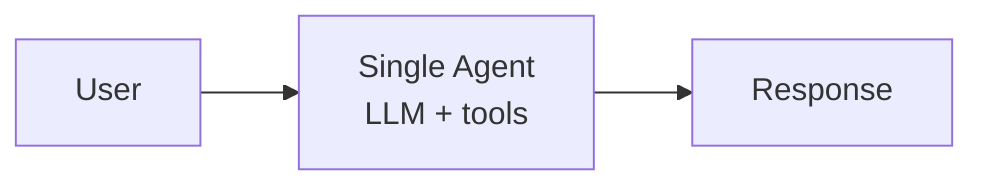
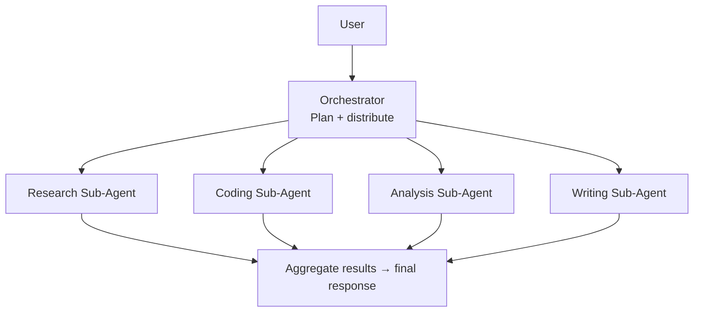
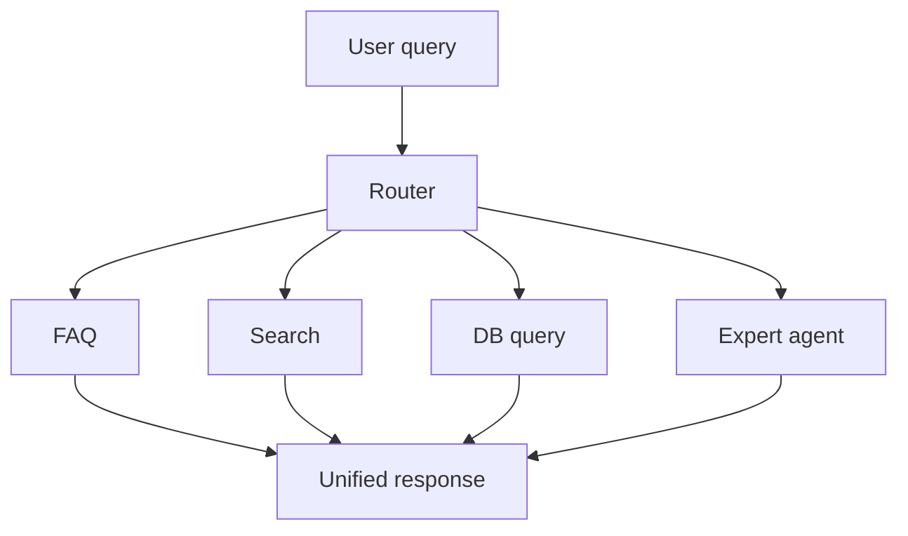
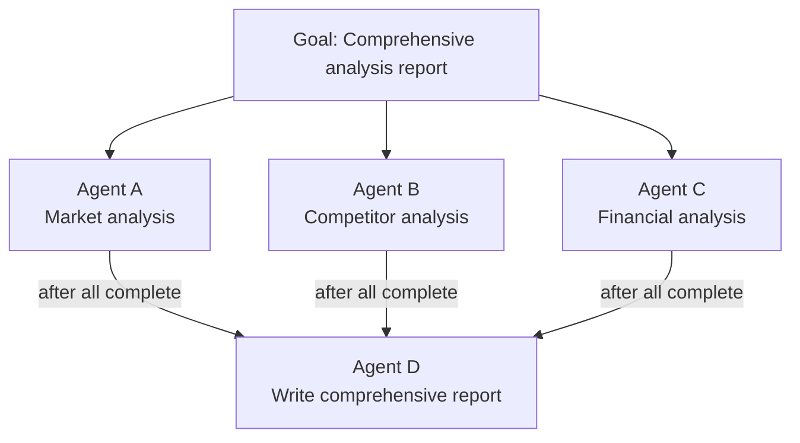
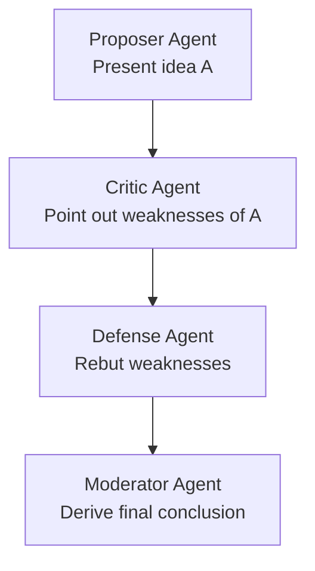
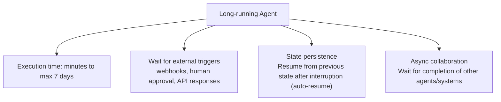
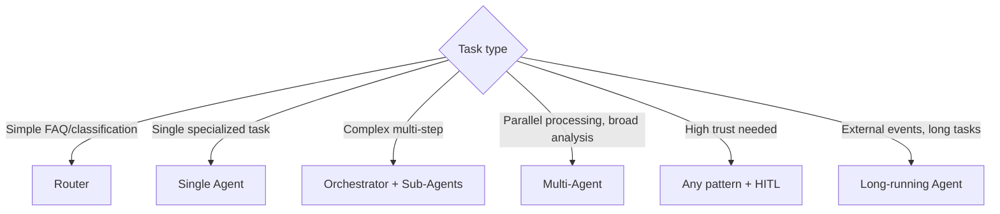

# Agent Architectures

## Overview

How an agent system is structured greatly impacts performance, cost, and reliability. Key architecture patterns: **Orchestrator & Sub-Agents**, **Router**, **Multi-Agent**.

## 1. Single Agent

Simplest form. One LLM handles all decisions and execution:



**Good fit**: Tasks with a clear domain and limited scope.
**Limitations**: Context overload and performance degradation on complex multi-step tasks.

## 2. Orchestrator & Sub-Agents

An upper **Orchestrator** makes strategic decisions and delegates work to specialized **Sub-Agents**:



### LangGraph Implementation Example
```python
from langgraph.graph import StateGraph
from langgraph_supervisor import create_supervisor

# Define specialized Sub-Agents
research_agent = create_react_agent(llm, tools=[tavily_search])
code_agent = create_react_agent(llm, tools=[python_repl])
writer_agent = create_react_agent(llm, tools=[file_write])

# Create Supervisor (Orchestrator)
supervisor = create_supervisor(
    agents={
        "researcher": research_agent,
        "coder": code_agent,
        "writer": writer_agent
    },
    model=llm,
    prompt="Delegate tasks to the appropriate agent to achieve the goal."
)
```

**Advantages**: Specialization → performance↑, efficient context window usage per agent.
**Disadvantages**: Orchestrator becomes bottleneck, communication overhead between Sub-Agents.

## 3. Router

Routes to appropriate specialist agents or pipelines based on input:



### Implementation Example
```python
def route_query(query: str) -> str:
    """Classify query and route"""
    classification_prompt = f"""
    Classify the following query:
    - "faq": frequently asked question
    - "search": requires external search
    - "database": requires internal DB lookup
    - "complex": requires complex analysis
    
    Query: {query}
    Classification:
    """
    category = llm.invoke(classification_prompt).strip()
    
    routes = {
        "faq": faq_handler,
        "search": search_agent,
        "database": db_query_agent,
        "complex": complex_analysis_agent
    }
    return routes.get(category, default_handler)(query)
```

**Advantages**: Simple and fast, low cost.
**Disadvantages**: Routing errors execute the wrong pipeline.

## 4. Multi-Agent (Parallel/Collaborative Agents)

Multiple agents work **in parallel** or **cooperate** with each other:

### Parallel Execution


```python
import asyncio

async def parallel_research(topic: str):
    tasks = [
        market_agent.ainvoke({"task": f"Market analysis: {topic}"}),
        competitor_agent.ainvoke({"task": f"Competitor analysis: {topic}"}),
        financial_agent.ainvoke({"task": f"Financial analysis: {topic}"})
    ]
    results = await asyncio.gather(*tasks)
    return synthesis_agent.invoke({"data": results})
```

### Debate Pattern (Inter-Agent Debate)



## 5. Long-running Agent *(May 2026)*

Agent pattern that runs over minutes to days. Distinguished from traditional short-running patterns (seconds to minutes).



**Good fit:**
- Large codebase refactoring (hours)
- Multi-step compliance review (including external approvals)
- Long-term research tasks (data collection/analysis over multiple days)
- Human-in-the-Loop workflows (waiting for human review)

```python
# Agent Runtime auto-resume pattern (conceptual)
async def long_running_agent(task: str):
    state = await runtime.create_session(task)
    
    # Phase 1: Initial processing
    result = await agent.process(state)
    
    # Wait for external event (webhook/human approval) — agent pauses
    await runtime.wait_for_event(
        session_id=state.id,
        event_type="human_approval",
        timeout_days=7
    )
    # Auto-resume after approval (full context/state restoration)
    
    # Phase 2: Continue after approval
    final_result = await agent.continue_processing(state)
    return final_result
```

**Infrastructure requirements**: Long-running Agents are very complex to implement without Agent Runtime (sub-second cold start, up to 7-day operations, auto-resume). Details → [[en/AI/Engineering/Agent_Engineering/Agent_Deployment|Agent Deployment]]

## Architecture Selection Guide



## Architecture Cost Characteristics

| Architecture | LLM calls | Cost | Speed | Execution time |
|-------------|-----------|------|-------|----------------|
| Single | Low | Low | Fast | Seconds~minutes |
| Router | Low | Low | Fast | Seconds~minutes |
| Orchestrator+Sub | Medium~high | Medium | Medium | Minutes |
| Multi-Agent parallel | High | High | Fast (parallel) | Minutes |
| Multi-Agent sequential | High | High | Slow | Minutes~hours |
| Long-running | Variable | Variable | Async | Hours~days |

## Role in AI Engineering

Architecture selection is the **core architectural decision** in AI system design. Best practice is to start simple (Single Agent) and only scale to Multi-Agent when complexity is truly needed. Complex architectures increase capability but also raise debugging difficulty and cost.

## Related Concepts
[[en/AI/Engineering/Agent_Engineering/Agent_Core_Pillars|Agent Core Pillars]] · [[en/AI/Engineering/Flow_Engineering/Graph_Flow/LangGraph|LangGraph]] · [[en/AI/Engineering/Flow_Engineering/Graph_Flow/Human_in_the_Loop|Human-in-the-Loop]] · [[en/AI/Engineering/Agent_Engineering/Agent_Skills_and_Protocols|Agent Skills & Protocols]]

## Sources
- Anthropic "Building Effective Agents" — [anthropic.com](https://www.anthropic.com/engineering/building-effective-agents)
- LangGraph Multi-Agent docs — [langchain-ai.github.io/langgraph](https://langchain-ai.github.io/langgraph/concepts/multi_agent/)
