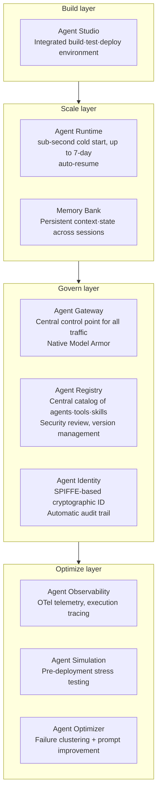

# Agent Core Pillars: Planning, Memory, Tools, Deployment

## Overview

LLM agents go beyond simple LLM calls to become systems that autonomously pursue goals. Lilian Weng (OpenAI) defined three core pillars in her 2023 blog post "LLM Powered Autonomous Agents": **Planning**, **Memory**, and **Tools**. In the May 2026 update, **Deployment** was added as the fourth core component — the runtime/infrastructure layer that gives agents a "body and legs" to operate continuously in production.

## Agent Definition

```
Agent = LLM (brain) + Planning + Memory + Tools + Deployment

Characteristics:
  - Autonomy: decides individual steps on its own
  - Goal-oriented: continues until goal is achieved, not just a single task
  - Adaptability: adjusts plans in response to environmental changes
  - Persistence: operates long-term (minutes to days), infrastructure-level management
```

## Pillar 1: Planning

The agent's ability to decompose complex goals into achievable sub-tasks and determine their order.

### Task Decomposition Techniques
- **CoT (Chain of Thought)**: Step-by-step reasoning
- **ToT (Tree of Thoughts)**: Exploring multiple paths
- **ReAct**: Reasoning + action interleaving

### Subgoal Decomposition
```
Goal: "Write 2024 annual report"
  → Sub-task 1: Collect financial data
  → Sub-task 2: Summarize each business unit's performance
  → Sub-task 3: Year-over-year comparison analysis
  → Sub-task 4: Draft executive commentary
  → Sub-task 5: Review and revision
```

### Plan-and-Execute Pattern
```python
# Step 1: Create plan (Planner)
plan = planner_llm.invoke(f"Create a detailed execution plan for the following goal: {goal}")

# Step 2: Execute plan (Executor)
for step in plan.steps:
    result = executor_agent.invoke(step)
    
# Step 3: Update plan (Replanner)
if result.needs_replan:
    plan = replanner_llm.invoke(remaining_steps + new_context)
```

## Pillar 2: Memory

The mechanism by which agents store information and retrieve it when needed.

### Short-term Memory
Current execution context stored in the LLM's context window:
```
[System prompt] + [Conversation history] + [Tool results]
        ↑ All exist within the current context window
```
- Lost when session ends
- Limited by context window (128K~1M tokens)

### Long-term Memory
Persists across sessions. External storage (Vector DB, DB):
```python
# Store user preferences
memory_store.save({
    "user_id": "user_123",
    "preference": "always respond in English",
    "context": "set on 2024-01-15"
})

# Retrieve in next session
memories = memory_store.search(
    user_id="user_123",
    query="language settings"
)
```

### Memory Type Classification (details → [[en/AI/Engineering/Agent_Engineering/Agent_Memory|Agent Memory]])

| Type | Example | Storage |
|------|---------|---------|
| Episodic | Previous conversation history | Vector DB |
| Semantic | User profile, preferences | DB + Vector |
| Procedural | Successful task patterns | Fine-tuning or prompt |

## Pillar 3: Tools

The interface through which agents interact with the external world. Extends LLM capabilities.

### Tool Categories

| Category | Examples | Function |
|----------|---------|---------|
| **Search** | Tavily, Brave Search | Latest information retrieval |
| **Code execution** | Python REPL, E2B | Calculation, data processing |
| **File I/O** | Read/Write, PDF | Document access |
| **API integration** | REST, GraphQL | External services |
| **Databases** | SQL, NoSQL | Structured data |
| **Communication** | Email, Slack | Message sending |
| **Browser** | Playwright, Selenium | Web automation |

### MCP (Model Context Protocol)
Tool integration standard proposed by Anthropic. Details → [[en/AI/Engineering/Agent_Engineering/Agent_Skills_and_Protocols/MCP|MCP]]

## Pillar 4: Deployment *(Added May 2026)*

The runtime/infrastructure layer for agents to operate reliably in actual production environments. Even agents with excellent Planning, Memory, and Tools cannot function at enterprise level without proper Deployment.

### Gemini Enterprise Agent Platform

Google's agent production infrastructure:



## 4 Pillars in Interaction

```
User goal: "Write a competitive analysis report"

Planning:
  → Decompose: competitor list → collect data per company → comparative analysis → write report

Tools:
  → search("Competitor A 2024 financial results")  [search tool]
  → scrape(competitor_website)  [web tool]
  → python("calculation code")  [code execution tool]

Memory:
  → Accumulate results from previous steps [short-term]
  → Remember report format [long-term]
  → Temporarily store collected data [external memory]

Deployment:
  → Run in Agent Runtime (sub-second cold start)
  → Agent Runtime maintains state for long runs (up to 7 days)
  → Agent Gateway centrally controls traffic and security
  → Agent Identity creates audit trail for all actions

Result: Completed report (enterprise-level security and operations guaranteed)
```

## Role in AI Engineering

The 4 Core Pillars are the **conceptual framework** for agent system design. When an agent isn't working, they serve as the diagnostic criteria: "Is Planning insufficient, is Memory lacking, are there no appropriate Tools, or is the Deployment infrastructure adequate?" Deployment in particular is the key layer that separates local prototypes from enterprise production.

## Related Concepts
[[en/AI/Engineering/Agent_Engineering/Agent_Architectures|Agent Architectures]] · [[en/AI/Engineering/Agent_Engineering/Planning_and_Reflection|Planning & Reflection]] · [[en/AI/Engineering/Agent_Engineering/Agent_Memory|Agent Memory]] · [[en/AI/Engineering/Agent_Engineering/Agent_Skills_and_Protocols|Agent Skills & Protocols]] · [[en/AI/Engineering/Agent_Engineering/Agent_Deployment|Agent Deployment]]

## Sources
- Weng, L. (2023) "LLM Powered Autonomous Agents" — [lilianweng.github.io](https://lilianweng.github.io/posts/2023-06-23-agent/)
