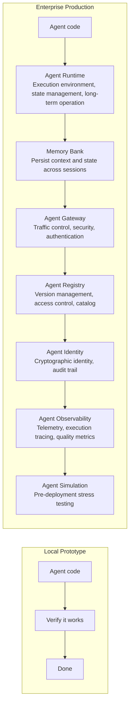
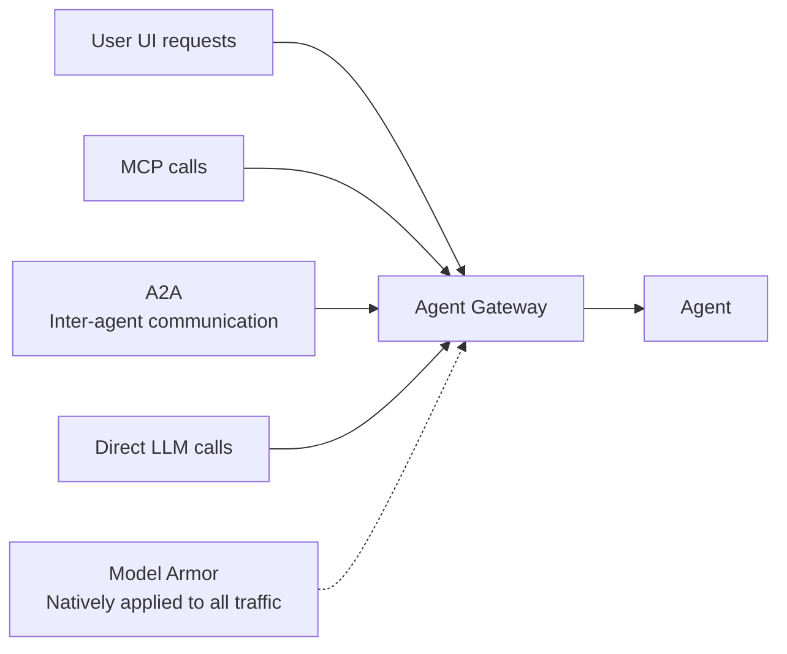
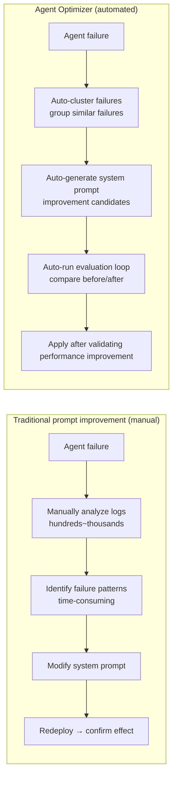

# Agent Deployment

## Overview

**Agent Deployment** is the 4th core component of agents — the "body and legs." If Planning, Memory, and Tools are the agent's brain, Deployment is the runtime and infrastructure layer that makes that brain actually operate and persist in production. Added as an essential element of agent design in the May 2026 update.



## Agent Runtime

Core execution environment for agents. Agent-specific design distinct from traditional serverless (Lambda, etc.):

### Key Characteristics

```
Sub-second cold start:
  Traditional container: seconds~tens of seconds to initialize
  Agent Runtime: nearly instant — no user experience degradation

Up to 7-day multi-day operation:
  Traditional serverless: minutes~tens of minutes timeout
  Agent Runtime: hours~up to 7 days for long-running tasks (managed)

Auto-resume:
  Suspend agent while waiting for external events (webhooks, human approval, API responses)
  Fully restore context and state automatically when event arrives
  Async waiting without wasting resources
```

### Implementation Pattern

```python
from google.adk.runtime import AgentRuntime

runtime = AgentRuntime()

async def document_review_agent(documents: list[str]):
    """Agent reviewing documents over several days and awaiting external expert approval"""
    
    session = await runtime.create_session(
        agent_id="doc-review-agent-v2",
        max_duration_days=3
    )
    
    # Phase 1: Document analysis (minutes)
    analysis = await session.run(analyze_documents, documents)
    
    # Request external expert review then wait — agent suspends
    # (Runtime saves state, releases resources)
    expert_review = await session.wait_for_webhook(
        webhook_url="/api/expert-review",
        timeout_hours=48
    )
    
    # Auto-resume after expert response (state fully restored)
    # Phase 2: Incorporate feedback + write final report
    final_report = await session.run(
        compile_report,
        analysis=analysis,
        expert_feedback=expert_review
    )
    
    return final_report
```

### Comparison vs Existing Infrastructure

| Characteristic | Cloud Functions/Lambda | GKE/Cloud Run | Agent Runtime |
|----------------|----------------------|---------------|---------------|
| Cold start | 1~10 seconds | Several seconds | Sub-second |
| Max execution time | 15 min~1 hour | Unlimited (self-managed) | 7 days (managed) |
| State management | Implement yourself | Implement yourself | Built-in |
| Auto-resume | Implement yourself | Implement yourself | Built-in |
| Agent-specific | ✗ | ✗ | ✓ |

## Memory Bank

Storage that persists agent context and state across session boundaries.

```python
from google.adk.memory import MemoryBank

memory_bank = MemoryBank(agent_id="customer-support-agent")

class CustomerSupportAgent:
    async def handle_session(self, user_id: str, query: str):
        # Automatically load previous session context
        context = await memory_bank.load_context(
            user_id=user_id,
            keys=["user_profile", "open_tickets", "interaction_history"]
        )
        
        # Generate agent response (referencing full history)
        response = await self.agent.run(query=query, context=context)
        
        # Automatically save context after session ends
        await memory_bank.save_context(
            user_id=user_id,
            updates={
                "last_interaction": datetime.now().isoformat(),
                "resolved_count": context["resolved_count"] + 1
            }
        )
        return response
```

**Memory Bank vs direct Vector DB implementation**:
- Memory Bank: Native integration with Agent Runtime, Agent Identity audit trail automatic, no separate setup
- Direct Vector DB: Platform-independent, finer-grained control, higher management burden

## Agent Gateway

Single control entry point for all agent traffic.



**Agent Gateway roles:**
- Authentication/authorization integration (resolves OAuth, IAM conflicts)
- Model Armor natively applied (no separate config)
- Traffic routing (agent versions, A/B testing)
- Rate limiting
- Audit logging (records all traffic)

## Agent Registry

Central catalog of agents, tools, and skills in the organization.

```python
from google.adk.registry import AgentRegistry

registry = AgentRegistry()

# Register agent (after security review)
await registry.register(
    agent_id="invoice-processor-v3",
    description="Automate invoice processing and approval",
    version="3.0.1",
    owner_team="finance-automation",
    security_review_status="approved",
    allowed_teams=["finance", "accounting"],
    tools=["read_invoice", "validate_amount", "submit_for_approval"],
    tags=["finance", "automation", "approved"]
)

# Query available agents for a team
available_agents = await registry.list(
    team="finance",
    tags=["approved"],
    status="active"
)
```

**Agent Registry value**:
- Security team pre-reviews agents before catalog registration → blocks unreviewed agent execution
- Version control → rollback and gradual rollout possible
- Team-based access control → sensitive agents only accessible to authorized teams

## Agent Identity

System that gives agents a cryptographically verifiable identity.

```
Before (identity ambiguous):
  Agent accesses DB → "Who accessed it?" unknown
  Agent calls API → shared service account makes accountability tracking impossible

Agent Identity (SPIFFE-based):
  Cryptographic ID automatically issued when agent starts
  (3rd principal type distinct from Service Account and User OAuth)

  ID attached to every action:
    "invoice-processor-v3 (ID: spiffe://company.com/agent/inv-proc-v3)
     read invoice #4521 at 2026-06-17T09:23:11Z"
  
  Audit trail automatically generated:
    Who (which agent) → What → When → With what result
    Used for compliance audits
```

## Agent Simulation

Pre-deployment stress testing tool that validates agents with synthetic traffic before release.

```
Agent Simulation flow:

1. Generate synthetic interactions
   Automatically generate diverse scenarios without real user data:
   - Normal cases (majority)
   - Edge cases (boundary conditions)
   - Adversarial inputs (simulate malicious users)
   - Load testing (thousands of concurrent requests)

2. Persona-based evaluation
   Test agent responses with diverse user types:
   - "Impatient user": short, incomplete requests
   - "Non-technical user": ambiguous phrasing
   - "Malicious user": policy violation attempts

3. Critic Agent automatic evaluation
   Critic Agent evaluates execution trace of each simulation run:
   - Goal achievement
   - Execution path efficiency
   - Policy compliance
   - Reasoning Drift detection

4. Result analysis
   Cluster failure patterns → prioritize core vulnerabilities
   → Fix before deployment then re-validate
```

```python
from google.adk.simulation import AgentSimulation

simulation = AgentSimulation(
    agent=my_agent,
    critic_agent=critic_llm
)

results = await simulation.run(
    num_scenarios=1000,
    personas=["normal", "impatient", "technical", "adversarial"],
    include_edge_cases=True,
    stress_test_concurrency=100
)

print(f"Overall success rate: {results.success_rate:.1%}")
print(f"Policy violations detected: {results.policy_violations}")
print(f"Reasoning Drift cases: {results.drift_cases}")
```

## Agent Optimizer

Automated tool that analyzes failure patterns from production and improves system prompts. Core component of the **Optimize layer** in Gemini Enterprise Agent Platform.



**Key features**:
- **Auto-cluster Failures**: Automatically collect failure cases from production traces, group similar failures to identify patterns, classify "why it fails" for each cluster
- **Automated Prompt Suggestion**: Auto-generate system instruction or tool description modifications based on cluster analysis; similar to DSPy/MIPROv2 meta-optimization but agent-specific
- **Iterative Optimization**: Automate the loop of apply improvement → rerun evaluation → measure performance → re-improve

## Deployment Checklist

```
Pre-deployment:
  □ Run Agent Simulation — success rate threshold met?
  □ Agent Registry registration — security review complete?
  □ Confirm Agent Identity issuance
  □ Set Agent Gateway routing rules
  □ Memory Bank schema migration (if needed)

Post-deployment:
  □ Check Agent Observability dashboard (operational)
  □ Establish quality dashboard baseline
  □ Set alert thresholds (error rate, latency, quality degradation)
  □ Intensive monitoring for first 24 hours

Continuous improvement loop:
  □ Run Agent Optimizer periodically — review failure clustering + prompt improvement candidates
  □ Re-validate with Agent Simulation before deploying accepted improvements
```

## Role in AI Engineering

Agent Deployment is the **layer that elevates agents from prototype to enterprise system**. No matter how excellent an agent's Planning, Memory, and Tools, long-term operation, security, auditing, and scale expansion are impossible without proper deployment infrastructure. Especially in regulated industries (finance, healthcare, legal), the combination of Agent Identity + Agent Gateway + Agent Registry is becoming a prerequisite for AI automation adoption.

## Related Concepts
[[en/AI/Engineering/Agent_Engineering/Agent_Core_Pillars|Agent Core Pillars]] · [[en/AI/Engineering/Agent_Engineering/Agent_Architectures|Agent Architectures]] · [[en/AI/Engineering/Agent_Engineering/Agent_Memory|Agent Memory]] · [[en/AI/Engineering/Harness_Engineering/Guardrail_Engineering|Guardrail Engineering]] · [[en/AI/Engineering/Harness_Engineering/Observability_and_Tracing|Observability & Tracing]] · [[en/AI/Engineering/Agent_Engineering/AgentOps|AgentOps]]

## Sources
- Google "Introduction to Agents" (originally published Nov 2025, updated May 2026)
- Google "Prototype to Production" (originally published Nov 2025, updated May 2026)
- Google Cloud "Optimize your agents" — [docs.cloud.google.com](https://docs.cloud.google.com/gemini-enterprise-agent-platform/optimize)
- Google Cloud Blog "Introducing Gemini Enterprise Agent Platform" — [cloud.google.com](https://cloud.google.com/blog/products/ai-machine-learning/introducing-gemini-enterprise-agent-platform)
