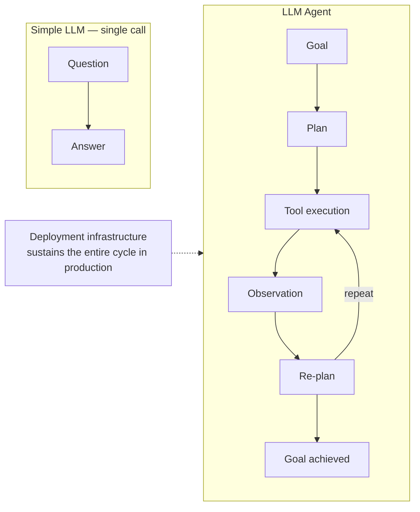
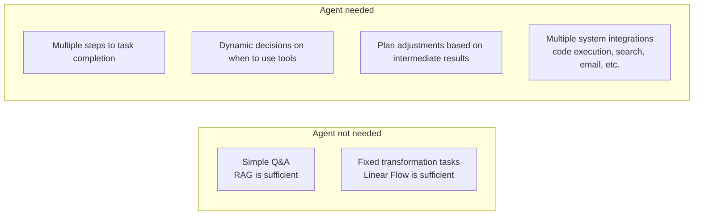
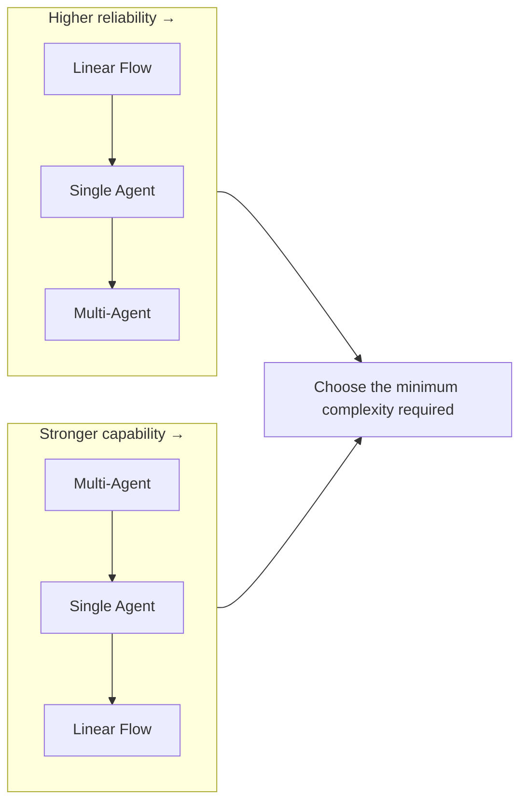

# Agent Engineering

## Overview

**Agent Engineering** is the discipline of designing LLMs not as mere text generators, but as **systems that autonomously pursue goals**. Per Lilian Weng's (OpenAI, 2023) definition, agents rest on three pillars — Planning, Memory, and Tools — with **Deployment** added as the fourth core element in the May 2026 update.

## Sub-documents

| Document | Content |
|----------|---------|
| [[en/AI/Engineering/Agent_Engineering/Agent_Core_Pillars\|Agent Core Pillars]] | Planning/Memory/Tools/**Deployment** 4 pillars (Weng 2023 + May 2026) |
| [[en/AI/Engineering/Agent_Engineering/Agent_Architectures\|Agent Architectures]] | Single/Orchestrator/Router/Multi-Agent/**Long-running** |
| [[en/AI/Engineering/Agent_Engineering/Planning_and_Reflection\|Planning & Reflection]] | Plan-and-Solve, Reflexion (NeurIPS 2023) |
| [[en/AI/Engineering/Agent_Engineering/Agent_Memory\|Agent Memory]] | Short/Long-term Memory, Memory ETL, Agent Runtime/Memory Bank |
| [[en/AI/Engineering/Agent_Engineering/Agent_Skills_and_Protocols\|Agent Skills & Protocols]] | Anthropic Skills, Google A2A Protocol |
| [[en/AI/Engineering/Agent_Engineering/Agent_Deployment\|Agent Deployment]] | Agent Runtime, Memory Bank, Gateway, Registry, Identity, Simulation *(May 2026)* |
| [[en/AI/Engineering/Agent_Engineering/AgentOps\|AgentOps]] | 3 Pillars methodology, agentops.ai platform, tool comparison |
| [[en/AI/Engineering/Agent_Engineering/Anthropic_Workflow_Patterns\|Anthropic Workflow Patterns]] | 5 workflow patterns (chaining/routing/parallelization/orchestrator-workers/evaluator-optimizer) |
| [[en/AI/Engineering/Agent_Engineering/Agent_Frameworks\|Agent Frameworks]] | AutoGen v0.4, CrewAI, OpenAI Agents SDK, Claude Agent SDK, Agno/Mastra |
| [[en/AI/Engineering/Agent_Engineering/Multi_Agent_Coordination\|Multi-Agent Coordination]] | Coordination patterns, communication protocols, failure modes (MASFT/MAST/Groupthink) |
| [[en/AI/Engineering/Agent_Engineering/Computer_Use_and_Voice_Agents\|Computer Use & Voice Agents]] | Claude/OpenAI CUA/Gemini computer use, Pipecat/LiveKit voice agents |
| [[en/AI/Engineering/Agent_Engineering/Autonomous_Systems\|Autonomous Systems]] | METR Time Horizon, STaR/AlphaEvolve/Darwin Gödel Machine, kill switch/HITL |
| [[en/AI/Engineering/Agent_Engineering/Eval_Driven_Development_and_Agent_Workbench\|Eval-Driven Development & Agent Workbench]] | 3-layer evaluation, Agent Workbench 7 surfaces |

## When to Use Agents

## Complexity vs Reliability Tradeoff

## Role in AI Engineering

Agent Engineering is the **frontier of AI automation**. It builds systems that autonomously handle repetitive knowledge work (research, code writing, data analysis), serving as the "brain" of the AI Engineering stack.

## Related Concepts
[[en/AI/Engineering/Flow_Engineering/Flow_Engineering|Flow Engineering]] · [[en/AI/Engineering/Harness_Engineering/Guardrail_Engineering|Guardrail Engineering]] · [[en/AI/Engineering/Agent_Engineering/Agent_Deployment|Agent Deployment]]
