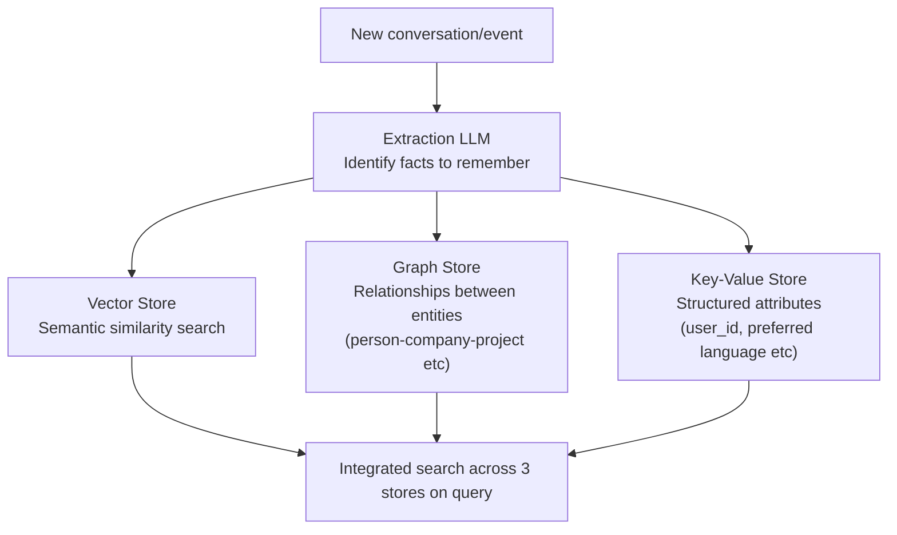
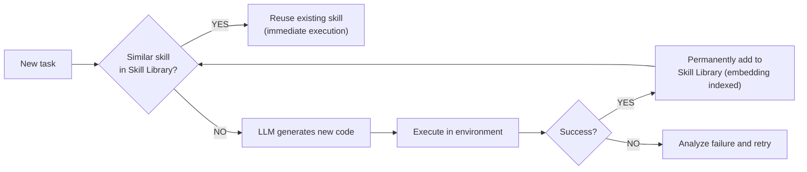
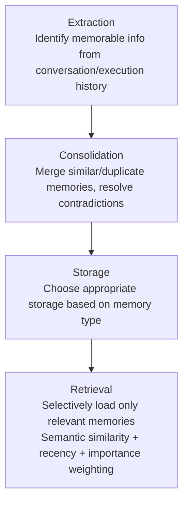

# Agent Memory

## Overview

Agent memory refers to all mechanisms by which agents store information and retrieve it for later use. Like human memory types, it's divided into **Short-term** and **Long-term** memory. A good memory system enables agents to make better decisions based on past experience.

## Short-term Memory

### Conversation History
Current session conversation content stored in the LLM's context window:

```python
from langchain_core.messages import HumanMessage, AIMessage

# Conversation history accumulates
messages = [
    HumanMessage(content="Hi! My name is Alice"),
    AIMessage(content="Hello, Alice!"),
    HumanMessage(content="Do you remember my name?"),
    # LLM references this entire history and answers "Alice"
]
```

### In-Context Working Memory
Stores intermediate results during complex task execution:
```python
class AgentState(TypedDict):
    task: str
    plan: list[str]
    completed_steps: list[dict]   # results of completed steps
    tool_outputs: list            # tool outputs
    current_hypothesis: str       # currently being reasoned hypothesis
```

### Short-term Memory Limitations
- Old content must be deleted when context window is exceeded
- Completely lost when session ends
- Solution: Conversation summarization + transfer to Long-term

## Long-term Memory

External storage-based memory that persists across sessions.

### Vector-based Memory
Retrieve related memories via semantic search:

```python
class VectorMemory:
    def __init__(self):
        self.store = Chroma(embedding_function=OpenAIEmbeddings())
    
    def save(self, content: str, metadata: dict = {}):
        self.store.add_texts(
            texts=[content],
            metadatas=[{**metadata, "timestamp": datetime.now().isoformat()}]
        )
    
    def recall(self, query: str, k: int = 5) -> list:
        return self.store.similarity_search(query, k=k)

memory = VectorMemory()
memory.save("User Alice prefers Python and likes concise code style")

# In next session
relevant_memories = memory.recall("code style preference")
```

### Episodic Memory
Records of past task executions:

```python
# Store successful task patterns
episodic_memory.save({
    "task_type": "code debugging",
    "problem": "IndexError in list comprehension",
    "solution_steps": ["Check index range", "Validate with len()", "Add try-except"],
    "success": True,
    "time_taken": 120
})

# Retrieve for similar tasks
similar_cases = episodic_memory.search("array index error")
```

## Memory as a Tool Pattern

Register memory as one of the agent's tools:

```python
@tool
def remember(content: str) -> str:
    """Store important information in long-term memory"""
    memory_store.save(content)
    return f"Memory saved: {content[:50]}..."

@tool
def recall(query: str) -> str:
    """Search for related memories"""
    memories = memory_store.search(query)
    return "\n".join([m.page_content for m in memories])

agent = create_react_agent(llm, tools=[remember, recall, ...])
```

## MemGPT / Virtual Context Management

Architecture proposed by Packer et al. (2023, MemGPT paper, later renamed Letta). Directly applies the OS **Virtual Memory** concept to LLMs — treating the limited context window as physical memory (RAM) and external storage as disk.

```
OS virtual memory analogy:
  RAM (limited, fast)        ↔ Main Context (LLM context window)
  Disk (almost unlimited)    ↔ External Context (external DB)
  Page Fault (load on need)  ↔ Explicit memory fetch/store via function calls

MemGPT Main Context structure:
  ┌─────────────────────────────┐
  │ System Instructions (fixed) │
  │ Working Context (key summary)│ ← LLM can self-edit
  │ FIFO Queue (recent dialogue) │ ← When full, summarize oldest then evict
  └─────────────────────────────┘
```

Core idea: **the LLM itself calls functions to manage its own memory** — using tools like `core_memory_append()` and `archival_memory_search()` to actively decide what to keep and what to evict.

## Sleep-Time Compute

Concept proposed by the Letta team (2025). Agents use **idle time** (waiting for user requests) to organize and restructure memory in the background — similar to how humans consolidate memories during sleep.

```
Traditional approach: search and organize all memories in real-time on every request → increased latency

Sleep-time Compute:
  During idle time, proactively:
    - Summarize and structure conversation logs
    - Detect and resolve contradictory memories
    - Pre-compute and cache answers for frequent queries
  → At actual request time, only pre-organized memory is queried (reduced latency)
```

## Mem0 — Hybrid Memory (Vector + Graph + KV)

Mem0 (2024) addresses the difficulty of capturing relational information (who is in what relationship with whom) using vector search alone, by combining three stores.



```python
from mem0 import Memory

m = Memory()
m.add(
    "Alice works at Acme Corp and is on the same team as Bob. She prefers Python.",
    user_id="alice"
)
# Internally:
#   Vector: embed "Python preference" and store
#   Graph: (Alice)-[works_at]->(Acme Corp), (Alice)-[colleague]->(Bob)
#   KV: {"user_id": "alice", "preferred_language": "python"}

# Graph relationship-based query also possible
related = m.search("Who are Alice's colleagues?", user_id="alice")
```

## Skill Libraries and Lifelong Learning — Voyager

Lifelong learning agent proposed by Wang et al. (2023) in a Minecraft environment. Core idea: agents **store successful actions as reusable code skills in a library**, and for similar problems later, search the library and reuse rather than reasoning from scratch.



## Memory ETL Pipeline

Memory needs processing stages like an **ETL pipeline**, not just storage and retrieval:



### Provenance (Source Tracking)

Managing memory reliability and validity:

```python
class MemoryWithProvenance:
    content: str
    source: str          # from which conversation/task it was extracted
    created_at: datetime
    confidence: float    # extraction confidence (0.0~1.0)
    last_verified: datetime  # when last confirmed
    
    def is_stale(self, days_threshold: int = 30) -> bool:
        return (datetime.now() - self.last_verified).days > days_threshold
```

## Agent Runtime + Memory Bank (Production) *(May 2026)*

Memory infrastructure for enterprise production:

```
Traditional approach (build yourself):
  Agent → Vector DB → Manual session management
  Drawbacks: Complex session restoration, slow cold start, difficult long-term operation

Gemini Enterprise Agent Platform:

  Agent Runtime:
    - sub-second cold start: new instances start almost instantly
    - Up to 7-day multi-day operations: no context loss for long tasks
    - auto-resume: exactly resumes from previous state after webhook/human approval
    
  Memory Bank:
    - Persistent context storage across session boundaries
    - Native integration with Agent Runtime (no separate Vector DB needed)
    - Linked with Agent Identity for memory access audit trail
```

## Role in AI Engineering

Agent Memory transforms agents from "disposable tools" to "continuously learning assistants." It's the foundation for long-term relationships with users, organizational knowledge accumulation, and preventing repeated mistakes. In production, memory quality must be managed with a Memory ETL pipeline, and session persistence and long-term operations must be guaranteed with Agent Runtime + Memory Bank.

## Related Concepts
[[en/AI/Engineering/Agent_Engineering/Agent_Core_Pillars|Agent Core Pillars]] · [[en/AI/Engineering/Context_Engineering/Memory_and_Semantic_Cache|Memory & Semantic Cache]] · [[en/AI/Engineering/Context_Engineering/Context_Engineering|Context Engineering]] · [[en/AI/Engineering/Agent_Engineering/Agent_Deployment|Agent Deployment]]

## Sources
- Weng, L. (2023) "LLM Powered Autonomous Agents" — [lilianweng.github.io](https://lilianweng.github.io/posts/2023-06-23-agent/)
- Packer et al. (2023) "MemGPT: Towards LLMs as Operating Systems" — [arXiv:2310.08560](https://arxiv.org/abs/2310.08560)
- Letta (formerly MemGPT) "Sleep-time Compute" — [letta.com/blog](https://www.letta.com/blog/sleep-time-compute)
- Mem0 "Building Production-Ready AI Agents with Scalable Long-Term Memory" — [arXiv:2504.19413](https://arxiv.org/abs/2504.19413) · [mem0.ai](https://mem0.ai)
- Wang et al. (2023) "Voyager: An Open-Ended Embodied Agent with Large Language Models" — [arXiv:2305.16291](https://arxiv.org/abs/2305.16291)
