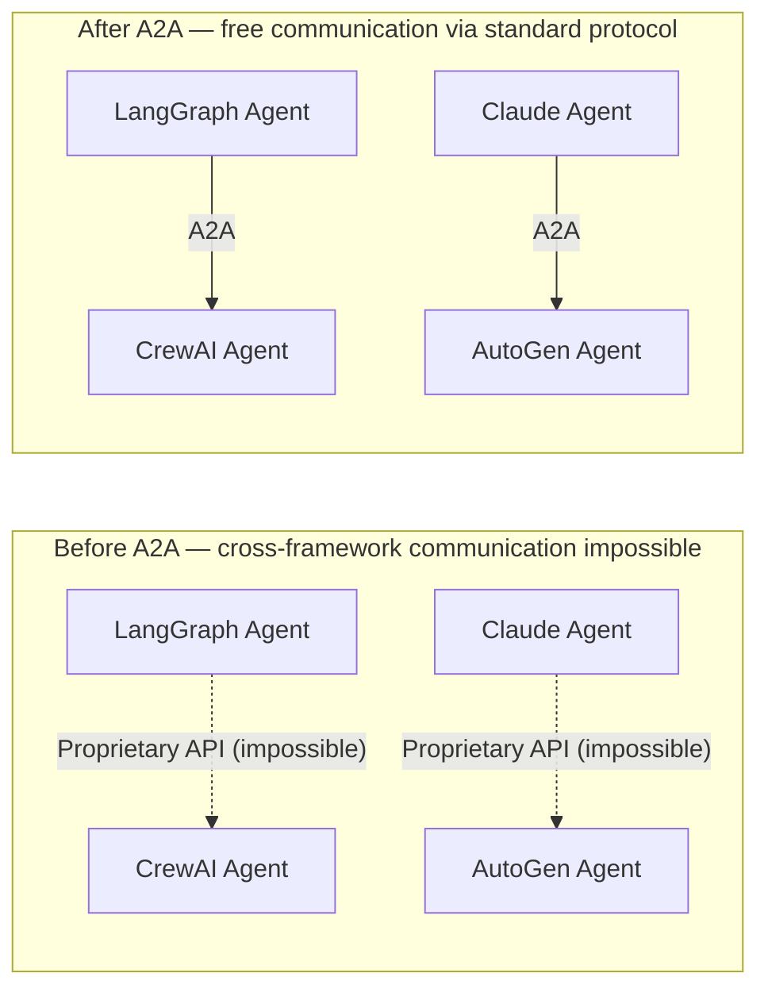
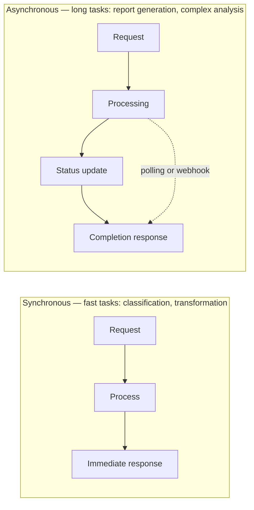
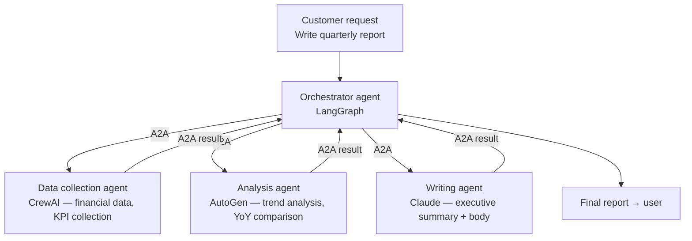

# A2A Protocol (Agent-to-Agent Protocol)

## Overview

**Agent2Agent (A2A) Protocol** is an open standard announced by Google at Google Cloud Next in April 2025 that enables **AI agents from different platforms and frameworks to communicate and collaborate in a standardized way**. It targets interoperability of the agent ecosystem.



## History and Status

- **April 2025**: Announced at Google Cloud Next. Google-led; Anthropic, AWS, Microsoft, SAP, and others support it
- **June 2025**: Donated to Linux Foundation, achieving neutral governance. Apache 2.0 license open source
- **Late 2025**: v1.0 stable spec release — multi-protocol support, enterprise multi-tenancy, enhanced security
- **April 2026**: 150+ organizations supporting, integrated into Google/Microsoft/AWS platforms, multiple production deployments

## Core Concepts

### Agent Card

JSON document where an agent declares its capabilities — acts as a "business card":

```json
{
    "agent_id": "sentiment-analyzer-v2",
    "name": "Sentiment Analysis Specialist Agent",
    "version": "2.1.0",
    "capabilities": [
        "text_classification",
        "sentiment_analysis",
        "multilingual_support"
    ],
    "supported_languages": ["ko", "en", "ja"],
    "input_formats": ["text/plain", "application/json"],
    "output_formats": ["application/json"],
    "pricing": {"per_request_usd": 0.001},
    "endpoint": "https://api.example.com/agent/sentiment",
    "auth": {"type": "bearer_token"}
}
```

### Task Request/Response

```json
// Request (orchestrator → sub-agent)
{
    "from": "agent://orchestrator.company.com",
    "to": "agent://sentiment.example.com",
    "message_id": "msg_abc123",
    "type": "task_request",
    "payload": {
        "task": "analyze_customer_sentiment",
        "input": {
            "reviews": ["Love it!", "Disappointed with slow delivery."],
            "language": "en"
        },
        "expected_output_schema": "sentiment_report_v1"
    },
    "auth": {"token": "Bearer eyJ..."}
}

// Response (sub-agent → orchestrator)
{
    "message_id": "resp_xyz789",
    "in_reply_to": "msg_abc123",
    "status": "completed",
    "result": {
        "sentiments": [
            {"text": "Love it!", "score": 0.95, "label": "positive"},
            {"text": "Disappointed with slow delivery.", "score": 0.12, "label": "negative"}
        ],
        "average_score": 0.535
    }
}
```

## Execution Modes



## A2A Use Case Scenario



## Relationship and Differences with MCP

| | MCP | A2A |
|--|-----|-----|
| **Target** | LLM ↔ tools/services (stateless) | Agent ↔ Agent (autonomous) |
| **Communication direction** | Unidirectional calls | Bidirectional collaboration |
| **State** | Stateless | Stateful (supports long-running tasks) |
| **Message nature** | "Execute this function" | "Achieve this complex goal" |
| **Announced by** | Anthropic (November 2024) | Google (April 2025) |
| **Governance** | Linux Foundation (December 2025~) | Linux Foundation (June 2025~) |

**Auto shop analogy**:
- Shop Manager (A2A) delegates diagnosis task to Mechanic (A2A)
- Mechanic calls diagnostic tools via MCP (scanner, DB queries, etc.)
- → MCP and A2A are **complementary, not competing**

Details → [[en/AI/Engineering/Agent_Engineering/Agent_Skills_and_Protocols/MCP|MCP]]

## Role in AI Engineering

A2A is the **interoperability layer for the agent ecosystem**. As multi-agent architectures where multiple specialized agents collaborate become more common beyond single-agent systems, agents remain isolated silos without A2A. If MCP connects agents to tools, A2A connects agents to agents — enabling **true agent networks**.

## Related Concepts
[[en/AI/Engineering/Agent_Engineering/Agent_Skills_and_Protocols/MCP|MCP]] · [[en/AI/Engineering/Agent_Engineering/Agent_Skills_and_Protocols|Agent Skills & Protocols]] · [[en/AI/Engineering/Agent_Engineering/Agent_Architectures|Agent Architectures]] · [[en/AI/Engineering/Flow_Engineering/Graph_Flow/Human_in_the_Loop|Human-in-the-Loop]]

## Sources
- Google Developers Blog (2025) "Announcing the Agent2Agent Protocol (A2A)" — [developers.googleblog.com](https://developers.googleblog.com/en/a2a-a2a-new-era-of-agent-interoperability/)
- A2A Protocol official spec — [a2a-protocol.org](https://a2a-protocol.org/latest/specification/)
- A2A GitHub — [github.com/a2aproject/A2A](https://github.com/a2aproject/A2A)
- Linux Foundation (2026) "A2A Protocol Surpasses 150 Organizations" — [linuxfoundation.org](https://www.linuxfoundation.org/press/a2a-protocol-surpasses-150-organizations-lands-in-major-cloud-platforms-and-sees-enterprise-production-use-in-first-year)
