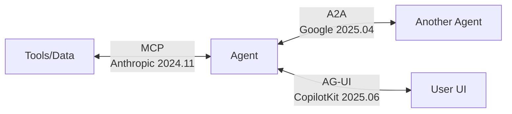
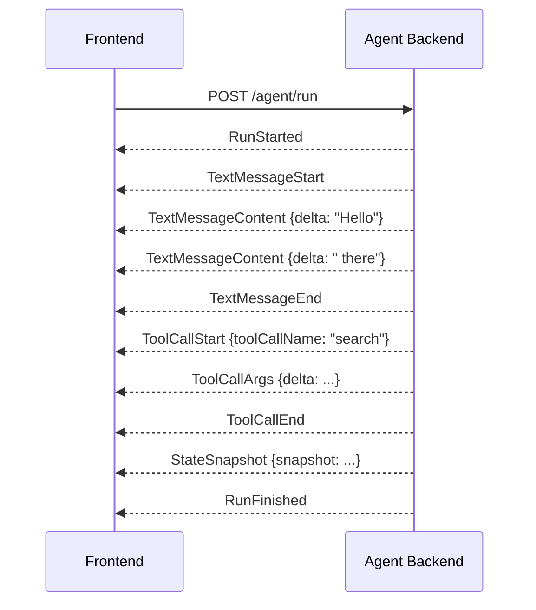

# AG-UI (Agent-User Interaction Protocol)

## Overview

**AG-UI (Agent–User Interaction Protocol)** is a lightweight, event-based protocol open-sourced by CopilotKit in June 2025. It standardizes the universal bidirectional connection between agent backends and user-facing frontends — created to solve "the last-mile problem of the agent ecosystem."



### Background

Agent-UI communication had long been implemented without standards — each team built custom WebSocket formats, JSON hacks, polling APIs. This meant:
- Writing individual integration code for each agent interface
- UI must also be modified when swapping agents
- Difficult debugging, logging, and reproduction

CopilotKit announced this open standard based on experience from early partnerships with LangGraph and CrewAI.

## Core Concepts

### Streaming Agent State and Events to Frontend

AG-UI's core model is simple. Frontend sends an HTTP POST request to the agent, and the agent returns a **typed JSON event stream** via SSE (Server-Sent Events) during execution.



Frontend updates the UI based on event type — text chunks display immediately in the chat window, tool calls show progress indicators, state changes update tables/widgets.

### Bidirectionality

AG-UI is not a one-way agent→UI streaming protocol — it's **bidirectional**. Users can in real-time while the agent is executing:
- Cancel operations
- Steer direction (Agent Steering)
- Pause for approval/modification (Human-in-the-Loop Interrupts)

## Event Type System

AG-UI defines 20+ standard event types organized into 7 categories:

### 1. Lifecycle Events

Tracks the start, progress, and end of agent execution.

| Event | Description |
|-------|-------------|
| `RunStarted` | Agent execution starts. Includes `threadId`, `runId` |
| `RunFinished` | Execution completes normally. `outcome: {type: "success"}` or `{type: "interrupt"}` |
| `RunError` | Execution ends with error. Includes `message`, `code` |
| `StepStarted` | Sub-step (node, function) starts |
| `StepFinished` | Sub-step completes |

### 2. Text Message Events

Streams text generated by the LLM.

```
TextMessageStart → TextMessageContent → ... → TextMessageEnd
                   (delta: "Hello")    (delta: " there")
```

| Event | Description |
|-------|-------------|
| `TextMessageStart` | Message starts. Includes `messageId`, `role` |
| `TextMessageContent` | Text chunk. Sequential delivery via `delta` field |
| `TextMessageEnd` | Message ends |
| `TextMessageChunk` | Convenience event that auto-expands Start→Content→End |

### 3. Tool Call Events

Streams when the agent calls a tool (API, function, etc.).

| Event | Description |
|-------|-------------|
| `ToolCallStart` | Tool call starts. Includes `toolCallId`, `toolCallName` |
| `ToolCallArgs` | Argument chunk streaming. JSON fragments via `delta` |
| `ToolCallEnd` | Tool call completes |
| `ToolCallResult` | Tool execution result returned |

### 4. State Management Events

Synchronizes agent internal state with the frontend. Uses **Snapshot-Delta pattern**:

```
StateSnapshot (full state)
  → StateDelta (RFC 6902 JSON Patch — only changes)
  → StateDelta
  → StateSnapshot (re-sync)
```

| Event | Description |
|-------|-------------|
| `StateSnapshot` | Full state snapshot |
| `StateDelta` | Incremental update in RFC 6902 JSON Patch format |
| `MessagesSnapshot` | Full conversation message history |

### 5. Activity Events

Delivers structured ongoing agent activities (planning, searching, etc.).

### 6. Reasoning Events

Displays LLM's Chain-of-Thought reasoning process to the UI while protecting privacy.

| Event | Description |
|-------|-------------|
| `ReasoningStart` / `ReasoningEnd` | Reasoning context boundaries |
| `ReasoningMessageContent` | Reasoning text chunk (summary to show user) |
| `ReasoningEncryptedValue` | Encrypted Chain-of-Thought (client stores and forwards as opaque) |

### 7. Special Events

| Event | Description |
|-------|-------------|
| `Raw` | Pass-through wrapping events from external systems |
| `Custom` | App-specific extension events not defined by the protocol |

## Transport Layer

AG-UI is **intentionally neutral** on transport layer:

```
Default recommended:  HTTP + SSE (Server-Sent Events)
  - Passes through standard infrastructure (firewalls, proxies, CDN)
  - Optimal for unidirectional streaming

Alternative supported:  WebSocket
  - Lower overhead, when both server→client + client→server needed

Flexible middleware layer:
  - Supports loose event format matching
  - Converts existing event formats from various agent frameworks to AG-UI
```

## Frontend Integration

### CopilotKit SDK (React)

AG-UI's 1st-party reference client. Subscribe to agent state simply with React hooks:

```typescript
import { CopilotKit, useCoAgent } from "@copilotkit/react-core";
import { CopilotChat } from "@copilotkit/react-ui";

// Shared state with agent
const { state, setState } = useCoAgent({
  name: "research_agent",
  initialState: { query: "", results: [] }
});

// Handle tool execution on frontend
useCopilotAction({
  name: "update_chart",
  handler: async ({ data }) => {
    setChartData(data);  // When agent calls the tool, handle in UI
  }
});
```

### Custom Client Direct Implementation

```typescript
import { AbstractAgentClient, EventType } from "@ag-ui/client";

class MyAgentClient extends AbstractAgentClient {
  protected async *fetchResponse(input: RunAgentInput) {
    const response = await fetch("/agent", {
      method: "POST",
      body: JSON.stringify(input),
    });
    yield* parseSSEStream(response.body);
  }
}
```

## Backend Implementation: Python SDK

```python
from ag_ui.core import (
    EventType, RunStartedEvent, TextMessageStartEvent,
    TextMessageContentEvent, TextMessageEndEvent, RunFinishedEvent
)
from ag_ui.encoder import EventEncoder

async def agent_endpoint(input: RunAgentInput):
    encoder = EventEncoder()
    
    async def event_generator():
        yield encoder.encode(RunStartedEvent(
            type=EventType.RUN_STARTED,
            thread_id=input.thread_id,
            run_id=run_id
        ))
        
        msg_id = str(uuid4())
        yield encoder.encode(TextMessageStartEvent(
            type=EventType.TEXT_MESSAGE_START,
            message_id=msg_id, role="assistant"
        ))
        
        async for chunk in llm.stream(input.messages):
            yield encoder.encode(TextMessageContentEvent(
                type=EventType.TEXT_MESSAGE_CONTENT,
                message_id=msg_id, delta=chunk.text
            ))
        
        yield encoder.encode(TextMessageEndEvent(
            type=EventType.TEXT_MESSAGE_END, message_id=msg_id
        ))
        yield encoder.encode(RunFinishedEvent(
            type=EventType.RUN_FINISHED, thread_id=input.thread_id
        ))
    
    return EventSourceResponse(event_generator())
```

## AG-UI vs MCP vs A2A vs A2UI Comparison

| | **AG-UI** | **MCP** | **A2A** | **A2UI** |
|--|-----------|---------|---------|---------|
| **Target** | Agent ↔ User UI | LLM ↔ tools/services | Agent ↔ Agent | Agent → UI component generation |
| **Announced by** | CopilotKit | Anthropic | Google | Google |
| **When** | June 2025 | November 2024 | April 2025 | 2026 |
| **Direction** | Bidirectional (agent↔user) | Unidirectional calls | Bidirectional collaboration | Unidirectional streaming |
| **Core data** | Event stream (text, tool calls, state) | Tool schema + call results | Task requests/responses | Declarative UI component JSON |
| **Transport** | SSE / WebSocket | Various (stdio, HTTP, etc.) | HTTP | SSE |
| **State** | Stateful (StateSnapshot, StateDelta) | Stateless | Stateful (long-running tasks) | Stateless |

### Analogy

```
Scenario: Agent performing stock analysis for a user

  MCP:   Agent calls stock price API, news DB, and other tools
         (executes "get_stock_price('AAPL')")

  A2A:   Orchestrator delegates analysis to specialist sub-agent
         ("Handle financial analysis for this ticker")

  AG-UI: Agent streams analysis process to user in real-time
         (text → displayed in chat in real-time,
          tool call → "Fetching data..." indicator,
          final chart data → UI update via StateSnapshot)

  A2UI:  Agent generates dynamic UI components themselves
         (sends declarative JSON: LineChart, DataTable, Button, etc.)

  → AG-UI and A2UI are complementary:
    AG-UI = runtime connection channel between agent and user
    A2UI = Generative UI spec delivered through that channel
```

## Role in AI Engineering

AG-UI is the **presentation layer of the agent ecosystem**. If MCP connects agents to tools and A2A connects agents to agents, AG-UI connects agents to humans. By standardizing the Human-in-the-Loop interface where users can observe and intervene in agent behavior in real-time, it transforms agents from opaque black boxes into partners that collaborate with users.

## Related Concepts
[[en/AI/Engineering/Agent_Engineering/Agent_Skills_and_Protocols|Agent Skills & Protocols]] · [[en/AI/Engineering/Agent_Engineering/Agent_Skills_and_Protocols/MCP|MCP]] · [[en/AI/Engineering/Agent_Engineering/Agent_Skills_and_Protocols/A2A|A2A]] · [[en/AI/Engineering/Agent_Engineering/Agent_Architectures|Agent Architectures]] · [[en/AI/Engineering/Flow_Engineering/Graph_Flow/Human_in_the_Loop|Human-in-the-Loop]]

## Sources
- CopilotKit Blog (2025) "AG-UI Protocol: Bridging Agents to Any Front End" — [copilotkit.ai](https://www.copilotkit.ai/blog/ag-ui-protocol-bridging-agents-to-any-front-end)
- AG-UI official docs "Introduction" — [docs.ag-ui.com](https://docs.ag-ui.com/introduction)
- AG-UI official docs "Events" — [docs.ag-ui.com](https://docs.ag-ui.com/concepts/events)
- AG-UI GitHub — [github.com/ag-ui-protocol/ag-ui](https://github.com/ag-ui-protocol/ag-ui)
- Google Developers Blog "Delight users by combining ADK Agents with AG-UI" — [developers.googleblog.com](https://developers.googleblog.com/delight-users-by-combining-adk-agents-with-fancy-frontends-using-ag-ui/)
