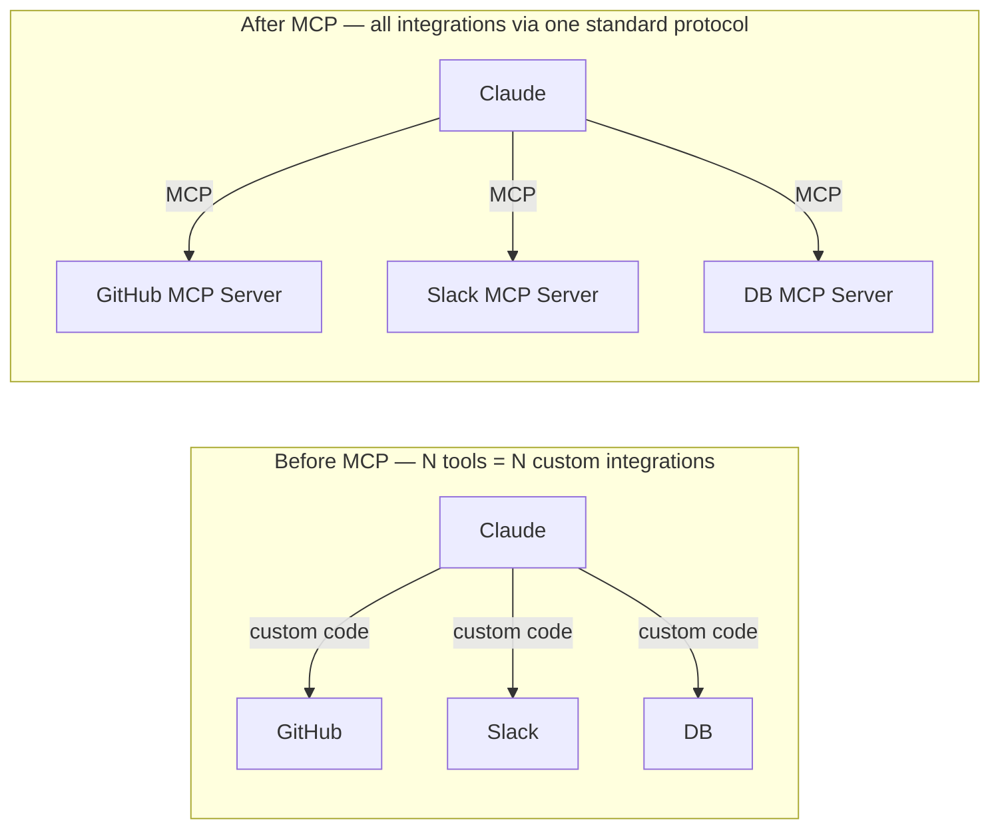
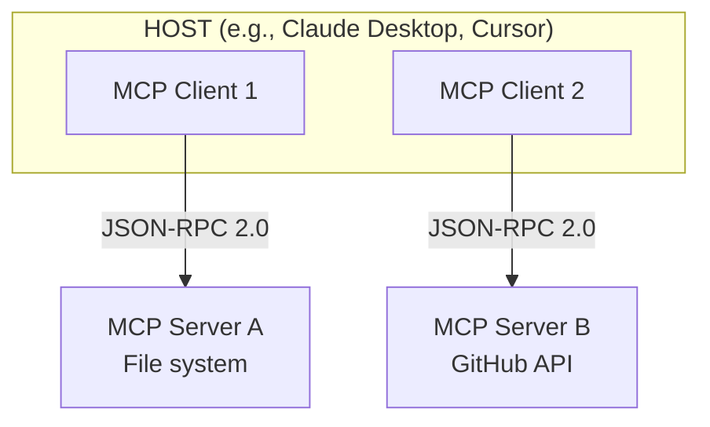

# MCP (Model Context Protocol)

## Overview

**Model Context Protocol (MCP)** is an open standard that Anthropic released in November 2024. It standardizes communication between AI Host applications and external data, tools, and services. Also called "the USB-C for AI" — it solves the fragmentation problem where each integration required building a separate connector.



## History and Status

- **November 2024**: Anthropic open-sourced it
- **November 2025**: 1-year anniversary spec update
- **December 2025**: Donated to Linux Foundation's Agentic AI Foundation — OpenAI, Google, Microsoft, AWS, Block, and others join as co-participants
- **2026**: Python/JS SDK 20M+ weekly downloads, ecosystem of thousands of third-party MCP Servers

## Core Architecture: Host-Client-Server



- **Host**: LLM application (Claude Desktop, Cursor, VS Code Copilot, etc.)
- **MCP Client**: Component inside Host that communicates 1:1 with a specific MCP Server. Handles session state management and request formatting.
- **MCP Server**: Lightweight server exposing actual tools and resources (local process or remote API)
- **Communication**: JSON-RPC 2.0 (standardized remote procedure calls)

## MCP Primitives (4 Core Functions)

| Primitive | Direction | Description | Example |
|-----------|-----------|-------------|---------|
| **Tools** | Client → Server | Execute functions — change external system state or perform computation | `create_file()`, `send_email()` |
| **Resources** | Client → Server | Expose data — provide files and DB records to LLM context | Project files, DB records |
| **Prompts** | Client → Server | Share reusable prompt templates | "Review this code" template |
| **Sampling** | Server → Client | Server requests LLM call from Host | Server-initiated AI generation |

## Configuration Example

```json
// claude_desktop_config.json
{
  "mcpServers": {
    "filesystem": {
      "command": "npx",
      "args": ["-y", "@modelcontextprotocol/server-filesystem", "/project"]
    },
    "github": {
      "command": "npx",
      "args": ["-y", "@modelcontextprotocol/server-github"],
      "env": {"GITHUB_TOKEN": "ghp_..."}
    },
    "slack": {
      "command": "npx",
      "args": ["-y", "@modelcontextprotocol/server-slack"],
      "env": {"SLACK_BOT_TOKEN": "xoxb-..."}
    }
  }
}
```

## MCP Server Implementation (Python SDK)

```python
from mcp.server import Server
from mcp.server.stdio import stdio_server
from mcp.types import Tool, TextContent
import mcp.types as types

app = Server("my-server")

@app.list_tools()
async def list_tools() -> list[Tool]:
    return [
        Tool(
            name="search_database",
            description="Search internal product database",
            inputSchema={
                "type": "object",
                "properties": {
                    "query": {"type": "string", "description": "Search term"},
                    "limit": {"type": "integer", "default": 10}
                },
                "required": ["query"]
            }
        )
    ]

@app.call_tool()
async def call_tool(name: str, arguments: dict) -> list[TextContent]:
    if name == "search_database":
        results = db.search(arguments["query"], limit=arguments.get("limit", 10))
        return [TextContent(type="text", text=str(results))]

async def main():
    async with stdio_server() as streams:
        await app.run(*streams, app.create_initialization_options())
```

## Transports

Physical channels for MCP Client and Server to exchange messages. Three are supported:

| Transport | Method | Best for |
|-----------|--------|----------|
| **stdio** | Standard I/O pipes | Local processes (Host runs Server as child process on same machine) |
| **HTTP + SSE** (legacy) | HTTP requests + Server-Sent Events for streaming responses | Early remote Server support |
| **Streamable HTTP** (standard since March 2025) | Single HTTP endpoint, upgrades to SSE when needed | Remote Servers, load-balancer deployments, reconnection resilience |

Streamable HTTP solves the HTTP+SSE problem of "entire session lost when connection drops" — it became the standard transport for remote MCP Servers post-2025.

## Resources, Prompts, Sampling In Depth

### Resources — Data Exposure

Server exposes **read-only context** like files and DB records via URI. Unlike Tools, they have no side effects and the Host can display them to the user "like file attachments."

```python
@app.list_resources()
async def list_resources() -> list[Resource]:
    return [Resource(uri="file:///project/README.md", name="Project Overview", mimeType="text/markdown")]

@app.read_resource()
async def read_resource(uri: str) -> str:
    return open(uri.replace("file://", "")).read()
```

### Prompts — Reusable Templates

Server exposes "pre-built prompt templates" that users can invoke like slash commands (e.g., `/review-pr`). Typically exposed as a template list in the Host UI.

### Sampling — Server-initiated LLM Calls

The only Primitive with the **direction reversed** — the Server asks the Host "please make an LLM call on my behalf." Server itself doesn't hold an LLM API key; it's designed to use the Host's model and policies (Host centrally controls cost and governance).

```python
async def summarize_via_host(large_document: str):
    result = await server.request_sampling(
        messages=[{"role": "user", "content": f"Summarize in 3 bullets: {large_document}"}],
        max_tokens=200,
    )
    return result.content
```

## Roots and Elicitation

**Roots**: Mechanism for Client to explicitly tell Server "the filesystem/URI boundary you can work within." An implementation of the least-privilege principle so the Server doesn't touch outside the project root.

**Elicitation** (added to spec June 2025): Standard way for Server to **request additional information from the user** during a task. For example, a deployment tool Server can ask "Which environment should I deploy to? (staging/production)" mid-execution — previously these kinds of interactions were implemented differently by every Server.

## Async Tasks

Standard pattern for long-running tool calls (minutes to hours). Instead of waiting synchronously, Server immediately returns a task ID and Client polls for status or receives a completion notification later.

```
1. Client → Server: "Start large-scale codebase refactoring" request
2. Server → Client: Immediately return task_id (no synchronous wait)
3. Client: Poll get_task_status(task_id) when needed
4. Server: Send notification when task completes
```

This naturally interlocks with the long-running agents in [[en/AI/Engineering/Agent_Engineering/Autonomous_Systems|Autonomous Systems]] — even multi-hour MCP tool calls can be handled with the same protocol.

## Security: OAuth 2.1

Early MCP had no authentication standard, so every Server implemented authentication differently. The 2025 spec adopted **OAuth 2.1** as the standard authentication method for remote MCP Servers.

```
OAuth 2.1 flow (MCP application):
  1. Client attempts to access Server → authentication required response
  2. Client redirects user to Authorization Server
  3. User logs in and consents → Authorization Code issued
  4. Client exchanges Code for Access Token
  5. All subsequent MCP requests include Access Token

MCP-specific requirements:
  - PKCE (Proof Key for Code Exchange) required — public client protection
  - Dynamic Client Registration (DCR) — Client can auto-register without prior registration
  - Resource Indicator — restricts token validity to specific MCP Server only (prevents token reuse attacks)
```

## 5 Security Threats

```
1. Prompt Injection via Tools
   Inject malicious data in MCP responses → manipulate agent behavior

2. Tool Poisoning
   Malicious MCP Server registers as legitimate server

3. Excessive Permissions
   Violation of least-privilege principle

4. Data Exfiltration
   Induce sending sensitive data to external MCP Server

5. Rug Pull Attack
   Build trust then later change MCP Server behavior
```

**Mitigations**: Verify and check signatures of MCP Server sources; apply least-privilege principle; Human-in-the-Loop approval gates; explicit user consent before processing sensitive data.

## MCP Gateway and Registry Ecosystem

Managing dozens to hundreds of MCP Servers individually in enterprise environments is impractical. Middleware tools to solve this matured rapidly in 2025-2026.

| Tool | Role |
|------|------|
| **LiteLLM** | Unified management of multiple LLM Providers + MCP Servers behind a single API, routing, cost tracking |
| **Portkey** | MCP traffic observability, caching, fallback policies |
| **Kong / Bifrost** | Apply authentication, rate limiting, and logging to MCP requests at API Gateway layer |

These tools solve the same problems (centralized auth, governance, observability) as Google's enterprise Agent Gateway/Registry covered in [[en/AI/Engineering/Agent_Engineering/Agent_Deployment|Agent Deployment]], but in a platform-independent way.

## MCP vs Function Calling vs A2A

| | Function Calling | MCP | A2A |
|--|-----------------|-----|-----|
| **Target** | Functions within a single app | LLM ↔ external tools/services | Agent ↔ Agent |
| **Standardization** | Varies by model | Open standard | Open standard |
| **Reusability** | Limited to within app | Build Server once, use in all compatible Hosts | Agent network |
| **State** | Stateless | Stateless | Stateful |
| **Governance** | Each model vendor | Linux Foundation (formerly Anthropic) | Linux Foundation |

Details → [[en/AI/Engineering/Agent_Engineering/Agent_Skills_and_Protocols/A2A|A2A]]

## Role in AI Engineering

MCP is the **standard layer for tool integration**. If Function Calling solved "how to call a function," MCP standardizes "what tools are exposed and in what format." It handles the interface to the external world in the Agent Engineering stack, and as agents grow larger and more complex, MCP's role becomes more important.

## Related Concepts
[[en/AI/Engineering/Agent_Engineering/Agent_Skills_and_Protocols/A2A|A2A]] · [[en/AI/Engineering/Agent_Engineering/Agent_Skills_and_Protocols|Agent Skills & Protocols]] · [[en/AI/Engineering/Flow_Engineering/Linear_Flow/Tool_Use_and_Function_Calling|Tool Use & Function Calling]] · [[en/AI/Engineering/Harness_Engineering/Guardrail_Engineering|Guardrail Engineering]]

## Sources
- Anthropic (2024) "Introducing the Model Context Protocol" — [anthropic.com](https://www.anthropic.com/news/model-context-protocol)
- MCP official docs — [modelcontextprotocol.io](https://modelcontextprotocol.io)
- MCP Blog "One Year of MCP: November 2025 Spec Release" — [blog.modelcontextprotocol.io](https://blog.modelcontextprotocol.io/posts/2025-11-25-first-mcp-anniversary/)
- MCP official spec "Transports" · "Authorization" — [modelcontextprotocol.io/specification](https://modelcontextprotocol.io/specification)
- LiteLLM docs (MCP Gateway) — [docs.litellm.ai](https://docs.litellm.ai)
