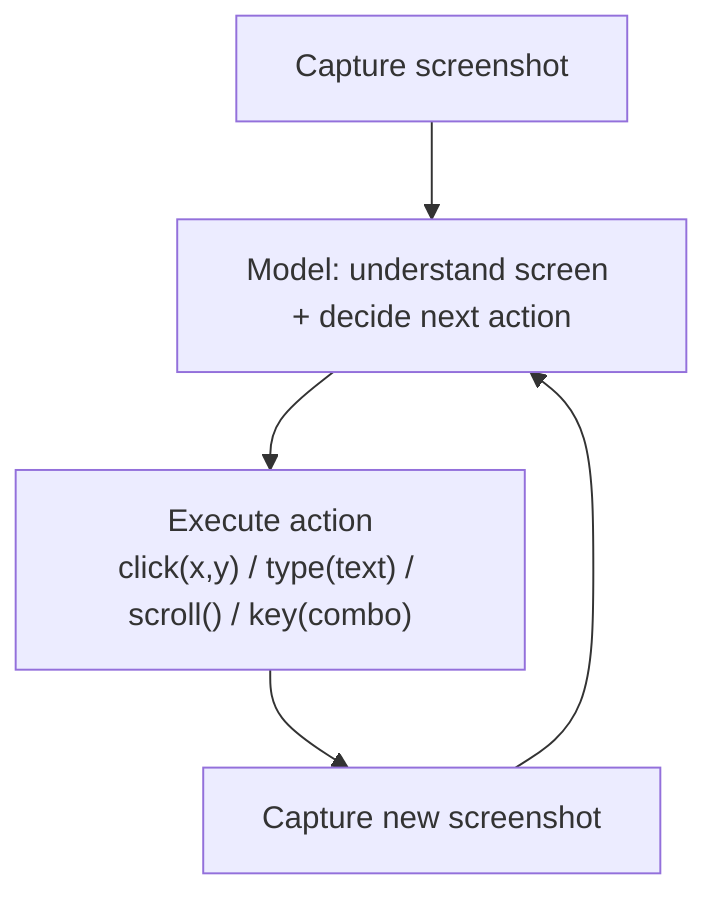
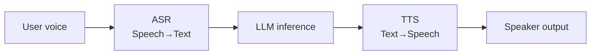

# Computer Use & Voice Agents

## Overview

Traditional agents interact with the world through API and MCP tools. But most software people use daily (legacy desktop apps, internal systems without APIs) have no APIs. **Computer Use agents** bridge this gap by viewing the screen and operating mouse and keyboard like humans. **Voice agents** interact via real-time audio instead of text, presenting distinct engineering challenges where latency becomes the key constraint.

## Computer Use — Action Space and Loop

Computer Use is not a new model architecture — it **extends the agent loop's action space to screenshots + coordinate clicks**.



```python
def computer_use_loop(task: str, max_steps: int = 50):
    history = [user(task)]
    for step in range(max_steps):
        screenshot = capture_screen()
        action = model.decide(history, screenshot)  # click, type, scroll, key, wait, done

        if action.type == "done":
            return action.result

        execute_action(action)
        history.append(observation(action, new_screenshot=capture_screen()))
    raise StepLimitExceeded
```

## Major Implementations Comparison

| | Claude (Computer Use) | OpenAI CUA (Operator) | Gemini Computer Use |
|--|----------------------|----------------------|---------------------|
| **Announced** | Anthropic, Oct 2024 | OpenAI, Jan 2025 | Google, 2025 |
| **Action space** | Coordinate click, typing, scroll, key combos | Coordinate click + browser-specific actions | Coordinate click + Android/web specific |
| **Isolation** | Docker container / VM recommended | Self-managed browser sandbox | Android emulator / browser |
| **Main use** | General desktop automation | Web browser task automation | Mobile (Android) + web |

## Safety Design — Why Sandbox is Essential

Computer Use executes arbitrary clicks and typing, so wrong decisions immediately affect real systems. Must always run in an isolated environment.

```
Computer Use safety checklist:
  □ Agent Sandbox / VM isolation — separated from core systems
  □ Human-in-the-Loop approval gate before sensitive actions (payment, delete, send)
  □ Allowed apps/URLs whitelist
  □ Step limit (action budget) — prevent infinite loops
  □ Human review of plan before execution (propose-then-commit pattern)
```

**Indirect prompt injection risk**: Browser-based Computer Use can treat hidden text in visited web pages ("ignore these instructions...") directly as observation results. This is a representative attack surface for Indirect Prompt Injection covered in [[en/AI/Engineering/Harness_Engineering/Red_Teaming|Red Teaming]].

## Voice Agents — Latency IS Quality

Voice agents have fundamentally different constraints from text agents: **humans feel responses over 200~500ms as "slow."** This can be shorter than a single LLM inference time.



**Latency Budget (End-to-End)**:
```
Target response latency: under 500ms (feels natural in conversation)
  ASR (streaming):           ~100-150ms
  LLM Time-to-First-Token:   ~150-250ms  ← bottleneck
  TTS (streaming start):     ~100-150ms
  Network round-trip:         ~50-100ms
```

### Pipecat and LiveKit

**Pipecat** (Daily.co) is an open-source framework that composes voice pipelines as frame-unit streaming pipelines. Connects ASR, LLM, and TTS in **pipeline parallelism** so each stage streams to the next without waiting for completion.

```python
from pipecat.pipeline.pipeline import Pipeline
from pipecat.services.deepgram import DeepgramSTTService
from pipecat.services.openai import OpenAILLMService
from pipecat.services.elevenlabs import ElevenLabsTTSService

pipeline = Pipeline([
    transport.input(),
    DeepgramSTTService(),      # streaming ASR
    OpenAILLMService(),        # streaming LLM (delivers to TTS from first token)
    ElevenLabsTTSService(),    # streaming TTS
    transport.output(),
])
```

**LiveKit** is WebRTC-based real-time media infrastructure that Pipecat runs on top of as a transport layer. Agents are attached as "participants" to the multi-party audio/video call infrastructure.

### Turn-Taking and VAD

A challenge unique to voice agents: **how do you know when the user has finished speaking?** Voice Activity Detection (VAD) alone is hard to distinguish between "a silence while thinking" and "finished speaking."

```
Simple VAD approach: detect 500ms of silence → judge turn ended
  Problem: fires during "um... so..." pauses while user is thinking

Improved turn-taking:
  - Combine sentence-final intonation (prosody) analysis
  - Parallel semantic completeness LLM judgment
  - Dedicated endpointing model training (e.g., LiveKit's turn detection model)
```

## Computer Use vs Voice Agents Comparison

| | Computer Use | Voice Agents |
|--|--------------|---------------|
| **Key constraint** | Action accuracy and safety | Latency |
| **Main failure mode** | Wrong click/coordinate misidentification | Awkward silence, interruptions |
| **Safety measures** | Sandbox, HITL approval | Real-time content filtering |
| **Cost driver** | Number of steps (tokens per screenshot) | Streaming infrastructure maintenance |

## Role in AI Engineering

Computer Use expands the agent's action range from "the world with APIs" to "any world with a screen." However, since physical consequences of failures are more immediate than text agents, it is inseparable from Guardrail and Sandbox design. Voice Agents have a completely different optimization axis (latency), and streaming/TTFB optimization techniques from Loop Engineering's Runtime Optimization apply far more strictly than to text.

## Related Concepts
[[en/AI/Engineering/Harness_Engineering/Guardrail_Engineering|Guardrail Engineering]] · [[en/AI/Engineering/Harness_Engineering/Red_Teaming|Red Teaming]] · [[en/AI/Engineering/Agent_Engineering/Autonomous_Systems|Autonomous Systems]] · [[en/AI/Engineering/Agent_Engineering/Agent_Core_Pillars|Agent Core Pillars]]

## Sources
- Anthropic "Introducing Computer Use" (2024) — [anthropic.com](https://www.anthropic.com/news/3-5-models-and-computer-use)
- OpenAI "Introducing Operator" (2025) — [openai.com](https://openai.com/index/introducing-operator/)
- Google "Gemini 2.5 Computer Use" — [ai.google.dev](https://ai.google.dev/gemini-api/docs/computer-use)
- Pipecat official docs — [docs.pipecat.ai](https://docs.pipecat.ai)
- LiveKit Agents docs — [docs.livekit.io/agents](https://docs.livekit.io/agents/)
