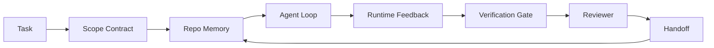

# Eval-Driven Development & Agent Workbench

## Overview

Agents pass demos but fail in production in unexpected ways. Benchmarks answer "is this model generally capable?" but not "does this agent produce results fit for our product?" This document covers two complementary disciplines: **Eval-Driven Development** (methodology that places evaluation at the center of the development loop) and **Agent Workbench** (execution environment with 7 surfaces that agents need to work reliably).

## Eval-Driven Agent Development

Anthropic's guidance: "Start with simple prompts, optimize with comprehensive evaluation, and only add multi-step agent systems when needed." Evaluation is not the last step — it's the **outer loop** that drives every other choice.

### 3-Layer Evaluation

```
1. Static Benchmarks
   General capability comparison, regression gating
   Code: SWE-bench Verified · Browsing/Desktop: WebArena, OSWorld
   General: GAIA · Tool use: BFCL V4
   Caution: Data contamination — SWE-bench+ research found 32.67% solution leakage
            → Always report "Verified" or audited scores

2. Custom Offline Evals
   Evaluation tailored to your product's actual shape
     - LLM-as-Judge (Langfuse, Phoenix, Opik)
     - Execution-based: actually run patches and verify test passage
     - Trajectory-based: compare against ground-truth action sequences
       (OSWorld-Human research: top agents use 1.4~2.7x more steps than ground truth)

3. Online Evals (Production Evaluation)
     - Session replay (Langfuse)
     - Guardrail trigger alerts (→ Guardrail Engineering)
     - Per-step cost & latency tracking (OTel spans → Observability & Tracing)
```

### Evaluator-Optimizer Tight Loop

1. Proposer generates output
2. Evaluator judges it
3. Iterate improvements until evaluator passes

This is a generalization of Self-Refine from [[en/AI/Engineering/Agent_Engineering/Planning_and_Reflection|Planning & Reflection]] — you can wrap any agent flow you care about in this loop.

### 2026 Production Standards

```
✓ Eval code lives next to application code (not a separate repository)
✓ Automatically runs in CI on every PR
✓ Merge gate on eval scores ("block merge if >5% regression vs main")
✓ Every guardrail rule has a corresponding eval case
✓ Every learned rule (Reflexion reflection, workflow learning rules) has a corresponding failure case
```

### Common Failures

- **No baseline**: Without a last-known-good state, eval results cannot be interpreted
- **Ungrounded LLM judges**: Judge LLMs hallucinate too → verify with external tools like the CRITIC pattern
- **Overfitting to evals**: Optimizing eval scores can diverge from actual production utility → rotate cases periodically
- **Flaky evals**: Non-deterministic cases cause false alarms → fix seeds, state snapshots

## Agent Workbench: Why Capable Models Still Fail

Ask a frontier model to add input validation code in a real repository — it writes plausible code, declares "done," and stops. But running the tests reveals 2 failures, files unrelated to validation have been touched, and there's no record of what the agent assumed, what it tried first, or what remains.

**The model doesn't misunderstand Python. It misunderstands the "task."** This isn't a model bug — it's a **workbench bug**: the "surfaces around the model" that transform one-shot generation into reliable, resumable engineering are missing.

### 7 Workbench Surfaces

| Surface | What it holds | Failure without it |
|---------|--------------|-------------------|
| **Instructions** | Starting rules, prohibited actions, definition of "done" | Agent guesses what "shippable" means |
| **State** | Current task, touched files, blockers, next action | Every session restarts from zero |
| **Scope** | Allowed/forbidden files, acceptance criteria | Changes leak into unrelated code |
| **Feedback** | Actual command output captured in the loop | Declares "success" on a 400 error |
| **Verification** | Tests, lint, smoke runs, scope checks | "Looks fine" goes straight to main |
| **Review** | Secondary review from a different role | Builder grades their own homework |
| **Handoff** | What changed, why, what remains | Next session re-discovers everything |



The loop **closes on a state file, not on conversation history.** Conversation is volatile; the repository is the system of record.

**Workbench vs Prompt Engineering**: Prompting tells "what you want this turn." Workbench tells "how to work across multiple turns and sessions." Most agent failure cases are workbench failures wearing the clothes of prompt engineering.

**Workbench vs Framework**: Frameworks ([[en/AI/Engineering/Agent_Engineering/Agent_Frameworks|Agent Frameworks]]) provide the runtime (LangGraph, AutoGen, Agents SDK). Workbench provides the space for agents to work *inside* that runtime. Both are needed.

### Reduction to Distributed System Primitives

Multiple vendors (LangChain, OpenAI, Anthropic, Martin Fowler) are describing the same thing in different vocabularies under the label "harness engineering." But the 7 surfaces reduce to 8 primitives that distributed backend systems have needed for years:

| Primitive | Identity | Corresponding agent element |
|-----------|----------|----------------------------|
| Function | Typed handler | Tool call, rule check, verification step, model call |
| Worker | Long-running process | Builder, reviewer, verifier, MCP server |
| Trigger | Event source that calls a function | Agent loop tick, HTTP request, queue message, cron, hook |
| Runtime | Boundary deciding what runs where | Claude Code process, LangGraph runtime |
| HTTP/RPC | Communication line between caller-worker | Tool call protocol, MCP request |
| Queue | Durable buffer between trigger-worker | Task board, feedback log, review inbox |
| Session Persistence | State surviving crash/restart | `agent_state.json`, checkpoints, the repository itself |
| Authorization Policy | Who can call what function in what scope | Allowed/forbidden files, approval boundaries, MCP capability list |

With this reduction, the "Ralph Loop" (re-injecting original intent into new context when an agent tries to stop early) is simply a requeue trigger with session persistence, and "Plan/Execute/Verify" is just 3 workers communicating via state and a queue. The vocabulary differs by vendor; the engineering is identical.

### Empirical Data — Cases Where Harness Beats Model

```
Terminal Bench 2.0: Same model, only harness changed → coding agent moved from outside top 30 to #5
Vercel: Deleted 80% of agent tools → success rate increased from 80% to 100%
Harvey: Harness optimization alone doubled legal agent accuracy
88% of enterprise AI agent projects fail to reach production
  — failures concentrated in "runtime" not "reasoning"
2025 benchmarks: WebAgent completion rates collapsed from 40~50% to under 10% in long context conditions
  — mostly infinite loops and goal abandonment
```

### Workbench Pack

The 7 surfaces packaged as an installable directory:

```
agent-workbench-pack/
├── AGENTS.md                    # Instructions
├── docs/
│   ├── agent-rules.md
│   ├── reliability-policy.md
│   ├── handoff-protocol.md
│   └── reviewer-rubric.md
├── schemas/
│   ├── agent_state.schema.json  # State
│   ├── task_board.schema.json
│   └── scope_contract.schema.json  # Scope
├── scripts/
│   ├── init_agent.py
│   ├── run_with_feedback.py     # Feedback
│   ├── verify_agent.py          # Verification
│   └── generate_handoff.py      # Handoff
└── bin/install.sh
```

## Relationship Between Eval-Driven Development and Workbench

The two methodologies are complementary: Eval-Driven Development addresses "how to measure what success is," while the Workbench's Verification Gate enforces that measurement inside the actual execution loop. Every workbench surface generates a corresponding eval case — for example, Reflexion (→ [[en/AI/Engineering/Agent_Engineering/Planning_and_Reflection|Planning & Reflection]]) produces an eval case "does the learned reflection actually apply on retry?", and failure modes ([[en/AI/Engineering/Agent_Engineering/Multi_Agent_Coordination|Multi-Agent Coordination]]) produce a case "does the detector tag known failures?"

## Role in AI Engineering

Eval-Driven Development and Agent Workbench represent the 2026 shift from "how smart is the model" to "how reliable is the system." As the Terminal Bench/Vercel/Harvey cases demonstrate, the same model's success rate changes dramatically based solely on harness (workbench) design. The 7 surfaces in this document are also concrete engineering countermeasures that prevent the failure modes (MASFT/MAST) from [[en/AI/Engineering/Agent_Engineering/Multi_Agent_Coordination|Multi-Agent Coordination]] — for example, Verification Gate structurally reduces "Verification Gap" failures, and Handoff reduces "Coordination Failure."

## Related Concepts
[[en/AI/Engineering/Agent_Engineering/Multi_Agent_Coordination|Multi-Agent Coordination]] · [[en/AI/Engineering/Agent_Engineering/Agent_Frameworks|Agent Frameworks]] · [[en/AI/Engineering/Agent_Engineering/Planning_and_Reflection|Planning & Reflection]] · [[en/AI/Engineering/Harness_Engineering/Guardrail_Engineering|Guardrail Engineering]] · [[en/AI/Engineering/Harness_Engineering/Observability_and_Tracing|Observability & Tracing]] · [[en/AI/Engineering/Harness_Engineering/Benchmarking|Benchmarking]]

## Sources
- Anthropic "Building Effective Agents" — [anthropic.com](https://www.anthropic.com/research/building-effective-agents)
- LangChain "The Anatomy of an Agent Harness" — [blog.langchain.com](https://blog.langchain.com/the-anatomy-of-an-agent-harness/)
- MongoDB "The Agent Harness: Why the LLM Is the Smallest Part of Your Agent System" — [mongodb.com](https://www.mongodb.com/company/blog/technical/agent-harness-why-llm-is-smallest-part-of-your-agent-system)
- Anthropic "Effective harnesses for long-running agents" — [anthropic.com](https://www.anthropic.com/engineering/effective-harnesses-for-long-running-agents)
- Martin Fowler / Böckeler, B. "Harness engineering for coding agent users" — [martinfowler.com](https://martinfowler.com/articles/harness-engineering.html)
