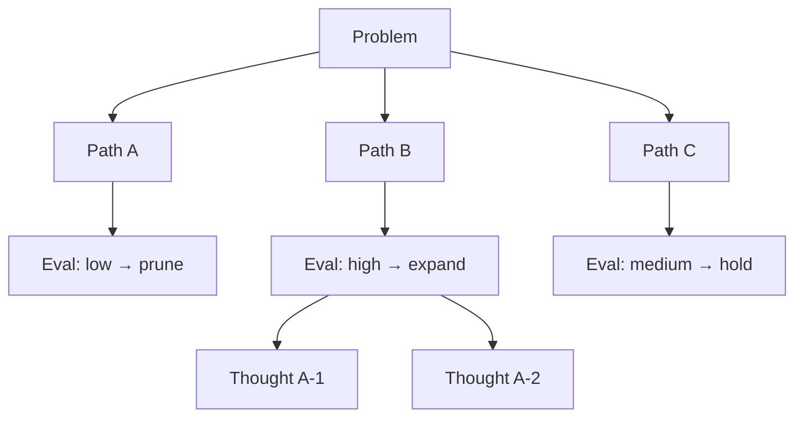
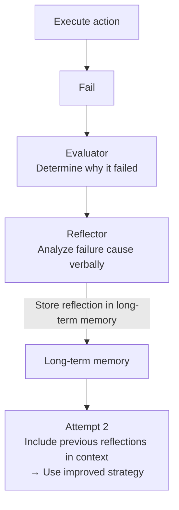

# Planning & Reflection

## Overview

Mechanisms for agents to **plan ahead** to achieve complex goals (Planning) and **evaluate results during execution to correct their own behavior** (Reflection). Goes beyond simple ReAct loops to give agents self-improvement capabilities.

## Planning Techniques

### Plan-and-Solve (Wei et al., 2023)
Explicitly create a plan before solving the problem:

```
Basic CoT: "Let's think step by step"

Plan-and-Solve:
  Step 1: "Let's create a plan to solve this problem"
         → Plan: [①collect data ②analyze ③conclude]
  Step 2: Execute according to plan
         → More systematic and fewer errors because a plan exists
```

```python
plan_and_solve_prompt = """
Problem: {problem}

First, create a step-by-step plan to solve this problem:
Plan:

Now execute the plan one step at a time:
"""
```

### ReWOO (Reasoning WithOut Observation)

A Plan-and-Execute variant proposed by Xu et al. (2023). Unlike regular ReAct which interleaves "reason → act → observe" at each step with LLM calls, **ReWOO designs all tool calls at once in the planning phase** and has a separate worker handle execution.

```
ReAct:  reason1 → act1 → observe1 → reason2 → act2 → observe2 → ...  (LLM call every step)

ReWOO:  Planner (1 LLM call)
          → "#E1 = search(question A)"
          → "#E2 = calculate(using #E1 result)"
          → "#E3 = search(question B)"
        Worker: execute #E1, #E2, #E3 (no LLM calls, parallelizable)
        Solver (1 LLM call): synthesize #E1~#E3 results to generate final answer
```

**Advantages**: Dramatically reduces LLM call count (lower token cost), enables parallel tool calls.
**Disadvantages**: If the plan is wrong (misjudged variable dependencies), recovery without re-planning is difficult — not suitable for tasks requiring dynamic path changes based on observations.

### Tree of Thoughts (ToT) and LATS

**Tree of Thoughts** (Yao et al., NeurIPS 2023) explores **multiple reasoning paths as a tree** instead of a single reasoning path (CoT), evaluating each node and expanding only promising paths.



**LATS (Language Agent Tree Search)** (Zhou et al., 2023) extends ToT by combining **MCTS (Monte Carlo Tree Search)** with environment feedback (tool execution results). It embeds the ReAct action-observation loop within tree search, executing actual tools at each node and updating node values with results.

```
LATS loop:
  1. Selection: select node with highest UCB score
  2. Expansion: LLM generates multiple action candidates
  3. Evaluation: execute each candidate, score with self-evaluation + external feedback
  4. Backpropagation: propagate scores up the tree
  5. Repeat → select best path
```

## Reflection

### Reflexion Framework (Shinn et al., NeurIPS 2023)

Learn through verbal self-reflection on failures:



**Performance**: HotPotQA +20%, HumanEval +11% (vs basic ReAct)

```python
reflection_prompt = ChatPromptTemplate.from_messages([
    ("system", "You are an expert who evaluates AI agent actions and suggests improvements."),
    ("human", """
    Goal: {goal}
    Actions taken: {actions}
    Final result: {result}
    
    Analyze what went wrong in this attempt and specifically describe
    how to improve in the next attempt.
    """)
])
```

### Self-Refine

Iterative self-improvement framework proposed by Madaan et al. (2023). The same LLM repeats generate → feedback → improve **without external feedback or additional training**.

```python
def self_refine(task: str, llm, max_iterations: int = 3) -> str:
    output = llm.invoke(task)
    for _ in range(max_iterations):
        feedback = llm.invoke(f"Specifically point out the problems with this output:\n{output}")
        if "no issues" in feedback.lower():
            break
        output = llm.invoke(f"Improve the output based on this feedback:\nOutput: {output}\nFeedback: {feedback}")
    return output
```

### CRITIC (Correcting with Tool-Interactive Critiquing)

Proposed by Gou et al. (2023). Unlike Self-Refine, **uses external tools (search engines, code interpreters, calculators) to critique** — compensates for the limitation that LLMs alone cannot catch factual errors.

```
Self-Refine: LLM critiques itself (hallucinations may not catch hallucinations)
CRITIC:      Validates with external tools → "This sentence in the response contradicts search results"
             → Correct with tool-based evidence
```

## Planning vs Reflection Comparison

| | Planning | Reflection |
|--|---------|-----------|
| **Timing** | Before execution | After execution |
| **Purpose** | Design efficient execution path | Learn from failures |
| **Memory use** | Reference strategy from long-term memory | Store reflections in long-term memory |
| **LLM calls** | 1~2 additional | 1 additional |

## Planning/Reasoning Technique Comparison

| Technique | LLM call cost | Strength | Weakness |
|----------|--------------|---------|---------|
| Plan-and-Solve | Low | Simple, fast | Difficult to re-plan |
| ReWOO | Low (plan 1 + solve 1) | Parallel tool calls, token savings | Cannot dynamically re-plan based on observations |
| ReAct | Medium (call per step) | Flexible response to observations | Cost increases proportionally to steps |
| Tree of Thoughts | High | Multi-path exploration, strong on complex problems | Excessive cost for simple tasks |
| LATS | Very high | ToT + environment feedback, highest performance | Complex implementation, maximum cost |
| Self-Refine | Medium (per iteration) | No external tools needed | May not catch hallucinations |
| CRITIC | Medium~high | Tool-based validation suppresses hallucinations | Limited to domains with verification tools |

## Role in AI Engineering

Planning & Reflection elevates agents from "executors" to "self-improving systems." Especially for repetitive tasks (code debugging, research, content generation), the Reflexion pattern achieves continuously improving quality without human supervision. ReWOO/ToT/LATS form a spectrum of "how broadly to search," while Self-Refine/CRITIC form a spectrum of "what basis to use for self-correction."

## Related Concepts
[[en/AI/Engineering/Agent_Engineering/Agent_Core_Pillars|Agent Core Pillars]] · [[en/AI/Engineering/Flow_Engineering/Graph_Flow/ReAct_Pattern|ReAct Pattern]] · [[en/AI/Engineering/Prompt_Engineering/Chain_of_Thought|Chain of Thought]] · [[en/AI/Engineering/Flow_Engineering/Graph_Flow/Human_in_the_Loop|Human-in-the-Loop]] · [[en/AI/Engineering/Agent_Engineering/Anthropic_Workflow_Patterns|Anthropic Workflow Patterns]]

## Sources
- Shinn et al. (2023) "Reflexion: Language Agents with Verbal Reinforcement Learning" — [NeurIPS 2023](https://proceedings.neurips.cc/paper_files/paper/2023/file/1b44b878bb782e6954cd888628510e90-Paper-Conference.pdf)
- Wang et al. (2023) "Plan-and-Solve Prompting" — [arXiv:2305.04091](https://arxiv.org/abs/2305.04091)
- Xu et al. (2023) "ReWOO: Decoupling Reasoning from Observations" — [arXiv:2305.18323](https://arxiv.org/abs/2305.18323)
- Yao et al. (2023) "Tree of Thoughts: Deliberate Problem Solving with Large Language Models" — [NeurIPS 2023](https://arxiv.org/abs/2305.10601)
- Zhou et al. (2023) "Language Agent Tree Search Unifies Reasoning, Acting, and Planning" — [arXiv:2310.04406](https://arxiv.org/abs/2310.04406)
- Madaan et al. (2023) "Self-Refine: Iterative Refinement with Self-Feedback" — [arXiv:2303.17651](https://arxiv.org/abs/2303.17651)
- Gou et al. (2023) "CRITIC: Large Language Models Can Self-Correct with Tool-Interactive Critiquing" — [arXiv:2305.11738](https://arxiv.org/abs/2305.11738)
