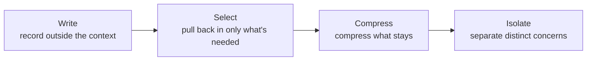

# Agentic Context Management

## Overview

**Agentic Context Management** covers how to continuously manage the context window across a long-running agent loop. If RAG answers "what should be retrieved and inserted," this document answers what comes after — **how to keep the context alive as an agent accumulates dozens to hundreds of turns of tool calls**.

```
One-shot RAG query: [System] + [retrieved docs] + [question] → answer (context built once)

Long-running agent: [System] + [tool call 1 result] + [tool call 2 result] + ...
                     → context keeps growing as turns accumulate
                     → eventually you either overflow the window, or quality degrades even before you do
```

## Context Rot: Quality Drops Even With Room to Spare

**Context Rot** is the phenomenon where a model's reasoning quality gradually degrades as input token count grows — even when the context window is nowhere near full. Chroma's technical report (2025) [1] tested 18 models including GPT-4.1, Claude 4, Gemini 2.5, and Qwen3, holding task difficulty fixed while only increasing input length, and quantitatively showed that models **do not use context uniformly**. A follow-up study on long-horizon search agents (2026) [2] reproduces the same degradation pattern and proposes mitigations.

### How This Differs From Lost in the Middle

This wiki already has a dedicated [[en/AI/Engineering/Context_Engineering/Lost_in_the_Middle|Lost_in_the_Middle]] page. The two are often conflated, but they are distinct phenomena.

| Aspect | Lost in the Middle | Context Rot |
|---|---|---|
| **Cause** | **Position** of information (middle of context) | **Total volume** of input tokens itself |
| **Mitigation** | Reposition key information to the front/back | Avoid putting unnecessary tokens in the window at all |
| **Room left in the window** | Occurs even with room to spare | Occurs even with room to spare — "filling the window less" is itself the fix |
| **Typically shows up in** | Multi-document RAG (document ordering) | Long-running agent loops (accumulated tool results) |

In short, Lost in the Middle is a "where to put it" problem, while Context Rot is a "how much to put in at all" problem. In practice both occur simultaneously, so document-order optimization (for Lost in the Middle) and the four strategies below (for Context Rot) need to be applied together.

## The Four Strategies: Write / Select / Compress / Isolate

LangChain's synthesis of context engineering (Lance Martin, 2025) [3] and Anthropic's practitioner guide (2025) [4] converge on the same frame. Every technique for handling context falls under one of these four axes.



### Write — Record Outside the Context Window

Instead of stacking entire tool-call outputs into the message history, store the raw results on disk or in agent state, and keep only a **summary or a reference (URL, file path)** in the context. Scratchpads, filesystem offloading, and memory blocks all fall here. This wiki's [[en/AI/Engineering/Context_Engineering/LLM_Memory|LLM_Memory]] page's treatment of In-Context Memory management is one branch of the Write strategy.

### Select — Pull Back In Only What's Needed

Of everything that has been written down, retrieve only the part actually relevant to the current turn and inject it into context. The entire [[en/AI/Engineering/Context_Engineering/Retrieval_Strategies/Retrieval_Strategies|Retrieval_Strategies]] chapter (RAG/GraphRAG/SQL RAG) is fundamentally a Select strategy, and in agents with many tools, exposing "only the tools relevant to the current task" follows the same principle.

### Compress — Compress What Stays

Information that can't be entirely discarded or entirely kept gets compressed. Where [[en/AI/Engineering/Context_Engineering/Context_Compression|Context_Compression]]'s LLMLingua and Contextual Compression operate at the **individual prompt/chunk** level, the **Compaction** technique discussed below operates at the **entire conversation flow** level — a different layer of the same idea.

### Isolate — Separate Distinct Concerns

Rather than cramming everything into one context window, split a subtask off into its own, independent context window. See "Sub-agent Context Isolation" below.

## Compaction: Summarize, Then Resume in a New Window

**Compaction** is a loop-level technique: when the context window nears its limit, summarize the conversation so far and use that summary as the seed to **open a fresh context window** [4]. Where `Context_Compression.md`'s LLMLingua is local compression — "shrink tokens within this prompt" — Compaction is global compression: "fold up this entire session and carry it into the next one."

```
Compaction loop:
  [Turns 1..N: tool calls accumulate] → approaching window limit
    ↓
  Generate a summary (what to keep vs. discard is the crux)
    ↓
  [Summary] + [continue from turn N] → resume in a fresh context window
```

Anthropic's practitioner guide [4] frames the core of Compaction design this way: first **maximize recall** so the compaction prompt captures every relevant piece of information from the trace, then **improve precision** by trimming superfluous content. Compress too aggressively and you risk losing information that seems unimportant now but turns out critical later — e.g., a constraint the user stated early on.

## Sub-agent Context Isolation

This is the flagship implementation of the **Isolate** strategy. A subtask is delegated to a separate sub-agent, which does detailed work (e.g., web search, code exploration) in its own isolated context window, then returns only a **condensed summary (typically 1,000–2,000 tokens)** to the lead agent [4].

```
Lead agent's context: [instruction] → [sub-agent A summary, 1.5K] + [sub-agent B summary, 1.2K] → synthesize
                                            ↑ each sub-agent's extensive internal exploration
                                              never touches the lead agent's context at all
```

Anthropic reports that this pattern, used in its multi-agent research system, outperformed single-agent approaches on complex research tasks [4]. This is the **context-level answer** to "why split agents apart at all" — a question this wiki's [[en/AI/Engineering/Agent_Engineering/Multi_Agent_Coordination|Multi_Agent_Coordination]] (communication/coordination patterns) and [[en/AI/Engineering/Graph_Engineering/Multi_Agent_Topology|Multi_Agent_Topology]] (agents as nodes/edges) also address — context isolation is one of the reasons topologies get split in the first place.

## Filesystem Offloading and Note-Taking

A concrete implementation of the Write strategy that became a 2025–2026 practitioner standard: the agent writes **directly to the filesystem** instead of the context, and reads back only when needed. Heavy tool-call outputs (a full webpage, a full log) get stored on disk or in agent state, only a summary or file path stays in context, and a `read_file` call pulls the content back in on demand. A long-running coding agent's `scratchpad.md` or `TODO.md` for progress tracking follows the same principle — state survives even if the context is reset or compacted.

## Risk: Governance Decay

Compaction and other context-management strategies carry a known risk. **Governance Decay** (arXiv:2606.22528, 2026) [5] identifies how repeated context compaction can quietly erode "not immediately visible but important" information — such as safety constraints or system instructions — during summarization. The risk is especially acute when a summarization prompt is tuned to favor precision over recall: what looks on the surface like "removing unnecessary content" can, over several Compaction cycles, wear away exactly the constraints [[en/AI/Engineering/Harness_Engineering/Guardrail_Engineering|Guardrail_Engineering]] set up. For long-running agents, the recommended design is to exclude safety-related instructions from the Compaction target, or place them in a fixed region — like the System Prompt — that gets re-injected unconditionally every cycle.

## Role in AI Engineering

Agentic Context Management is the higher-level design discipline for **how to combine individual component techniques — RAG, Memory, Compression — along an agent's time axis**. Problems that don't exist in one-shot Q&A — quality dropping even though the window isn't full (Context Rot), compaction eroding safety guardrails (Governance Decay), and where to draw information boundaries between sub-agents (Isolation) — are all addressed here. For the cost-reduction angle on managing context from a Loop Engineering perspective, see [[en/AI/Engineering/Loop_Engineering/Cost_Engineering/Context_Usage_Auditing|Context_Usage_Auditing]].

## Related Concepts
[[en/AI/Engineering/Context_Engineering/Context_Compression|Context_Compression]] · [[en/AI/Engineering/Context_Engineering/Lost_in_the_Middle|Lost_in_the_Middle]] · [[en/AI/Engineering/Context_Engineering/LLM_Memory|LLM_Memory]] · [[en/AI/Engineering/Agent_Engineering/Agent_Memory|Agent_Engineering/Agent_Memory]] · [[en/AI/Engineering/Agent_Engineering/Multi_Agent_Coordination|Agent_Engineering/Multi_Agent_Coordination]] · [[en/AI/Engineering/Harness_Engineering/Guardrail_Engineering|Harness_Engineering/Guardrail_Engineering]] · [[en/AI/Engineering/Loop_Engineering/Cost_Engineering/Context_Usage_Auditing|Loop_Engineering/Cost_Engineering/Context_Usage_Auditing]]

## Sources
1. Hong, Troynikov & Huber (Chroma, 2025) "Context Rot: How Increasing Input Tokens Impacts LLM Performance" — [research.trychroma.com/context-rot](https://research.trychroma.com/context-rot)
2. "Diagnosing and Mitigating Context Rot in Long-horizon Search" (2026) — [arXiv:2606.29718](https://arxiv.org/abs/2606.29718)
3. Martin, L. (LangChain, 2025) "Context Engineering for Agents" — [rlancemartin.github.io/2025/06/23/context_engineering](https://rlancemartin.github.io/2025/06/23/context_engineering/)
4. Anthropic (2025) "Effective context engineering for AI agents" — [anthropic.com/engineering/effective-context-engineering-for-ai-agents](https://www.anthropic.com/engineering/effective-context-engineering-for-ai-agents)
5. "Governance Decay: How Context Compaction Silently Erases Safety Constraints in Long-Horizon LLM Agents" (2026) — [arXiv:2606.22528](https://arxiv.org/abs/2606.22528)
6. "Context Engineering 2.0: The Context of Context Engineering" (2025) — [arXiv:2510.26493](https://arxiv.org/abs/2510.26493)
