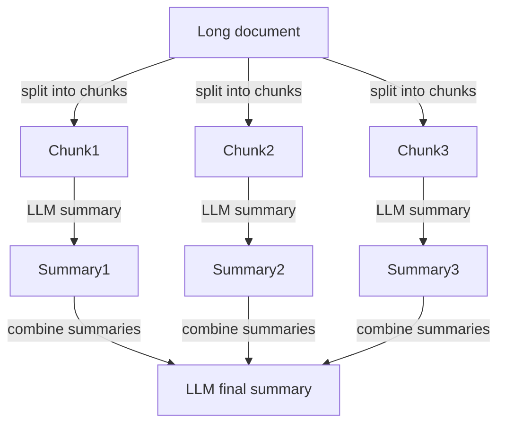

# Context Compression / Prompt Pruning

## Overview

**Context Compression** is a technique that minimizes information entering the LLM's context window while retaining necessary information. **Prompt Pruning** is the specific implementation of removing unnecessary content from prompts. It is a key optimization for reducing context window costs and latency.

## Why Is It Needed?

```
Cost structure (GPT-4 Turbo):
  Input tokens: $0.01 / 1K tokens
  Output tokens: $0.03 / 1K tokens

Filling the 128K context window:
  = 128K × $0.01 = $1.28/request
  10,000 requests/day = $12,800/day

Removing 50% unnecessary context:
  = $6,400/day savings
```

## Key Techniques

### 1. LLM Lingua (Selective Compression)

Token-level compression developed by Microsoft Research (2023):

```python
from llmlingua import PromptCompressor

compressor = PromptCompressor(
    model_name="microsoft/llmlingua-2-xlm-roberta-large-meetingbank",
    device_map="cuda"
)

compressed = compressor.compress_prompt(
    context,
    instruction="Answer the question",
    question="How do you sort in Python?",
    target_token=200,        # target token count
    rate=0.55,               # compression rate (remove 45%)
    condition_in_question="after_condition"
)

print(compressed["compressed_prompt"])  # Prompt with unnecessary tokens removed
```

**How it works**: A small language model calculates an importance score for each token; low-score tokens are removed.

### 2. Contextual Compression Retriever (LangChain)

Extract only relevant parts from RAG chunks, not the whole chunk:

```python
from langchain.retrievers.document_compressors import LLMChainExtractor
from langchain.retrievers import ContextualCompressionRetriever

# Compressor: extract only sentences relevant to query
compressor = LLMChainExtractor.from_llm(llm)

# Combine base retriever + compression
compression_retriever = ContextualCompressionRetriever(
    base_compressor=compressor,
    base_retriever=vectorstore.as_retriever()
)

# Return only relevant sentences instead of entire chunks
relevant_docs = compression_retriever.get_relevant_documents(query)
```

### 3. Map-Reduce Summarization (Long Documents)

When it's difficult to process the entire document at once:


### 4. Conversation History Summarization

Save tokens in multi-turn conversations by summarizing previous dialogue:

```python
from langchain.memory import ConversationSummaryMemory

memory = ConversationSummaryMemory(
    llm=llm,
    max_token_limit=500  # summarize when over 500 tokens
)
# Automatically summarizes previous content as conversation grows
```

### 5. Selective Context

Don't always include all tool descriptions and few-shot examples; dynamically select only what's needed:
```python
# Include only query-relevant tools
def select_relevant_tools(query: str, all_tools: list) -> list:
    query_embed = embed(query)
    tool_embeds = [embed(tool.description) for tool in all_tools]
    similarities = cosine_sim(query_embed, tool_embeds)
    return [all_tools[i] for i in top_k_indices(similarities, k=3)]
```

## Compression Technique Comparison

| Technique | Compression rate | Quality loss | Speed | Suitable case |
|------|-------|---------|------|-----------|
| LLM Lingua | 50~80% | Low | Fast | RAG context |
| LLM Summarization | 70~90% | Medium | Slow | Long document processing |
| Contextual Compression | 40~60% | Low | Medium | RAG chunks |
| Conv. Summary Memory | 60~80% | Low | Slow | Long conversation sessions |

## Lost in the Middle Problem

The phenomenon where LLMs use information in the middle of the context window significantly less than information at the ends (Liu et al., 2023):
```
Context: [Info A][Info B][Info C][Info D][Info E]
Utilization: High   Low    Low    Low    High

→ Place important info at the front/back of context
→ Can be resolved by removing unnecessary info in the middle
```

See [[en/AI/Engineering/Context_Engineering/Lost_in_the_Middle|Lost in the Middle]] for details.

## Role in AI Engineering

Context Compression simultaneously achieves both **cost optimization** and **performance improvement**. Removing unnecessary tokens reduces API costs, and concentrating on core information improves model response quality. It is especially the key technique for managing accumulated context in Agent systems with long context windows.

## Related Concepts
[[en/AI/Engineering/Context_Engineering/Retrieval_Strategies/RAG/Chunking_Strategies|Chunking Strategies]] · [[en/AI/Engineering/Context_Engineering/Retrieval_Strategies/RAG/Advanced_Retrieval|Advanced Retrieval]] · [[en/AI/Engineering/Context_Engineering/Memory_and_Semantic_Cache|Memory & Semantic Cache]] · [[en/AI/Engineering/Loop_Engineering/Runtime_Optimization|Runtime Optimization]]

## Sources
- Jiang et al. (2023) "LLMLingua: Compressing Prompts for Accelerated Inference" — [arXiv:2310.05736](https://arxiv.org/abs/2310.05736)
- Liu et al. (2023) "Lost in the Middle: How Language Models Use Long Contexts" — [arXiv:2307.03172](https://arxiv.org/abs/2307.03172)
- LangChain "Contextual Compression" — [python.langchain.com](https://python.langchain.com/docs/how_to/contextual_compression/)
