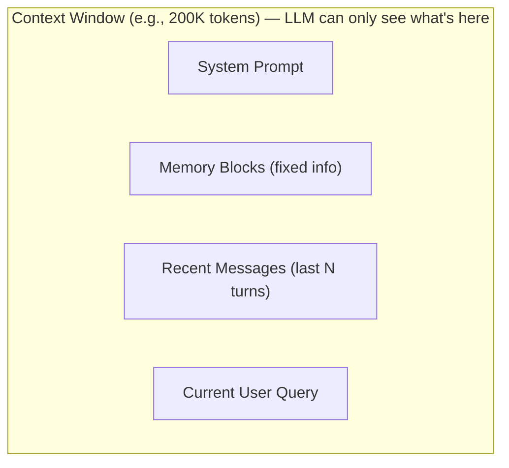
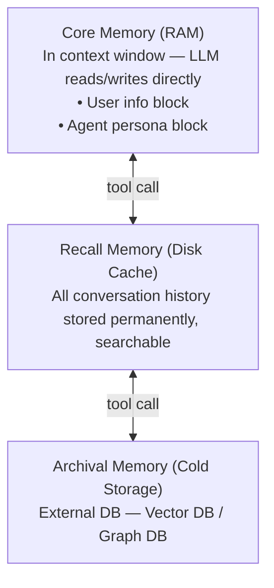
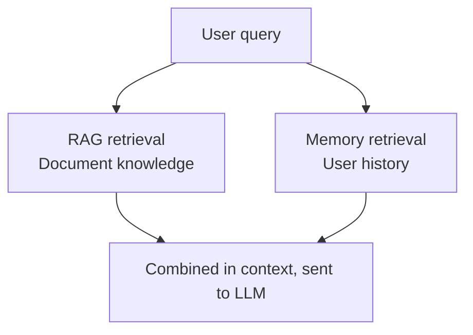

# LLM Memory

## Overview

LLM Memory refers to all mechanisms by which AI systems **store, maintain, and retrieve information from previous interactions to use in future responses**. A basic LLM is stateless — each conversation starts independently — but Memory systems transform it into a stateful agent.

```
Stateless LLM:
  Session 1: "My name is John" → no memory
  Session 2: "What's my name?" → "I don't know" ❌

Stateful Agent (with Memory):
  Session 1: "My name is John" → stored in memory
  Session 2: "What's my name?" → "You're John!" ✅
```

---

## Memory Type Classification (4 Types)

The 4 LLM memory types organized by Lilian Weng (2023) [1] have become the standard classification.

### 1. In-Context Memory
All information within the current context window. Stored in tokens; lost when the context window fills up.



- **Pros**: Immediate access, no separate retrieval needed
- **Cons**: Capacity limit, lost when session ends
- **Solution**: Transfer to External Memory via Summarization

### 2. External Memory
Persistent storage outside the model — vector DB, key-value store, relational DB, etc.

```python
# Save: Extract important info from conversation → store in external DB
memory_store.add("User John prefers Python", user_id="user_123")

# Retrieve: Inject relevant memories as context
memories = memory_store.search("language preferences", user_id="user_123")
# → Added to context window, sent to LLM
```

- **Characteristics**: Persistent across sessions, retrieval-based access
- **Technology**: Vector DB (semantic search), Knowledge Graph (relationship traversal), KV Store (fast lookup)

### 3. In-Weights Memory
Knowledge internalized into model weights through pre-training and fine-tuning. [2]

```
Pre-training → world knowledge like "Paris is the capital of France" encoded in weights
Fine-tuning  → additional domain-specific knowledge internalized
```

- **Pros**: No additional storage needed, fast access
- **Cons**: Cannot update at inference time, no information after cutoff date
- **Solution**: Supplement with RAG or Fine-tuning

### 4. In-Cache Memory
KV (Key-Value) Cache of Transformer Attention. Stores computed results to avoid recomputation of the same context.

```
KV Cache:
  [System prompt processing] → Save Key-Value vector cache
  [Next request] → Reuse cached KV → Compute savings
```

- **Main purpose**: Computational efficiency (prevent token recomputation)
- **Usage**: Anthropic's Prompt Caching, OpenAI's Cached Tokens, etc. [3]
- **Memory limitations**: Valid only within the same session, same prefix

---

## Memory Scope

| Scope | Persistence | Applies to |
|------|--------|---------|
| **Session (short-term)** | Within current conversation | Maintain conversation context |
| **User** | Persistent across sessions | Personalization, preferences |
| **Agent** | Per agent instance | Agent-specific knowledge |
| **Organization** | Shared across org | Enterprise knowledge base |

---

## Conversation Memory Strategies

### 1. Buffer Memory (Full History)
Store all conversation records as-is. Simplest but high token consumption.

```python
from langchain.memory import ConversationBufferMemory

memory = ConversationBufferMemory(return_messages=True)
# Pros: Simple implementation, complete context
# Cons: Context window overflow in long conversations
```

### 2. Window Buffer Memory (Sliding Window)
Maintain only the last K turns. Old conversation automatically removed. [4]

```python
from langchain.memory import ConversationBufferWindowMemory

memory = ConversationBufferWindowMemory(k=5, return_messages=True)
# Maintain only last 5 turns → guaranteed constant token usage
```

### 3. Summary Memory
LLM summarizes and retains old conversations. High information density.

```python
from langchain.memory import ConversationSummaryMemory

memory = ConversationSummaryMemory(llm=llm, return_messages=True)
# LLM auto-summarizes conversation → preserves more info with fewer tokens
```

### 4. Summary Buffer Memory (Hybrid)
Recent conversations kept as-is + old conversations summarized. Most used in practice.

```python
from langchain.memory import ConversationSummaryBufferMemory

memory = ConversationSummaryBufferMemory(
    llm=llm,
    max_token_limit=2000,  # auto-summarize over 2000 tokens
    return_messages=True
)
# Recent 2000 tokens: preserve original
# Earlier content: LLM summary → compressed
```

### 5. Entity Memory
Structured tracking of specific entities (people, places, concepts, etc.).

```python
from langchain.memory import ConversationEntityMemory

memory = ConversationEntityMemory(llm=llm)
# e.g., entity "John" → {name: John, job: developer, preferred_language: Python}
# Auto-injects relevant info when same entity appears
```

### 6. Vector Store Memory (Vector Search Memory)
Store all conversations in vector DB. Find relevant past conversations via semantic search.

```python
from langchain.memory import VectorStoreRetrieverMemory
from langchain_community.vectorstores import Chroma

vectorstore = Chroma(embedding_function=embeddings)
retriever = vectorstore.as_retriever(search_kwargs={"k": 3})

memory = VectorStoreRetrieverMemory(retriever=retriever)
# Auto-injects 3 most similar past conversations to current query
```

---

## Real-world Implementation Frameworks

### Letta (formerly MemGPT) — OS Paradigm

Started from MemGPT (2023) [5]. Lets the LLM manage its own memory like an operating system.



- Agent calls functions itself: `core_memory_append()`, `archival_memory_search()`, etc.
- Sleep-time agents: async memory cleanup and summarization during idle time
- Single perpetual thread for infinite conversation support

### Mem0 — Universal Memory Layer

Paper presented at ECAI 2025 [6]. Memory middleware inserted between LLMs and apps.

```python
from mem0 import MemoryClient

client = MemoryClient(api_key="...")

# Save: LLM extracts facts from conversation → ADD/UPDATE/DELETE
client.add("Prefers Python, dislikes JavaScript", user_id="user_123")

# Retrieve: Multi-signal (semantic similarity + BM25 + entity matching)
results = client.search("language preferences", user_id="user_123")
# → Inject into context
```

**Key features:**
- Multi-scope memory: `user_id`, `agent_id`, `run_id`, `org_id` combinations
- Multi-signal retrieval: vector similarity + BM25 keyword + entity matching fusion
- Achieves 92.5 on LoCoMo benchmark (as of 2026) [7]
- Adopted as the official memory layer for AWS Agent SDK

### Zep — Temporal Knowledge Graph

Paper from January 2025 [8]. Manages conversation flow as a time-axis knowledge graph (Graphiti).

```
Conversation → Graphiti processing →
  Nodes: entities (people, places, concepts)
  Edges: relationships + temporal info (valid_from, valid_to)
    e.g., John -[worked at: 2022~2024]→ Company A
          John -[works at: 2025~present]→ Company B
```

- Bitemporal modeling: separately tracks when facts were created vs. valid time period
- Outperforms MemGPT on Deep Memory Retrieval benchmark
- +18.5% accuracy, -90% response latency (vs. baseline)

---

## Memory Type Comparison (Memory Science Perspective)

Applying cognitive neuroscience memory classification to LLMs: [9]

| Human memory | LLM equivalent | Example |
|---------|---------|------|
| **Episodic** | Conversation history, Recall Memory | "How did we fix this bug last time?" |
| **Semantic** | Knowledge base, In-weights | "Python's list.sort() is in-place" |
| **Procedural** | Workflows, patterns | "This team always runs tests before PR" |
| **Working** | In-Context (current window) | Current conversation context |

---

## Memory vs RAG Comparison

In common: both inject external information into context. But purpose and operation differ. [10]

| Item | RAG | Memory |
|------|-----|--------|
| **Question** | "What does this document say?" | "What does this user need?" |
| **Target** | Static documents/knowledge | Dynamic user state/preferences |
| **Updates** | Read-only (re-index on doc change) | Read-write (real-time updates) |
| **Personalization** | Same for all users | Customized per user |
| **Use case** | Fact verification, hallucination prevention | Personalization, session continuity |

**Practical conclusion**: Most production agents use **RAG (knowledge) + Memory (personalization) together**.



---

## Memory System Design Principles

### Write: What and when to store?
```python
# Good: facts, preferences, completed tasks
memory.add("User prefers dark mode")
memory.add("Project A deployment completed 2024-03")

# Bad: transient info, duplicates
memory.add("User is sending this message right now")  # unnecessary
```

### Select: Which memories to retrieve?
- Semantically most relevant to current query
- Prioritize latest information (when old info conflicts with new)
- Improve precision with multi-signal retrieval

### Compress: How to maintain old memories?
```
Latest N turns: preserve original
Before that:   compress via LLM summary
Very old:      archive or delete (decay)
```

### Forget: What to delete?
- Delete/update old info when new contradicting info arrives
- Delete sensitive info after retention period expires
- Staleness: even high-confidence memories can become outdated over time (unresolved problem)

---

## Current Open Problems (2026) [7]

- **Temporal abstraction**: Reasoning about fact changes over time (e.g., job changes)
- **Cross-session identity**: Linking multiple devices/anonymous sessions for same user
- **Memory staleness**: Frequently accessed memories can become outdated, causing confident wrong answers
- **Procedural memory tooling**: Procedural memory management tools still in early stages

---

## Role in AI Engineering

LLM Memory is the core infrastructure that transforms agents from **"one-off tools" into "continuously learning assistants"**. Beyond simple chatbots, it is the foundation for AI experiences that form long-term relationships with users, accumulate organizational know-how, and prevent repeated mistakes.

## Related Concepts
[[en/AI/Engineering/Context_Engineering/Semantic_Cache|Semantic Cache]] · [[en/AI/Engineering/Context_Engineering/Context_Engineering|Context Engineering]] · [[en/AI/Engineering/Agent_Engineering/Agent_Memory|Agent Memory]] · [[en/AI/Engineering/Context_Engineering/Retrieval_Strategies/RAG/RAG|RAG]]

## References
1. Weng, L. (2023) "LLM Powered Autonomous Agents" — [lilianweng.github.io](https://lilianweng.github.io/posts/2023-06-23-agent/)
2. "LLM Weights Context and Memory Explained Simply" — [Medium](https://medium.com/@tahirbalarabe2/llm-weights-context-and-memory-explained-simply-03685b6789c0)
3. Anthropic "Prompt Caching" — [docs.anthropic.com](https://docs.anthropic.com/en/docs/build-with-claude/prompt-caching)
4. Pinecone "Conversational Memory for LLMs with Langchain" — [pinecone.io](https://www.pinecone.io/learn/series/langchain/langchain-conversational-memory/)
5. Packer et al. (2023) "MemGPT: Towards LLMs as Operating Systems" — [arXiv:2310.08560](https://arxiv.org/abs/2310.08560)
6. Chhikara et al. (2025) "Mem0: Building Production-Ready AI Agents with Scalable Long-Term Memory" — [arXiv:2504.19413](https://arxiv.org/abs/2504.19413)
7. Mem0 Team (2026) "State of AI Agent Memory 2026" — [mem0.ai](https://mem0.ai/blog/state-of-ai-agent-memory-2026)
8. Rasmussen et al. (2025) "Zep: A Temporal Knowledge Graph Architecture for Agent Memory" — [arXiv:2501.13956](https://arxiv.org/abs/2501.13956)
9. "AI Meets Brain: Memory Systems from Cognitive Neuroscience to Autonomous Agents" — [arXiv:2512.23343](https://arxiv.org/abs/2512.23343)
10. Mem0 Blog "RAG vs. AI Memory: What Agent Developers Need to Know" — [mem0.ai](https://mem0.ai/blog/rag-vs-ai-memory)
11. Letta "Agent Memory: How to Build Agents That Learn and Remember" — [letta.com](https://www.letta.com/blog/agent-memory/)
