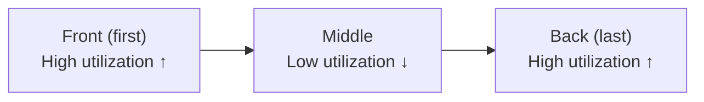
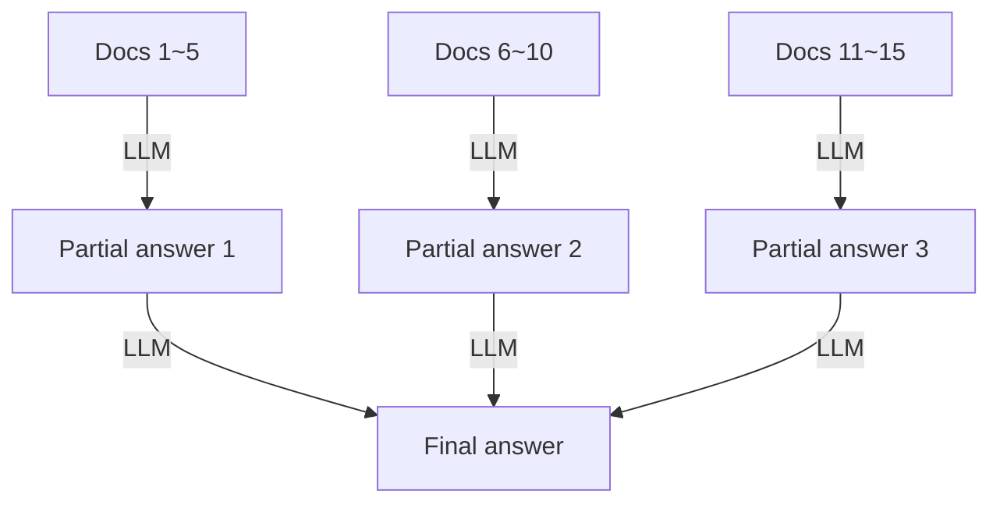

# Lost in the Middle

## Overview

**Lost in the Middle** is the phenomenon where LLMs processing long contexts **utilize information in the middle significantly less than information at the front/back**. Liu et al. (2023) first quantified this, and it is a characteristic that must be considered when designing RAG pipelines and long-document processing systems [1].



## Research Background: Liu et al. (2023)

The original paper "Lost in the Middle: How Language Models Use Long Contexts" (arXiv:2307.03172) [1] measured this phenomenon with two tasks:

1. **Multi-Document QA**: Measure performance while changing position of the answer document among multiple documents
2. **Key-Value Retrieval**: Find a specific key in a list of key-value pairs

### Key Findings

| Finding | Content |
|------|------|
| **U-shaped performance curve** | Performance highest when answer is at front/back of context, lowest in the middle |
| **Proportional to context length** | Middle utilization degradation worsens as context gets longer |
| **Same for long-context models** | Models trained to support long contexts show the same pattern |
| **Performance gap** | Up to 20%+ performance difference between optimal (front/back) vs worst (middle) position |

```python
# Experiment example: Exact Match scores by answer document position
# (20-document setup, Claude-2)
positions = [0, 4, 9, 14, 19]   # front → back index
em_scores  = [59, 41, 35, 38, 60]  # U-shape pattern confirmed
```

## Root Causes

### 1. Positional Attention Bias

Transformer attention mechanisms reflect patterns in training data. Most text has **conclusions or key information concentrated at the front/back**, so the model is assumed to have internalized this.

### 2. Primacy / Recency Effects

- **Primacy Effect**: High weight assigned to first-seen information
- **Recency Effect**: Better recall of most recently (last) seen information

These two effects combine to relatively dilute the middle.

### 3. Information Dilution with Context Length

As token count increases, attention values for specific positions disperse, reducing attention that individual tokens in the middle receive.

## Avoidance Strategies

### Strategy 1: Place Important Information at Front/Back of Context

The most direct countermeasure. Documents or information critical to the answer are placed at the beginning or end of the context.

```
# Recommended structure (answer document is #1 among 20 documents)
[Answer document]  ← placed at front (utilization ↑)
[Related document 2]
[Related document 3]
...
[Related document 20]

# Or
[Related document 1]
...
[Related document 19]
[Answer document]  ← placed at back (utilization ↑)
```

**RAG pipeline application**:

```python
def reorder_for_primacy_recency(docs: list, scores: list) -> list:
    """Place most relevant docs at front/back, less relevant in middle"""
    ranked = sorted(zip(docs, scores), key=lambda x: x[1], reverse=True)
    top_docs = [d for d, _ in ranked[:3]]    # top 3
    low_docs = [d for d, _ in ranked[3:]]    # rest
    # Top half at front, rest in middle, remaining top at back
    mid = len(top_docs) // 2
    return top_docs[:mid] + low_docs + top_docs[mid:]
```

### Strategy 2: Query-Aware Contextualization

Method proposed by Liu et al. (2024) [2]. Place the query **both before and after** the context so the model recognizes the objective at any position.

```
# Standard approach
{context}
Question: {question}

# Query-Aware Contextualization
Question: {question}
---
{context}
---
Based on the above, answer this question: {question}
```

### Strategy 3: Emphasize Important Info with Structured Markup

Use XML tags, headers, and separators to explicitly mark critical information sections. This is because models use structural signals as attention cues.

```xml
<!-- Emphasize important info with markup -->
<important>
Refer to information in this section with highest priority.
[Key document content]
</important>

<supporting_context>
[Supporting documents...]
</supporting_context>

<key_reminder>
Be sure to utilize the <important> section above when answering.
</key_reminder>
```

### Strategy 4: Minimize Context Size (Context Compression)

Removing unnecessary documents eliminates the middle problem at its source. See [[en/AI/Engineering/Context_Engineering/Context_Compression|Context Compression]].

```
Principle: "Put only necessary documents in context"

- Remove low-relevance documents with Reranker
- Remove unnecessary tokens within each document with LLM Lingua
- Minimize chunk size
```

### Strategy 5: Multi-Query and Split Processing (MapReduce)

Instead of processing the entire context at once, split by chunk, process separately, then combine. Since information is at the front/back of each chunk, the Lost in the Middle problem doesn't occur.



### Strategy 6: Optimize Document Order with Reranking

When reordering documents by relevance score in the Reranking step of [[en/AI/Engineering/Context_Engineering/Retrieval_Strategies/RAG/Advanced_Retrieval|Advanced Retrieval]], instead of simply sorting in descending order, apply the front/back placement principle from Strategy 1.

## Current Status: Improvements in Latest Models

Latest long-context models have partially improved the Lost in the Middle phenomenon, but it is **not completely resolved** [3][4].

```
Improvement trend by model (Multi-Doc QA, middle position performance):
  GPT-3.5-Turbo (2023):  ~35% Exact Match
  Claude-2 (2023):        ~38% Exact Match
  GPT-4 (2024):           ~50% Exact Match (improved)
  Latest models (2025~):  Further improved but front/back still advantaged
```

That is, even as models advance, **the front/back placement principle remains a valid design guideline**.

## Role in AI Engineering

Lost in the Middle is a trap that's easy to overlook in RAG pipeline design. Even if a good Retriever and Reranker are built, **neglecting the final document order design sent to the LLM degrades performance**. Especially as context windows grow to hundreds of thousands of tokens, this problem becomes more prominent, so logic for explicitly optimizing context order must be included in the pipeline.

## Related Concepts
[[en/AI/Engineering/Context_Engineering/Context_Engineering|Context Engineering]] · [[en/AI/Engineering/Context_Engineering/Context_Compression|Context Compression]] · [[en/AI/Engineering/Context_Engineering/Retrieval_Strategies/RAG/Advanced_Retrieval|Advanced Retrieval]] · [[en/AI/Engineering/Context_Engineering/Retrieval_Strategies/RAG/Chunking_Strategies|Chunking Strategies]]

## Sources
1. Liu et al. (2023) "Lost in the Middle: How Language Models Use Long Contexts" — [arXiv:2307.03172](https://arxiv.org/abs/2307.03172)
2. Towards AI: "Lost in the Middle: How Context Engineering Solves AI's Long-Context Problem" — [pub.towardsai.net](https://pub.towardsai.net/why-language-models-are-lost-in-the-middle-629b20d86152)
3. arXiv (2025): "Lost in the Middle: An Emergent Property from Information Retrieval Demands in LLMs" — [arxiv.org/html/2510.10276v1](https://arxiv.org/html/2510.10276v1)
4. arXiv (2025): "What Works for 'Lost-in-the-Middle' in LLMs? A Study on GM-Extract and Mitigations" — [arxiv.org/html/2511.13900v1](https://arxiv.org/html/2511.13900v1)
5. GitHub: "lost-in-the-middle (Nelson Liu)" — [github.com/nelson-liu/lost-in-the-middle](https://github.com/nelson-liu/lost-in-the-middle)
