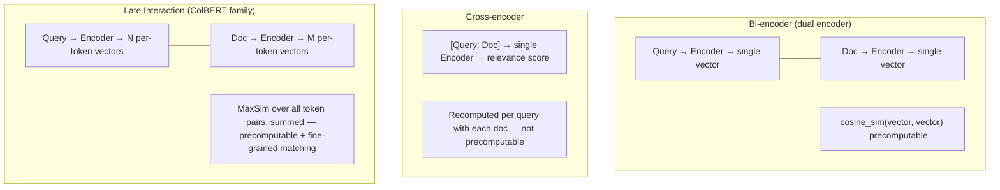

# Embedding & Reranker Models

## Overview

Everything RAG, GraphRAG, and semantic search do rests on **embedding models**. Every Retrieval Strategies document in this wiki (Chunking, Vector Storage, Advanced Retrieval, Agentic RAG, etc.) assumes "good embeddings already exist" and designs its retrieval pipeline on top of that assumption. This document addresses the assumption itself — **how to choose an embedding model, why a particular architecture is chosen, and how to divide labor with rerankers.**

```
Embedding = lossy compression that maps heterogeneous data (text/image/audio) into a shared vector space
  Semantic similarity = geometric distance (the same principle as latitude/longitude being a 2D embedding of location)
  Embeddings produced by different models are not compatible with each other → the entire pipeline must pin one version
```

## 3 Architectures: Bi-encoder vs Cross-encoder vs Late Interaction



| | Bi-encoder | Cross-encoder | Late Interaction (ColBERT) |
|---|---|---|---|
| **When computed** | Query/doc encoded independently (precomputed) | Query+doc fed together (real-time) | Query/doc encoded independently, per-token vectors kept |
| **Speed** | Very fast (ANN index possible) | Slow (one forward pass per candidate) | Medium (more storage/compute than bi-encoder) |
| **Accuracy** | Medium (whole sentence collapsed to one vector) | High (token-level interaction) | High (token-level interaction + precomputable) |
| **Use** | First-pass retrieval (Top-K from a large candidate pool) | Reranking (reorder a small candidate set) | First-pass retrieval + fine-grained matching at once |
| **Representative models** | Sentence-BERT, E5, Gemini/OpenAI embeddings | Cohere Rerank, bge-reranker, Qwen3-Reranker, evolutions of Vertex's two-tower encoder | ColBERT (Khattab & Zaharia, 2020), XTR (Lee, 2023), ColPali (Faysse, 2024) |

**Practical pattern**: first-pass retrieval over a large candidate pool with a bi-encoder (Top-100~500) → reorder with a cross-encoder or late-interaction model (Top-5~20). See [[en/AI/Engineering/Context_Engineering/Retrieval_Strategies/RAG/Advanced_Retrieval|Advanced Retrieval]] for where the reranking stage sits in the pipeline.

## Matryoshka Representation Learning — Choosing Dimensions

**Matryoshka Embedding** (Kusupati et al., 2022) trains multiple resolutions of representation nested inside a single embedding vector. Like a Russian nesting doll, truncating just the first N dimensions of the vector still yields a valid embedding on its own.

```
Full vector: [d1, d2, d3, ..., d3072]  (e.g. a 3072-dim model)
  Using only the first 1024 dims → 1/3 the storage, ~2% quality drop
  Using only the first 256 dims  → 1/12 the storage, larger quality drop but still usable

→ Different truncation points can be used at different serving stages:
  Coarse first-pass filtering = 256 dims (fast, cheap)
  Final reranking             = full dims (accurate)
```

Truncating from 3072→1024 dims cuts vector-DB storage cost to roughly 1/3 while quality drops only about 2% — a trade-off repeatedly observed in practice. Since 2025, Matryoshka Quantization has combined this with quantization to push storage costs down further.

## Benchmarks: MTEB / BEIR and Their Limits

- **BEIR** (Benchmarking IR, zero-shot retrieval): the standard for measuring domain-transfer performance
- **MTEB** (Massive Text Embedding Benchmark): a leaderboard combining retrieval with classification, clustering, similarity, and more. Original BERT's BEIR score of ~10.6 has climbed to a top-model average of 55.7 as of 2025
- **Metrics**: Precision@k (fraction of retrieved items that are relevant), Recall@k (fraction of all relevant items that were retrieved), nDCG (a normalized score that also accounts for ranking order)

**Limits**: MTEB/BEIR are based on public benchmark datasets, so their distribution can differ from a real domain (internal legal documents, medical records, etc.). It's common for the leaderboard's #1 model to underperform a lower-ranked model on a specific domain — **benchmarks are for shortlisting candidates, not for the final decision.** Always re-validate on your own golden set (see [[en/AI/Engineering/Agent_Engineering/Eval_Driven_Development_and_Agent_Workbench|Eval-Driven Development & Agent Workbench]] for how to build one).

## Domain Fine-Tuning

General-purpose embedding models degrade on specialized terminology, internal jargon, and legal/medical domains. Countermeasures:

```python
# Contrastive fine-tuning conceptual flow
# Trained on <anchor(query), positive(correct doc), [negatives(wrong docs)]> triples
# Goal: pull positive close to anchor, push negative away

# Hard negative mining: instead of random wrong answers,
# find documents that "look similar on the surface but are semantically wrong" and use them as negatives
# → the decision boundary becomes far more precise
```

- **Data sources**: human-labeled query-document pairs, synthetic data (LLM-generated queries — the Gecko paper's approach of LLM-synthesized Q-D pairs), extraction from existing search logs
- **Considerations for non-English/Korean embeddings**: multilingual models (BGE-M3, multilingual-e5) tend to have lower token efficiency and ambiguous morpheme boundaries for languages like Korean compared to English, which affects chunking and embedding quality. Language-specific models (e.g. KoSimCSE, KURE for Korean) or multilingual models re-fine-tuned on a language-specific corpus are often more reliable in practice.

## Reranker Models

| Model | Approach | Notes |
|------|------|------|
| **Cohere Rerank** | Cross-encoder (API) | Multilingual, no separate infrastructure needed |
| **bge-reranker** | Cross-encoder (open source) | Self-hosted, multiple sizes (base/large) |
| **Qwen3-Reranker** | Cross-encoder (open source) | Latest generation, multilingual, long-context support |
| **ColBERT/ColPali family** | Late Interaction | Same model can handle first-pass retrieval and reranking |

Where a reranker sits in the pipeline and how it combines with techniques like RRF (Reciprocal Rank Fusion) is covered in [[en/AI/Engineering/Context_Engineering/Retrieval_Strategies/RAG/Advanced_Retrieval|Advanced Retrieval]] — this document focuses on **the selection criteria for the reranker model itself**.

## Boundaries

| Document | Covers |
|------|-----------|
| **This document (Embedding_Models)** | Architecture taxonomy, benchmark interpretation, dimension selection, and fine-tuning of the embedding/reranker **models themselves** |
| [[en/AI/Engineering/Context_Engineering/Retrieval_Strategies/RAG/Vector_Storage\|Vector Storage]] | Infrastructure for **storing** embeddings — ANN indexes (HNSW/FAISS/ScaNN), vector DB product selection |
| [[en/AI/Engineering/Context_Engineering/Retrieval_Strategies/RAG/Advanced_Retrieval\|Advanced Retrieval]] | How to place reranking and query transformation within the retrieval **pipeline** |

## Role in AI Engineering

Every retrieval-related document in this wiki — RAG, GraphRAG, semantic cache, Agentic RAG — ultimately rests on the premise that "good embeddings already exist." If that premise goes unexamined while only the retrieval pipeline is refined, no amount of improvement to reranking, chunking, or query transformation can lift the ceiling set by the embedding model's representational power. Choosing an embedding model is a decision that RAG projects tend to make first and revisit last — often the wrong order.

## Related Concepts
[[en/AI/Engineering/Context_Engineering/Retrieval_Strategies/RAG/Vector_Storage|Vector Storage]] · [[en/AI/Engineering/Context_Engineering/Retrieval_Strategies/RAG/Advanced_Retrieval|Advanced Retrieval]] · [[en/AI/Engineering/Context_Engineering/Retrieval_Strategies/RAG/Multimodal_RAG|Multimodal RAG]] · [[en/AI/Engineering/Model_Engineering/Quantization|Model_Engineering/Quantization]]

## Sources
- [[en/AI/sources/whitepaper_emebddings_vectorstores_v2|Embeddings & Vector Stores]] (Google, Nawalgaria/Ren/Sugnet, Feb 2025 — existing wiki source)
- Kusupati et al. (2022) "Matryoshka Representation Learning" — [arXiv:2205.13147](https://arxiv.org/abs/2205.13147)
- Khattab & Zaharia (2020) "ColBERT: Efficient and Effective Passage Search via Contextualized Late Interaction over BERT" — [arXiv:2004.12832](https://arxiv.org/abs/2004.12832)
- Faysse et al. (2024) "ColPali: Efficient Document Retrieval with Vision Language Models" — [arXiv:2407.01449](https://arxiv.org/abs/2407.01449)
- Lee et al. (2024) "Gecko: Versatile Text Embeddings Distilled from Large Language Models" — [arXiv:2403.20327](https://arxiv.org/abs/2403.20327)
- MTEB Leaderboard — [huggingface.co/spaces/mteb/leaderboard](https://huggingface.co/spaces/mteb/leaderboard)
