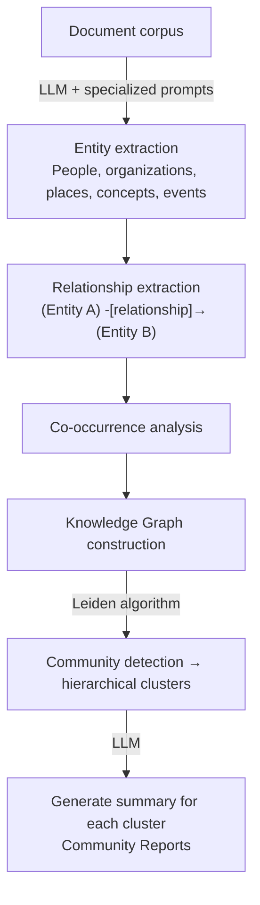

# Graph RAG

## Overview

**Graph RAG** leverages the structural relationship information of Knowledge Graphs for RAG retrieval, enabling **complex multi-hop reasoning** and **global topic summarization** that conventional vector-based RAG struggles with.

## Origin

- **Developer**: Microsoft Research
- **Release**: Blog announcement February 2024, open-sourced on GitHub July 2024 (20,000+ stars)
- **Paper**: "From Local to Global: A Graph RAG Approach to Query-Focused Summarization" — [arXiv:2404.16130](https://arxiv.org/abs/2404.16130)
- **Implementation**: [github.com/microsoft/graphrag](https://github.com/microsoft/graphrag)

## Limitations of Traditional RAG

```
Traditional vector RAG:
  Question: "What are the most important themes in this dataset?"
  → Vector search cannot "trace connections"
  → Difficulty recognizing patterns spanning multiple documents
  → No global understanding

Graph RAG solution:
  → Knowledge graph captures structure of entire dataset
  → Can identify global themes through semantic clusters
  → Multi-hop reasoning along paths between entities
```

## How It Works

### Phase 1: Knowledge Graph Construction



### Phase 2: Query Processing (Two Modes)

#### Local Search
Specific questions about particular entities:
```
Question: "Who is Apple's CEO and what is their career?"

1. Entity mapping: "Apple" → graph node
2. 1~2-hop neighbor traversal: CEO, board, related people
3. Search relevant Community Reports
4. Combine to generate LLM final answer
```

#### Global Search
Summary/analysis questions spanning the entire dataset:
```
Question: "What are the main themes covered in this report?"

1. Use all Community Reports
2. Map stage: generate answers from each community report
3. Reduce stage: synthesize all answers into global answer
(MapReduce pattern)
```

## Implementation Example (Microsoft GraphRAG)

```python
# Install
# pip install graphrag

# Indexing (graph construction)
# graphrag index --root ./myproject

# Query
from graphrag.query.api import global_search, local_search

# Local search
result = local_search(
    root_dir="./myproject",
    query="What are Tesla's main products?",
    community_level=2
)

# Global search
result = global_search(
    root_dir="./myproject",
    query="What are the main themes of this dataset?",
    response_type="Multiple Paragraphs"
)
```

## Performance Characteristics

Microsoft's evaluation (Podcast transcript, News article):
- **Comprehensiveness**: GraphRAG +16.3% (vs Vector RAG)
- **Diversity**: GraphRAG +62.9%
- **Empowerment**: GraphRAG +35.5%
- **Directness**: Vector RAG +25% (GraphRAG is more comprehensive)

**Cost**: Heavy LLM API usage during indexing → high cost. Even medium corpora with GPT-4 can cost tens to hundreds of dollars.

## Neo4j GraphRAG

Neo4j also provides LPG-based GraphRAG implementation:
```python
from neo4j_graphrag.retrievers import VectorCypherRetriever

retriever = VectorCypherRetriever(
    driver=neo4j_driver,
    index_name="document_embeddings",
    retrieval_query="""
    MATCH (node)-[:MENTIONS]->(entity)
    OPTIONAL MATCH (entity)-[r]-(related)
    RETURN node.text, entity.name, type(r), related.name
    """,
    embedder=OpenAIEmbeddings()
)
```

## Graph RAG vs Vector RAG

| Criterion | Vector RAG | Graph RAG |
|-----------|-----------|-----------|
| **Search method** | Semantic similarity | Graph traversal + similarity |
| **Multi-hop** | Difficult | Natural |
| **Global summarization** | Not possible | Possible |
| **Build cost** | Low | High (LLM entity extraction) |
| **Query speed** | Fast | Slow |
| **Best case** | Specific fact retrieval | Complex analysis, topic discovery |

## Role in AI Engineering

Graph RAG is powerful for **extracting insights** from large-scale unstructured enterprise data. For analytical questions like "What are the key risk factors in this quarter's reports?" vector RAG has limitations but Graph RAG can answer effectively. However, due to high build cost, it should be selectively applied to high-value use cases.

## Knowledge Graph Sub-documents

GraphRAG is based on Knowledge Graph concepts. Related sub-documents:

| Document | Content |
|----------|---------|
| [[en/AI/Engineering/Context_Engineering/Retrieval_Strategies/GraphRAG/Knowledge_Graph/Knowledge_Graph\|Knowledge Graph]] | Knowledge graph overview — triples, entity-relationship model |
| [[en/AI/Engineering/Context_Engineering/Retrieval_Strategies/GraphRAG/Knowledge_Graph/LPG_and_RDF\|LPG & RDF]] | Labeled Property Graph (Neo4j) vs RDF (SPARQL) |
| [[en/AI/Engineering/Context_Engineering/Retrieval_Strategies/GraphRAG/Knowledge_Graph/Ontology\|Ontology]] | OWL ontology, domain ontology, inference engines |

Graph RAG's Phase 1 (knowledge graph construction) is an LLM-automated version of the traditional Knowledge Graph concepts above. Unlike the traditional approach of manually constructing Knowledge Graphs, LLMs automatically extract entities and relationships from documents.

## Related Concepts
[[en/AI/Engineering/Context_Engineering/Retrieval_Strategies/GraphRAG/Knowledge_Graph/LPG_and_RDF|LPG & RDF]] · [[en/AI/Engineering/Context_Engineering/Retrieval_Strategies/GraphRAG/Knowledge_Graph/Ontology|Ontology]] · [[en/AI/Engineering/Context_Engineering/Retrieval_Strategies/RAG/Advanced_Retrieval|Advanced Retrieval]] · [[en/AI/Engineering/Context_Engineering/Retrieval_Strategies/RAG/Vector_Storage|Vector Storage]] · [[en/AI/Engineering/Context_Engineering/Retrieval_Strategies/Retrieval_Strategies|Retrieval Strategies]]

## Sources
- Microsoft Research "GraphRAG: Unlocking LLM discovery on narrative private data" — [microsoft.com](https://www.microsoft.com/en-us/research/blog/graphrag-unlocking-llm-discovery-on-narrative-private-data/)
- Edge et al. (2024) "From Local to Global: A Graph RAG Approach" — [arXiv:2404.16130](https://arxiv.org/abs/2404.16130)
- Neo4j "The GraphRAG Manifesto" — [neo4j.com](https://neo4j.com/blog/genai/graphrag-manifesto/)
- GitHub microsoft/graphrag — [github.com](https://github.com/microsoft/graphrag)
