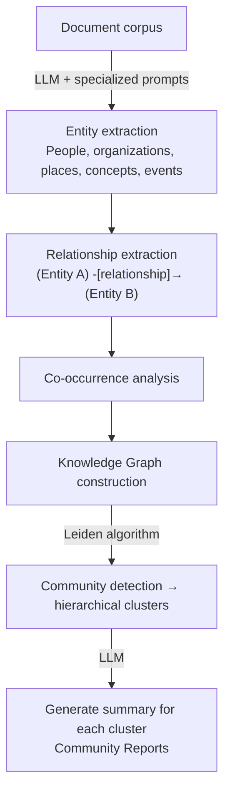

# Graph RAG

## Overview

**Graph RAG** leverages the structural relationship information of Knowledge Graphs for RAG retrieval, enabling **complex multi-hop reasoning** and **global topic summarization** that conventional vector-based RAG struggles with.

## Origin

- **Developer**: Microsoft Research
- **Release**: Blog announcement February 2024, open-sourced on GitHub July 2024 (20,000+ stars)
- **Paper**: "From Local to Global: A Graph RAG Approach to Query-Focused Summarization" — [arXiv:2404.16130](https://arxiv.org/abs/2404.16130)
- **Implementation**: [github.com/microsoft/graphrag](https://github.com/microsoft/graphrag)

## Limitations of Traditional RAG

```
Traditional vector RAG:
  Question: "What are the most important themes in this dataset?"
  → Vector search cannot "trace connections"
  → Difficulty recognizing patterns spanning multiple documents
  → No global understanding

Graph RAG solution:
  → Knowledge graph captures structure of entire dataset
  → Can identify global themes through semantic clusters
  → Multi-hop reasoning along paths between entities
```

## How It Works

### Phase 1: Knowledge Graph Construction


```mermaid
flowchart TD
    DOC[Document corpus] -->|LLM + specialized prompts| ENT["Entity extraction<br/>People, organizations, places, concepts, events"]
    ENT --> REL["Relationship extraction<br/>(Entity A) -[relationship]→ (Entity B)"]
    REL --> CO["Co-occurrence analysis"]
    CO --> KG[Knowledge Graph construction]
    KG -->|Leiden algorithm| COM["Community detection → hierarchical clusters"]
    COM -->|LLM| CR["Generate summary for each cluster<br/>Community Reports"]
```

### Phase 2: Query Processing (Two Modes)

#### Local Search
Specific questions about particular entities:
```
Question: "Who is Apple's CEO and what is their career?"

1. Entity mapping: "Apple" → graph node
2. 1~2-hop neighbor traversal: CEO, board, related people
3. Search relevant Community Reports
4. Combine to generate LLM final answer
```

#### Global Search
Summary/analysis questions spanning the entire dataset:
```
Question: "What are the main themes covered in this report?"

1. Use all Community Reports
2. Map stage: generate answers from each community report
3. Reduce stage: synthesize all answers into global answer
(MapReduce pattern)
```

#### DRIFT Search (Hybrid Search)
A third mode Microsoft added to compensate for the weaknesses of Local and Global Search — local search misses global context, global search misses fine-grained facts:
```
DRIFT = Dynamic Reasoning and Inference with Flexible Traversal

1. Generate an initial answer "seed" from Community Reports (establishes global-level context)
2. Use the seed to generate follow-up questions, exploring down to specific entities via Local Search
3. Flexibly traverse the graph as needed to refine the answer
```
Reported to outperform vector RAG, DRIFT aims to capture the strengths of both Local and Global search.

## Implementation Example (Microsoft GraphRAG)

```python
# Install
# pip install graphrag

# Indexing (graph construction)
# graphrag index --root ./myproject

# Query
from graphrag.query.api import global_search, local_search

# Local search
result = local_search(
    root_dir="./myproject",
    query="What are Tesla's main products?",
    community_level=2
)

# Global search
result = global_search(
    root_dir="./myproject",
    query="What are the main themes of this dataset?",
    response_type="Multiple Paragraphs"
)
```

## Performance Characteristics

Microsoft's evaluation (Podcast transcript, News article):
- **Comprehensiveness**: GraphRAG +16.3% (vs Vector RAG)
- **Diversity**: GraphRAG +62.9%
- **Empowerment**: GraphRAG +35.5%
- **Directness**: Vector RAG +25% (GraphRAG is more comprehensive)

**Cost**: Heavy LLM API usage during indexing → high cost. Even medium corpora with GPT-4 can cost tens to hundreds of dollars.

## Recent Development: LazyGraphRAG

A low-cost version of GraphRAG released by Microsoft Research in November 2024, directly addressing GraphRAG's biggest weakness — high build cost.

- **Core idea**: Skips LLM-based entity/relationship extraction at indexing time. Instead, graph traversal and summarization are performed lazily, **only as much as needed at query time**.
- **Cost**: Indexing cost is nearly identical to plain vector RAG — about 0.1% of full GraphRAG's cost. Query cost is over 700x cheaper than GraphRAG Global Search while maintaining comparable answer quality.
- **Adoption**: Integrated into Microsoft Discovery (an agentic platform for scientific research) and Azure services in 2025.

## Neo4j GraphRAG

Neo4j also provides LPG-based GraphRAG implementation:
```python
from neo4j_graphrag.retrievers import VectorCypherRetriever

retriever = VectorCypherRetriever(
    driver=neo4j_driver,
    index_name="document_embeddings",
    retrieval_query="""
    MATCH (node)-[:MENTIONS]->(entity)
    OPTIONAL MATCH (entity)-[r]-(related)
    RETURN node.text, entity.name, type(r), related.name
    """,
    embedder=OpenAIEmbeddings()
)
```

## Alternative Implementation: LightRAG

A widely-used open-source alternative to Microsoft GraphRAG. Guo et al. (2024, EMNLP 2025), [arXiv:2410.05779](https://arxiv.org/abs/2410.05779), [github.com/HKUDS/LightRAG](https://github.com/HKUDS/LightRAG).

- **Core idea**: **Dual-level retrieval** — for each query, generates both a low-level key (specific entities/relationships) and a high-level key (abstract topics), searching both simultaneously rather than splitting into separate Local/Global modes.
- **Architecture**: A lightweight dual-layer architecture combining graph structure with vector embeddings.
- **Advantages**: Lower indexing and query cost than Microsoft GraphRAG, with a lighter-weight implementation that has been widely adopted by the open-source community.

## Graph RAG vs Vector RAG

| Criterion | Vector RAG | Graph RAG |
|-----------|-----------|-----------|
| **Search method** | Semantic similarity | Graph traversal + similarity |
| **Multi-hop** | Difficult | Natural |
| **Global summarization** | Not possible | Possible |
| **Build cost** | Low | High (LLM entity extraction)¹ |
| **Query speed** | Fast | Slow |
| **Best case** | Specific fact retrieval | Complex analysis, topic discovery |

¹ Recent variants such as LazyGraphRAG and LightRAG substantially mitigate this build-cost problem.

## Practical Considerations and Limitations

- **Entity Resolution**: Entities are matched primarily by name. Failing to resolve name variants or distinguish entities that share a name fragments the graph, and this error compounds as reasoning traverses the graph.
- **Incremental Indexing**: Early GraphRAG required a full re-index whenever documents were added. Since v0.4.0 (November 2024), the `graphrag update` command extracts entities only from new documents and merges them into the existing graph.
- **Query Latency and Scalability**: Graph traversal and community-summary generation have been reported to add 2-3x higher end-to-end latency compared to vector RAG. As corpus size grows, the graph index and its summaries grow super-linearly, increasing memory overhead.

## Role in AI Engineering

Graph RAG is powerful for **extracting insights** from large-scale unstructured enterprise data. For analytical questions like "What are the key risk factors in this quarter's reports?" vector RAG has limitations but Graph RAG can answer effectively. However, due to high build cost, it should be selectively applied to high-value use cases.

## Knowledge Graph Sub-documents

GraphRAG is based on Knowledge Graph concepts. Related sub-documents:

| Document | Content |
|----------|---------|
| [[en/AI/Engineering/Context_Engineering/Retrieval_Strategies/GraphRAG/Knowledge_Graph/Knowledge_Graph\|Knowledge Graph]] | Knowledge graph overview — triples, entity-relationship model |
| [[en/AI/Engineering/Context_Engineering/Retrieval_Strategies/GraphRAG/Knowledge_Graph/LPG_and_RDF\|LPG & RDF]] | Labeled Property Graph (Neo4j) vs RDF (SPARQL) |
| [[en/AI/Engineering/Context_Engineering/Retrieval_Strategies/GraphRAG/Knowledge_Graph/Ontology\|Ontology]] | OWL ontology, domain ontology, inference engines |

Graph RAG's Phase 1 (knowledge graph construction) is an LLM-automated version of the traditional Knowledge Graph concepts above. Unlike the traditional approach of manually constructing Knowledge Graphs, LLMs automatically extract entities and relationships from documents.

## Related Concepts
[[en/AI/Engineering/Context_Engineering/Retrieval_Strategies/GraphRAG/Knowledge_Graph/LPG_and_RDF|LPG & RDF]] · [[en/AI/Engineering/Context_Engineering/Retrieval_Strategies/GraphRAG/Knowledge_Graph/Ontology|Ontology]] · [[en/AI/Engineering/Context_Engineering/Retrieval_Strategies/RAG/Advanced_Retrieval|Advanced Retrieval]] · [[en/AI/Engineering/Context_Engineering/Retrieval_Strategies/RAG/Vector_Storage|Vector Storage]] · [[en/AI/Engineering/Context_Engineering/Retrieval_Strategies/Retrieval_Strategies|Retrieval Strategies]]

## Sources
- Microsoft Research "GraphRAG: Unlocking LLM discovery on narrative private data" — [microsoft.com](https://www.microsoft.com/en-us/research/blog/graphrag-unlocking-llm-discovery-on-narrative-private-data/)
- Edge et al. (2024) "From Local to Global: A Graph RAG Approach" — [arXiv:2404.16130](https://arxiv.org/abs/2404.16130)
- Neo4j "The GraphRAG Manifesto" — [neo4j.com](https://neo4j.com/blog/genai/graphrag-manifesto/)
- GitHub microsoft/graphrag — [github.com](https://github.com/microsoft/graphrag)
- Microsoft Research "LazyGraphRAG: Setting a new standard for quality and cost" — [microsoft.com](https://www.microsoft.com/en-us/research/blog/lazygraphrag-setting-a-new-standard-for-quality-and-cost/)
- Guo et al. (2024) "LightRAG: Simple and Fast Retrieval-Augmented Generation" — [arXiv:2410.05779](https://arxiv.org/abs/2410.05779)
- GitHub HKUDS/LightRAG — [github.com](https://github.com/HKUDS/LightRAG)
