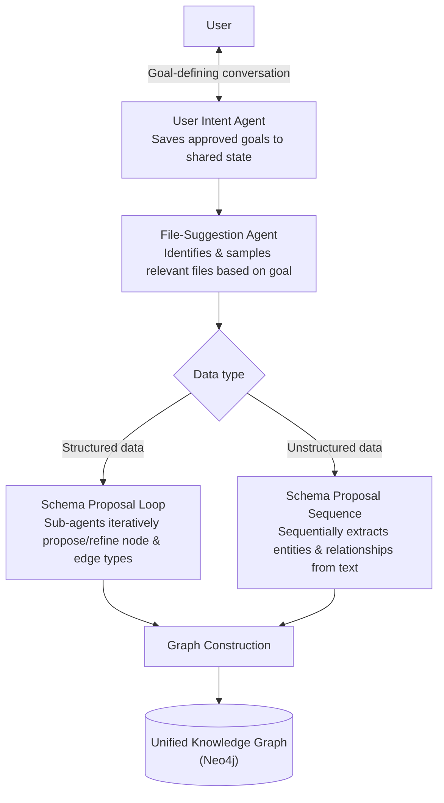

# Agentic Knowledge Graph Construction

## Overview

**Agentic Knowledge Graph Construction** is an approach that delegates the process of building a knowledge graph from raw data (structured + unstructured) to a **multi-agent system**. Traditional KG construction relied on humans manually designing schemas, extracting entities, and mapping relationships, or on fixed ETL pipelines. In this approach, an agent that understands the user's goal, an agent that finds relevant files, and agents that propose and refine schemas collaborate to build the graph automatically.



## Origin

- **Course**: "Agentic Knowledge Graph Construction" — DeepLearning.AI
- **Instructor**: Andreas Kollegger (Neo4j, Lead for GenAI Innovation)
- **Format**: Intermediate level, 12 video lessons (3h 8m total), 8 code examples, 1 graded assignment
- **Tools used**: Google's **Agent Development Kit (ADK)** for multi-agent orchestration, **Neo4j** for graph storage; Cypher knowledge helps but isn't required

## 4-Stage Pipeline

Unlike conventional RAG, which only splits documents into chunks for a vector store, this pipeline **also places chunks inside the graph structure** — for example, a product-review chunk gets connected to the corresponding product node.

```
① User Intent Agent
   Converses with the user to clarify "what do you want to do with this KG"
   → Saves the approved goal to shared state

② File-Suggestion Agent
   Identifies relevant data files based on the goal
   → Samples file contents to verify fit → Maintains an approved file list

③ Schema Proposal Agents (two tracks)
   Structured data: A loop of sub-agents iteratively proposes and refines node/edge types (schema)
   Unstructured data: A sequential workflow extracts entities and relationships from text

④ Graph Construction
   Builds the graph from the proposed schema
   → Connects the structured graph and unstructured graph into one unified Knowledge Graph
```

**One conversational agent + multiple sub-agentic workflows** — a single conversational agent that identifies the user's goal collaborates, via **shared state**, with several sub-agentic workflows that process structured and unstructured data. Work that a human used to do by hand — designing the schema and writing extraction rules every time — is automated into an agent pipeline: define goal → explore data → propose schema → construct.

## Comparison with Manual Construction

| | Manual KG Construction | Agentic KG Construction |
|---|---|---|
| Schema design | Pre-designed by domain experts | Schema Proposal Agent iteratively proposes/refines based on the data |
| Target file selection | Manually specified by a person | File-Suggestion Agent explores based on the goal |
| Structured/unstructured handling | Separate pipelines, manual integration | Both tracks processed in parallel, then auto-merged |
| Iterative improvement | Redesign from scratch | Approved goals/files/schema accumulate in shared state, refinement continues on re-request |

## Role in AI Engineering

Agentic KG Construction applies the coordination patterns covered in [[en/AI/Engineering/Agent_Engineering/Multi_Agent_Coordination|Multi-Agent Coordination]] (role specialization, shared memory/Blackboard patterns) to the concrete domain of building a [[en/AI/Engineering/Context_Engineering/Retrieval_Strategies/GraphRAG/Knowledge_Graph/Knowledge_Graph|Knowledge Graph]]/[[en/AI/Engineering/Context_Engineering/Retrieval_Strategies/GraphRAG/Knowledge_Graph/Ontology|Ontology]]. If Context Engineering answers "what structural knowledge should we give the LLM," this approach answers "how do we organize agents to build that structural knowledge themselves" — it's also a concrete case where the node-type distinctions (conversational agent, sequential workflow, iterative loop) covered in [[en/AI/Engineering/Graph_Engineering/Multi_Agent_Topology|Multi-Agent Topology]] apply directly.

## Related Concepts
[[en/AI/Engineering/Context_Engineering/Retrieval_Strategies/GraphRAG/Knowledge_Graph/Knowledge_Graph|Knowledge Graph]] · [[en/AI/Engineering/Context_Engineering/Retrieval_Strategies/GraphRAG/Knowledge_Graph/Ontology|Ontology]] · [[en/AI/Engineering/Context_Engineering/Retrieval_Strategies/GraphRAG/Knowledge_Graph/LPG_and_RDF|LPG & RDF]] · [[en/AI/Engineering/Agent_Engineering/Multi_Agent_Coordination|Multi-Agent Coordination]] · [[en/AI/Engineering/Agent_Engineering/Agent_Frameworks|Agent Frameworks]] · [[en/AI/Engineering/Graph_Engineering/Multi_Agent_Topology|Multi-Agent Topology]]

## Sources
- DeepLearning.AI, ["Agentic Knowledge Graph Construction"](https://www.deeplearning.ai/courses/agentic-knowledge-graph-construction) — Andreas Kollegger (Neo4j), 2026
