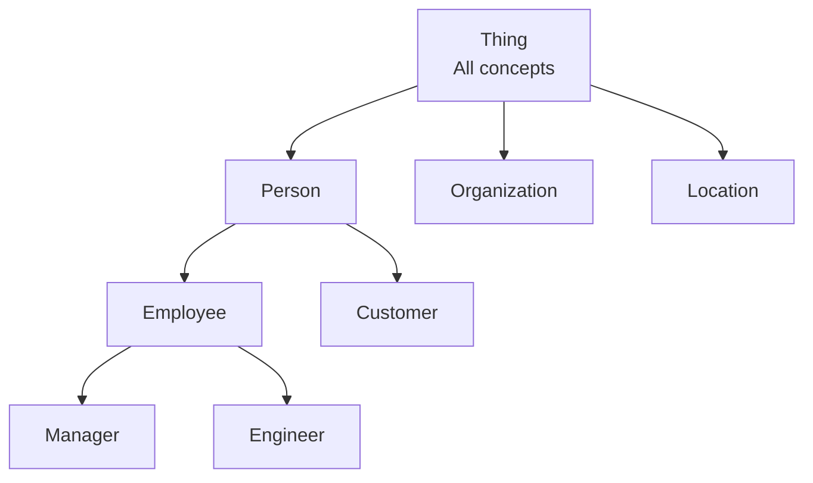

# Ontology

## Overview

An **Ontology** is a **formal specification of a knowledge system** that formally defines the concepts (Classes), properties (Properties), and relationships (Relationships) of a specific domain. It describes "what things are and what relationships they have" in a form that machines can understand and reason about.

## Etymology and Origins

- **Philosophical origin**: Greek "ontos (being)" + "logos (theory)" = study of being
- **Introduction to computer science**: Tom Gruber (1993) "A translation approach to portable ontology specifications" — defined in AI as "explicit specification of shared conceptualization"
- **Semantic web standard**: W3C OWL (2004, 2012)

## Ontology Components

### Classes
Major conceptual categories in a domain:
```owl
# OWL/Turtle representation
ex:Person rdf:type owl:Class .
ex:Organization rdf:type owl:Class .
ex:Employee rdfs:subClassOf ex:Person .
```

### Properties
Relationships between two classes (Object Property) or data values (Datatype Property):
```owl
ex:worksFor rdf:type owl:ObjectProperty .
ex:worksFor rdfs:domain ex:Employee .
ex:worksFor rdfs:range ex:Organization .

ex:hasAge rdf:type owl:DatatypeProperty .
ex:hasAge rdfs:range xsd:integer .
```

### Individuals
Actual instances of classes:
```owl
ex:John_Doe rdf:type ex:Employee .
ex:John_Doe ex:worksFor ex:Acme_Corp .
ex:John_Doe ex:hasAge "30"^^xsd:integer .
```

### Axioms
Logical constraints:
```owl
# A person can have only one direct manager
ex:hasDirectManager rdf:type owl:FunctionalProperty .

# Synonym relationship
ex:Employee owl:equivalentClass ex:Worker .
```

## Ontology Hierarchy



## Reasoning

The most powerful feature of ontologies. Logically infers facts not explicitly entered:

```
Input:
  John_Doe rdf:type Employee
  All Employees are Persons

Inference:
  → John_Doe rdf:type Person (automatic inference)

Input:
  John_Doe worksFor Acme_Corp
  Acme_Corp rdf:type KoreanCompany

Inference:
  → John_Doe works for a Korean company (automatic inference)
```

**Reasoners**: Pellet, HermiT, FaCT++ (OWL DL reasoners)

## Major Domain Ontologies

| Domain | Ontology | Purpose |
|--------|----------|---------|
| **Medical** | SNOMED CT, ICD-11 | Medical terminology standardization |
| **Bioinformatics** | Gene Ontology (GO) | Gene function classification |
| **Legal** | LKIF, Akoma Ntoso | Legal document structuring |
| **Enterprise** | GS1, Schema.org | Product/business description |
| **Web** | Dublin Core, FOAF | Web metadata |

## Ontologies in the LLM Era

### Role Shift
```
Traditional: Ontology = meaning repository for knowledge
LLM era: Ontology = structural guide for LLMs

Use patterns:
1. Ontology-based prompt construction
   "Extract entities based on Person, Organization, Location classes"

2. Using ontologies to validate LLM output
   LLM extraction results → ontology constraint validation

3. Automated ontology generation (using LLMs)
   Documents → LLM → propose new ontology classes/relationships
```

### Ontology Management Combined with LLMs
Automating ontology construction/maintenance with GPT-4, Claude, etc.:
```python
prompt = """
Extract new classes and relationships from the following medical document
and propose them in OWL Turtle format:
{medical_document}
"""
```

## Role in AI Engineering

Ontologies clearly define domain knowledge **in a form machines can understand**. Combined with Knowledge Graphs, they give AI systems reasoning capabilities and are used to improve retrieval precision in RAG pipelines. In Graph RAG systems, ontologies serve as the **schema** for entities and relationships extracted by LLMs.

## Related Concepts
[[en/AI/Engineering/Context_Engineering/Retrieval_Strategies/GraphRAG/Knowledge_Graph/LPG_and_RDF|LPG & RDF]] · [[en/AI/Engineering/Context_Engineering/Retrieval_Strategies/GraphRAG/GraphRAG|GraphRAG]] · [[en/AI/Engineering/Context_Engineering/Retrieval_Strategies/GraphRAG/Knowledge_Graph/Knowledge_Graph|Knowledge Graph]]

## Sources
- Gruber (1993) "A translation approach to portable ontology specifications"
- W3C OWL 2 Web Ontology Language — [w3.org/OWL](https://www.w3.org/OWL/)
- Pavlyshyn "Ontology vs Graph Database. LLM Agents as Reasoners" — [Substack](https://volodymyrpavlyshyn.substack.com/p/ontology-vs-graph-database-llm-agents)
