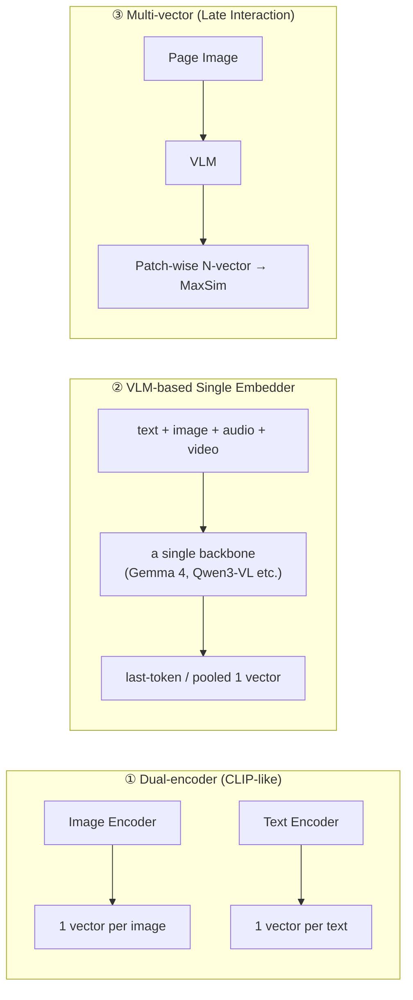

# Multimodal Embedding Models

## Overview

**Multimodal embedding models** map inputs of different forms, such as text, images, audio, video, and PDF pages, into **a single shared vector space**. Since "picture of a cat" and "a cat" with the same meaning become close vectors, cross-modal search—finding images with text queries or finding documents with video clips—becomes possible with a single ANN index. The architecture, dimension, and benchmark discussions for text embeddings are covered in [[en/AI/Engineering/Context_Engineering/Retrieval_Strategies/Embedding_Models|Embedding_Models]], and this document addresses the issues that arise when modalities are increased—**alignment methods, modality gap, model lineage, and evaluation**.

```
Text embedding: text ──► Encoder ──► Vector
Multimodal embedding: text / image / audio / video / PDF ──► (Modality-specific encoder + shared backbone) ──► vectors in the same space
  → Alignment learning is necessary for the distance comparison between modalities to have meaning
```

## Learning Methods: Alignment

| Method | Core | Notes |
|------|------|------|
| **CLIP** (Radford, 2021) | InfoNCE (softmax contrastive) in image-caption pairs — pull correct pairs closer, push others further within the batch | Requires softmax normalization over the entire batch, leading to high communication costs for large batches |
| **SigLIP / SigLIP 2** (Google) | Independent **sigmoid loss** for each pair — no global normalization required | Stable even with small batches, currently a standard choice for vision encoders |
| **ImageBind** (Meta, 2023) | Aligns audio, depth, IMU, etc., into the image space using images as "glue" | Indirectly aligns modality combinations even when paired data is unavailable |
| **CLAP** | Audio-text contrastive | Audio retrieval and classification |
| **VLM-based Embedders** | Contrastive fine-tuning using a pre-trained Vision-Language Model as the backbone | Refer to the structure classification below — mainstream after 2025 |

## Structure Classification



- **① Dual-encoder**: Separate encoders for each modality make it lightweight and fast. Text understanding is shallow (weak against long queries and complex instructions), and it is difficult to create a single vector for interleaved inputs (mixed image+text).
- **② VLM-based Single Embedder**: A single transformer processes all modality tokens. It naturally handles mixed inputs and long contexts, and it directly applies techniques from text encoders (instruction prefix, MRL). Most modern models belong to this category.
- **③ Multi-vector**: Like ColPali/ColQwen, it preserves pages as N patch-level vectors and matches them using MaxSim. Document page retrieval accuracy is high, but storage increases significantly, with tens to thousands of vectors per image. Its use in the retrieval pipeline is discussed in [[en/AI/Engineering/Context_Engineering/Retrieval_Strategies/RAG/Multimodal_RAG|Multimodal_RAG]].

## Modality Gap

In CLIP-style dual-encoders, the image vectors and text vectors are **clustered in different regions (cones)** even within the same space. This is the modality gap. Consequently, image queries receive higher similarity scores with other images, and text queries receive higher similarity scores with other texts, leading to a bias where **one modality dominates** in the hybrid index.

- Mitigation strategies: Centering by subtracting the mean vector for each modality, searching with separate indices for each modality followed by score normalization and RRF combination, or adopting a structure (②) that processes all modalities with a single backbone.
- Practical check: Verify the Top-K ratio for each modality for a single query in the mixed corpus. If it leans heavily to one side, gap compensation is needed.

## Representative Models (As of October 2026)

| Model | Release | Modality | Features |
|------|------|----------|------|
| **EmbeddingGemma 2** (Google DeepMind) | 2026-10 | text·code·image·video·audio | Apache 2.0 open weights, 740M (text 270M + vision 170M + audio 300M, optional loading), based on Gemma 4. 768 dimensions, 512/256/128 slicing with MRL, 8K context (29 images or 5.5 minutes of audio or 58 frames of video). Approx. 191MB for on-device RAM text-only when quantized, total approx. 567MB |
| **Gemini Embedding 2** (Google) | 2026-03 preview, 2026-04 GA | text·image·video·audio·PDF | API provided. MRL 128~3072 dimensions. 8192 tokens per call, 6 images, 120 seconds of video, 180 seconds of audio (direct embedding without transcription), 6 pages of PDF |
| **Qwen3-VL-Embedding / Reranker** (Alibaba) | 2026-01 | text·image·document image·video | 2B/8B open models, 32k context, MRL support. Provides a pair of embedding models and a cross-encoder reranker. 8B achieves 77.8 on MMEB-V2 (top score at the time, according to the paper) |
| **Voyage Multimodal 3.5** | 2026-01 | text·image·video | Processes interleaved input with a single transformer. Claims to mitigate modality gap |
| **Cohere Embed v4** | 2025 | text·image (document) | 128K context, embeds document images including tables, charts, and handwriting without preprocessing |
| **jina-embeddings-v5-omni** | 2026-05 | text·image·audio·video(·PDF) | Weights are public under CC BY-NC 4.0 license — commercial use requires a separate agreement |
| **TwelveLabs Marengo 3.0** | 2026 | video-centric | Video-native embedding that reflects temporal structure |
| **ColPali / ColQwen** | 2024~ | Document page image | Multi-vector, OCR-free document search |

In terms of research trends, there is **UEmbed** (arXiv:2608.02583) which outputs dense and sparse representations from a single checkpoint, **MMLongEmbed** (arXiv:2606.14747) for long-context evaluation, and **MMEmb-R1** (arXiv:2604.06156) which performs reasoning before embedding. Since the individual metrics are vendor-reported values, re-verification using an in-house golden set is a prerequisite.

### EmbeddingGemma Lineage and Selection Criteria

EmbeddingGemma (2025) was a text-only 308M on-device embedder, and EmbeddingGemma 2 extended this "small and runs locally" approach to text, code, image, video, and audio. According to Google reports, its MTEB Code score increased from 68.76 to 78.68, making it a leader among sub-1B multimodal embedders in MTEB Code and MAEB (Massive Audio Embedding Benchmark). Its multilingual text performance is comparable to the first generation.

| Scenario | Selection |
|---|---|
| Privacy, offline, edge devices, commercial use | EmbeddingGemma 2 (Apache 2.0, text-only loading possible) |
| Managed API, handling video, audio, and PDF simultaneously | Gemini Embedding 2 |
| Self-hosting document images + reranker | Qwen3-VL-Embedding/Reranker |
| Search preserving layout of scanned PDF pages | ColPali/ColQwen (accepting increased storage) |
| Research, non-commercial | jina-embeddings-v5-omni |

As the number of modalities increases, the storage required and the encoding cost for the same accuracy also increase, making the modular structure (EmbeddingGemma 2) that allows **loading only the necessary modalities** and MRL pruning (the Matryoshka pruning of [[en/AI/Engineering/Context_Engineering/Retrieval_Strategies/Embedding_Models|Embedding_Models]]) cost control mechanisms.

## Evaluation

- **MMEB / MMEB-V2**: A comprehensive multimodal embedding benchmark across images, videos, and visual documents. Proposed by the VLM2Vec family, and metrics are reported by models such as Qwen3-VL-Embedding.
- **ViDoRe**: A visual document retrieval benchmark released alongside ColPali.
- **MAEB**: An audio embedding benchmark, **MTEB Code**: For code retrieval.
- **Limitations**: Similar to text benchmarks, the distribution of public datasets differs from real-world domains (in-house drawings, medical images, meeting recordings). Since cross-modal retrieval often fails in ways not apparent from the average score due to the modality gap, golden sets are created separately for each modality combination (text→image, image→text, text→video, etc.).

## Boundary Definition

| Document | Covers |
|------|-----------|
| **This document (Multimodal_Embeddings)** | The multimodal **embedding model itself** — alignment learning, structure, modality gap, model comparison |
| [[en/AI/Engineering/Context_Engineering/Retrieval_Strategies/Embedding_Models\|Embedding_Models]] | Text embedding/reranker models — architecture classification, MRL, benchmarks, fine-tuning |
| [[en/AI/Engineering/Context_Engineering/Retrieval_Strategies/RAG/Multimodal_RAG\|Multimodal_RAG]] | **Search/generation pipelines** that use multimodal embeddings |
| [[en/AI/Engineering/Model_Engineering/Multimodal_Models\|Multimodal_Models]] | Architecture of multimodal **generation** models (VLM) — vision encoder, projector |

## Role in AI Engineering

The search quality ceiling of multimodal RAG is determined by how well the embedding model aligns the modalities. Model selection considers the modality scope, license, deployment location (cloud vs. on-device), and storage costs, and since embeddings are not compatible across models, the entire corpus must be re-embedded upon replacement.

## Related Concepts
[[en/AI/Engineering/Context_Engineering/Retrieval_Strategies/Embedding_Models|Embedding_Models]] · [[en/AI/Engineering/Context_Engineering/Retrieval_Strategies/RAG/Multimodal_RAG|Multimodal_RAG]] · [[en/AI/Engineering/Context_Engineering/Retrieval_Strategies/RAG/Vector_Storage|Vector_Storage]] · [[en/AI/Engineering/Model_Engineering/Multimodal_Models|Multimodal_Models]] · [[en/AI/Engineering/Context_Engineering/Retrieval_Strategies/RAG/Document_Ingestion|Document_Ingestion]]

## References
- Google, "EmbeddingGemma 2 is a best-in-class open model for natively multimodal embeddings" (2026-10-06) — [blog.google](https://blog.google/innovation-and-ai/technology/developers-tools/embeddinggemma-2/)
- Google, "Gemini Embedding 2: Our first natively multimodal embedding model" (2026-03) — [blog.google](https://blog.google/innovation-and-ai/models-and-research/gemini-models/gemini-embedding-2/)
- Google Developers Blog, "Building with Gemini Embedding 2: Agentic multimodal RAG and beyond" (2026-04) — [developers.googleblog.com](https://developers.googleblog.com/building-with-gemini-embedding-2/)
- Qwen Team (2026) "Qwen3-VL-Embedding and Qwen3-VL-Reranker" — [arXiv:2601.04720](https://arxiv.org/abs/2601.04720)
- Radford et al. (2021) "Learning Transferable Visual Models From Natural Language Supervision (CLIP)" — [arXiv:2103.00020](https://arxiv.org/abs/2103.00020)
- Zhai et al. (2023) "Sigmoid Loss for Language Image Pre-Training (SigLIP)" — [arXiv:2303.15343](https://arxiv.org/abs/2303.15343)
- Girdhar et al. (2023) "ImageBind: One Embedding Space To Bind Them All" — [arXiv:2305.05665](https://arxiv.org/abs/2305.05665)
- Liang et al. (2022) "Mind the Gap: Understanding the Modality Gap in Multi-modal Contrastive Representation Learning" — [arXiv:2203.02053](https://arxiv.org/abs/2203.02053)
- Faysse et al. (2024) "ColPali: Efficient Document Retrieval with Vision Language Models" — [arXiv:2407.01449](https://arxiv.org/abs/2407.01449)
- Jina AI / Elastic, "jina-embeddings-v5-omni" (2026-05) — [jina.ai](https://jina.ai/news/jina-embeddings-v5-omni-multimodal-embeddings-for-text-image-audio-and-video)
