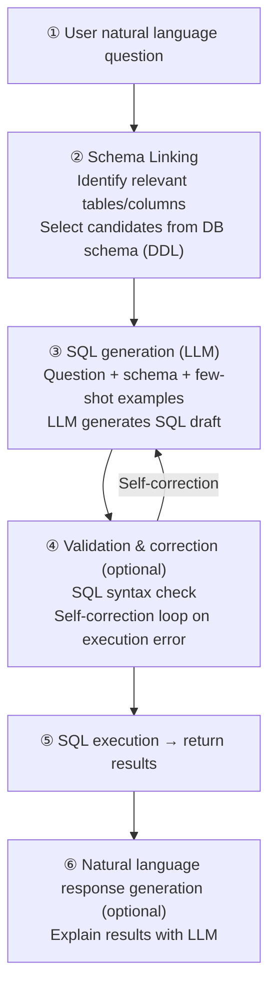

# NL2SQL (Natural Language to SQL)

## Overview

**NL2SQL** (Natural Language to SQL, also **Text-to-SQL**) is a technology that automatically converts users' natural language questions into executable SQL queries. It is attracting attention as a key means of realizing Data Democratization by allowing non-experts who don't know SQL to query data stored in relational databases (RDBMS) in natural language.

```
User: "What are the top 5 best-selling products last quarter?"
        ↓ NL2SQL
SELECT product_name, SUM(quantity) AS total_sold
FROM orders
WHERE order_date >= '2024-10-01' AND order_date < '2025-01-01'
GROUP BY product_name
ORDER BY total_sold DESC
LIMIT 5;
```

## Text-to-SQL Pipeline



## Schema Linking

Schema Linking is the **most difficult and important step** in NL2SQL. It involves narrowing down from hundreds to thousands of tables/columns to only those relevant to the question — the accuracy of this step determines the final SQL quality.

### Key Methods

```
Method 1: DDL-based representation
  CREATE TABLE orders (
    order_id INT,
    product_name VARCHAR(100),
    quantity INT,
    order_date DATE
  );
  → Include full schema in LLM context (suitable for small DBs)

Method 2: Dictionary-based representation (TA-SQL)
  {"orders.product_name": "name of ordered product", "orders.quantity": "quantity ordered"}
  → Include per-column descriptions (effective for large DBs)

Method 3: Vector search-based Schema Filtering
  Query embedding ↔ column name/description embedding comparison
  → Filter only high-similarity columns
  → Context savings for large-scale DBs
```

### Recent Research (2024-2025)

- **LinkAlign** (2025): Proposes scalable Schema Linking for multi-database environments [1]
- **Bidirectional Retrieval** (2024): Improves accuracy with bidirectional search (question→schema, schema→question) [2]
- **E-SQL**: Improves Schema Linking quality through Question Enrichment

## Key Approaches

### 1. Decomposed In-Context Learning

```
DIN-SQL (2023):
  Step 1: Schema Linking — "What tables are needed for this question?"
  Step 2: Query classification — Simple / Nested / Non-nested
  Step 3: SQL generation — specialized prompts per classification
  Step 4: Self-correction — error fixing

DFIN-SQL (2024): Combines DIN-SQL with Focused Schema for improved accuracy on large DBs [3]
```

### 2. Few-shot Prompting-based

```
DAIL-SQL (2023):
  - Select few-shot examples by skeleton similarity
  - Encode structural knowledge as DDL
  - Domain-specific word masking for generalization

PURPLE / C3: Zero/Few-shot prompting approach

OpenSearch-SQL (2025):
  - Dynamic few-shot selection + Consistency Alignment
  - Achieves SOTA on Spider·BIRD benchmarks [4]
```

### 3. Multi-agent / Multi-pass

```
CHESS (2024):
  - Generate candidate schema pool
  - Generate multiple SQL candidates then vote
  - Hierarchical Schema representation

MAC-SQL / MCS-SQL:
  - Multiple agent collaboration for complex queries

Memo-SQL (2026):
  - Structural decomposition + experience-based learning
  - Stores previous mistakes as memos to prevent repeated errors [5]
```

### 4. Fine-Tuning-based

```
CODES (2024):
  - Fine-tune small LLMs on domain-specific data
  - Reduce inference cost

Synthesizing NL2SQL Data (2024):
  - Synthesize training data with weak LLM + strong LLM combination [6]
```

## Benchmarks

### Spider

```
- Source: Yale University (Yu et al., 2018)
- Scale: 10,181 question-SQL pairs / 200 databases
- Split: Train 7,000 / Dev 1,034 / Test 2,147
- Features: Cross-domain, compositional generalization evaluation
- Metrics: Exact Match (EM), Execution Accuracy (EX)
- Limitation: Simpler than real DB complexity
```

### BIRD (Big Bench for Large-scale Database Grounded Text-to-SQL)

```
- Source: Li et al. (2023)
- Scale: 12,751 question-SQL pairs / 95 real-world DBs / 37 domains
- Split: Train 9,428 / Dev 1,534 / Test 1,789
- Features:
  - Real business data (Finance, Healthcare, Sports, etc.)
  - Complex multi-joins, nested subqueries
  - Requires implicit knowledge (domain common sense)
  - Includes Efficient Execution score
- Metrics: Valid Efficiency Score (VES), EX
- SOTA accuracy: ~73% (as of 2025, GPT-4-class models)
```

| Benchmark | DB count | Questions | Difficulty | Features |
|-----------|----------|-----------|------------|---------|
| Spider | 200 | 10K | Medium | Cross-domain generalization |
| BIRD | 95 | 12.7K | High | Real-world complexity + implicit knowledge |
| Spider 2.0 | 632 | Thousands | Very high | Enterprise-level complex queries |

## Limitations and Practical Considerations

```
1. Schema scale problem
   - Hundreds of tables → context overflow
   - Solution: Schema Filtering, dynamic schema loading

2. Implicit knowledge
   - "Last quarter" → needs calculation from current date
   - "Active users" → different definition per domain
   - Solution: Domain metadata injection, add description columns

3. Dialect differences
   - MySQL vs PostgreSQL vs BigQuery vs Snowflake
   - Portability issues from function name/syntax differences

4. Execution error handling
   - Generated SQL may have syntax or runtime errors
   - Solution: Self-correction loop (feed error messages back to LLM)

5. Security risks
   - SQL Injection possibility
   - Solution: Use parameterized queries, read-only accounts with restricted permissions

6. Complex aggregation/analysis queries
   - Accuracy drops sharply on Window Functions, CTEs, complex subqueries
   - ~73% accuracy on BIRD Dev — still 30% errors
```

## Role in AI Engineering

NL2SQL is the **core of Retrieval Strategy for structured data**. It is essential for BI Chatbots and data analysis agents that provide natural language access to enterprise ERP, CRM, and data warehouses. Combined with [[en/AI/Engineering/Context_Engineering/Retrieval_Strategies/SQL_RAG/SQL_RAG|SQL RAG]], it enables building Hybrid systems that simultaneously leverage vector search (unstructured knowledge) + SQL search (structured data).

## Related Concepts

[[en/AI/Engineering/Context_Engineering/Retrieval_Strategies/SQL_RAG/SQL_RAG|SQL RAG]] · [[en/AI/Engineering/Context_Engineering/Retrieval_Strategies/RAG/RAG|RAG]] · [[en/AI/Engineering/Context_Engineering/Retrieval_Strategies/RAG/Advanced_Retrieval|Advanced Retrieval]] · [[en/AI/Engineering/Context_Engineering/Retrieval_Strategies/GraphRAG/GraphRAG|GraphRAG]]

## References

[1] LinkAlign: Scalable Schema Linking for Real-World Large-Scale Multi-Database Text-to-SQL — [arxiv.org/pdf/2503.18596](https://arxiv.org/pdf/2503.18596)

[2] Rethinking Schema Linking: A Context-Aware Bidirectional Retrieval Approach for Text-to-SQL — [arxiv.org/pdf/2510.14296](https://arxiv.org/pdf/2510.14296)

[3] DFIN-SQL: Integrating Focused Schema with DIN-SQL for Superior Accuracy in Large-Scale Databases — [arxiv.org/pdf/2403.00872](https://arxiv.org/pdf/2403.00872)

[4] OpenSearch-SQL: Enhancing Text-to-SQL with Dynamic Few-shot and Consistency Alignment — [arxiv.org/pdf/2502.14913](https://arxiv.org/pdf/2502.14913)

[5] Memo-SQL: Structured Decomposition and Experience-Driven — [arxiv.org/pdf/2601.10011](https://arxiv.org/pdf/2601.10011)

[6] Synthesizing Text-to-SQL Data from Weak and Strong LLMs — [arxiv.org/pdf/2408.03256](https://arxiv.org/pdf/2408.03256)

[7] Retrieval-Augmented NL2SQL Generation with Data-Centric Query Capsules (SIGIR-AP 2025) — [dl.acm.org/doi/10.1145/3767695.3769489](https://dl.acm.org/doi/10.1145/3767695.3769489)

[8] BASE-SQL: A powerful open source Text-To-SQL baseline approach — [arxiv.org/pdf/2502.10739](https://arxiv.org/pdf/2502.10739)
