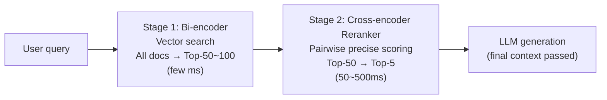
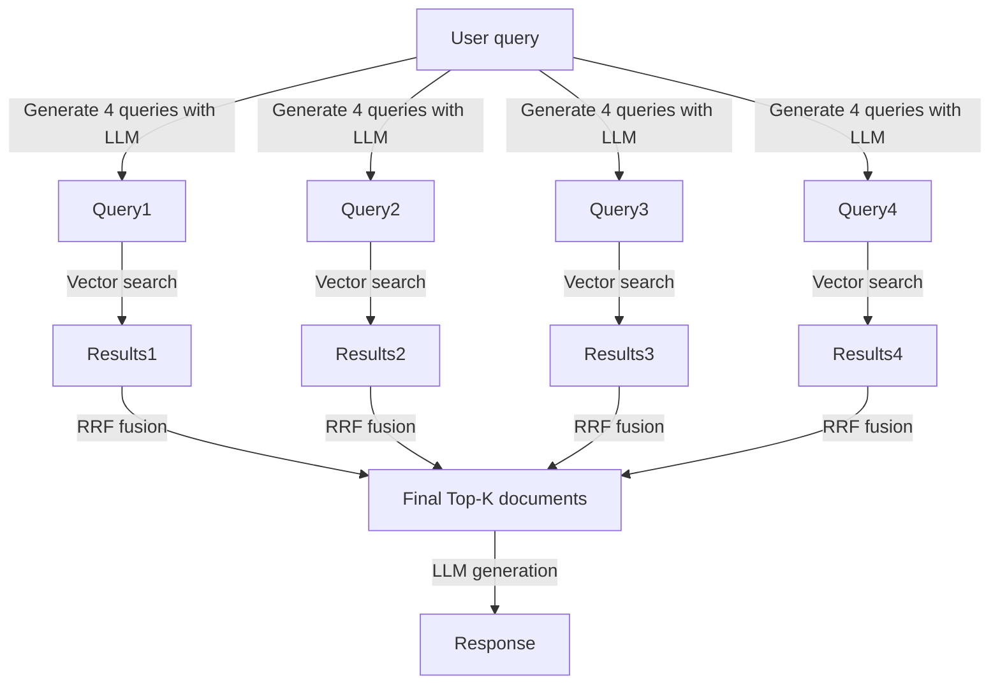

# Advanced Retrieval

## Overview

Various advanced techniques beyond basic vector search (simple query → return Top-K) that improve retrieval quality. Includes Reranking, Query Transformation, Multi-query, etc.

## Limitations of Basic RAG

```
Problem 1 — Query-Document Mismatch:
  Query: "How do you sort in Python?"
  Document: "Python's sort() function..." (different keywords → low similarity)

Problem 2 — Single perspective:
  A single query can't cover various aspects of relevant documents

Problem 3 — Noise in top K:
  Even with high similarity scores, documents with low actual relevance may be included
```

## Reranking

### Why Reranking Is Needed

Vector search (Bi-encoder) is fast but has structural limitations. Since query and document are encoded **independently** then compared by cosine similarity, it cannot capture the interaction between the two texts (token-level cross-attention).

```
Bi-encoder limitation:
  embed("How to sort in Python") ↔ embed("How to use Python sort() function")
  → Low similarity due to surface keyword differences → Good documents missed

Cross-encoder solution:
  Transformer([CLS] How to sort in Python [SEP] Python sort() function...)
  → Process both texts together → Precise relevance score
```

However, Cross-encoder requires inference for every document pair, making it infeasible to apply directly to millions of documents. Solved by **Two-Stage Retrieval**.

### Two-Stage Retrieval Pipeline



Stage 1 ensures recall, Stage 2 improves precision. Reranking alone can improve RAG response quality by **15~40%** [1][2].

### Cross-Encoder Reranking

```python
from sentence_transformers import CrossEncoder

reranker = CrossEncoder("cross-encoder/ms-marco-MiniLM-L-6-v2")
pairs = [(query, doc) for doc in candidate_docs]  # Top-50 candidates
scores = reranker.predict(pairs)
reranked_docs = sorted(zip(scores, candidate_docs), reverse=True)[:5]
```

### Key Reranker Model Comparison

| Model | Type | Features | Latency (Top-50 GPU) |
|------|------|------|----------------------|
| **BAAI/bge-reranker-v2-m3** | Cross-encoder | Best open-source, multilingual, 278M params | ~80ms |
| **Cohere Rerank v3.5** | API | Commercial, structured data (YAML), 4096 context | API latency |
| **Cohere Rerank v4.0-pro/fast** | API | v3.5 successor, pro/fast tier separation | API latency |
| **ColBERT v2** | Late Interaction | Per-token MaxSim, server-side index | ~25ms |
| **FlashRank** | Cross-encoder | Lightweight MiniLM-based, CPU-runnable | ~15ms |
| **ms-marco-MiniLM-L-6-v2** | Cross-encoder | General English baseline | ~50ms |

**BGE Reranker v2-m3** is currently evaluated as best among open-source for English/multilingual tasks [1].

#### BGE Reranker Usage Example

```python
from FlagEmbedding import FlagReranker

reranker = FlagReranker("BAAI/bge-reranker-v2-m3", use_fp16=True)
scores = reranker.compute_score(
    [(query, doc) for doc in candidate_docs],
    normalize=True  # normalize to 0~1 range
)
top_docs = [doc for _, doc in sorted(zip(scores, candidate_docs), reverse=True)[:5]]
```

#### ColBERT: Late Interaction

A middle approach faster than Cross-encoder but more accurate than Bi-encoder. Separately encode query and documents, but interact at **token level** with MaxSim operation:

```
score(q, d) = Σ_i max_j (E_q[i] · E_d[j])
  → Each query token matches the most similar token in the document
```

Builds a server-side index (RAGatouille library) for fast operation at scale [4].

### Cohere Rerank API

```python
import cohere
co = cohere.Client(api_key)

results = co.rerank(
    model="rerank-v3.5",       # or rerank-v4.0-pro / rerank-v4.0-fast
    query=query,
    documents=[doc.page_content for doc in candidates],
    top_n=5,
    return_documents=True
)

top_docs = [r.document.text for r in results.results]
```

Low adoption cost — just add as 2nd stage to existing keyword/vector search [3].

### RRF (Reciprocal Rank Fusion)

Mathematically combine multiple retrieval result lists without a model:
```
RRF score = Σ 1 / (k + rank_i)
  k=60 (constant, reduces top rank influence)
```
Used to safely combine Dense search (vector) and Sparse search (BM25) results. No training required.

### Performance vs. Latency Trade-offs

| Strategy | Additional latency | Accuracy gain | Recommended when |
|------|-------------|------------|----------|
| Bi-encoder alone | 0 | — | Real-time search, latency-sensitive |
| RRF (Hybrid) | <10ms | +5~10% | When combining Dense+Sparse |
| FlashRank | ~15ms | +15~20% | CPU server, cost reduction |
| BGE Reranker v2-m3 | ~80ms | +20~30% | Open-source high accuracy |
| Cohere Rerank v3.5 | 100~300ms | +25~40% | Managed, structured data |

**Practical tips:**
- Top-K from Stage 1 typically 50~100, Stage 2 output narrowed to 3~5
- Truncating documents to 512 tokens balances reranking speed and quality
- For static corpora, caching query-document scores reduces duplicate costs

### LLM-as-Reranker

General LLMs can also be used as rerankers. Two approaches [8][9]:

**Pointwise Reranking**: Feed LLM one query and document at a time to request relevance score. Cost and latency grow linearly as LLM is called per Top-K document.

**Listwise Reranking**: Input query and all candidate documents at once to output a ranked list. More consistent than Pointwise but context length (O(n²) attention cost) and latency explode as documents increase.

#### Trade-offs vs. Dedicated Cross-Encoder Models

Results measured by ZeroEntropy across 17 benchmarks (MTEB, BEIR, MS MARCO, etc.) [8]:

| Model | Avg NDCG@10 | p50 latency (75kb input) | Relative cost |
|------|------------|-------------------|---------|
| zerank-1 (dedicated reranker) | **0.777** | **130ms** | 1x |
| GPT-5-mini (listwise) | 0.698 | 2,180ms | 10x |
| GPT-4.1-mini (listwise) | 0.713 | 740ms | 32x |
| Cohere rerank-3.5 | 0.719 | 198ms | 2x |

Dedicated Cross-encoders have higher accuracy and are better in both latency and cost. Main drawbacks of LLM rerankers:
- **Score inconsistency**: LLMs are not trained to stably output absolute scores (0~1), so calibration is poor
- **Pointwise vulnerability**: Evaluating candidate documents individually loses relative comparison signal between documents
- **Not real-time capable**: Difficult to process 100 candidates with LLM within user abandonment threshold (3 seconds)

#### When LLM Reranker Is Advantageous

- **Reranking requiring complex reasoning**: High-difficulty tasks like logical entailment, multi-step reasoning that dedicated models haven't learned [9]
- **Offline batch processing**: Data pipelines where latency is acceptable and accuracy is top priority
- **Listwise refinement of few candidates**: 3-stage pipeline where Cross-encoder narrows Top-50 → Top-5, then LLM listwise re-ranks final 3

## Query Transformation

### Query Rewriting
Transform original query into a more effective form for retrieval:
```python
rewrite_prompt = """
Transform the following user question into a keyword-focused query
optimized for document retrieval.
Original: {query}
Search query:
"""
optimized_query = llm.generate(rewrite_prompt.format(query=user_query))
```

### Step-Back Prompting
Transform specific questions into more abstract questions to retrieve background knowledge:
```
Original: "How does GPT-4's RLHF work?"
Step-back: "How are LLMs trained with reinforcement learning?"
→ Can retrieve documents covering a wider range
```

### Multi-Query Retrieval
Expand a single query into multiple queries from different perspectives:
```python
multi_query_prompt = """
Rewrite the following question in 5 different versions from various perspectives:
Question: {question}

1.
2.
3.
4.
5.
"""
queries = llm.generate(multi_query_prompt)
# Search each of 5 queries → union of results → deduplicate
```

### Decomposition
Break complex questions into sub-questions then retrieve step by step:
```
Complex question: "Compare Company A and Company B's 2024 revenue and operating profit, then calculate growth rate"

Sub-questions:
  1. "What was Company A's 2024 revenue?"
  2. "What was Company A's 2024 operating profit?"
  3. "What was Company B's 2024 revenue?"
  4. "What was Company B's 2024 operating profit?"
  5. Calculate growth rate from each answer
```

## RAG Fusion

Pattern combining Multi-query + RRF:


## Contextual Compression

Extract only actually relevant parts from retrieved chunks:
```python
from langchain.retrievers.document_compressors import LLMChainExtractor
from langchain.retrievers import ContextualCompressionRetriever

compressor = LLMChainExtractor.from_llm(llm)
compression_retriever = ContextualCompressionRetriever(
    base_compressor=compressor,
    base_retriever=base_retriever
)
# Return only relevant sentences instead of entire chunks
```

## Evaluation Metrics

| Metric | Meaning | Calculation |
|------|------|------|
| **Precision@K** | Ratio of relevant documents in top K | TP / K |
| **Recall@K** | Ratio of all relevant documents included in top K | TP / Total relevant |
| **MRR** | Mean reciprocal rank of first relevant document | Σ(1/rank_i) / N |
| **NDCG** | Ranking quality (considers relevance + order) | Complex calculation |

## Role in AI Engineering

Advanced Retrieval is the **precision layer** of the RAG pipeline. If basic retrieval "finds relevant documents," advanced retrieval "provides the most useful context in optimal form." Reranking alone can improve RAG response quality by 15~30%.

## Related Concepts
[[en/AI/Engineering/Context_Engineering/Retrieval_Strategies/RAG/Chunking_Strategies|Chunking Strategies]] · [[en/AI/Engineering/Context_Engineering/Retrieval_Strategies/RAG/Vector_Storage|Vector Storage]] · [[en/AI/Engineering/Context_Engineering/Retrieval_Strategies/RAG/HyDE|HyDE]]

## Sources
1. Reranking for RAG: +40% Accuracy with Cross-Encoders (2025 Guide) — [ailog.fr](https://app.ailog.fr/en/blog/guides/reranking)
2. Build BGE Reranker: Cross-Encoder Reranking for Better RAG — [markaicode.com](https://markaicode.com/bge-reranker-cross-encoder-reranking-rag/)
3. Cohere Rerank Best Practices — [docs.cohere.com](https://docs.cohere.com/docs/reranking-best-practices)
4. Reranking with ColBERT: Precision Without Pain — [Medium](https://medium.com/@ThinkingLoop/reranking-with-colbert-precision-without-pain-b390dda517f0)
5. Nogueira & Cho (2019) "Passage Re-ranking with BERT" — [arXiv:1901.04085](https://arxiv.org/abs/1901.04085)
6. Gao et al. (2023) "RAG Survey" — [arXiv:2312.10997](https://arxiv.org/abs/2312.10997)
7. Top 7 Rerankers for RAG — [analyticsvidhya.com](https://www.analyticsvidhya.com/blog/2025/06/top-rerankers-for-rag/)
8. Houir Alami (2025) "Should You Use LLMs for Reranking?" — [zeroentropy.dev](https://zeroentropy.dev/articles/should-you-use-llms-for-reranking-a-deep-dive-into-pointwise-listwise-and-cross-encoders/)
9. "A Thorough Comparison of Cross-Encoders and LLMs for Reranking SPLADE" — [arXiv:2403.10407](https://arxiv.org/html/2403.10407v1)
