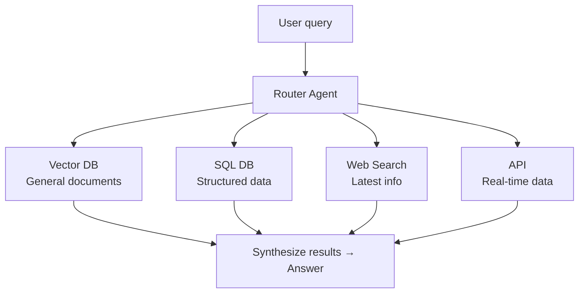
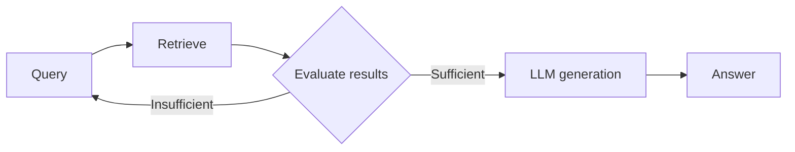
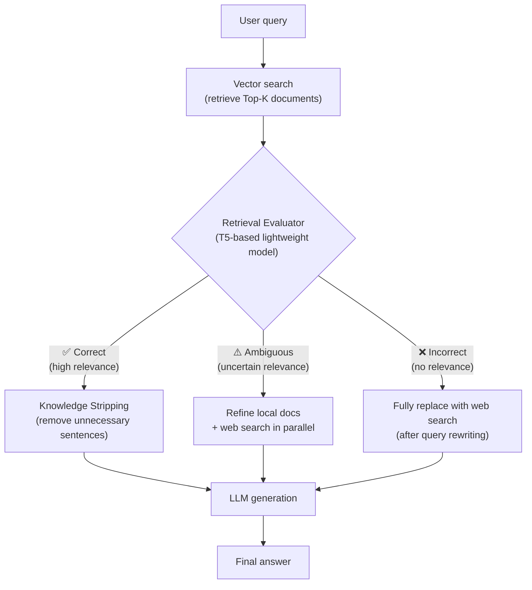
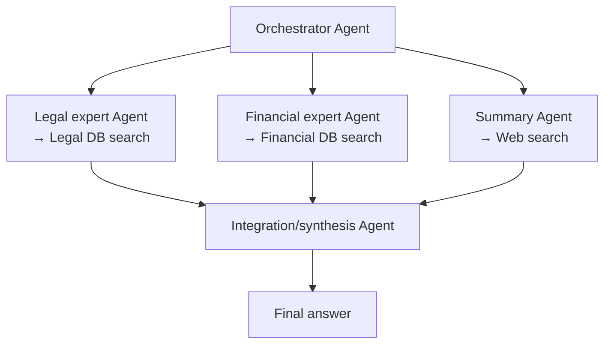
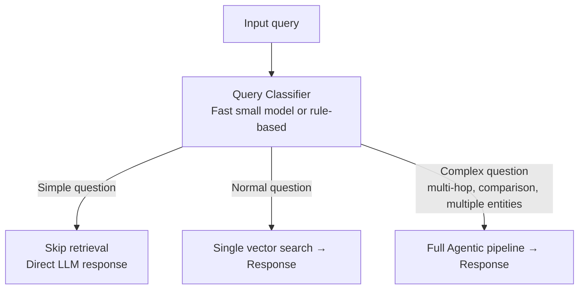
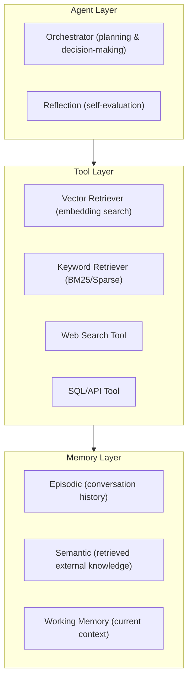

# Agentic RAG

## Overview

**Agentic RAG** is an architecture that combines traditional RAG pipelines with autonomous agents. Unlike Naive RAG which follows a simple linear flow of "query → retrieve → generate," the LLM operates in a **control loop** where it decides *what, when, and how to retrieve*, and re-retrieves or employs other tools when results are insufficient.

As of 2025, a survey paper (Agentic RAG Survey, arXiv 2501.09136) defines it as:

> "Agentic RAG embeds autonomous AI agents into the RAG pipeline, leveraging agentic design patterns — reflection, planning, tool use, and multi-agent collaboration — to dynamically manage retrieval strategies."

## Naive RAG vs Advanced RAG vs Agentic RAG

```mermaid
flowchart TD
    subgraph naive["Naive RAG (single retrieval, no verification)"]
        N1[User query] --> N2[Vector search x1] --> N3[LLM generation] --> N4[Answer]
    end
    subgraph advanced["Advanced RAG (more sophisticated retrieval, unidirectional)"]
        A1[User query] --> A2[Query rewriting] --> A3[Hybrid search] --> A4[Reranking] --> A5[LLM generation] --> A6[Answer]
    end
    subgraph agentic["Agentic RAG (dynamic retrieval, self-correction)"]
        Q[User query] --> AG[Agent LLM]
        AG --> P["① Query analysis & planning<br/>② Tool/source selection<br/>③ Execute retrieval"]
        P --> E{④ Evaluate results}
        E -->|"Insufficient"| P
        E -->|"Sufficient"| R[Generate final answer]
    end
```



| Type | Naive RAG | Advanced RAG | Agentic RAG |
|------|-----------|--------------|-------------|
| Retrieval count | 1 (fixed) | 1 (sophisticated) | Dynamic (repeat as needed) |
| Retrieval source | Single vector DB | Hybrid | Multiple tools/DBs |
| Self-evaluation | None | None | Yes |
| Multi-hop reasoning | Not possible | Partially possible | Possible |
| Cost | Low | Medium | High (~10x) |
| Complex query accuracy | ~34% | ~60% | ~89% |

## Core Architecture Patterns

### 1. Single-Agent Router Pattern

Simplest form. Agent analyzes query and routes to appropriate retrieval tool or knowledge source.



### 2. Iterative Retrieval Pattern

Evaluates retrieval results and repeats additional retrieval if insufficient.



**Self-RAG** (Asai et al., 2023) is the representative implementation of this pattern. Generates special reflection tokens (`[Retrieve]`, `[IsRel]`, `[IsSup]`) to judge retrieval necessity and result appropriateness itself.

### 3. Corrective RAG (CRAG) Pattern

Pattern proposed by Yan et al. (2024). Inserts a lightweight evaluator/grader into retrieval results to judge quality, then branches into one of three paths based on judgment. Structurally blocks hallucinations caused by bad context being injected directly into LLMs [5].



**Core components:**

**Retrieval Evaluator**: T5-based lightweight model classifies document-query relevance as Correct / Ambiguous / Incorrect. Unlike Naive RAG's "use retrieval results as-is," it conditionally responds to retrieval quality.

**Knowledge Stripping**: When judged Correct, instead of using the full chunk, extracts only "knowledge strips" directly related to the query to reduce context noise.

**Query Rewriting**: When judged Incorrect, transforms query to a more search-friendly form before web search. Not a simple fallback but a retry with an improved query.

**Performance**: 2025 MDPI benchmark — CRAG Precision@5 = 0.69, hallucination rate 10.5%, latency 240ms. ~40% reduction in hallucination rate vs. Naive RAG [5].

**CRAG limitations**: If evaluator judgment is wrong (False Negative), good documents may be discarded or unnecessary web search executed. Web search dependency requires internet connection and increases latency. Evaluator itself has additional inference cost.

### 4. Multi-Agent RAG Pattern

Multiple specialized agents retrieve and process in parallel, then integrate results.



Used when a single agent is difficult to cover the scope — multiple domains or parallel retrieval needed.

## Query Routing

The key to Adaptive RAG is routing to the appropriate strategy based on query complexity.



Complexity signals:
- Query length and clause count
- Multi-hop markers like "compare", "and also", "relationship between"
- Number of entities (2+ means complex)

Generally 70-85% of total traffic is handled by Classic RAG, with only the remaining 15-30% by Agentic RAG. This is because Agentic RAG costs ~10x more per query.

## Core Components



## Framework Support

| Framework | Supported patterns |
|-----------|----------|
| **LangGraph** | State graph-based Agentic RAG, CRAG, Self-RAG implementation |
| **LlamaIndex** | `AgentRunner`, `RouterRetriever`, Iterative RAG |
| **LangChain** | `create_react_agent` + RAG tools |
| **AutoGen** | Multi-Agent RAG, inter-agent retrieval collaboration |

## Performance Trade-offs

```
Multi-hop reasoning:
  Naive RAG:   ~34% accuracy
  Agentic RAG: ~89% accuracy

Self-RAG hallucination rate:
  5.8% vs. standard RAG (lowest in clinical QA)

Cost:
  Agentic RAG ≈ Naive RAG × 10 (increased LLM calls)
  → Need to maintain Classic RAG for simple queries
```

## When to Use Agentic RAG

**Use when:**
- Multi-hop questions requiring answers to cross multiple documents/DBs
- When a single retrieval is insufficient and a reasoning-retrieval loop is needed
- When integrating multiple heterogeneous data sources (SQL, API, documents)
- Domains where result accuracy guarantees matter more than cost (medical, legal, financial)

**Don't use when:**
- Simple FAQ or single document retrieval is sufficient
- Extremely latency-sensitive real-time services
- High-frequency simple queries with cost constraints

## Role in AI Engineering

Agentic RAG sits at the **intersection of Context Engineering and Agent Engineering**. If RAG was a passive pipeline for "what knowledge to put in context," Agentic RAG is an **active cognitive loop** where agents themselves decide knowledge collection strategies.

It is becoming the de facto standard architecture for domains where simple retrieval has limitations — enterprise QA, legal research, medical information verification, complex financial analysis, etc.

## Related Concepts

[[en/AI/Engineering/Context_Engineering/Retrieval_Strategies/RAG/RAG|RAG]] · [[en/AI/Engineering/Context_Engineering/Retrieval_Strategies/RAG/Advanced_Retrieval|Advanced Retrieval]] · [[en/AI/Engineering/Context_Engineering/Retrieval_Strategies/RAG/HyDE|HyDE]] · [[en/AI/Engineering/Context_Engineering/Retrieval_Strategies/GraphRAG/GraphRAG|GraphRAG]] · [[en/AI/Engineering/Agent_Engineering/Agent_Architectures|Agent Architectures]] · [[en/AI/Engineering/Agent_Engineering/Planning_and_Reflection|Planning & Reflection]]

## Sources

- Asai et al. (2025) "Agentic Retrieval-Augmented Generation: A Survey on Agentic RAG" — [arXiv:2501.09136](https://arxiv.org/abs/2501.09136)
- Asai et al. (2023) "Self-RAG: Learning to Retrieve, Generate, and Critique through Self-Reflection" — [arXiv:2310.11511](https://arxiv.org/abs/2310.11511)
5. Yan et al. (2024) "CRAG — Corrective Retrieval Augmented Generation" — [arXiv:2401.15884](https://arxiv.org/abs/2401.15884)
6. Analytics Vidhya "Corrective RAG (CRAG) in Action" (2024) — [analyticsvidhya.com](https://www.analyticsvidhya.com/blog/2024/12/corrective-rag/)
- Weaviate "What Is Agentic RAG?" — [weaviate.io/blog/what-is-agentic-rag](https://weaviate.io/blog/what-is-agentic-rag)
