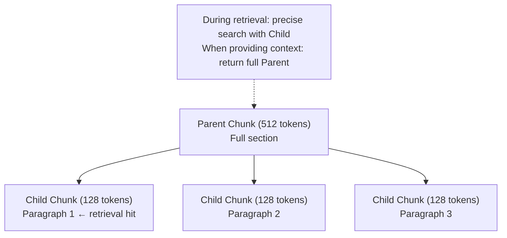

# Chunking Strategies

## Overview

**Chunking** is the process of splitting source documents into small units (**chunks**) that fit into an LLM's context window in RAG (Retrieval-Augmented Generation) pipelines. Chunking strategies directly affect retrieval quality, and must address the trade-off: "too large means noise, too small means context loss."

## Why It Matters

```
Chunks too large:
  - Irrelevant content included in context
  - Retrieval precision↓ (topics get mixed)
  
Chunks too small:
  - Context fragmentation (sentences cut off)
  - Retrieval recall↓ (complete meaning lost)
```

## Key Chunking Strategies

### 1. Fixed-Size Chunking

The simplest approach. Split uniformly by character count or token count:

```python
from langchain.text_splitter import RecursiveCharacterTextSplitter

splitter = RecursiveCharacterTextSplitter(
    chunk_size=512,      # chunk size (tokens)
    chunk_overlap=50,    # overlap between chunks (context continuity)
)
chunks = splitter.split_text(document)
```

**Pros**: Fast and simple to implement. Cost-effective.
**Cons**: May cut in the middle of sentences.
**Overlap**: 10~20% overlap between consecutive chunks to mitigate boundary loss.
**Recommended size**: Generally 512 tokens (adjust per task within 128~1024 range).

### 2. Semantic Chunking

Groups **semantically related sentences** into one chunk using embedding similarity:

```python
from langchain_experimental.text_splitter import SemanticChunker
from langchain_openai.embeddings import OpenAIEmbeddings

chunker = SemanticChunker(
    embeddings=OpenAIEmbeddings(),
    breakpoint_threshold_type="percentile",  # split criterion
    breakpoint_threshold_amount=95,          # split at top 5% dissimilar points
)
```

**How it works**:
```
sentence1 → embed → [0.2, 0.8, ...]
sentence2 → embed → [0.3, 0.7, ...]  # similar → same chunk
sentence3 → embed → [0.9, 0.1, ...]  # dissimilar → start new chunk
```

**Pros**: High semantic completeness. Up to +9% recall improvement (vs. fixed-size).
**Cons**: Embedding computation cost during indexing. Slow.

### 3. Hierarchical Chunking

**Parent-Child** structure: maintain small chunks (for retrieval) and large chunks (for context):



```python
# LlamaIndex's Hierarchical Node Parser
from llama_index.node_parser import HierarchicalNodeParser

parser = HierarchicalNodeParser.from_defaults(
    chunk_sizes=[2048, 512, 128]  # 3-level hierarchy
)
```

**Pros**: Simultaneously achieves precision (Child) and context (Parent). Recommended for production.
**Cons**: Increased index complexity.

### 4. Document-Level Chunking

Short documents (FAQs, tickets, product descriptions) embedded as a whole without splitting:
```python
# Embed entire document without chunking
chunks = [Document(page_content=full_document, metadata={"source": url})]
```

**Suitable for**: FAQs, short manuals, news articles.

### 5. Context-Aware Chunking

Prepend a **summary of the full document context** to each chunk before embedding:
```
Original chunk: "This method has O(n log n) complexity."

After adding context:
"This document compares sorting algorithms.
 In this document, this chunk explains the time complexity of merge sort.
 
 This method has O(n log n) complexity."
```
Proposed in Anthropic's Contextual Retrieval (2024). Recall ↑49%, Full RAG errors ↓67%.

## Chunk Size Selection Guide

| Document type | Recommended chunk size | Strategy |
|----------|--------------|------|
| Legal/contracts | 512~1024 tokens | Semantic + Overlap |
| Code | Function/class unit | Syntax-based |
| FAQ | Document unit | No splitting |
| Long reports | 128~512 + Parent | Hierarchical |
| Academic papers | Paragraph unit | Semantic |

## Performance Comparison (NVIDIA 2024 Benchmark)

| Strategy | Accuracy | Variance |
|------|-------|------|
| Page-level | 0.648 | Low (most stable) |
| Semantic | +9% recall | Medium |
| Fixed-512 | Competitive | Low |
| Hierarchical | Best balance | Low |

## Role in AI Engineering

Chunking strategies are the **foundation** of RAG systems. Poor chunking is difficult to compensate for even with good embedding models or search algorithms. In production, the appropriate strategy for task and document characteristics must be validated through experimentation before selection.

## Related Concepts
[[en/AI/Engineering/Context_Engineering/Retrieval_Strategies/RAG/Vector_Storage|Vector Storage]] · [[en/AI/Engineering/Context_Engineering/Retrieval_Strategies/RAG/Advanced_Retrieval|Advanced Retrieval]] · [[en/AI/Engineering/Context_Engineering/Retrieval_Strategies/RAG/HyDE|HyDE]]

## Sources
- Atlan "Chunking Strategies for RAG: Methods, Trade-offs & Best Practices" — [atlan.com](https://atlan.com/know/chunking-strategies-rag/)
- Firecrawl "Best Chunking Strategies for RAG (and LLMs) in 2026" — [firecrawl.dev](https://www.firecrawl.dev/blog/best-chunking-strategies-rag)
- Anthropic "Contextual Retrieval" (2024) — [anthropic.com](https://www.anthropic.com/news/contextual-retrieval)
- Mix-of-Granularity Paper (2024) — [arXiv:2406.00456](https://arxiv.org/pdf/2406.00456)
