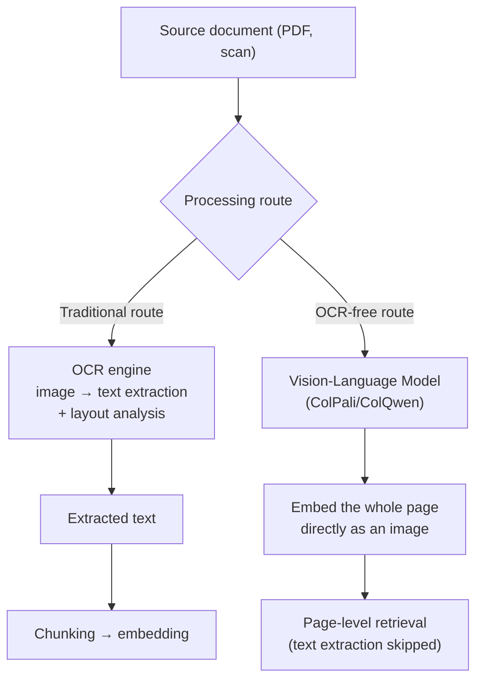

# Document Ingestion

## Overview

[[en/AI/Engineering/Context_Engineering/Retrieval_Strategies/RAG/Chunking_Strategies|Chunking Strategies]] starts from "how do we split the text," but real-world documents (PDFs, scans, spreadsheets, presentations) **aren't text to begin with**. There has to be a step before chunking that extracts chunkable text from source files where layout, tables, formulas, and multi-column composition are all mixed together. If this step's quality is poor, no amount of downstream refinement to chunking, embedding, or reranking can raise the ceiling it sets.

## What Needs Parsing

```
Plain text (.txt) → chunkable as-is

PDF/document files → require parsing:
  - Multi-column layout (reading column order wrong scrambles sentences)
  - Tables — must be serialized to text while preserving cell structure to keep meaning intact
  - Formulas — converted to LaTeX/MathML or handled separately as images
  - Scanned documents — no text layer, OCR is mandatory
  - Headers/footers/page numbers — noise if mixed into the body text
```

## Two Routes: OCR-Based vs OCR-Free



**OCR-based**: text is explicitly extracted and then fed as-is into the existing RAG pipeline (chunk → embed → retrieve). Its weakness is that text-extraction errors (broken table structure, mangled formulas) propagate straight downstream.

**OCR-free** (ColPali/ColQwen family): instead of converting the document page to text, it's fed **directly as an image** into a Vision-Language Model for embedding. The advantage is sidestepping OCR error entirely on documents where layout, tables, charts, and images are all mixed together. See [[en/AI/Engineering/Context_Engineering/Retrieval_Strategies/RAG/Multimodal_RAG|Multimodal RAG]] and [[en/AI/Engineering/Context_Engineering/Retrieval_Strategies/Embedding_Models|Embedding Models]] for architecture and embedding details.

## Tool Landscape

| Tool | Approach | Notes |
|------|------|------|
| **Unstructured.io** | Layout detection + integrated OCR | Broad file-format support (PDF/HTML/DOCX/PPTX, etc.), open source |
| **LlamaParse** | LLM-based parsing (LlamaIndex ecosystem) | Strong on complex tables/nested layouts, managed API |
| **Docling** (IBM) | Layout model + table structure recognition | Open source, specialized in preserving table/formula structure |
| **Marker** | PDF → Markdown conversion | Fast processing, strong on structured layouts like academic papers |

## Metadata Extraction and Structure Preservation

What's easily lost at the parsing stage isn't the text content — it's the **structural information**.

```
Metadata worth preserving:
  - Position within the document (page number, section heading hierarchy)
  - Linking a table/figure's caption to its original location
  - Creation date/author/version (needed to judge document freshness)

Problems that arise when structure is lost:
  A body sentence saying "see Table 3" gets separated from Table 3 after chunking,
  and looking at the chunk alone gives no way to know what it's referring to
  → no chunking strategy, however good, can recover this without the original structural information
```

## Incremental Indexing and Reprocessing Cost

Re-parsing, re-chunking, and re-embedding the entire corpus every time a document is updated is expensive.

```
Change-detection strategies:
  - Compare file content hashes → reprocess only changed documents
  - Chunk-level hashing → re-embed only the affected chunks even if just part of a document changed
  - Version tagging → don't discard old embeddings immediately; serve both in parallel, then cut over (similar to blue-green)
```

## Boundaries

| Document | Covers |
|------|-----------|
| **This document (Document_Ingestion)** | The step of **extracting chunkable text/structure** from source files — parsing, OCR, metadata preservation |
| [[en/AI/Engineering/Context_Engineering/Retrieval_Strategies/RAG/Chunking_Strategies|Chunking Strategies]] | The step of **splitting extracted text into semantic units** |
| [[en/AI/Engineering/Context_Engineering/Retrieval_Strategies/RAG/Multimodal_RAG|Multimodal RAG]] | The step covering **mixed image/text retrieval**, including the OCR-free route |

## Role in AI Engineering

A large share of RAG pipeline quality degradation is already decided at **this first step**, not at reranking or the embedding model — if a table is chunked already broken, or pages are embedded out of order, every optimization downstream is built on damaged input. When troubleshooting a RAG project, visually inspecting this step's output before suspecting the retrieval algorithm is often the fastest debugging path in practice.

## Related Concepts
[[en/AI/Engineering/Context_Engineering/Retrieval_Strategies/RAG/Chunking_Strategies|Chunking Strategies]] · [[en/AI/Engineering/Context_Engineering/Retrieval_Strategies/RAG/Multimodal_RAG|Multimodal RAG]] · [[en/AI/Engineering/Context_Engineering/Retrieval_Strategies/Embedding_Models|Embedding Models]] · [[en/AI/Engineering/Context_Engineering/Retrieval_Strategies/NL2SQL/NL2SQL|NL2SQL]]

## Sources
- Unstructured.io official docs — [docs.unstructured.io](https://docs.unstructured.io)
- LlamaParse official docs — [docs.llamaindex.ai](https://docs.llamaindex.ai/en/stable/llama_cloud/llama_parse/)
- Docling (IBM) — [github.com/docling-project/docling](https://github.com/docling-project/docling)
- Faysse et al. (2024) "ColPali: Efficient Document Retrieval with Vision Language Models" — [arXiv:2407.01449](https://arxiv.org/abs/2407.01449)
