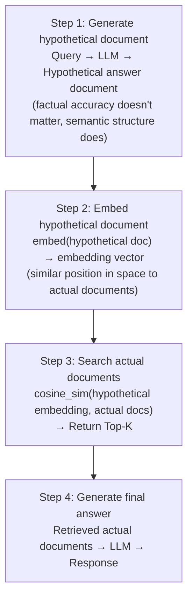
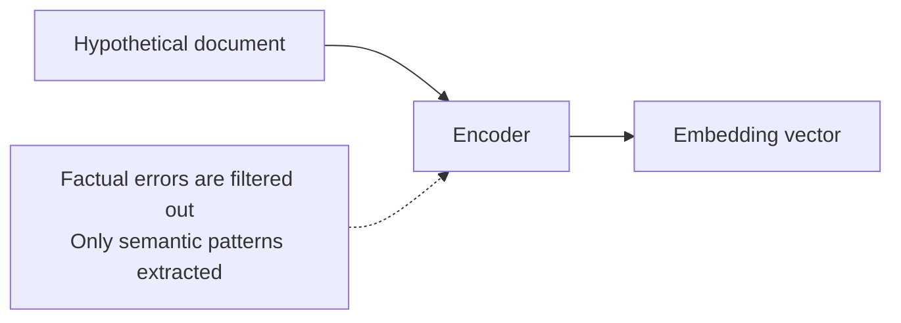

# HyDE (Hypothetical Document Embeddings)

## Overview

**HyDE** (Hypothetical Document Embeddings) is a technique that generates a **hypothetical answer document** for a user query using an LLM, then uses the embedding of that hypothetical document to search for actual documents. It solves the **representation gap** problem between queries and documents.

## Origin

- **Authors**: Gao et al. (2022)
- **Paper**: "Precise Zero-Shot Dense Retrieval without Relevance Labels" — [arXiv:2212.10496](https://arxiv.org/abs/2212.10496)

## Problem: Query-Document Gap

```
Query style: "How to sort a list in Python"
  → Short natural language question style

Document style: "Python's list.sort() method performs in-place sorting..."
  → Long explanatory text style

→ These representations may be far apart in embedding space
```

## How HyDE Works



## Implementation Example

```python
from langchain.chains import HypotheticalDocumentEmbedder
from langchain_openai import OpenAI, OpenAIEmbeddings

# LLM for generating hypothetical documents
llm = OpenAI()

# HyDE embeddings
embeddings = OpenAIEmbeddings()
hyde_embeddings = HypotheticalDocumentEmbedder.from_llm(
    llm=llm,
    embeddings=embeddings,
    prompt_key="web_search"  # per-task prompts
)

# Automatically generates hypothetical document then embeds during search
query = "How to sort a Python list"
results = vectorstore.similarity_search_by_vector(
    hyde_embeddings.embed_query(query),
    k=5
)
```

## Why HyDE Is Effective

**Dense Bottleneck** characteristic of Dense Contrastive Encoders:


Even if the hypothetical document contains factual errors, it can search in the **correct semantic direction**.

## Pros and Cons

### Pros
- Resolves query-document representation mismatch
- Zero-shot performance improvement (no additional training)
- Especially effective in specialized domains (medical, legal, technical)
- Higher recall vs. simple query embedding

### Cons
- Cost of generating hypothetical documents (additional LLM calls)
- Increased latency (additional generation time)
- If hypothetical document hallucinations are severe, search direction can go wrong
- Limited effectiveness for short, clear queries

## Suitable Cases

```
High effectiveness:
  - Specialized technical document retrieval (API docs, papers)
  - Domain-specific QA (medical, legal)
  - When query is short but documents are long
  - When looking for concept explanations

Low effectiveness:
  - When query is already similar in language to documents
  - Fact-checking queries (dates, numbers, etc.)
  - When real-time latency matters
```

## Multi-HyDE Variant

Generate multiple hypothetical documents and average their embeddings:
```python
# Generate 3 hypothetical documents
hypothetical_docs = [llm.generate(query) for _ in range(3)]
# Average embeddings
avg_embedding = np.mean([embeddings.embed(doc) for doc in hypothetical_docs], axis=0)
# Search with averaged embedding
results = vectorstore.similarity_search_by_vector(avg_embedding)
```

## Role in AI Engineering

HyDE is the representative query transformation technique in Advanced Retrieval. It is especially effective for improving RAG pipeline recall in specialized domains, and combining with reranking in a complementary manner creates great synergy from a cost-effectiveness perspective.

## Related Concepts
[[en/AI/Engineering/Context_Engineering/Retrieval_Strategies/RAG/Advanced_Retrieval|Advanced Retrieval]] · [[en/AI/Engineering/Context_Engineering/Retrieval_Strategies/RAG/Chunking_Strategies|Chunking Strategies]] · [[en/AI/Engineering/Context_Engineering/Retrieval_Strategies/RAG/Vector_Storage|Vector Storage]]

## Sources
- Gao et al. (2022) "Precise Zero-Shot Dense Retrieval without Relevance Labels" — [arXiv:2212.10496](https://arxiv.org/abs/2212.10496)
- Machine Learning Plus "HyDE for RAG Explained" — [machinelearningplus.com](https://machinelearningplus.com/gen-ai/hypothetical-document-embedding-hyde-a-smarter-rag-method-to-search-documents/)
- Zilliz "Better RAG with HyDE" — [zilliz.com](https://zilliz.com/learn/improve-rag-and-information-retrieval-with-hyde-hypothetical-document-embeddings)
