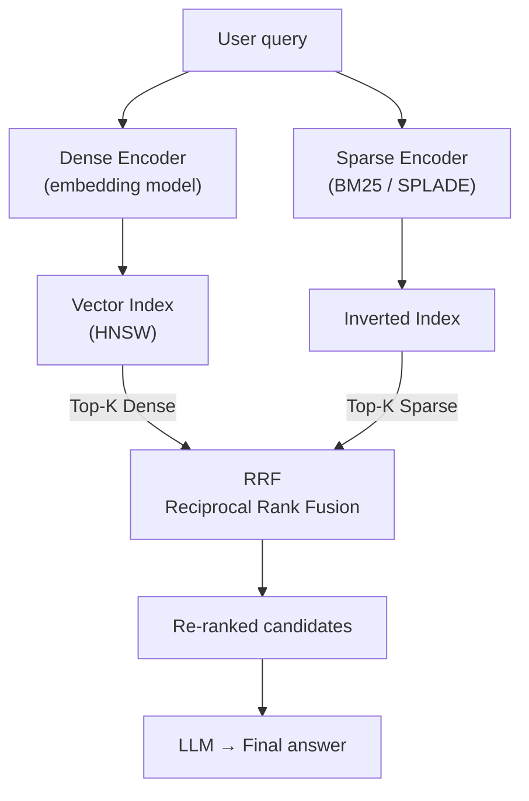
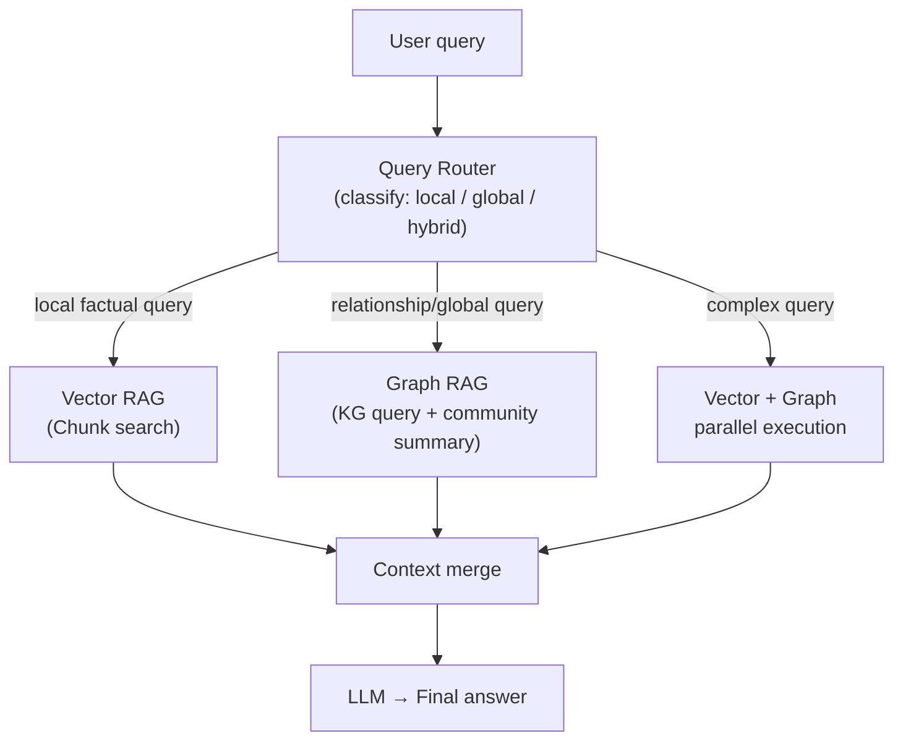
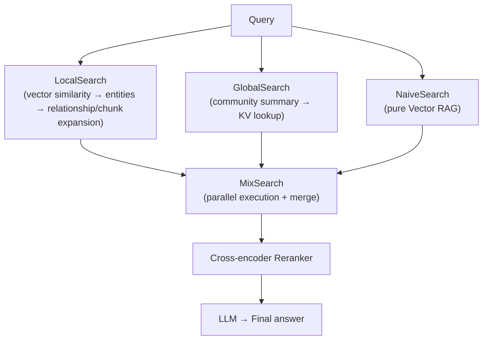

# Hybrid RAG

## Overview

"Hybrid RAG" is used with two distinct meanings.

| Type | Combination | Primary Purpose |
|------|-------------|-----------------|
| **Hybrid Search RAG** | Dense (vector) + Sparse (BM25/SPLADE) | Improve retrieval Recall |
| **Vector + Graph RAG** | Vector RAG + GraphRAG (Knowledge Graph) | Handle both local similarity + global structure |

The two concepts are independent, and in practice a "Full Hybrid" configuration combining all three is also possible.

---

## 1. Hybrid Search RAG (Dense + Sparse)

### Principle

Run Dense vector search and Sparse keyword search (BM25/SPLADE) in parallel, then sum results with **Reciprocal Rank Fusion (RRF)**. Because the two methods fail on different query types, combining them compensates for each other's weaknesses.

Recall@10 improvements of 15~30% over single Dense search have been reported [1], and it has been adopted as the production default in major vector DBs including Weaviate, Qdrant, Pinecone, and Elasticsearch [2].

### Dense vs Sparse Comparison

| Property | Dense (vector) | Sparse (BM25/SPLADE) |
|----------|---------------|---------------------|
| Representation | Continuous float vector (768~4096 dims) | High-dimensional sparse vector (vocab size) |
| Good at | Semantic similarity, paraphrasing | Exact term matching, proper nouns, code |
| Bad at | Rare terms, exact matching | Semantic inference, synonyms |
| Representative models | text-embedding-3, BGE, E5 | BM25, SPLADE, BM42 |
| Index structure | HNSW (ANN) | Inverted Index |

**BM25 vs SPLADE**: BM25 operates on token frequency (TF-IDF family) without learning. SPLADE uses BERT-based Masked LM to perform implicit term expansion, automatically assigning "car", "vehicle" weights to an "automobile" document. Consistently outperforms BM25 on the BEIR benchmark, but incurs inference cost [3].

### Pipeline



① Send query to Dense/Sparse encoders simultaneously
② Retrieve Top-50~100 candidates from each index (parallel)
③ Mathematically combine two ranking lists with RRF
④ Inject combined Top-K into LLM context

### RRF (Reciprocal Rank Fusion)

A rank-only algorithm that uses **only rank** instead of scores to avoid score scale mismatches (Dense: cosine 0.6~0.95, Sparse: BM25 0~15).

```
RRF(d) = Σ  1 / (k + rank_i(d))
  k = 60  (default; softens top-rank concentration)
  rank_i(d) = rank of document d in retriever i
```

---

## 2. Vector + Graph Hybrid RAG

### Principle

Combines **Vector RAG** (unstructured text chunk retrieval) with **GraphRAG** (Knowledge Graph entity/relationship queries). The two retrievers handle different types of knowledge, combined via Query Router or parallel execution.

This is analogous to how Microsoft's GraphRAG paper (Edge et al., 2024) separates "local mode" (entity-based vector search) and "global mode" (community summary search). In practice, "hybrid mode" combining both modes achieves the highest performance [4]. Sarmah et al. (2024) experimentally verified that HybridRAG combining VectorRAG and GraphRAG outperforms each method individually in both retrieval accuracy and answer generation on financial documents (earnings call transcripts) [5].

### Role of Each Retriever

| Question type | Suitable retriever | Example |
|--------------|--------------------|---------|
| Fact-checking within specific documents | Vector RAG | "What are the specs of product A?" |
| Reasoning about entity relationships | Graph RAG | "What is the relationship between A and B?" |
| Global summarization/pattern recognition | Graph RAG (community) | "What are the key topics in this domain?" |
| Searching semantically similar documents | Vector RAG | "What are similar cases to this concept?" |

### Pipeline



**Implementation patterns**

- **Query Router**: Determine query type with LLM classifier or keyword heuristics, route to appropriate retriever
- **Parallel execution + context merge**: Always run both retrievers simultaneously and combine results for LLM (when it fits within context window)
- **Agentic RAG**: Agent dynamically selects Vector/Graph search during execution → See [[en/AI/Engineering/Context_Engineering/Retrieval_Strategies/RAG/Agentic_RAG|Agentic RAG]]

### Pros and Cons

**Pros**
- Handle factual queries (vector) and relationship/global queries (graph) in a single pipeline
- Improved local fact retrieval quality vs. GraphRAG alone
- Complex multi-hop reasoning possible vs. Vector RAG alone

**Cons**
- Knowledge Graph construction/maintenance cost (entity extraction, relationship linking)
- Increased pipeline complexity (two indexes + router + merge logic)
- Context length: combining both retriever results pressures LLM context window

---

## 3. Vector + Graph + Key-Value (Multi-Store Hybrid)

A configuration combining three types of **storage backends**. Each store handles a different type of knowledge.

| Store | Role | Suitable queries |
|-------|------|-----------------|
| **Vector Store** | Chunk embeddings → semantic similarity search | "What's similar to this concept?" |
| **Graph DB** | Entities/relationships → structural traversal | "Relationship between A and B? Multi-hop reasoning" |
| **Key-Value Store** | Entity attributes/community summaries → exact lookup | "Quickly get summary info for X" |

### Representative Approaches

**StructRAG** (2024) [6]: A **Hybrid Structure Router** dynamically selects the optimal structure based on query characteristics. A DPO-trained router selects one of 5 candidate structures, converts documents to that structure, then generates answers.

| Structure type | Store type | Suitable task |
|----------------|------------|---------------|
| Table | Structured Key-Value | Statistics, comparison questions |
| Graph | Graph DB | Multi-hop reasoning, relationship exploration |
| Algorithm | Procedure representation | Planning, ordering questions |
| Catalogue | Key-Value list | Global summaries, enumeration |
| Chunk | Vector Store | Simple single-hop fact retrieval |

→ Since the router selects one optimal structure per query, this is **dynamic routing** rather than simultaneous parallel execution.

**RAGU** (2025) [7]: Provides a MixSearch engine that **runs all three storage tiers (graph DB + key-value store + vector store) in parallel simultaneously**.



- **LocalSearch**: Find entities with vector similarity, expand relationships/chunks with Graph DB
- **GlobalSearch**: Directly look up Leiden community summaries from KV Store
- **MixSearch**: Run all three engines in parallel and combine contexts
- **QueryPlanEngine**: Decompose complex queries into DAG for sequential/parallel execution

---

## Role in AI Engineering

Handles Stage 1 (ensuring Recall) in the [[en/AI/Engineering/Context_Engineering/Retrieval_Strategies/RAG/Advanced_Retrieval|Advanced Retrieval]] Two-Stage pipeline: the current standard production pattern combines Hybrid Search (Dense+Sparse) to retrieve Top-100 → then Cross-encoder Reranker to narrow to Top-5. Vector+Graph combination is especially effective in domains requiring relationship reasoning (medical, legal, knowledge-intensive industries). Multi-Store Hybrid (Vector+Graph+KV) shows the greatest benefit when a single query requires fact retrieval, relationship exploration, and global summarization simultaneously; StructRAG's Router approach and RAGU's MixSearch approach are currently the representative implementations.

## Related Concepts

[[en/AI/Engineering/Context_Engineering/Retrieval_Strategies/RAG/Advanced_Retrieval|Advanced Retrieval]] · [[en/AI/Engineering/Context_Engineering/Retrieval_Strategies/RAG/Vector_Storage|Vector Storage]] · [[en/AI/Engineering/Context_Engineering/Retrieval_Strategies/RAG/Agentic_RAG|Agentic RAG]] · [[en/AI/Engineering/Context_Engineering/Retrieval_Strategies/GraphRAG/GraphRAG|GraphRAG]] · [[en/AI/Engineering/Context_Engineering/Retrieval_Strategies/GraphRAG/Knowledge_Graph/Knowledge_Graph|Knowledge Graph]]

## Sources

1. Pinecone Research (2024) "Hybrid Search: 15-30% Retrieval Improvement" — [atlan.com/know/hybrid-rag](https://atlan.com/know/hybrid-rag/)
2. Digital Applied "Hybrid Search: BM25, Vector & Reranking Reference 2026" — [digitalapplied.com](https://www.digitalapplied.com/blog/hybrid-search-bm25-vector-reranking-reference-2026)
3. GoPenAI "Hybrid Search in RAG: Dense + Sparse (BM25/SPLADE), Reciprocal Rank Fusion" — [blog.gopenai.com](https://blog.gopenai.com/hybrid-search-in-rag-dense-sparse-bm25-splade-reciprocal-rank-fusion-and-when-to-use-which-fafe4fd6156e)
4. Edge et al. (2024) "From Local to Global: A Graph RAG Approach to Query-Focused Summarization" — [arXiv:2404.16130](https://arxiv.org/abs/2404.16130)
5. Sarmah et al. (2024) "HybridRAG: Integrating Knowledge Graphs and Vector Retrieval Augmented Generation for Efficient Information Extraction" — ACM ICAIF '24 — [arXiv:2408.04948](https://arxiv.org/abs/2408.04948)
6. Xu et al. (2024) "StructRAG: Boosting Knowledge Intensive Reasoning of LLMs via Inference-time Hybrid Information Structurization" — [arXiv:2410.08815](https://arxiv.org/abs/2410.08815)
7. (2025) "RAGU: A Multi-Step GraphRAG Engine with a Compact Domain-Adapted LLM" — [arXiv:2607.11683](https://arxiv.org/abs/2607.11683)
